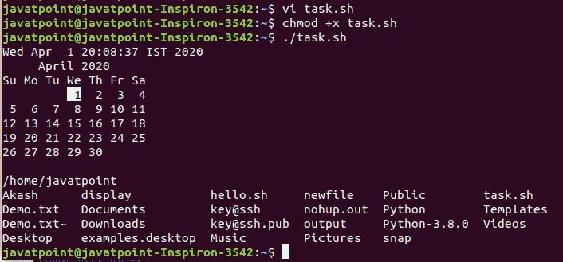

# Linux Bash

> 原文：<https://www.javatpoint.com/linux-bash>

Linux Bash 也被称为**“伯恩-又是外壳**”这是一个基于 Linux 系统的**命令语言解释器**。它是伯恩贝壳(sh)的替代品。它是在 GNU 项目下开发的，作者是**布莱恩·福克斯**。如今，Bash 是大多数 Linux 发行版的默认用户外壳。

Linux/Unix 外壳允许我们通过命令与 Linux 系统交互。它让我们调用一个可执行文件来创建一个正在运行的进程。此外，它还允许我们与 Linux 文件系统进行交互。它的设计方式使得我们可以通过 Bash 执行所有的 Linux 操作。

Bash 是一个**命令语言解释器**以及一个**编程语言**。像其他编程语言一样，它支持**变量、函数和流量控制**。它还可以从一个文件中读取和执行命令，这个文件被称为 **shell 脚本。**

它提供了各种功能上的改进，无论是交互还是编程使用。尽管很多 sh 脚本可以由 Bash 运行，而无需任何更改。与 sh 相比，Bash 包含以下改进:

*   它提供命令行编辑
*   它包含无限大小的命令历史记录
*   它提供作业控制
*   它便于使用外壳函数和别名
*   它提供了无限大小的索引数组
*   它包含从 2 到 64 的任意基数的整数运算。

**如何下载 Bash**

可以通过 HTTP([http://ftp.gnu.org/gnu/bash/](https://ftp.gnu.org/gnu/bash/))和 FTP([ftp://ftp.gnu.org/gnu/bash/](ftp://ftp.gnu.org/gnu/bash/))服务器从官方 GNU 服务器下载。

人们经常混淆 **bash、shell、**和 **shell 脚本。**让我们浏览一下 shell 和脚本，以了解 bash、shell 和脚本的全貌。

## 什么是壳牌

如果我们是一个新的 Linux 用户，我们打开终端，假设我们对如何使用它很困惑。贝壳在这里扮演角色。

终端包含外壳；它允许我们执行命令与系统交互。我们可以执行各种操作，例如存储和检索数据、处理信息以及各种其他简单和复杂的任务。

打开终端，按 **CTRL+ALT+T** 键。执行一些基本操作，如**日期、cal、ls、**和 **pwd** 带着它去旅游。

请考虑下图:


从上图中我们可以看到，外壳允许我们与 Linux 系统进行交互。当我们执行了 date 和 cal 命令后，shell 与系统交互并检索数据。

## 什么是脚本

假设我们每天都需要执行一些基本命令，例如上面的四个命令。Linux 支持一种叫做脚本的功能，它允许我们同时执行多个任务。因此，定义一个脚本而不是执行重复的任务是很好的。

为了理解如何使用 Linux 脚本，让我们结合一些任务来定义一个脚本。要定义脚本，请创建扩展名为. sh 的文件。我们正在使用虚拟仪器文本编辑器。但是，任何文本编辑器都可以用来定义脚本。考虑以下命令:

```

vi tasks.sh

```

上述命令将在正常模式下打开 vi 编辑器。按下 **ESC** 将其切换到插入模式，然后输入**【I】**键，输入您想要的任务。每个任务都应该在一个新的行中定义。考虑以下任务:

```

date
cal
pwd
ls

```

进入任务后，按**ESC****:wq！**键保存并退出编辑器。

现在，将创建的文件作为可执行文件，使用 chmod 命令和+x 选项，如下所示:

```

chmod +x tasks.sh

```

我们已经创建了第一个脚本。要执行 shell 脚本，通过预定义**来执行文件名。/ '** 同文件名。考虑以下命令:

```

./task.sh

```

考虑以下输出:



从上面的输出中我们可以看到，通过使用 shell，我们可以自动化这些任务。我们可以随时使用它。它可以重复使用任何次数。

## Bash 的特点

sh shell 的所有内置命令都可以在 Bash 中获得；此外，它还为我们提供了许多其他功能。Bash 的一些关键特性如下:

*   **Shell 语法:**Shell 语法包含 **shell 操作**、**引用**和**注释**。shell 操作是 shell 的基本操作。引用允许如何删除字符的特殊含义，而注释意味着指定注释。
*   **Shell 命令:** Shell 命令是可以执行的命令类型。这些命令可以是简单命令、管道、列表、复合命令等等。
*   **Shell 函数:** Shell 函数用于按名称对命令进行分组。它们作为传统命令执行。当我们使用 shell 函数的名称时，会执行与之相关的命令列表。
*   **Shell 参数:**基本上，参数是存储值的实体；它可以是名称、数字或特殊字符。外壳参数指定外壳如何存储值。它们可以是位置参数或特殊参数。位置参数是外壳的命令行参数，特殊参数由特殊字符表示。
*   **Shell Expansions:**Shell expansion 是 Bash 用来扩展参数的一种技术。在将输入拆分为标记后，在命令行上执行扩展。
*   **重定向:**是管理和控制输入输出的一种方式。
*   **命令执行:**它决定了当我们执行一个命令时，系统会有怎样的反应。
*   **Shell 脚本:**是一个有 Shell 命令的文本文件，使用时执行命令。Bash 读取并执行命令，然后退出。

* * *