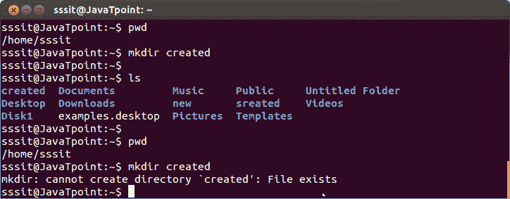

# Linux mkdir | Linux 创建目录

> 哎哎哎:# t0]https://www . javatppoint . com/Linux-mkdir

现在让我们学习如何在命令提示符的帮助下创建自己的目录。

mkdir 代表“制作目录”。在 mkdir 命令的帮助下，您可以在系统中的任何地方创建一个新目录。只需键入**“mkdir<目录名>** ，在<目录名>处键入您想要创建的新目录的名称，然后按回车键即可。

**语法:**

```
mkdir  
```

**示例:**

```
mkdir created

```



在上例中，我在 **/home/sssit 目录**中。我已经通过传递命令**“mkdir created”**创建了一个目录**“created”**。

现在，如果我尝试创建一个新文件，该文件具有技术上已经存在的相同文件名**‘created’**，我将收到一条错误消息。

**注意:**如果您不提供路径，那么默认情况下，您的文件将只在当前目录中创建。如果你想在其他地方创建你的目录，那么提供你的目标目录的路径，你的文件将在那里创建。

* * *

## 创建多个目录

**语法:**

```
mkdir <dirname2><dirname3>...</dirname3></dirname2> 
```


您也可以同时创建多个目录。看上面的例子，我们已经创建了多个目录**‘文件 1 文件 2 文件 3’**。

* * *

## Mkdir 选项

| 选择 | 描述 |
| [mkdir -p，-父母](linux-mkdir-p) | 添加目录，包括其子目录。 |
| [mkdir -v，-动词](linux-mkdir-v) | 为每个创建的目录打印一条消息。 |
| [mkdir -m -mode=MODE](linux-mkdir-m-mode) | 设置访问权限。 |