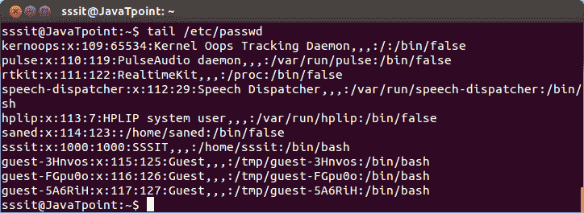

# Linux 用户管理

> 原文：<https://www.javatpoint.com/linux-user-management>

用户管理包括从在系统上创建用户到删除用户的所有内容。在 Linux 系统上，用户管理可以通过三种方式完成。

**图形化工具**简单易行，适合新用户，因为它保证你不会遇到任何麻烦。

**命令行工具**包括 useradd、userdel、passwd 等命令。这些主要由服务器管理员使用。

第三个也是非常难得的工具是**直接使用 vi 编辑本地配置文件**。

```

/etc/passwd

```

Linux 中的本地用户数据库是/etc/passwd 目录。



看看上面的快照，它有 7 列，用冒号分隔。从左栏开始表示用户名、x、用户 id、主要组 id、描述、主目录名和登录外壳。

* * *

## 根

根用户是超级用户，拥有创建用户、删除用户的所有权限，甚至可以使用其他用户的帐户登录。根用户的用户标识始终为 0。


* * *

## useradd(用户添加)

使用 useradd 命令，您可以添加用户。

**语法:**

```

useradd -m -d /home/ -c "<username>" <username></username></username> 
```

**示例:**

```

useradd -m -d /home/xyz -c "xyz" xyz

```


看上面的快照，我们已经创建了一个用户 **xyz** 以及一个主目录(-m)，设置了主目录的名称(-d)和一个描述(-c)。

“xyz”收到的**用户标识**为 1004，**主要组标识**为 1004。

* * *

## /etc/default/useradd

文件/etc/default/useradd 包含一些用户默认选项。命令 **useradd -D** 可用于显示该文件。

**语法:**

```

useradd -D

```


* * *

## 你是谁

使用 userdel 命令删除用户帐户。

**语法:**

```

userdel -r  
```


**示例:**

```

userdel -r xyz

```

看看上面的快照，首先我们已经显示了带有' tail '命令的 xyz 用户帐户。要删除它，传递命令**“user del-r XYZ”**。

要重新检查，再次传递“tail”命令，如您所见，没有显示 xyz 用户帐户。

因此，它被删除。

* * *

## 用户模式

usermod 命令用于修改现有用户的属性。

**语法:**

```

usermod -c   
```

**示例:**

```

usermod -c 'jhonny' john

```


看上面的快照，用户名 **john** 被新用户名 **jhonny** 替换

* * *

## /etc/skel/

/etc/skel/包含一些隐藏文件，这些文件具有应用程序的配置文件设置和默认值。因此，它用作默认的主目录和用户配置文件。使用 useradd -m 选项时，/etc/skel/被复制到新创建的目录中。


看上面的快照，列出了/etc/skel/的文件。

* * *

## 删除主目录

通过使用 **userdel -r** 选项，您可以删除主目录和用户帐户。

**语法:**

```

userdel -r  
```

**示例:**

```

userdel -r john

```


看看上面的快照，主目录和用户帐户 john 都被删除了。

* * *

## 登录外壳

/etc/passwd 文件还告诉用户登录外壳。


看上面的快照，用户 guest 用 **/bin/bash** shell 登录，用户 jtp 用 **/bin/ksh shell** 登录。

您可以使用 usermod 命令为用户更改外壳模式。

**语法:**

```

usermod -s <username></username> 
```

**示例:**

```

usermod -s /bin/bash jtp

```


看上面的快照，jtp 的 shell 从 **/bin/ksh 改成了 **/bin/bash** 。**

* * *

## 嘘！嘘

用户可以使用 chsh 命令更改他们的登录外壳。

命令 **chsh** 和 **chsh -s** 都将用于更换外壳。

**语法:**

```

chsh

```


看上面的快照，命令 chsh 已经把 sssit 登录外壳从 **/bin/sh** 改成了 **/bin/bash** 。

**语法:**

```

chsh -s 
```

**示例:**

```

chsh -s /bin/sh

```


看上面的快照，登录 shell 改成了/bin/s。