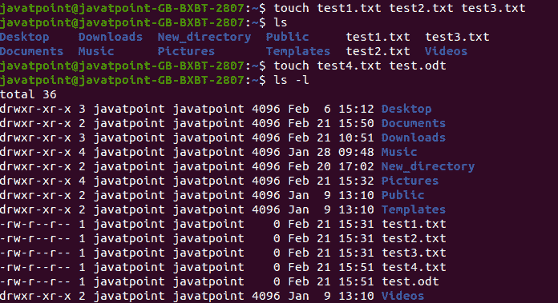

# Linux 创建文件

> 原文：<https://www.javatpoint.com/linux-create-file>

Linux 文件系统在 Linux 中把一切都看作一个文件；无论是文本文件图像、分区、编译程序、目录还是硬件设备。如果它不是一个文件，那么它一定是一个进程。为了管理数据，它形成了一个树形结构。

[Linux](https://www.javatpoint.com/linux-tutorial) 文件区分大小写，所以 **test.txt** 和 **Test.txt** 会被认为是两个不同的文件。在 Linux 中有多种方法来创建文件。一些常规方法如下:

*   [使用 cat 命令](#usingcat)
*   [使用触摸命令](#usingtouch)
*   [使用重定向“>”符号](#usingredirect)
*   [使用回声命令](#usingecho)
*   [使用 printf 命令](#usingprintf)
*   [使用不同的文本编辑器，如 vim、nano、vi](#usingdifferent)

除了上述所有方法，我们还可以从桌面文件管理器创建一个文件。让我们详细了解一下上面的方法:

## 1.使用 cat 命令

cat 命令是 Linux 中最常用的[命令之一。用于**创建文件、显示文件内容、连接多个文件内容、显示行号、**等。](https://www.javatpoint.com/linux-commands)

在这里，我们将看到如何使用 [cat 命令](https://www.javatpoint.com/linux-cat)创建文件并向其中添加内容。

首先创建一个目录并命名为 **New_directory** ，执行 **mkdir** 命令如下:

```

mkdir New_directory

```

将目录更改为:

```

cd New_directory

```

**输出:**


现在执行 cat 命令创建一个文件:

```

cat > test.txt

```

上述命令将创建一个文本文件，并进入编辑模式。现在，输入所需的文本，按 **CTRL + D** 键保存并退出文件，它将返回命令行。

要显示文件内容，请按如下方式执行 cat 命令:

```

cat test.txt

```

考虑以下输出:


## 2.使用触摸命令

**触摸**命令也是 Linux 中比较流行的命令之一。它用于**创建新文件，更新现有文件和目录的时间戳**。它还可以在 Linux 中创建空文件。

[触摸命令](https://www.javatpoint.com/linux-touch)是从命令行创建新文件的最简单方法。我们可以通过一次执行这个命令来创建多个文件。

要创建文件，请执行 touch 命令，后跟文件名，如下所示:

```

touch test1.txt

```

要列出所创建文件的信息，请执行以下命令:

```

ls - l test1.txt

```

考虑以下输出:


要一次创建多个文件，请在 touch 命令后指定文件及其扩展名以及单个空格。执行以下命令，一次创建三个文件:

```

touch test1.txt test2.txt test3.txt 

```

要创建两种不同类型的文件，请执行以下命令:

```

touch test4.txt test.odt

```

上面的命令将创建两个不同的文件，分别名为 **test4.txt** 和 **test.odt** 。

要显示文件及其时间戳，执行 **ls** 命令如下:

```

ls -l

```

考虑以下输出:



如果我们传递一个现有文件的名称，它将改变该文件的时间戳。

#### 注意:触摸和 cat 命令的显著区别在于，使用 cat 命令，我们可以从命令提示符指定文件的内容，相比之下，触摸命令会创建一个空白文件。

## 3.使用重定向(>)符号

我们还可以使用命令行上的重定向符号(>)创建一个文件。要创建一个文件，我们只需键入一个重定向符号(>)，后跟文件名。该符号主要用于重定向输出。有两种方法可以重定向输出。如果使用>**操作符**，会覆盖已有文件，> >操作符会追加输出。

要使用重定向(>)操作符创建文件，请执行以下命令:

```

> test5.txt

```

上面的命令将创建一个文件，要显示所创建文件的存在，执行下面的命令:

```

ls -l test5.txt

```

考虑以下输出:


## 4.使用回声命令

**回显**命令用于创建文件，但是我们应该在命令行上指定文件内容。

要使用 echo 命令创建文件，请执行以下命令:

```

echo " File content" > test6.txt

```

上述命令将创建**测试 6** 文件。要显示文件的存在，请执行以下命令:

```

ls -l test6.txt

```

考虑以下输出:


## 5.使用 printf 命令

我们也可以使用 **printf** 命令创建一个文件。为此，我们需要在命令行上指定文件内容。

要使用 printf 命令创建文件，请执行以下命令:

```

printf " File content" > test7.txt

```

要显示文件详细信息，请执行 ls 命令，如下所示:

```

ls -l test7.txt

```

要显示文件内容，请按如下方式执行 cat 命令:

```

cat test7.txt

```

考虑以下输出:


## 6.使用文本编辑器

我们还可以使用不同的文本编辑器创建一个文件，如 **vim、nano、vi、**等。

*   **使用 Vim 文本编辑器**

我们可以使用 **Vim 文本编辑器**创建一个文件。如果机器上没有安装 vim 编辑器，请执行以下命令:

```

sudo apt install vim

```

**输出:**

```
[sudo] password for javatpoint: 
Reading package lists... Done
Building dependency tree       
Reading state information... Done
The following additional packages will be installed:
  vim-runtime
Suggested packages:
  ctags vim-doc vim-scripts
The following NEW packages will be installed:
  vim vim-runtime
0 upgraded, 2 newly installed, 0 to remove and 64 not upgraded.
Need to get 6,878 kB of archives.
After this operation, 33.4 MB of additional disk space will be used.
Do you want to continue? [Y/n] y
Get:1 http://in.archive.ubuntu.com/ubuntu eoan/main amd64 vim-runtime all 2:8.1.0875-5ubuntu2 [5,669 kB]
Get:2 http://in.archive.ubuntu.com/ubuntu eoan/main amd64 vim amd64 2:8.1.0875-5ubuntu2 [1,209 kB]
Fetched 6,878 kB in 3s (2,256 kB/s)
Selecting previously unselected package vim-runtime.
(Reading database ... 216385 files and directories currently installed.)
Preparing to unpack .../vim-runtime_2%3a8.1.0875-5ubuntu2_all.deb ...
Adding 'diversion of /usr/share/vim/vim81/doc/help.txt to /usr/share/vim/vim81/doc/
help.txt.vim-tiny by vim-runtime'
Adding 'diversion of /usr/share/vim/vim81/doc/tags to /usr/share/vim/vim81/doc/tags
.vim-tiny by vim-runtime'
Unpacking vim-runtime (2:8.1.0875-5ubuntu2) ...
Selecting previously unselected package vim.
Preparing to unpack .../vim_2%3a8.1.0875-5ubuntu2_amd64.deb ...
Unpacking vim (2:8.1.0875-5ubuntu2) ...
Setting up vim-runtime (2:8.1.0875-5ubuntu2) ...
Setting up vim (2:8.1.0875-5ubuntu2) ...
update-alternatives: using /usr/bin/vim.basic to provide /usr/bin/vim (vim) in auto
 mode
update-alternatives: using /usr/bin/vim.basic to provide /usr/bin/vimdiff (vimdiff)
 in auto mode
update-alternatives: using /usr/bin/vim.basic to provide /usr/bin/rvim (rvim) in au
to mode
update-alternatives: using /usr/bin/vim.basic to provide /usr/bin/rview (rview) in 
auto mode
update-alternatives: using /usr/bin/vim.basic to provide /usr/bin/vi (vi) in auto m
ode
update-alternatives: using /usr/bin/vim.basic to provide /usr/bin/view (view) in au
to mode
update-alternatives: using /usr/bin/vim.basic to provide /usr/bin/ex (ex) in auto m
ode
Processing triggers for man-db (2.8.7-3) ...

```

Vim 文本编辑器已成功安装。

要使用 vim 文本编辑器创建文件，请执行以下命令:

```

vim test8.txt

```

以上命令将打开文本编辑器，按 I 键进入编辑器的插入模式。

输入文件内容，按**前面的 **Esc 键**:wq**保存并退出文件。文本编辑器如下所示:


要显示文件信息，执行 **ls** 命令如下:

```

ls -l test8.txt

```

要查看文件内容，请按如下方式运行 cat 命令:

```

cat test8.txt

```

考虑以下输出:


## 7.使用纳米编辑器

我们可以使用 **nano** 文本编辑器创建一个文件。要创建文件，请执行以下命令:

```

nano test9.txt

```

以上命令将打开纳米文本编辑器。输入所需的文本，按下 **CTRL + X** ，然后输入 y 确认文件更改。按**回车键**退出编辑器。

纳米文本编辑器如下图所示:


要显示文件信息，请执行以下命令:

```

ls -l test9.txt

```

要查看文件内容，请执行以下命令:

```

cat test9.txt

```

考虑以下输出:


### 使用 Vi 编辑器

要使用 Vi 编辑器创建文件，请执行以下命令:

```

vi test10.txt

```

上面的命令将打开 Vi 编辑器。按 I 键进入插入模式并输入文件内容。按 Esc 键和:wq 保存文件并从编辑器中退出。

要显示文件信息，请执行以下命令:

```

ls -l test10.txt

```

要显示文件内容，请执行以下命令:

```

cat test10.txt

```

考虑以下输出:


* * *