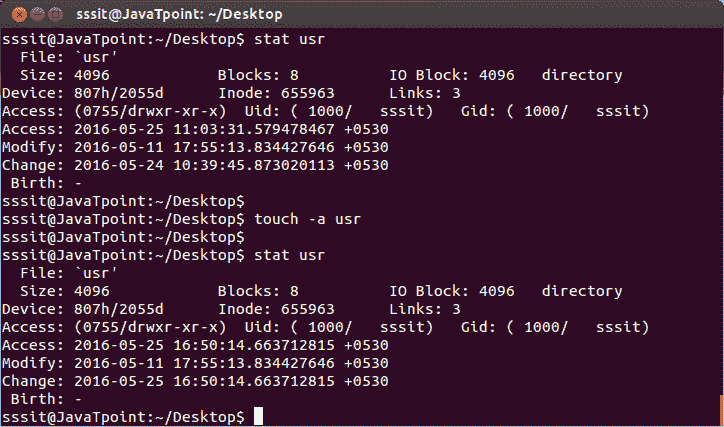
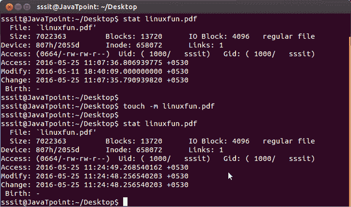
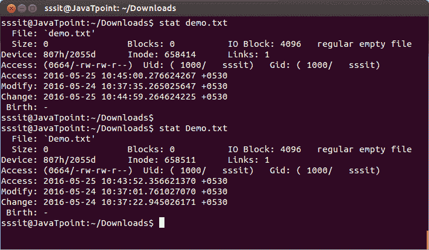
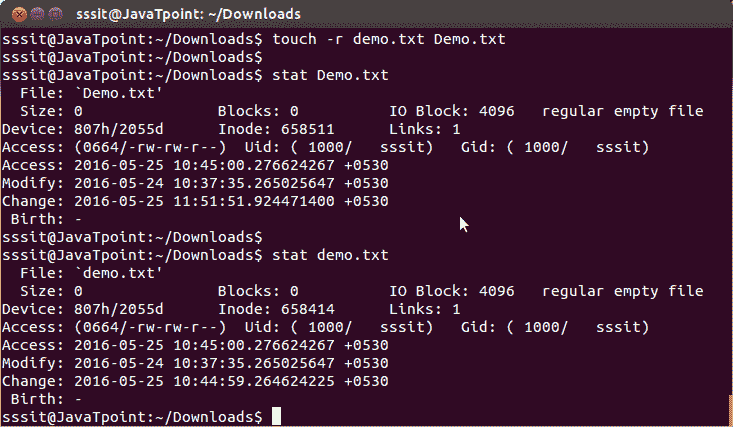
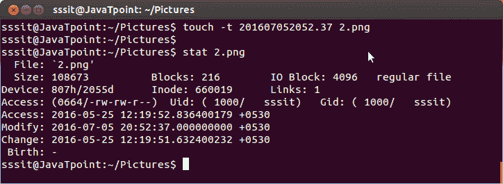
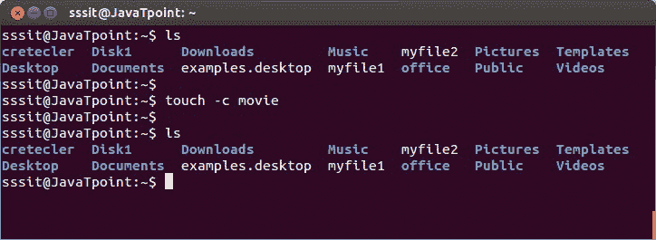

# Linux 触摸命令

> 原文：<https://www.javatpoint.com/linux-touch>

touch 命令是创建空文件的一种方法(也有一些其他方法)。您可以在 touch 命令的帮助下更新每个文件的修改和访问时间。

**语法:**

```
touch  
```

**示例:**

```
touch myfile1

```


看上面，我们通过 touch 命令创建了两个文件，即“myfile1”和“myfile2”。要创建多个文件，只需用一个触摸命令键入所有文件名，然后按回车键。例如，如果您想同时创建“myfile1”和“myfile2”，那么您的命令将是:

```
touch myfile1 myfile2

```

* * *

## 触摸选项

| [计]选项 | 功能 |
| [触摸-a](#linux-touch-a) | 更改文件访问和修改时间。 |
| [触摸-m](#linux-touch-m) | 它仅用于修改文件的时间。 |
| [触摸-r](#linux-touch-r) | 参照另一个文件更新一个文件的时间。 |
| [触摸-t](#linux-touch-t) | 通过指定时间创建文件。 |
| [触摸-c](#linux-touch-c) | 它不会创建空文件。 |

## Linux 触摸-一个命令

带有选项“a”的 touch 命令用于更改文件的访问时间。默认情况下，它会占用您系统的当前时间。

**语法:**

```
touch -a  
```

**示例:**

```
touch -a usr

```

要查看文件的访问和更改时间，需要使用 **stat** 命令。



在上面的快照中，我们使用了“stat”命令(我们将在后面的教程中学习)来检查我们的目录(usr)的状态。所以不要搞混了。现在，您可以在传递命令“touch -a usr”前后匹配目录(usr)的访问时间。它占用了我们系统的默认访问时间。

## Linux touch -m 命令

触摸“-m”选项将帮助您仅更改文件的修改时间。

**语法:**

```
touch -m  
```

**示例:**

```
touch -m usr

```



请注意，在上面的快照中，只有修改时间发生了变化。

## Linux touch -r 选项

该命令将参照另一个提到的命令更新时间。有两种方法可以使用这个命令。两者工作原理相同。

在下面的例子中，我们想参照**【演示. txt】**更改**【演示. txt】**的时间戳。首先你可以把它写成，

```

touch -r demo.txt Demo.txt

```

或者

```

touch Demo.txt -r demo.txt

```

首先，我们将在使用 touch comand 之前查看这两个文件的状态。



现在在使用 **touch -r demo.txt Demo.txt** 命令后， **Demo.txt** 的时间已经参照 **demo.txt** 的时间进行了更改



## Linux 触摸命令

使用此命令，您可以通过确定文件的指定时间来更改文件的访问时间。

它将按指定时间而不是默认时间修改时间。

时间格式为:

```
touch -t YYYYMMDDhhmm.ss

```

下面的截图显示了触摸命令之前文件 2.png 的状态，


这个截图显示文件 2.png 的时间已经被我们指定的时间修改了。



## Linux touch -c 命令

如果文件不存在，在 touch 命令中使用“c”选项不会创建空文件。

**语法:**

```
touch -c  
```

**示例:**

```
touch -c movie

```



在上图中，我们想创建文件'电影'，但使用' c '选项时，没有创建文件。