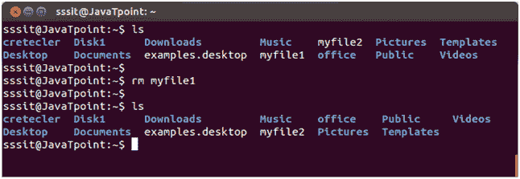

# Linux rm | Linux 删除文件

> 原文：<https://www.javatpoint.com/linux-rm>

“rm”的意思是移除。此命令用于删除文件。命令行不像其他图形用户界面那样有回收站或垃圾桶来恢复文件。因此，在使用这个命令时要非常小心。一旦您删除了文件，它将被永久删除。

**语法:**

```

rm  
```

**示例:**

```

rm myfile1

```



在上面的快照中，我们已经在“rm”命令的帮助下永久删除了文件 myfile1。

* * *

## rm 选项

| [计]选项 | 描述 |
| [RM *分机](linux-rm-extension) | 用于删除扩展名相同的文件。 |
| [rm -r 或 R](linux-rm-r) | 递归删除目录。 |
| [rm -i](linux-rm-i) | 交互式删除文件。 |
| RM-RF | 强制删除目录。 |