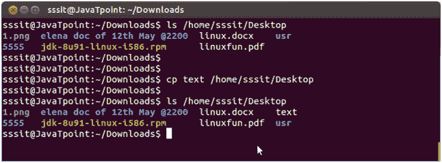

# Linux cp | Linux 复制文件

> 原文：<https://www.javatpoint.com/linux-cp>

“cp”是复制的意思。“cp”命令用于复制文件或目录。

要将文件复制到同一目录，语法将是，

```

cp 
```


在上面的快照中，我们已经创建了**“docu”**的副本，并将其命名为**“new docu”**。如果在这种情况下，(在我们的例子中是‘new docu’)已经存在，那么它将简单地重写较早的文件。

* * *

## 要将文件复制到不同的目录中

我们必须提到目标目录的路径。

在下面的快照中，先前没有“文本”文件。发出命令后，**【文本】**文件已复制到目标目录，即**【桌面】**。



* * *

## cp 选项

| [计]选项 | 功能 |
| [cp -r](linux-cp-r) | 复制目录及其子目录。 |
| [cp 文件 1 文件 2 目录名](linux-copy-multiple-files) | 在一个目录中复制多个文件或目录。 |
| [CP-备份](linux-cp-backup) | 在覆盖之前备份现有文件。 |
| [cp -i](linux-cp-i) | 要求确认。 |
| [cp -l](linux-cp-l) | 创建硬链接文件。 |
| [cp -p](linux-cp-p) | 保留文件的属性。 |
| [cp -u -v](linux-cp-u-v) | 确保源文件比目标文件新。 |