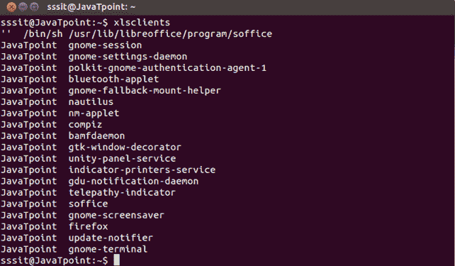
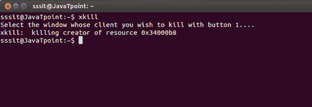

# 克希尔

> 原文：<https://www.javatpoint.com/linux-xkill>

命令 xkill 用于在不传递进程名或进程号的情况下杀死 X 服务器上的一个进程。它强制 X 服务器关闭与其客户端的通信，最终通过其 X 资源杀死其客户端。简而言之，xkill 指示 X 服务器终止客户端。

要获取 x 个客户端的列表，请使用命令

**语法:**

```

xlsclients

```



看上面的快照，这是我们系统中 x 个客户端的完整列表。

* * *

## 使用 xkill 命令

使用 xkill 命令当您想要终止一个进程时，在终端上键入 xkill。你的光标会变成 **x 的形状，**用 x 光标点击你想杀死的窗口。您将获得如下消息，如下面的快照所示。



* * *