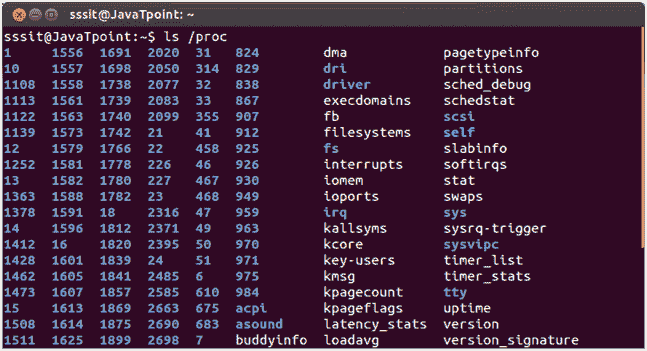
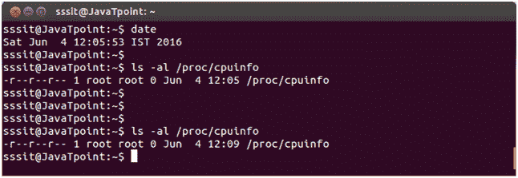
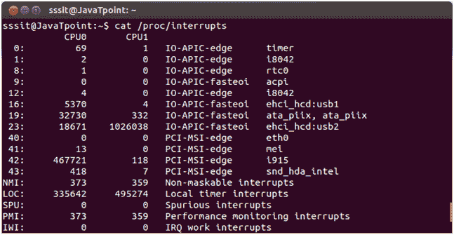

# Linux 内存目录

> 原文：<https://www.javatpoint.com/linux-fhs-memory-directory>

内存目录包含整个系统的文件。所有设备信息、数据中运行的进程或系统相关信息都存储在该目录中。

内存目录包含以下目录。

*   /dev
*   /proc
*   /sys

## /dev

术语“开发”是**设备**的简称。众所周知，在 Linux 操作系统中，一切都是一个文件。它看起来是一个普通文件，但不占用磁盘空间。用于表示和访问设备的文件存储在这里，包括像 usb 这样的终端设备。存储在“/dev”中的所有文件都与真实设备无关，有些文件还与虚拟设备相关。

*   **/dev/tty 和/dev/pts** :文件“/dev/tty”代表命令行界面，它是连接到系统的终端或控制台。在终端中键入命令是图形界面的一部分，就像 Gnome 或 KDE 一样，然后终端将被表示为“/dev/pts/1”(这里 1 可以被任何其他数字替换)。
*   **/dev/null** :这个“/dev/null”文件被认为是一个黑洞，它有无限的存储空间，但是没有任何东西可以从中检索到。您可以丢弃终端中不需要的输出，但不能取回。

## /proc

术语“过程”是过程的简称。与'/dev '相同，'/proc '也不占用磁盘空间。它包含过程信息。它是一个伪文件系统，包含关于正在运行的进程的信息。它还作为包含系统资源文本信息的虚拟文件系统工作。

*   **/proc 与内核的对话**:/proc’显示内核的视图，内核管理什么，是直接与内核通信的手段。

**示例:**

```

ls /proc

```



看上面的快照，命令**“ls/proc”**显示“/proc”的内容。许多文件被命名为数字，一些命名的文件也在那里。

“/proc”有一些文件属性，如 date，它会不断更新，如下图所示。



此外,/proc '中的大多数文件都是 0 字节，但它们包含大量数据。大多数文件都是只读的，有些需要 root 权限，有些是可写的。

*   **/进程/中断**:进程/中断显示中断。

**示例:**

```

cat /proc/interrupts

```



看上面的快照，当一个系统有两个 CPU 时，文件会是这样的。

## /sys

术语“系统”是**系统**的简称。基本上它包含关于硬件的内核信息。它是为 Linux 2.6 内核创建的。它是一种“/proc”，用于即插即用配置。

* * *