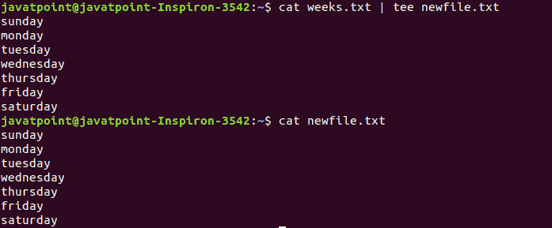
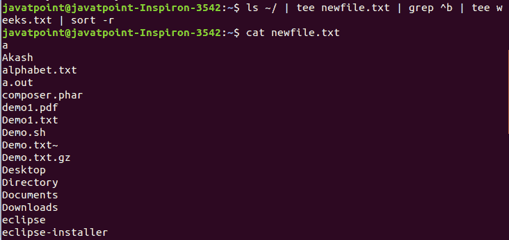

# Linux tee 命令

> 原文：<https://www.javatpoint.com/linux-tee>

Linux tee 命令与‘cat’命令非常相似，只有一点不同。它将 stdin 放在 stdout 上，并将它们放入一个文件中。它是通过管道与其他命令一起使用最多的命令之一。它允许我们将从标准输入到标准输出提供的任何内容写入。可选地，它提供对一个或多个文件的写入。命令名 tee 来自于管道工程中使用的 T 分离器。

### 语法:

```
tee <options> <file name>

```

### 选项:

以下是一些有用的选项，可以与 tee 命令一起使用，使其更加具体:

**-a、- append:** 用于给定文件追加数据，不覆盖数据。

**-i，-忽略-中断:**用于忽略中断信号。

**-p:** 用于诊断写入非管道的错误。

**-输出-错误[=模式]:** 用于设置写错误模式下的行为。

**-帮助:**用于显示帮助文档。

**-版本:**用于显示版本信息。

### 三通命令示例

让我们看看 tee 命令的以下示例:

*   [如何使用三通命令](#How)
*   [写文件追加输出](#append)
*   [将数据状态写入文件](#state)
*   [写入多个文件](#multiple)
*   [写入特权文件](#privileged)
*   [忽略中断](#Ignoring)
*   [隐藏输出](#Hide)

### 如何使用 tee 命令

tee 命令用于将标准输入写入标准输出和文件。它用在烟斗之后。要写入标准输出和文件，请在管道后指定 tee 命令并提供文件名。考虑以下命令:

```
cat weeks.txt | tee newfile.txt

```

上面的命令将把“weeks.txt”的输入写到“newfile.txt”中。考虑下面的输出:



从上面的输出中，使用 tee 命令创建了一个文件“newfile.txt”。

### 写一个文件并追加输出

“-a”选项与 tee 命令一起使用，以追加输出并将其写入文件。考虑以下命令:

```
echo 'Saturday and Sunday are week offs' | tee -a newfile.txt

```

上面的命令将把指定的输入附加到“newfile.txt”中。考虑以下输出:


根据上面的输出，指定的输入被追加到“newfile.txt”中。

### 将数据状态写入文件

出于调试目的，写入数据状态对于备份或创建数据快照非常有用。使用 tee 命令可以轻松完成。

要将数据状态写入文件，请执行以下命令:

```
ls ~/ | tee pipe1.txt | grep ^b | tee pipe2.txt | sort -r

```

上述命令将数据写入 pipe1.txt。考虑以下输出:



从上面的输出中，当前工作目录数据的快照存储在' newfile.txt '中。

### 写入多个文件

tee 命令允许我们写入多个文件。要写入多个文件，请在 tee 命令后指定文件的名称，如下所示:

```
echo " add text" | tee file1.txt file2.txt file3.txt

```

上面的命令将创建所有指定的文件。考虑以下输出:


### 写入特权文件

tee 命令允许我们写入具有 sudo 权限的文件。如果我们试图写一个根用户拥有的文件就会通过权限错误。但是，我们可以通过执行 tee 命令提升 sudo 权限，如下所示:

```
echo "some text" | sudo tee -a <file name>

```

### 忽略中断

“-i”选项用于忽略中断。如果我们想在执行过程中优雅地停止并退出命令，这是很有用的。它的用法如下:

```
command | tee -i <filename>

```

### 隐藏输出

要限制 tee 命令不写入标准输出，请将其重定向到“/dev/null”。按如下方式执行命令:

```
echo "Text" | tee newfile.txt >/dev/null

```

考虑以下输出:


* * *