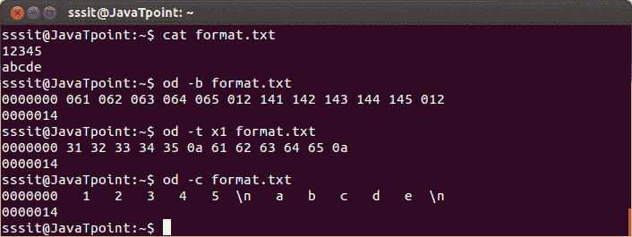

# Linux 来自

> 原文：<https://www.javatpoint.com/linux-od>

“od”一词代表八进制转储。它以不同的人类可读格式显示文件内容，如十六进制、八进制和 ASCII 字符。

**语法:**

```
od -b (display files in octal format)
od -t x1 <filename>(display files in hexadecimal bytes format)
od -c <filename>(display files in ASCII (backslashed) character format)</filename></filename> 
```

**示例:**

```
 od -b format.txt                          
od -t x1 format.txt
od -c format.txt

```



看上面的快照，命令**“od-b format . txt”**以八进制格式显示，命令**“od-t x1 format . txt”**以十六进制格式显示，命令**“od-c format . txt”**以 ASCII 字符显示，新的一行将被标记为 **'\n'**