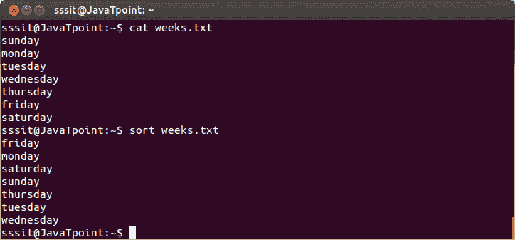
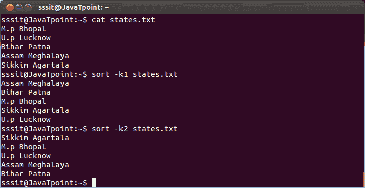
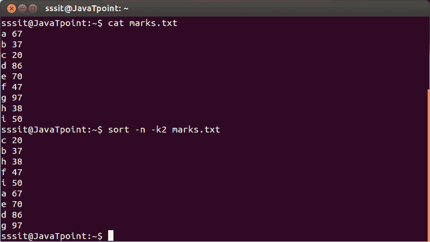

# Linux 排序

> 原文：<https://www.javatpoint.com/linux-sort>

“排序”命令按字母顺序对文件内容进行排序。

**语法:**

```
sort  
```

**示例:**

```
 sort weeks.txt

```



看看上面的快照，sort 命令已经按照字母顺序对 weeks.txt 文件进行了排序。

* * *

## 对列进行排序

如果文件有多个列，列号用于对特定列进行排序。

**语法:**

```
sort -k <filename></filename> 
```

**示例:**

```
 sort -k1 states.txt
sort -k2 states.txt

```



看看上面的快照，我们已经对第 1 列和第 2 列进行了排序。

* * *

## 数字排序

数字排序不同于字母排序。如果需要，数字排序选项**‘n’**与列号一起使用。

**语法:**

```
sort -n -k <filename></filename> 
```

**示例:**

```
sort -n -k2 marks.txt  

```

