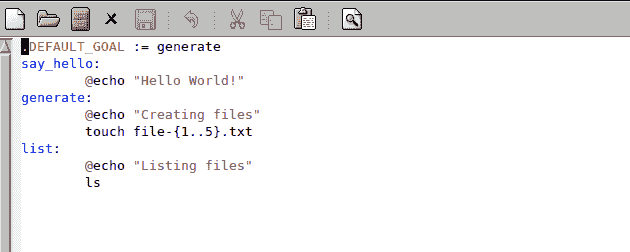

# Linux 生成命令

> 原文：<https://www.javatpoint.com/linux-make-command>

Linux **make** 命令用于从源代码中构建和维护程序和文件组。在 Linux 中，它是开发人员最常用的命令之一。它帮助开发人员从终端安装和编译许多实用程序。此外，它还处理大型项目的编译过程。它节省了编译时间。

make 命令的主要目的是将一个大程序分成几部分，并检查它是否需要重新编译。此外，它会发出必要的命令来重新编译它们。

在本节中，我们将使用 C++程序，因为 C++编程语言是一种面向对象的语言，但是您可以使用安装在您的机器上的任何语言。它不仅仅局限于程序；我们也可以用它来描述其他任务。

## 如何让命令发挥作用？

make 命令将目标作为参数。这些参数在“Makefile”中指定 makefile 包含目标以及与这些目标相关的相关操作。

当我们执行 make 命令时，它会搜索 makefile 并扫描它以找到目标并访问它的依赖项。如果未指定依赖项，它将搜索依赖项并构建它。它将在构建依赖关系后构建主目标。

例如，如果我们只想更改一个源文件，并且我们执行 make 命令；因此，这将只编译与该源文件连接的目标文件。这将在项目的最终编译中节省大量时间。

## 什么是 Makefile？

make 命令调用 makefile 的执行。这是一个特殊的文件，包含我们创建的维护项目的 shell 命令。makefile 包含要执行的目标和命令。不允许创建多个生成文件。建议为其创建一个单独的目录。

它跟踪最近的文件，所以只更新那些需要的文件。如果我们有一个包含许多源文件的大型程序，我们必须重新编译所有相关文件。所以，这可能是一个极其耗时的过程。

makefile 有一个标准列表。这些标准有助于系统理解我们想要执行什么命令。这些标准分为两部分，由一条新的线隔开。第一行是**依赖线，**，后面的行被认为是**动作或命令** s。新行中的命令用制表符分隔。

**依赖关系**指定每个文件与源文件的关系。而**目标**是一个可执行文件，在执行 make 命令后创建。

## 选择

make 命令简化了各种选项，使其更加具体。一些重要选项如下:

*   **-b、-m:** 这些选项用于忽略 make 命令不同版本的兼容性。
*   **-B、- always-make:** 这些选项用于无条件地制造所有目标。
*   **-C dir，- directory=dir:** 这些选项用于在执行 makefile 之前更改目录。
*   **-d:** 用于打印调试信息。
*   **- debug[=FLAGS]:** 用于打印正常处理的同时打印调试信息。如果我们跳过这个标志，那么它将显示类似于“-d”选项的结果。
*   **-e，-环境覆盖:**它用于将从环境中获取的变量优先提供给 makefile。
*   **-f file，- file=file，- makefile=FILE:** 用于将文件作为 makefile 使用。
*   **-i，-忽略-错误:**-I 选项用于忽略命令中的所有错误。
*   **-I dir，- include-dir=dir:** 用于指定一个目录，以搜索指定的 makefile。如果我们指定了多个“-I”选项，它将按照指定的顺序在多个目录中搜索。
*   **-j[作业]，- jobs[=jobs]:** 用于指定同时运行的作业数量。如果我们提供了许多“-j”选项，最后一个选项将被考虑执行。如果我们不指定作业的数量，就不会限制可以同时运行的作业。
*   **-k，-继续:**用于在得到错误后尽可能的继续程序。
*   **-l [load]，- load-average[=load]:** 用于指定如果队列中有其他任务，且平均负载处于最小值，则不应启动新任务。
*   **-n，-刚打印，-试运行，-侦察:**用于显示将要运行的命令。
*   **-o 文件，- old-file=file，-假定-old=file:** 它用于确保 make 不会重新制作文件，即使该文件比其依赖项旧。
*   **-O[type]，- output-sync[=type]:** 用于确认每个任务的输出放在一起，而不是其他任务的混排输出。它对于带有“-j”选项的多任务处理非常有用。
*   **-p，-print-database:**用于打印读取 makefiles 后产生的数据库。与“-v”选项一起使用时，打印版本信息也很有用。要打印数据库而不尝试重新制作任何文件，请执行以下命令:
    make -p -f/dev/null。
*   **-q，-问题:**-q 选项用于**问题模式。**不会运行任何命令，也不会打印任何东西。如果指定的目标已经同步，它将只返回退出状态为零；否则，它将显示非零退出状态。
*   **-r，-无内置规则:**用于消除内置隐式规则的使用。
*   **-R、-无内置变量:**如果我们不想定义任何内置变量，这很有用。
*   **-s，-静音，-静音:**这些选项被称为**静音操作。**限制在命令执行时打印命令。
*   **-S，-不-继续，-停止:**用于取消“-k，-继续”操作的效果。
*   **-t，- touch:** 用来触摸文件，而不是运行文件的命令。
*   **- trace:** 用于追踪每个目标的处置情况。
*   **-v，- version:** 用于打印 make 实用程序的已安装版本。此外，它还显示了作者、版权和一些关于 make 实用程序的通知的列表。
*   **-w、- print-directory:** 用于跟踪包含其他处理前后工作目录的打印消息。从递归 make 命令的复杂结构中追踪错误是有用的。
*   **-无打印目录:**用于关闭“-w”选项。
*   **-W 文件，-假设=文件，-新建-文件=文件，-假设-新建=文件:**这些选项假装目标文件刚刚被修改。
*   **-warn-undefined-变量:**此选项用于警告引用了未定义的变量。

让我们了解 make 命令的一些示例。我们将看到 makefile 的基本用法，此外，我们将创建一些 c++程序和一个 makefile。我们将对它们执行一些操作，以便更好地理解 make 命令。

## make 命令的基本用法

让我们了解 make 命令的最基本用法，它可能会帮助您了解它是如何工作的。

创建一个目录“项目”并将目录更改为它。考虑以下命令:

```

mkdir project
cd project

```

现在为第一个程序创建一个具有以下内容的**“Makefile”**:

```

say_hello:
	echo "Hello World!"

```

从上面的文件来看，say_hello 是一个目标，其行为类似于任何编程语言中的函数，echo 将被视为一个操作。必须记住，应该使用**标签来编写动作。**目标和动作共同为 makefile 创建一个规则。现在，执行 make 命令如下:

考虑以下输出:


从上面的输出中，我们可以看到回声操作本身正在显示。如果我们不想在输出上显示 echo 命令，请执行以 **'@'** 符号开始的 echo。要抑制回声，请按如下方式更新 makefile 的内容:

```

say_hello:
	@echo "Hello World!"

```

考虑以下输出:


目标可能是依赖于操作的二进制文件。

让我们再添加几个目标，比如 makefile 中的 generate 和 list。按如下方式更新 makefile:

```

say_hello:
	@echo "Hello World!"
generate:
	@echo "Creating files"
	touch file-{1..5}.txt
list:
	@echo "Listing files"
	ls 

```

如果我们执行 make 命令，它只执行第一个目标，因为它是 makefile 的默认目标。考虑以下输出:


我们可以通过在 makefile 中包含以下内容来更改默认目标:

```

.DEFAULT_GOAL := generate

```

将其添加到文件的第一行，如下所示:



上面的 makefile 将“生成”视为默认目标。执行 make 命令，它将给出如下输出:


默认目标选项将只执行一个目标，以指定多个目标来使用所有选项。要指定多个目标，请更新 makefile 的第一行，如下所示:

```

all: say_hello generate

```

它将执行指定的目标。考虑以下输出:


还有一个选项允许我们执行所有目标。如果我们想执行 makefile 的所有目标，请按如下方式更新文件:

```

.PHONY: all say_hello generate list
say_hello:
	@echo "Hello World!"
generate:
	@echo "Creating files"
	touch file-{1..5}.txt
list:
	@echo "Listing files"
	ls 

```

上述文件将执行所有指定的目标。执行 make 命令，考虑以下输出:


## make 命令的高级用法

让我们创建一个 C++项目，它有文件 main.cpp、function1.cpp、function2.cpp 和一个依赖文件 function.h。

文件代码如下:

**main.cpp:**

```

#include<iostream>
#include "functions.h"
int main()
{
    print_hello();
    std::cout<< std::endl;
    std::cout<< "The factorial of 5 is" << factorial(5) << std:: endl;
    return 0;
}

```

**功能 1.cpp:**

```

#include "functions.h"

int factorial(int n)
{
  if(n!=1)
    {
      return (n * factorial(n-1));
    }
      else return 1;
    }

```

**功能 2.cpp:**

```

#include <iostream>
#include "functions.h"
void print_hello()
{
  std::cout << "Hello World";
}

```

**功能. h:**

```

void print_hello();
int factorial (int n);

```

现在，通过执行以下命令，创建上述项目的可执行文件:

```

g++ main.cpp function1.cpp function2.cpp -o hello

```

上面的命令将创建一个可执行文件**‘hello’**的文件 main.cpp，function1.cpp 和 function2.cpp。

考虑以下输出:


从上面的输出来看，如果成功执行，就不会给出任何输出。

让我们通过使用 makefile 来执行相同的任务。

创建一个文件作为 **Makefile** ，并将下面的代码放入其中。

```

all:
	g++ main.cpp function1.cpp function2.cpp -o hello

```

all 关键字用于 target，在 newline put 中，使用与上面相同的制表符来指定操作。保存文件。考虑以下文件:


要进行操作，请执行以下命令:

```

make

```

上面的命令将创建一个指定文件的可执行文件“hello”。考虑以下输出:


让我们向 Makefile 添加更多的任务。添加任务**‘编译’**如下:

```

all:

compile:
	g++ main.cpp function1.cpp function2.cpp -o hello

```

要执行任务**编译，**执行以下命令:

```

make compile

```

上面的命令将执行编译任务。考虑以下输出:


让我们对 makefile 执行更多的任务。

按如下方式更新 Makefile:

```

all: hello
hello: main.o function1.o function2.o
	g++ main.o function1.o function2.o -o hello
main.o: main.cpp
	g++ -c main.cpp
function1.o: function1.cpp
	g++ -c function1.cpp
function2.o: function2.cpp
	g++ -c function2.cpp
clean:
	rm -rf *o hello

```

从上面的 makefile 中，我们创建了三个对象作为 main.o、function1.o 和 function2.o。此外，我们还分别提供了 main.o、function1.o 和 function2.o 作为 main.cpp、function1.cpp 和 function2.cpp 的依赖关系。所有目标将在其中执行指定的任务。我们还指定了一个清理目标来清理所有依赖项并移除可执行文件。

现在执行 make all 命令来执行我们的新 makefile。

```

make all

```

考虑以下输出:


从上面的输出中，我们可以看到该命令首先分别执行了 main.o、function1.o 和 function2.o。它将创建给定文件的可执行文件和对象文件。它不会执行干净的目标，因为我们没有在 hello 中指定它。考虑以下文件:


make 命令有一个直接的工作过程。它执行了 all 选项并转到 hello。执行 hello 后，它按照指定的顺序读取目标。它搜索每个目标及其依赖项，并按顺序执行它们。

要删除对象和可执行文件，请执行清理任务。要执行清理任务，请执行以下命令:

```

make clean

```

考虑以下输出:


上述命令将删除所有对象和可执行文件。请参见下面的目录快照:


从上面的图片中，我们可以看到我们已经清理了我们的目录。

## make 命令中的变量

我们可以在 makefile 中定义变量。要定义变量，请使用 **'="** 运算符。例如，如果我们想要创建一个变量 A 并为其分配一个命令 gcc，将其分配为:

```

A=g++

```

在我们的 makefile 中使用它如下:

```

hello: hello.cpp
    ${A} hello.cpp -o hello

```

它以如下形式传递给终端:

```

g++ hello.cpp -o hello

```

我们可以使用$(A)代替${A}，因为脚本对两者的处理是相同的。

## makefile 中的注释

要在 makefile 中添加注释，请使用 **'#'** 符号。例如，要在编译部分添加注释，将其添加为**“#这将编译程序**”编译器会忽略注释。

* * *