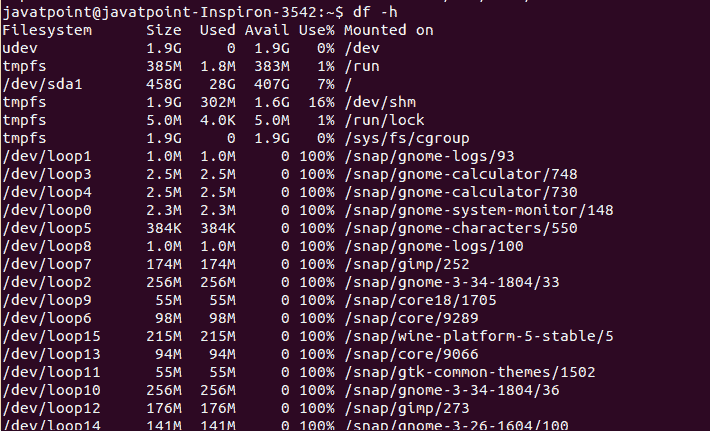
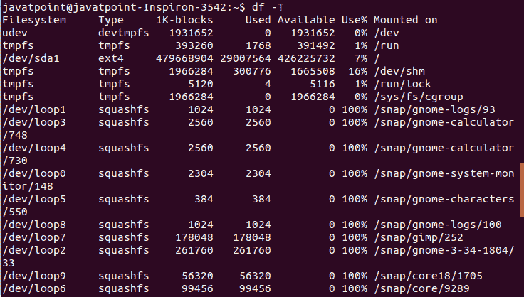

# Linux 测向命令

> 原文：<https://www.javatpoint.com/linux-df>

Linux df 命令用于显示文件系统中使用的**磁盘空间。“df”代表**“磁盘文件系统**”它定义了使用的块数、可用的块数以及装载文件系统的目录。**

### 语法:

```

df [OPTION]... [FILE]...

```

### 选项:

**-a、- all:** 用于包含伪、复制、远程文件系统。

**-B，- block-size=SIZE:** 用于在打印前按大小缩放尺寸，例如，“-BM”选项以 1，048，576 字节为单位打印尺寸。

**-h，-人类可读:**用于显示 1024 次方(如 1023 米)的尺寸。

**-H，- si:** 用于显示 1000 次方的尺寸(如 1.1G)

**-i，- inodes:** 用于列出 inode 信息，而不是数据块使用情况

**-l，- local:** 用于将列表限制在本地文件系统。

**-不同步:**用于获取使用信息前不调用同步(默认)。

**-输出[=FIELD_LIST]:** 如果我们要使用 FIELD_LIST 定义的输出格式，或者如果 FIELD_LIST 被省略，则打印所有字段，则使用该选项。

**-P，-可移植性:**用于使用 POSIX 输出格式。

**-总计:**用于排除对可用空间不重要的所有条目，并产生总计。

**-t，- type=type:** 用于将列表限制为 TYPE 类型的文件系统。

**-T，- print-type:** 用于显示文件系统类型。

**-x，- exclude-type=type:** 用于将列表限制为文件系统，而不是 TYPE 类型。

**-帮助:**用于显示帮助手册，其中包含支持选项的简要信息。

**-版本:**用于显示 df 命令的版本信息。

### df 命令的示例

让我们看看 df 命令的以下示例:

*   显示磁盘空间使用情况
*   以人类可读的形式显示磁盘空间使用情况
*   显示文件系统类型
*   显示特定的文件系统类型
*   排除特定的文件系统类型
*   显示文件夹的可用空间和挂载点

### 显示磁盘空间使用情况

要显示磁盘空间使用情况，请在没有任何参数的情况下执行 df 命令。它将以表格形式显示磁盘空间使用情况。df 命令对于发现系统或文件系统上的可用空间非常有用。执行以下命令:

```

df

```

上述命令将产生如下输出:


从上面的输出中，我们可以分别看到文件系统、1k 数据块中文件系统的大小、已用空间、可用空间、文件系统应用的百分比和装载点。

### 以人类可读的形式显示磁盘空间使用情况

“-h”选项用于以人类可读的形式显示磁盘空间。它将以 1024 的幂显示大小，并将为千兆字节追加 G，为兆字节追加 M，为字节追加 B。执行以下命令:

```

df -h

```

上述命令将产生如下输出:



### 显示文件系统类型

“-T”选项用于显示文件系统类型。它将添加一个具有文件系统类型的新列来输出。执行以下命令:

```

df -T

```

上述命令将产生如下输出:



从上面的输出中，我们可以看到列“type”已经添加了输出。

### 显示特定的文件系统类型

“-t”选项与文件系统类型一起使用来显示特定的文件系统。它将只显示给定的文件系统。我们可以用它指定多个文件系统。考虑以下命令:

```

df -t ext4

```

上述命令将只显示“ext4”类型的文件系统。考虑以下输出:


### 排除特定的文件系统类型

“-x”选项与特定的文件系统类型一起使用，以将其从输出中排除。它将显示除给定类型之外的所有其他文件系统类型。考虑以下命令:

```

 df -x squashfs

```

上述命令将从输出中排除“squashfs”文件系统。考虑以下输出:


### 显示文件夹的可用空间和挂载点

要显示文件夹的可用空间、文件系统类型和装载点，请使用 df 命令传递文件夹名称。考虑以下命令:

```

df Newdirectory

```

上述命令将显示给定文件夹的文件系统详细信息。考虑以下输出:


从上面的输出中，我们可以看到显示了给定文件夹的已用磁盘空间、文件系统类型和其他信息。我们可以通过传递支持的选项来使输出更加具体。

* * *