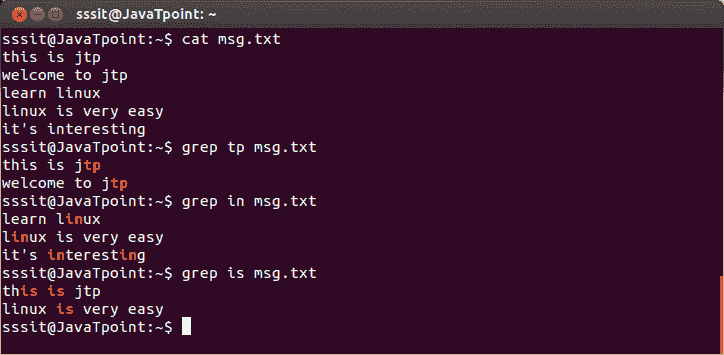
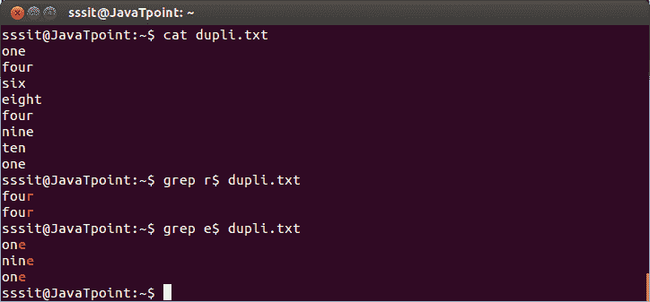
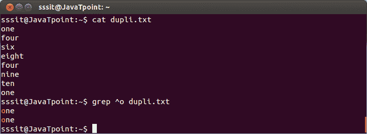

# Linux grep 正则表达式

> 原文：<https://www.javatpoint.com/linux-grep-regular-expressions>

grep 工具有以下使用正则表达式的选项:

*   -E:字符串被读取为 ERE(扩展正则表达式)
*   -G:字符串被解读为 BRE(基本正则表达式)
*   字符串被解读为 PRCE (Perl 正则表达式)
*   -F:字符串是按字面读的。

* * *

## 打印与图案匹配的线条

grep 命令将搜索与指定模式匹配的行。

**语法:**

```

 grep <filename></filename> 
```

**示例:**

```

grep t msg.txt
grep l msg.txt
grep v msg.txt

```


看上面的快照，所有匹配的图案线都显示出来，图案高亮显示。

* * *

## 连接字符

如果一个模式是连接字符，那么它必须按原样匹配，才能显示该行。

**示例:**

```

grep tp msg.txt
grep in msg.txt
grep is msg.txt

```



看上面的快照，显示了与指定模式完全匹配的线条。

* * *

## 非此即彼

在这里，管道(|)符号被用作或来表示一个或另一个。显示了所有三个版本。选项-E 和-P 语法相同，但-G 语法使用(\)。

**语法:**

```

grep <filename></filename> 
```

**示例:**

```

grep -E 'j|g' msg.txt
grep -P 'j|g' msg.txt
grep -G 'j\|g' msg.txt

```


看上面的快照，应该匹配模式“j”或“g”来显示线条。

* * *

## 一个或多个/零个或多个

*表示模式出现零次或多次，而+表示出现一次或多次。

**语法:**

```

grep <filename></filename> 
```

**示例:**

```

grep -E '1*' list
grep -E '1+' list

```


看上面的快照，*字符显示零次或更多次出现模式**‘1’**。但是+字符显示一次或多次出现。

* * *

## 匹配字符串的结尾

为了匹配字符串的结尾，我们使用$符号。

**语法:**

```

grep $ <filename></filename> 
```

**示例:**

```

grep r$ dupli.txt
grep e$ dupli.txt

```



看上面的快照，显示的行与字符串的结尾相匹配。

* * *

## 匹配字符串的开头

为了匹配文件的开头，我们使用插入符号(^).

**语法:**

```

grep ^ <filename></filename> 
```

**示例:**

```

grep ^o dupli.txt

```



看上面的快照，显示的行与字符串的开头或开头相匹配。

* * *

## 分离单词

**语法:**

```

grep '\b\b' <filename></filename> 
```

**示例:**

```

grep '\bsome\b' file

```


看上面的快照，通过给出命令**“grep some file**，所有与单词‘some’匹配的行都被显示出来。但是通过给出命令**“grep”\ b \ b“file”**仅显示匹配单个单词“some”的行。

**注意:**这也可以借助-w 选项完成。

**语法:**

```

grep -w <filename></filename> 
```

**示例:**

```

grep -w some file

```


看上面的快照，命令**“grep-w some file”**显示的结果与 **\b** 字符相同。

* * *