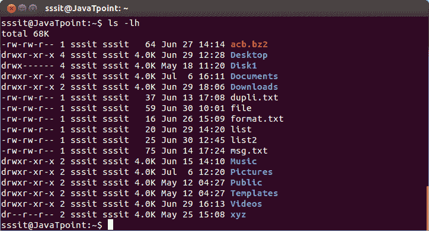
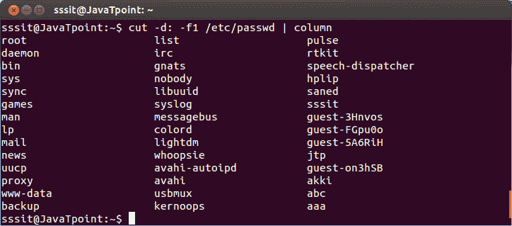

# Linux 文件所有权

> 原文：<https://www.javatpoint.com/linux-file-ownership>

每个 Linux 系统都有三种所有者:

1.  **用户:**用户是创建文件的用户。默认情况下，无论谁创建了文件，都将成为文件的所有者。用户可以创建、删除或修改文件。
2.  **组:**一个组可以包含多个用户。属于一个组的所有用户对一个文件具有相同的访问权限。
3.  **其他:**除了**用户**和**组**之外，任何有权访问该文件的人都属于**其他**类别。其他既没有创建文件，也不是组成员。

用户和组可以在 **/etc/psswd** 或 **/etc/group 中进行本地管理。**

**语法:**

```
ls -lh

```



看上面的快照，所有列出的文件和目录都有相同的用户和组，即 **sssit。第一**列表示用户，**第二**列表示组。

* * *

## 列出用户帐户

要知道本地用户帐户，可以使用以下命令。它列出了系统中所有的本地用户。

**语法:**

```
cut -d: -f1 /etc/passwd | column

```



* * *

## Linux chgrp:更改组

chgrp 命令可以缩写为**变更组**。您可以使用 chgrp 命令更改文件的组所有者。

**语法:**

```
chgrp <filename></filename> 
```

**示例:**

```
chgrp php file

```


看上面的快照，早先的‘文件’组是 sssit。但是在传递命令**“chgrp php 文件”**之后，我们已经将该组更改为 **php** (我们突出显示 PHP 只是为了向您展示)。

#### 注意:只有超级用户有权更改系统中文件的所有者或组。

## Linux chown:改变所有者

命令 chown 用于更改文件的所有者。

**语法:**

```
chown <filename></filename> 
```

**示例:**

```
chown jtp list

```


看上面的快照，我们已经将文件**列表**的所有者从 sssit 更改为 **jtp。**

命令 chown 也可以用于更改用户所有者和组。

**语法:**

```
chown <filename></filename> 
```

**示例:**

```
chown jtp:php msg.txt

```


看上面的快照，用户所有者和组都分别变成了 **jtp** 和 **php** 。

## 特殊文件列表

当我们键入 **ls -l** 命令时，在用户所有者和组之前会显示十个字符。第一个字符告诉我们文件的类型。

**以下是文件类型:**

| 第一个字符 | 文件类型 |
| - | 普通文件 |
| d | 目录 |
| l | 符号链接 |
| p | 命名管道 |
| b | 被阻止的设备 |
| c | 字符设备 |
| s | 窝 |

**文件类型示例:**


看上面的快照，第一个字母 c 表示字符设备， **b** 表示阻塞设备。


看上面的快照，第一个字母(-)表示正常文件，d 表示目录。

* * *