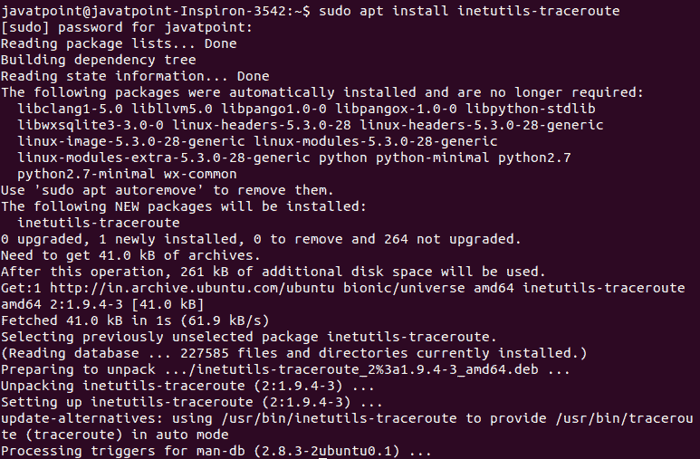
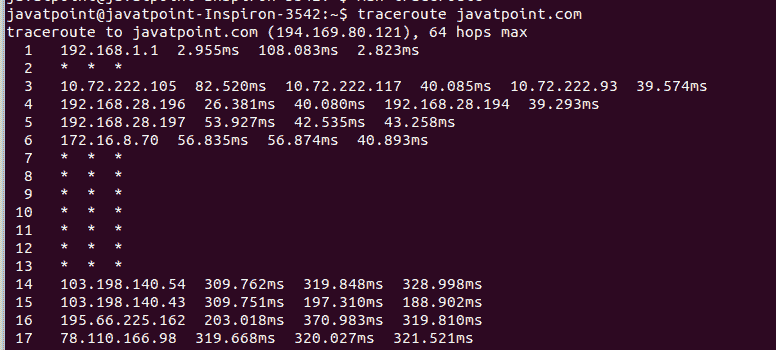
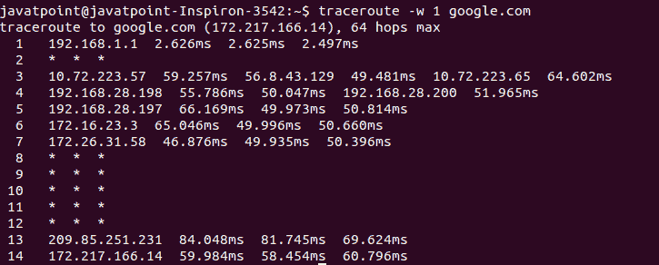
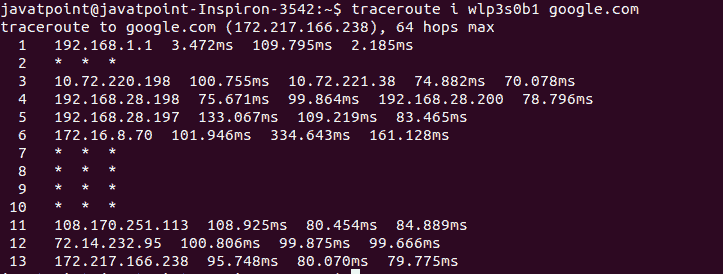
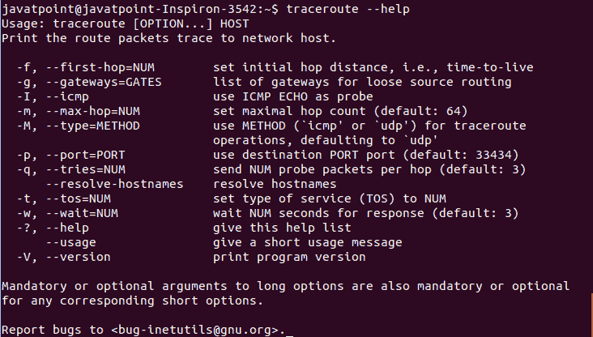
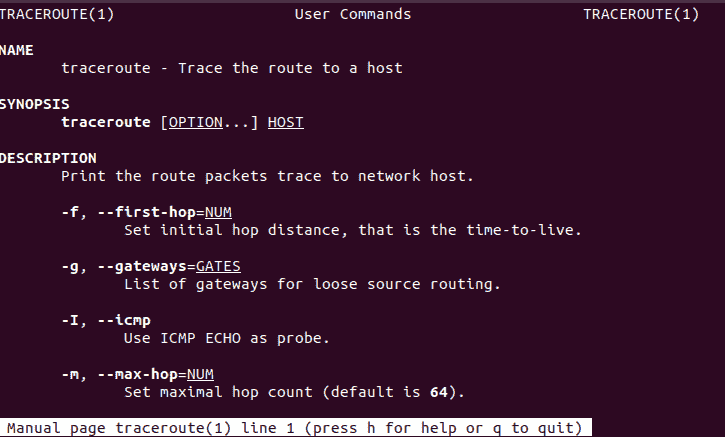

# Linux traceroute 命令

> 原文：<https://www.javatpoint.com/linux-traceroute>

Linux traceroute 命令是一个网络故障排除实用程序，帮助我们确定到达目的地所需的跳数和数据包传输路径。它用于显示数据是如何从本地机器传输到远程机器的。加载网页是 traceroute 的常见示例之一。网页加载通过网络和路由器传输数据。traceroute 可以显示网络上路由器的路由、 [IP](https://www.javatpoint.com/ip-full-form) 地址和主机名。它对于诊断网络问题非常有用。

### 语法:

```

 traceroute [OPTION...] HOST

```

### 选项:

traceroute 命令支持以下命令行选项:

**-f，-第一跳=NUM:** 用于设置初始跳距。

**-g，-GATES = GATES:**用于显示松散源路由的网关列表。

**-I，- icmp:** 指定使用 ICMP ECHO 作为探针。

**-m，-最大跳数=NUM:** 用于设置最大跳数，默认为 64。

**-M，- type=METHOD:** 它为 traceroute 操作指定了 METHOD (icmp 或 udp)，默认方法是 udp。

**-p，- port=port:** 定义为使用目的端口 PORT，默认端口为 33434。

**-q，- tries=NUM:** 用于每跳转发 NUM 探测包，默认值为 3。

**-解析-主机名:**用于解析主机名。

**-t，- tos=NUM:** 用于将服务类型(tos)设置为 NUM。

**-w，- wait=NUM:** 用于以秒为单位等待响应，默认为 3。

**-？，- help:** 用于显示帮助手册，其中包含对支持的命令行选项和用法的简要描述。

**-用法:**显示简短的用法信息。

**-V，- version:** 用于显示 traceroute 的版本信息。

让我们看一下主题的快速索引:

*   安装跟踪路由命令
*   它是如何工作的？
*   使用 Ipv6 跟踪路由
*   使用 Ipv4 跟踪路由
*   禁用 IP 地址和主机名映射
*   设置每跳的查询数量
*   设置响应等待时间
*   指定要使用的接口
*   设置初始 TTL 值
*   设置最大跳数
*   获得帮助

### 安装跟踪路由命令

traceroute 不是 [Linux](https://www.javatpoint.com/linux-tutorial) 系统的默认实用程序。要使用 traceroute，我们需要手动安装它。要安装它，请执行以下命令之一:

```

sudo apt install inetutils-traceroute
sudo apt install traceroute 

```

上述命令将在我们的系统上安装 traceroute 实用程序。成功安装后，输出如下所示:



### 它是如何工作的？

要跟踪连接的网络主机的路由，请传递要连接的服务器名称或 [IP](https://www.javatpoint.com/ip) 地址。例如，要跟踪服务器“javatpoint.com”的路由，请执行以下命令:

```

traceroute javatpoint.com

```

上面的命令将显示给定路由上的跳数、数据包和许多其他信息。考虑以下输出:



从上面的输出，我们可以看到几个东西。让我们了解输出的每个部分:

*   第一行显示要到达的主机名和 IP 地址、traceroute 命令要尝试的跳数以及要发送的数据包大小。
*   从第二行开始，每一行都显示到目的地的一跳。主机名后面跟着主机的 IP 地址，往返时间。往返时间是信号发送所用的时间和响应主机所用的时间之和。
*   默认情况下，它为每台主机发送三个数据包，因此列出了三个响应时间。
*   “*”符号表示数据包丢失。丢包是由于网络中断、高流量导致的网络拥塞，或者防火墙正在丢弃流量。在大量数据包丢失的情况下，traceroute 将显示错误为“未到达目的地”

### 使用 IPv6 跟踪路由

“6”选项用于使用 Ipv6 协议跟踪到主机网络的路由。考虑以下命令:

```

traceroute6 google.com

```

上面的命令将使用 Ipv6 协议跟踪到“google.com”的路由。考虑以下输出:


### 使用 Ipv4 跟踪路由

“4”选项用于使用 Ipv6 协议跟踪到主机网络的路由。考虑以下命令:

```

traceroute 4 google.com

```

上面的命令将使用 Ipv6 协议跟踪到“google.com”的路由。考虑以下输出:


### 禁用 IP 地址和主机名映射

“n”选项用于禁用 IP 地址和主机名映射。考虑以下命令:

```

traceroute n google.com

```

上述命令将产生如下输出:


### 设置每跃点的查询数

“-q”选项用于设置每跳的查询数量。考虑以下命令:

```

 traceroute -q 2 google.com

```

上述命令将产生如下输出:


### 设置响应等待时间

“-w”选项用于设置 traceroute 中的响应等待时间。它将以秒为单位指定响应探测的等待时间。考虑以下命令:

```

traceroute -w 1 google.com

```

根据上面的命令，响应等待时间为 1 秒。它将产生如下输出:



### 指定要使用的接口

“I”选项用于设置 traceroute 应该使用的网络接口。如果未设置，将根据路由表设置接口。考虑以下命令:

```

traceroute i wlp3s0b1 google.com

```

上述命令将产生如下输出:



### 设置初始 TTL 值

我们可以设置除默认值之外的初始 TTL(生存时间)值。它会跳过一些跳跃。通常，对于相应的测试集，它被设置为一、二、三等等。因此，如果我们将其设置为 7，第一个测试将尝试跳 7，并跳过从 1 到 6 的跳。考虑以下命令:

```

traceroute -f 7 google.com

```

上面的命令将直接进入第七跳。考虑以下输出:


### 设置最大跳数

“-m”选项用于设置数据包到达目的地的最大跳数。最大跃点数的默认值是 30。考虑以下命令:

```

traceroute -m 7 google.com

```

上述命令将设置数据包到达目的地的最大跳数为 7。考虑以下输出:


### 获得帮助

要显示包含用法和支持选项摘要的帮助手册，请执行以下命令:

```

traceroute --help

```

上面的命令将显示帮助。它将产生如下输出:



我们还可以通过执行 man 命令来访问手动页面，如下所示:

```

man traceroute

```

上述命令将显示 traceroute 命令的手动页面。它将如下所示:



滚动页面阅读更多内容，然后按“q”键退出手动页面。

* * *