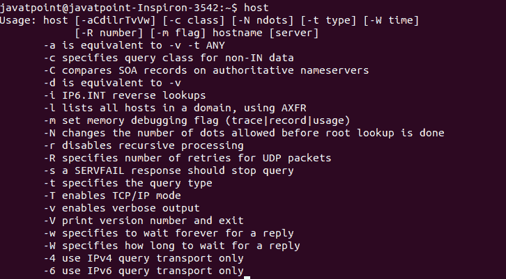
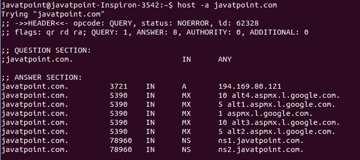

# Linux 主机命令

> 原文：<https://www.javatpoint.com/linux-host>

Linux 主机命令显示给定 IP 地址的域名，反之亦然。它还执行与域名系统查询相关的域名系统查找。主机命令的默认行为显示其命令行参数和支持的选项的摘要。

### 语法:

host 命令支持各种命令行参数和选项。主机命令的基本语法如下:

```

host <name>

```

哪里，

**名称:**名称可以是域名或 [IP](https://www.javatpoint.com/ip-full-form) 地址(Ipv4 或 Ipv6)。它将查找给定的名称。

### 选项:

以下命令行参数和选项可用于主机命令:

**-4:** 仅用于查询的 Ipv4 地址。

**-6:** 仅用于查询 IPv6 地址。

**-a:**-a 选项代表“全部”它相当于“-v”，“-r”，“s”，任何选项。但是，它会影响“-l”选项的行为。

**-c 类:**用于指定查询类。该类的默认值为“在(互联网)”。

**-C:** 用于检查一致性。

**-d:** 用于显示调试痕迹。该选项类似于“-v”verbose 选项。

**-i:** 用于废弃值。

**-l:** 用于列出分区。主机命令还用于传输区域和显示记录，如 NS、PTR、A 等。

**-N 个数字:**用于指定名称中必须包含的点数。

**-r:** 用于非递归查询。通过使用非递归查询来模拟名称服务器的行为非常有用。

**-R 编号:**用于 UDP 查询的重试次数。对于负数或零，重试次数将为 1(即默认)。

**-s:** 如果某个服务器没有响应，则不会向下一个名称服务器发送查询。

**-t 类型:**用于指定查询类型。此选项将识别任何查询类型，如“CNAME”、“NS”、“SOA”、“TXT”、“DNSKEY”、“AXFR”等。如果我们不指定查询类型，它将自动选择适当的类型。默认情况下，它将搜索“A”、“AAAA”和 MX 记录。如果名称是一个 IP 地址，它将搜索“PTR”记录。

**-T 或-U:** 用于 TCP/UDP 连接:默认情况下，主机命令在查询时选择“UDP”连接。“-T”选项指定 TCP 连接，“-U”指定“UDP”连接。

**-m 标志:**用于内存使用调试。“flag”参数可以被记录、使用或跟踪。我们可以使用这个选项设置多个标志。

**-v:** 用于显示详细(口头)输出。该选项类似于“-d”选项。

**-V:** 用于显示版本信息。

**-w:** 用于永远等待模式。它会将查询超时设置为最大可能值。

**-W 等待:**用于等待指定的截止时间(以秒为单位)。它不能取小于 1 的值。默认查询等待时间为 5 秒(对于 UDP 响应)和 10 秒(对于 TCP 连接)。

### 主机命令的示例

让我们看看主机命令的以下示例:

*   默认主机命令
*   显示域 IP 地址
*   仅将 Ipv4 地址用于查询传输
*   仅将 Ipv6 地址用于查询传输
*   显示域名服务器
*   仅显示 Cname 记录
*   仅显示 MX 记录
*   仅显示 TXT 记录
*   仅显示 SOA 记录
*   查询特定的名称服务器
*   显示域名服务器的所有信息
*   显示 TTL 信息

### 默认主机命令

如果我们在没有任何参数的情况下执行 host 命令，它将显示命令行参数和支持的选项的摘要。按如下方式执行命令:

```

host

```

上述命令将显示支持的命令行选项列表。考虑以下输出:



### 显示域的 IP 地址

要显示域的 [IP](https://www.javatpoint.com/ip) 地址，请执行主机命令，后跟域名，如下所示:

```

host javatpoint.com

```

上面的命令将显示给定域名的 IP 地址。考虑以下输出:


### 仅将 Ipv4 用于查询传输

我们可以为一个域使用 Ipv4 查询传输。要使用 IPv4 地址，请使用“-4”选项执行命令，如下所示:

```

host -4 javatpoint.com

```

上面的命令将使用 Ipv4 地址在给定的域名上进行查询传输。考虑以下输出:


### 仅将 Ipv6 用于查询传输

“-6”选项用于使用 Ipv6 查询传输。这对于检查启用 Ipv6 的名称服务器是否工作非常有用。按如下方式执行命令:

```

host -6 javatpoint.com

```

考虑以下输出:


### 显示域名服务器

带有“-t”参数的“ns”选项用于显示域名服务器。考虑以下命令:

```

host -t ns www.javatpoint.com

```

上面的命令将显示“javatpoint”的名称服务器。考虑以下输出:


### 仅显示 Cname 记录

带有“-t”参数的“cname”选项用于显示 cname 记录。考虑以下命令:

```

host -t cname www.javatpoint.com

```

上面的命令将显示“javatpoint”的 cname 记录。考虑以下输出:


### 仅显示 MX 记录

带有“-t”参数的“mx”选项用于显示 mx 记录。考虑以下命令:

```

host -t mx www.javatpoint.com

```

上面的命令将显示“javatpoint”的 mx 记录。考虑以下输出:


### 仅显示文本文件记录

带“-t”参数的“txt”选项用于显示 TXT 记录。考虑以下命令:

```

host -t txt www.javatpoint.com

```

上面的命令将显示“javatpoint”的 txt 记录。考虑以下输出:


### 仅显示 SOA 记录

我们可以使用 host 命令列出指定区域的 SOA 记录。它将显示给定区域的权威名称服务器。要显示 SOA 记录，请使用“-C”选项执行主机命令，如下所示:

```

host -C javatpoint.com

```

上面的命令将显示“javatpoint”的 SOA 记录。考虑以下输出:


### 查询特定的名称服务器

我们可以通过在域名或 IP 地址后指定名称服务器来查询特定的名称服务器。要查询特定的名称服务器，请执行主机命令，如下所示:

```

host javatpoint.com ns1.javatpoint.com

```

上面的命令将显示给定名称服务器上的信息。考虑以下输出:


### 显示域名服务器的所有信息

要显示任何域名服务器的详细信息，请使用 host 命令传递“-a”选项，后跟域名。考虑以下命令:

```

host -a javatpoint.com

```

上面的命令将显示“javatpoint”域的详细信息。考虑以下输出:



### 显示 TTL 信息

要显示任何服务器的生存时间信息，请执行主机命令，如下所示:

```

host -v -t a javatpoint.com

```

上述命令将在“Javatpoint.com”上显示 TTL 信息。您可以选择任何其他域名。考虑以下输出:


* * *