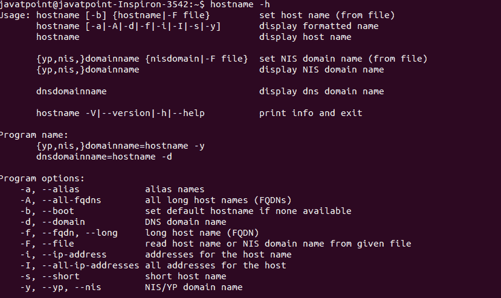
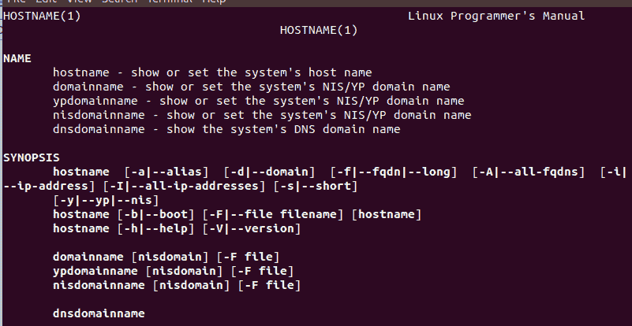

# Linux 主机名命令

> 原文：<https://www.javatpoint.com/linux-hostname>

Linux hostname 命令允许我们设置和查看系统的主机名。主机名是通过网络唯一标识的连接到网络的任何计算机的名称。无需使用特定的 [IP](https://www.javatpoint.com/ip-full-form) 地址即可访问。

默认情况下，系统的主机名是在安装操作系统期间设置的。即使我们安装了虚拟机，它也是由系统动态分配的。但是，每当我们想要更改主机名时，可能会出现一些情况。主机名命令将允许我们这样做。

### 语法:

主机名命令的基本语法如下:

```

hostname

```

### 选项:

hostname 命令支持以下命令行选项:

**-a，-别名:**用于显示主机的别名(如果已定义)。但是，不推荐使用“-a”选项。

**-A，-all-FQDN:**用于显示系统的 FQDN。“-A”选项列出所有接口上所有已配置的网络地址，并将它们转换为域名。它跳过无法转换的地址，因为它们没有正确的反向 [IP](https://www.javatpoint.com/ip) 条目。

**-b、- boot:** 它允许为始终设置主机名。如果未指定任何主机名，它将使用默认主机名(即 localhost)。

**-d，- domain:** 用于打印 DNS 域名。不要混淆域名和主机名命令。domainname 命令显示 NIS 域名，它还显示 DNS 域名。

**-f，- fqdn，- long:** 用于打印 fqdn(完全限定域名)。FQDN 包含短主机名和域名。FQDN 和[域名可以在“/etc/hosts”文件中更改，BIND 或 NIS 主机查找除外。](https://www.javatpoint.com/dns-full-form)

**-F，-文件文件名:**用于从文件中读取主机名。

**-i，- ip 地址:**用于打印主机名的网络地址。仅当主机名处于解析环境中时，此选项才有效。

**-I，-全 ip 地址:**用于打印主机的网络地址。它将列出所有网络接口上所有已配置的地址。在此选项中，将跳过环回接口和 Ipv6 本地地址。此选项确实依赖于名称解析，如“-”选项。

**-s，- short:** 用于打印短主机名。如果主机名太长，它将从第一个点开始切割。

**-V，-版本:**用于显示已安装的版本信息。

**-y、- yp、- nis:** 用于打印 nis 域名。如果我们传递一个参数或文件名，那么根可以设置一个新的 NIS 域。

**-h，- help:** 用于显示帮助手册，其中包含使用和支持选项的摘要。

### 什么是 FQDN

FQDN 代表**完全合格域名**。它是返回主机名(如 abc.example.com)的系统的名称。它是主机名，后跟域名。可以通过执行“hostname -fqdn”命令来检查 FQDN。

### 主机名命令的示例

让我们看看主机名命令的以下示例:

*   [打印系统名称](#system)
*   [设置主机名](#hostname)
*   [打印系统的 IP 地址](#IP)
*   [打印主机名别名(如果有)](#alias)
*   [打印关联域名](#associated)
*   [打印短主机名](#short)
*   [获取帮助](#Getting-Help)

### 打印系统的主机名

要显示系统名称，请执行基本主机名命令。考虑以下命令:

```

hostname

```

上述命令将显示系统名称。考虑以下输出:


从上面的命令中，系统名称显示为“javatpoint-Inspiron-3542”，这是安装过程中创建的默认名称。

### 设置主机名

我们可以使用 hostname 命令来设置主机名。它需要 sudo 特权。要设置系统名称，请执行以下命令:

```

sudo hostname <newName>  

```

考虑以下命令:

```

sudo hostname xyz.com  

```

上面的命令将主机名设置为“xyz.com”。考虑下面的输出:


从上面的输出中，我们已经将**“XYZ . com”**设置为我们的主机名。

上述系统名称不是永久的。使用 hostname 命令设置的系统名称不是永久的。重新启动系统时，名称将更改为主机名文件中指定的名称。

要永久设置主机名，您必须将其保存在服务器上的主机名文件中。设置后，您必须重新启动系统。

对于 Ubuntu，使用/etc/hostname 文件。

对于 RHEL，使用/etc/sysconfig/network。

### 打印系统的 IP 地址

我们可以通过执行 hostname 命令来查看系统的 IP 地址。“-i”选项用于显示系统的 IP 地址。考虑以下命令:

```

hostname -i

```

上述命令将显示系统的 IP 地址。考虑以下输出:


### 打印主机名别名(如果有)

“a”选项用于显示主机系统的别名(如果有)。如果系统没有别名，它将返回一个空行。它列出了所有网络接口上的所有配置地址。考虑以下命令:

```

hostname -a 

```

上述命令将显示系统的主机名。考虑以下输出:


上面的输出返回一个空行，这意味着没有为此系统设置别名。

### 打印关联的域名

“-d”选项用于显示与系统相关联的域名。它将显示本地域名(如果设置)。如果没有为系统设置域名，它将不会返回任何内容。考虑以下命令:

```

hostname -d

```

上面的命令名称将显示相关的域名。考虑以下输出:


上面的输出没有返回任何内容，这意味着没有为

### 打印短主机名

“-s”选项用于打印短主机名。简称是第一部分的一部分(在“.”之前)).如果系统没有任何简称，它将显示全名。考虑以下命令:

```

hostname -s

```

上述命令将显示系统的简称。考虑以下输出:


### 获得帮助

如果您在使用 hostname 命令时遇到困难，您可以从您的终端获得帮助。Linux 命令支持“-help”和手动页面，其中包含用法和支持选项的摘要。

要获得帮助，请执行以下命令:

```

hostname -h

```

上述命令将显示使用情况和支持选项的摘要。考虑以下输出快照:



从上面的输出中，我们可以看到显示了 hostname 命令的摘要。

还有另一种从命令行获取帮助的方法，即手动页面。要显示它的手动页面，请执行以下命令:

```

man hostname

```

上述命令将显示主机名命令的手动页面。考虑以下输出:



要阅读更多滚动输出，请按“q”键退出手动页面并返回终端。

* * *