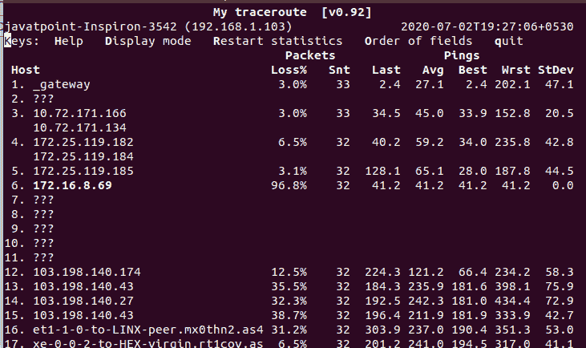
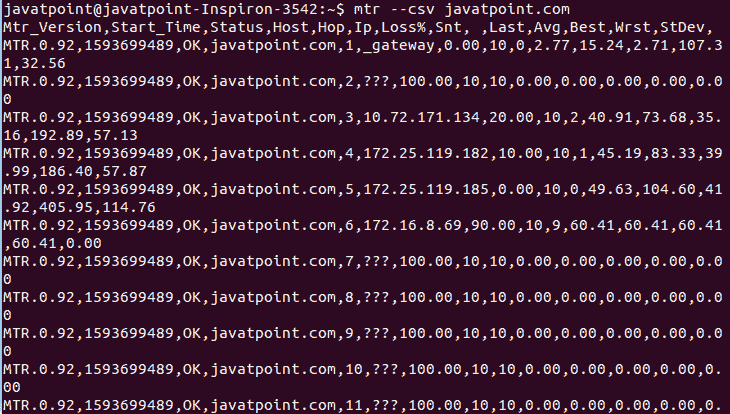
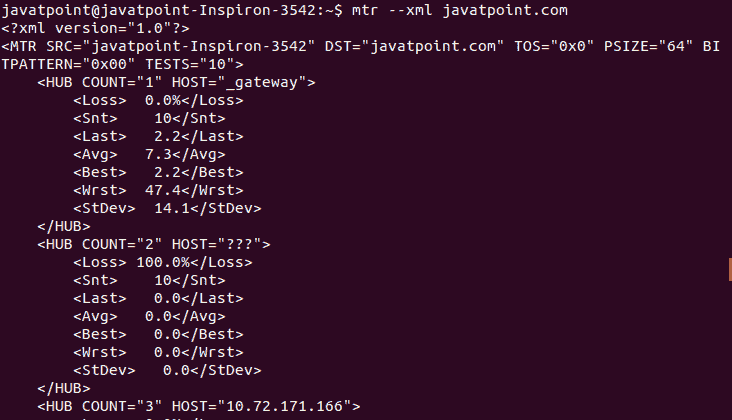
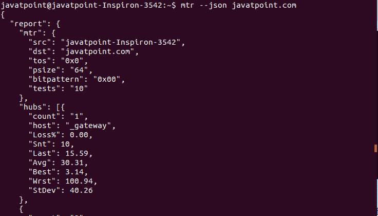
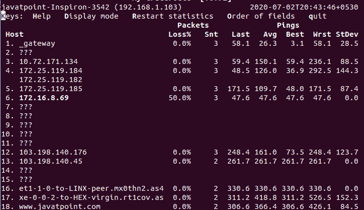
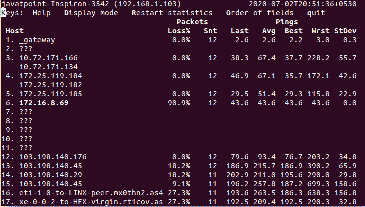
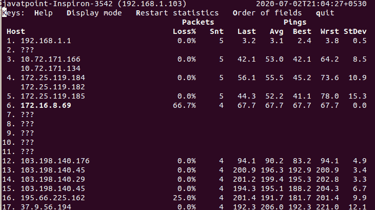
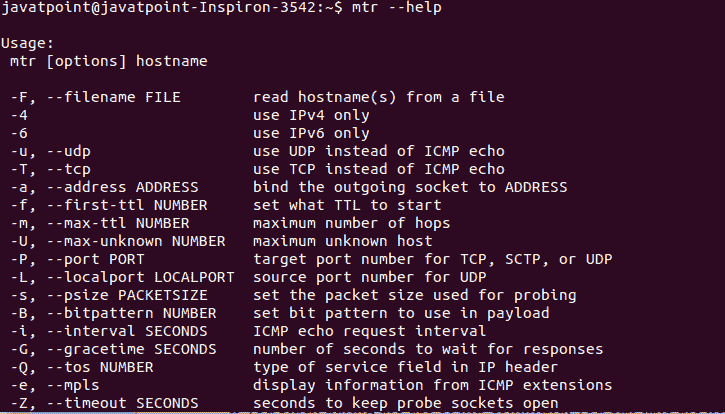
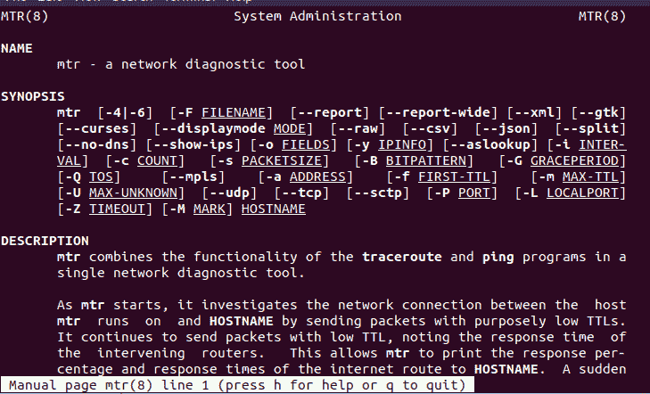

# Linux 地铁指挥部

> 原文：<https://www.javatpoint.com/linux-mtr>

mtr 命令是 ping 和 traceroute 命令的组合。它是一种网络诊断工具，可以连续发送数据包，显示每一跳的 ping 时间。它还显示网络数据包采用的整个路由的网络问题。

### 语法:

mtr 命令的基本语法如下:

```

mtr <option> <hostname>/path

```

### 选项:

mtr 命令支持以下命令行选项:

**-h，- help:** 用于显示帮助手册，其中有使用方法和命令行选项的简要说明。

**-v，-版本:**用于显示已安装的版本信息。

**-4:** 用于 IPv4 地址。

**-6:** 用于 IPv6 地址。

**-F FILENAME，- filename FILENAME:** 用于从文件中访问域名(路径)。

**-r、- report:** 用于将地铁设置为报表模式。这对于显示网络统计质量很有用。

**-w、-全报:**用于将地铁设置为全报模式。

**-x，- xml:** 用于指定 [xml](https://www.javatpoint.com/xml-tutorial) 输出格式。

**-t、- curses:** 用于强制指定使用基于 curses 的终端界面。

**-显示模式模式:**用于选择初始显示模式。显示模式如下:

0:选择统计数据(默认)

1:选择不带延迟信息的条带图

2:选择带有延迟信息的条带图

**-g，- gtk:** 用于指定使用基于 GTK+的 X11 窗口界面。

**-l，- raw:** 用于指定 raw 输出格式。

**-C，- csv:** 用于指定“逗号分隔值(csv)”输出格式。

**-j，- json:** 用于指定 json 输出格式。

**-p，- split:** 用于指定吐槽的一种格式。它适用于分离用户界面。

**-n、- no-dns:** 用于显示数字 IP 号，不尝试强行解析主机名。

**-b、- show-ips:** 用于显示域名和 IP 地址。

**-o FILERS，-order FILERS:**用于指定要显示的字段及其顺序。

**-y n，- ipinfo n:** 用于显示各 IP 跳的信息。

**-z，- aslookup:** 用于显示每一跳的自治系统(AS)号。它类似于“- ipinfo 0”命令。

**-i SECONDS，- interval SECONDS:** 用于描述 ICMP ECHO 请求之间的正秒数。

**-c COUNT，-报告周期数:**用于指定发送的 pings 数。

**-s PACKETSIZE，- psize PACKETSIZE:** 用于描述探测的数据包大小。

**-B NUM，- bitpattern NUM:** 用于指定有效载荷的位模式。

**-G SECONDS，- gracetime SECONDS:** 用于指定最终请求后正秒数内的响应时间，默认为 5 秒。

**-Q NUM，- tos NUM:** 用于指定 Ip 头中服务字段值的类型。

**-e，- mpls:** 用于指定来自 ICMP 扩展的信息。

**-a ADDRESS，- address ADDRESS:** 用于将输出套接字绑定到 ADDRESS。

**-f NUM，- first-ttl NUM:** 用于指定要启动的 ttl。

**-m NUM，- max-ttl NUM:** 用于描述最大跳数(最大 ttl 值)。默认情况下，它是三十。

**-U NUM，-max-未知 NUM:** 用于指定最大未知主机。默认情况下，它是五。

**-u，- udp:** 用于指定 udp 数据报，而不是 ICMP ECHO。

**-T，- tcp:** 用于指定 TCP SYN 数据包，而不是 ICMP ECHO。

**-S，- sctp:** 用来代替 ICMP ECHO 使用“流控制传输协议”。

**-P PORT，-PORT PORT PORT:**用于指定 TCP/SCTP/UDP 跟踪的端口号。

**-L LOCALPORT，- localport LOCALPORT:** 用于指定 UDP 跟踪的源端口号。

### 地铁指挥部的例子

让我们看看下面的 mtr 命令的例子:

*   [显示追踪路线报告](#traceroute)
*   [显示 CSV 输出](#CSV)
*   [显示 Xml 输出](#Xml)
*   [显示 Json 输出](#Json)
*   [指定平的极限](#Limit)
*   [从文件中读取主机名](#Hostnames)
*   [禁用域名解析(仅显示数字地址)](#DNS)
*   [获取帮助](#Getting-Help)

### 显示跟踪路由报告

mtr 命令的默认行为显示远程主机名或 IP 地址的 traceroute 报告。要显示 traceroute 报告，请传递主机名或 IP 地址，如下所示:

```

mtr <hostname>

```

考虑下面的例子:

```

mtr javatpoint.com

```

上面的命令将显示“javatpoint.com”的 traceroute 报告。考虑以下输出:



从上面的输出中，traceroute 报告会一直显示，直到完成为止。要中断它，请按 CTRL+C 键。

### 显示 CSV 输出

要显示 CSV 输出，请使用 mtr 命令传递 **' - csv'** 选项。CSV 文件是一个逗号分隔的文件，用逗号(，)分隔各列。考虑以下命令:

```

mtr --csv javatpoint.com

```

上述命令将显示 CSV 输出。考虑以下输出:



### 显示 Xml 输出

mtr 命令支持 [Xml](https://www.javatpoint.com/xml-interview-questions) 格式输出。要显示 Xml 输出，请将“- xml”选项与 mtr 命令一起传递。Xml 格式对于自动化处理很有用。考虑以下命令:

```

mtr --xml javatpoint.com

```

上面的命令将以 Xml 格式显示输出。考虑以下输出:



### 显示 Json 输出

mtr 命令支持的另一种有用的输出格式是 Json 文件。我们可以用 [Json](https://www.javatpoint.com/json-tutorial) 格式显示输出。要显示输出，请使用“- json”选项执行命令，如下所示:

```

mtr --json javatpoint.com

```

上述命令将产生如下输出:



### 指定 Ping 的限制

我们可以指定 pings 的限制；它将在完成指定次数的 pings 后自动退出。pings 的数量可以在“Snt”列中看到。要确定 pings 的数量，请使用“-c”选项执行命令，如下所示:

```

mtr -c 10 javatpoint.com

```

上述命令将显示指定 pings 次数的 traceroute 报告。考虑以下输出:



### 从文件中读取主机名

mtr 命令允许我们在一个文件中指定多个主机名进行读取。各种主机名可以在文本文件中通过插入新行来指定。它会按顺序读取它们。要从文件中读取文件名，请使用“-F”选项执行命令。考虑以下命令:


上面的命令将从文件“pings.txt”中读取文件名。考虑下面的输出:



从上面的输出中，指定主机名的 traceroute 将按顺序显示。

### 禁用域名解析(仅显示数字地址)

[DNS](https://www.javatpoint.com/dns-full-form) 解析的禁用使得输出更快，因为这将减少更多的流量和 DNS 解析所花费的等待时间。要禁用域名解析，请使用“-n”选项执行命令，如下所示:

```

mtr -n javatpoint.com

```

上述命令将禁用域名解析并产生更快的输出。考虑以下输出:



### 获得帮助

如果您在使用 mtr 命令时被卡住，您可以从您的终端获得帮助。有“help”和“man”命令，其中包含用法和支持的命令行选项的摘要。

要显示帮助，请使用“- help”选项执行命令，如下所示:

```

mtr --help

```

上面的命令将显示支持的选项列表，如下所示:



要阅读手册页，请执行以下命令:

```

man mtr

```

上述命令将显示手动页面。它看起来像这样:



要阅读更多内容，滚动输出并退出手册，请按“q”键。

* * *