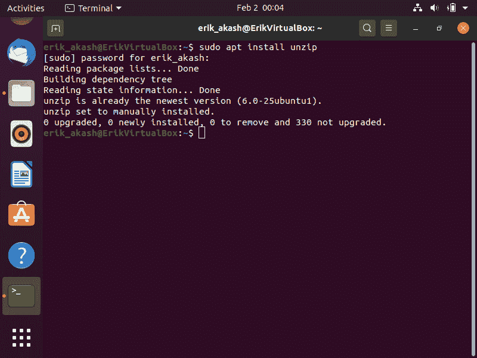
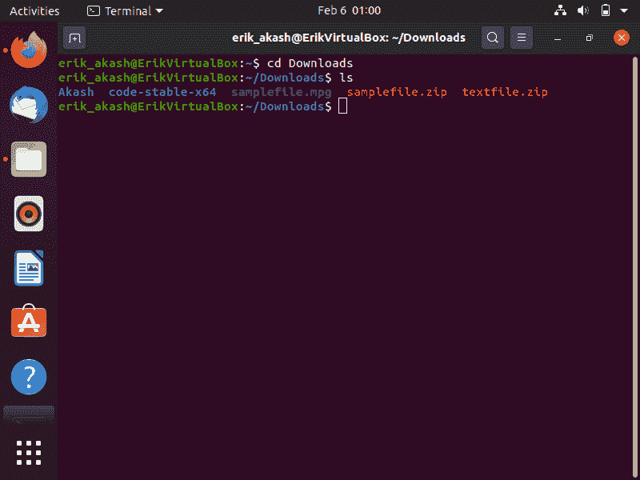
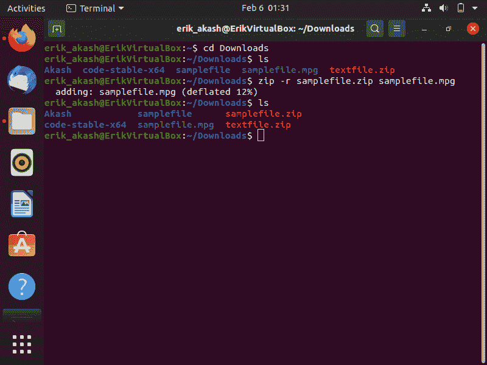
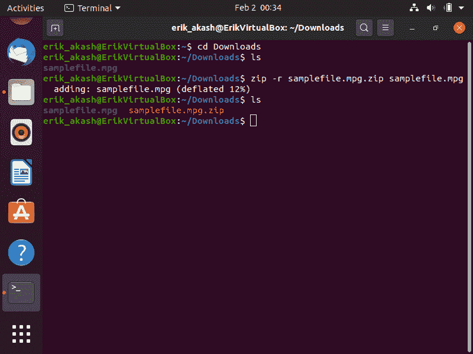
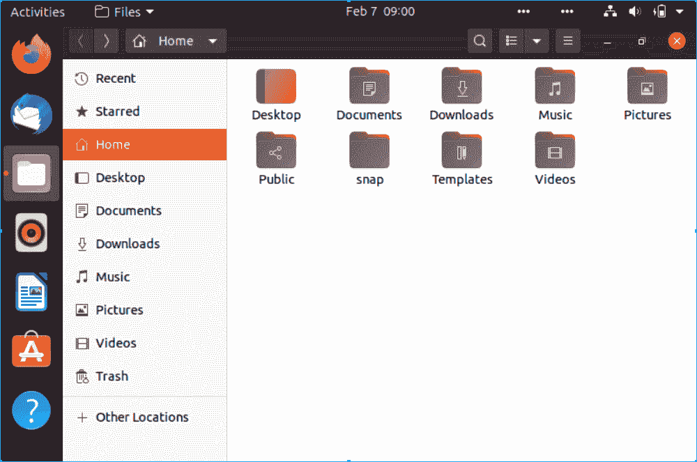
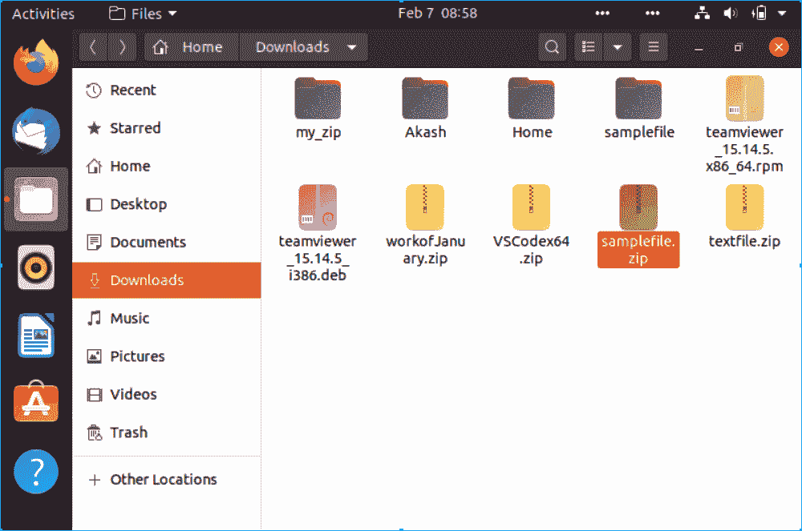
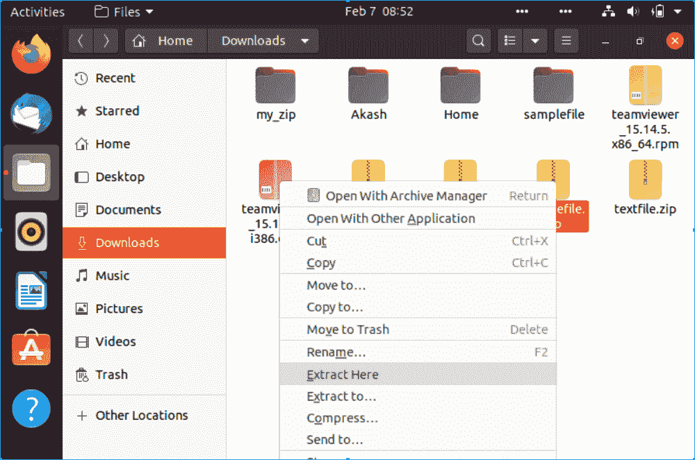
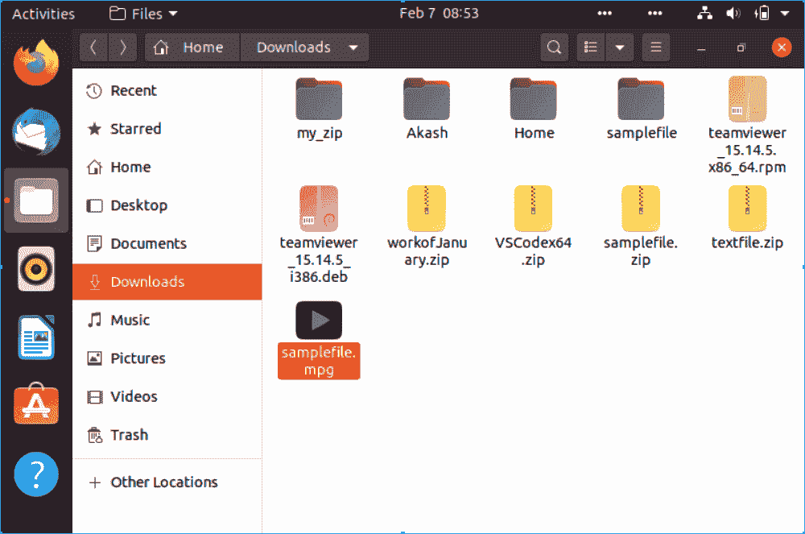
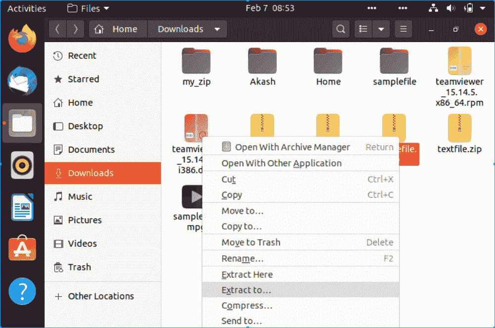
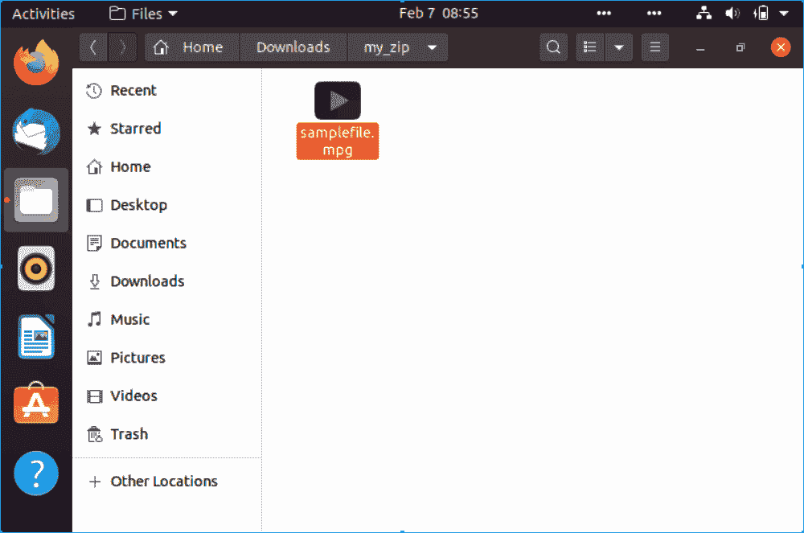

# 如何在 Linux 中解压文件？

> 原文：<https://www.javatpoint.com/how-to-unzip-files-in-linux>

通常，几乎所有文件，如文档、媒体文件，都以 zip 格式共享，以避免几种类型的损坏或盗窃。还可以设置密码来防止文件被不必要的访问，这也有助于保护文档的机密性。然而，新用户或对计算机不够熟悉或没有信息技术背景的用户在处理这些类型的文件时面临许多困难，例如打开 zip 文件、压缩文件等。

在本教程中，我们将学习如何在基于 Linux 的操作系统(Ubuntu)中打开 zip 文件。在继续之前，我们需要先知道如何识别 zip 文件。如果下载的文件(或目标文件)包含 **.tar.gz** 或**。zip** 在扩展名中，它表示文件是一种类型的 zip 文件。要访问 zip 文件的内容，我们需要提取该文件，之后我们可以轻松访问该文件的内容。

**先决条件:**

*   访问终端窗口或命令行
*   管理员密码
*   压缩/解压缩实用程序

### 如何在 Ubuntu 中安装解压缩实用程序？

要解压缩 zip 存档文件，您必须在系统中安装解压缩包。然而，几乎所有现代 Linux 发行版都带有解压缩支持，但是验证它并没有坏处，以避免在您不确定的情况下出现令人讨厌的意外。在基于 Ubuntu 和 Debian 的发行版中，可以使用下面给出的步骤来安装解压缩。如果它已经安装在您的操作系统上，它会通知您。

**第 1 步:**打开终端，输入如下给定命令，按回车键，如给定输出所示:

命令:

```

sudo apt install unzip

```

**输出**



一旦你在你的操作系统中安装了解压缩包，现在你就可以按照要求压缩和解压缩文件了。

在 [Linux 操作系统](https://www.javatpoint.com/linux-tutorial)中，有两种方法可以解压压缩文件；在这里，我们将讨论这两种方法(或过程)，以及实用性。

*   [使用 Linux 终端](https://itsfoss.com/unzip-linux/#terminal)解压文件
*   [通过图形用户界面](https://itsfoss.com/unzip-linux/#gui)解压缩文件

让我们详细了解一下上面的方法。

### 使用 Linux 终端解压文件

以下步骤将帮助我们在 Linux 中处理压缩文件，并展示如何在不降低文件质量的情况下压缩文件。

**在 Linux 中解压文件的步骤:**

**步骤 1 -** 在 Linux 中解压文件的过程非常简单。首先，打开终端，转到目录，在那里我们有我们的 zip 文件，如给定的图像所示:


**步骤 2 -** 现在使用“ls”命令查看该目录中存储的所有文件，并使用以下命令解压缩 zip 文件。

```

unzip zipped_file.zip

```

**我们通过下面的例子来了解这个命令的工作原理:**

假设我们的下载目录中存储了一个压缩文件，如**“sample file . zip**”。要解压缩“simplefile.zip”，我们需要打开终端并使用以下命令转到下载目录:

```

cd Downloads
ls      < To display all available files in current folder>

```

**例**



**步骤 2 -** 现在输入命令 **<解压“samplefile . zip”>**并按 enter 键，一旦文件解压，您就可以访问解压文件的内容，如给定图像所示:


**Linux 中 Zip 文件是如何实现的？**

将标准文件转换为压缩格式的过程与我们之前所做的略有不同。要转换文件(例如 samplefile.mpg)，我们必须转到文件存储在您的操作系统中的目录。到达目录后，您可以使用以下命令将该文件转换为压缩格式。

**命令:**

```

Zip -r samplefile.zip samplefile.mpg

```

要了解该命令的工作原理，请考虑下面给出的示例:




我们还可以提供我们想要解压缩的 zip 文件路径，而不是转到目录。为此，请考虑以下给定步骤:

**第一步。**打开终端，输入以下命令

**命令:**

```

unzip code-stable.zip -d folder1

```

它将显示以下输出。

```

unzip code-stable.zip -d folder1
Archive:  unzip code-stable..zip
  inflating: my_zip/625993-PNZP34-678.jpg  
  inflating: my_zip/License free.txt  
  inflating: my_zip/License premium.txt

```

总的来说，这个命令似乎非常好用。但是，在某些情况下，如果用户不小心使用，他在使用上述命令时可能会面临一个稍大的问题。这个命令的主要问题是，它通常会提取当前目录或文件夹中特定 zip 文件的所有内容，这并不好，至少在某些情况下是这样。

### 将文件解压缩到目录

通过将目标文件解压缩到单个目录，而不是将其提取到当前目录，可以轻松避免上述问题。这样，我们所有提取的文件都将存储在指定的目录中。在用户指定的目录不存在的某些情况下，它还会通过创建带有上述标签的目录来解决这个问题。

**让我们看看如何将一个文件解压到一个特定的目录**

要将压缩文件解压缩到特定的文件夹或目录，可以使用以下说明:

**步骤 1:** 打开终端，进入存储压缩文件的目录。到达该目录后，在终端中键入以下命令

**命令:**

```

unzip filename.zip -d unzipped_directory (or directory name)

```

要了解该命令的工作原理，请考虑下面给出的示例:

假设您有一个压缩文件(例如 samplefile.zip)，您希望在一个特定的不同目录(例如 Akash)中提取该文件。为此，您需要指定要提取压缩文件的目录或目录地址。因此，我们的命令如下所示:

**命令**

**<未开化 samplefile.zip -d \Akash >**

**输出**


现在 samplefile.zip 的所有内容都将被提取到用户指定的目录中。

### 2.通过图形用户界面解压缩文件:

这个方法对所有用户来说绝对简单，即使是初学者。它看起来就像是窗口提取 zip 文件的过程。要通过图形用户界面解压缩 zip 文件，请遵循下面给出的说明。

**第一步。**在您的 Linux 操作系统中打开文件资源管理器:



**第二步**。现在转到存储 zipfile(例如 textfile.zip)的那个文件夹，并选择它，如下所示:



**第三步。**选择压缩文件后，点击鼠标右键查看更多选项:



**第二步。**现在根据需要点击“提取到这里”或“提取到”选项。我们希望提取当前文件夹中的文件，然后单击“提取”选项。



**第四步。**如果您想在不同的文件夹中提取该文件，那么您可以使用如下所示的“提取到”选项:



步骤 5 点击“提取到”选项后，将会打开一个新窗口，您必须在其中指定您想要存储文件内容的任何目录。选择目录或文件夹后，单击如下所示的选择选项:


**第五步。**现在我们移动到选定的文件夹或目录，以验证文件是否解压缩。



* * *