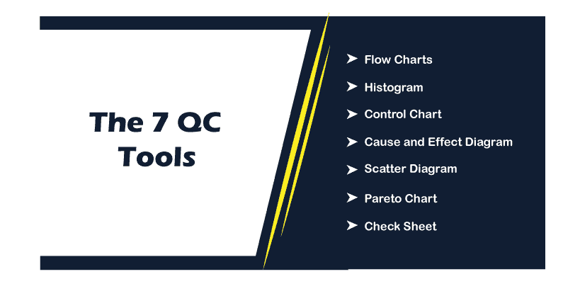
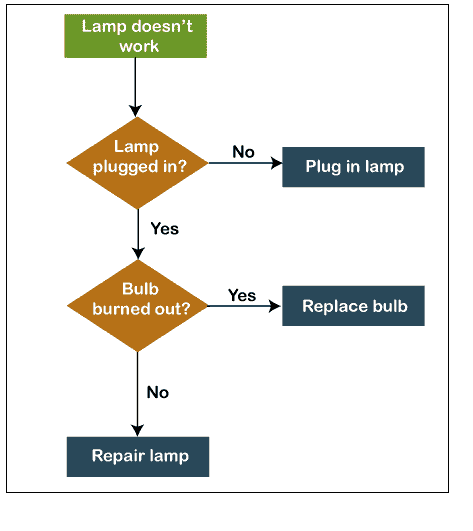
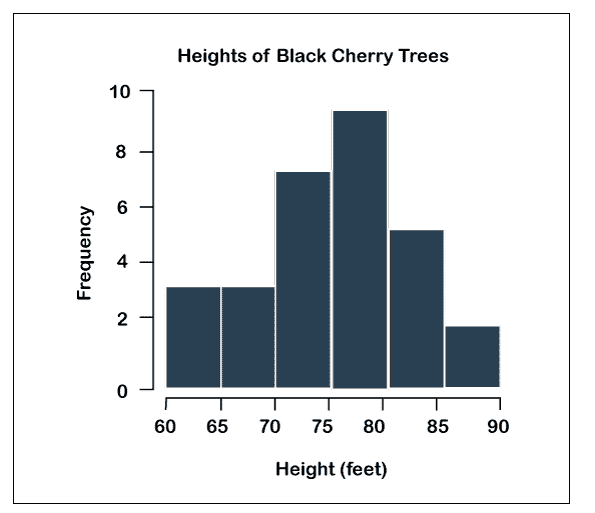
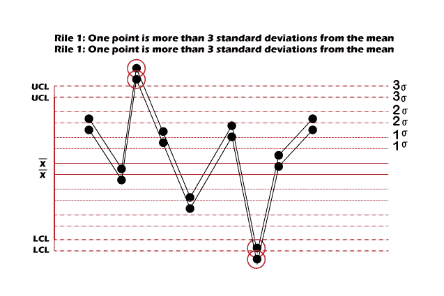
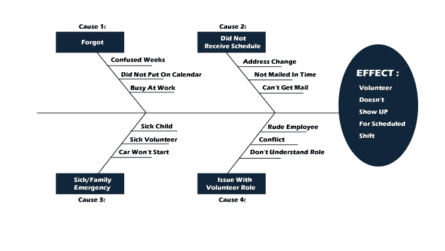
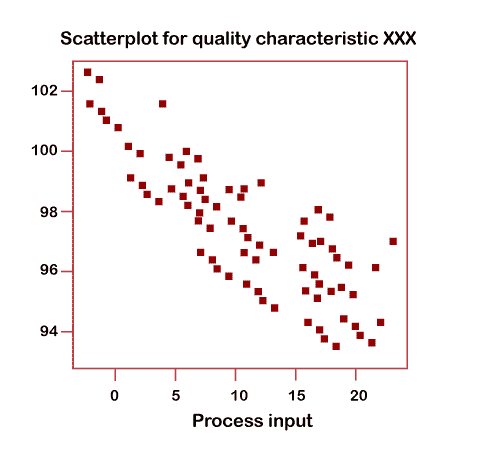
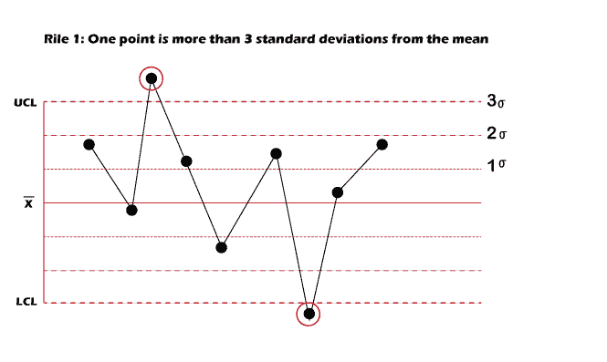
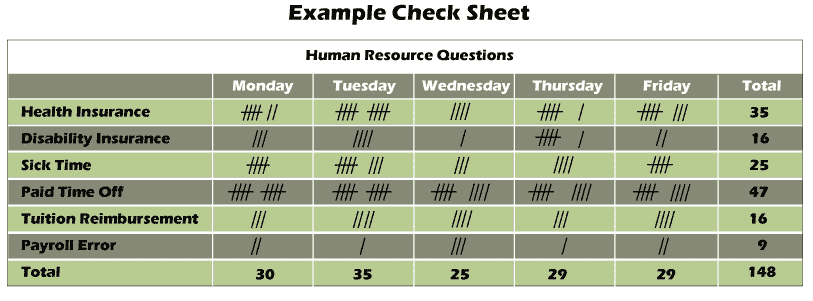

# 7 质量控制工具

> 原文：<https://www.javatpoint.com/linux-7-qc-tools>

*   7 质量控制工具是解决问题技术的科学和系统技术。
*   我们使用 7 个质量控制工具毫无问题地解决了许多车间问题，并改善了我们的工作场所。
*   换句话说，7 QC 工具意味着解决问题的系统和科学的程序，它用于过程和产品改进。

## 为什么我们使用 7 个质量控制工具进行流程开发？

*   7 质量控制工具是我们用来提高产品和过程质量的基本概念。
*   我们使用 7 种质量控制工具来分析生产顺序，识别关键问题，控制产品质量变化，并提供解决方案以避免未来的缺陷。
*   这是一个图形方法的集合，被确定为对质量问题的故障排除最有用。
*   7 个质控工具易于理解和实施，不需要复杂的分析/统计能力，因此功能强大且简单。

## 7 种质控工具的优势

7 个质控工具有各种优势:

*   7 质量控制工具易于理解和实施；但是非常有用。
*   有助于在过程中识别和检查问题。
*   对于质量改进和问题解决，它提供了一个更结构化的路径。
*   提升客户体验和客户满意度。
*   产品和服务质量的提高。
*   为质量改进和解决问题提供了更有条理的途径。

## 7 质量控制工具:

让我们逐一讨论 7 种质控工具

### 1.流程图

流程图是最受欢迎的质量控制工具。我们可以使用这个工具来可视化流程、系统、工作流、事件等中的一系列步骤。除了将流程显示为一个完整的流程之外，流程图还具有阶段和流程边界之间的关联。

在流程图中，我们使用了标准的符号排列，规范这些符号的使用非常重要，这样每个人都可以轻松理解和使用流程图。

**流程图的使用**

以下是流程图的用途:

*   流程图用于建立对流程的一般理解。
*   流程图用于标准化程序，以便每个人都遵循类似的步骤。
*   流程图用于检查流程并确定问题区域、阻碍因素、不足之处等。

**如何制作流程图**

1.  首先，我们必须召集员工团队，他们在执行分析流程时非常细致。
2.  然后，我们必须列出从开始到结束的每个阶段。
3.  如果我们使用的是像 Creately 这样的在线工具，那么我们可以先写下流程的步骤，然后在识别流程时将它们记录在画布上。
4.  识别步骤的顺序；每当用我们的流程图表示流程时，从上到下或从左到右显示它。
5.  使用箭头链接形状以指定流程。

**流程图的优势**

流程图有许多优点:

*   流程图是向所有相关人员传达系统逻辑的绝佳方式。
*   使用流程图，可以熟练地检查过程，从而减少成本和时间浪费。
*   在调试过程中，流程图很有用。
*   流程图作为系统分析和程序开发阶段的蓝图或指南。
*   使用流程图，操作系统的维护变得很容易。这有助于程序员更有效地在这一部分付出努力。

**流程图的缺点**

*   我们不能输入流程图符号，所以流程图的复制成了一个问题。
*   有时候程序的逻辑相对有点复杂。在这种情况下，流程图变得笨拙而复杂。它会成为用户的麻烦，导致试图解决问题时浪费金钱和时间。
*   流程图的修改和修改是很困难的，如果需要修改，那么我们必须重新绘制整个流程图，这样就浪费了更多的时间。

### 2.柱状图

直方图是另一种质量控制工具。它是一种条形图，可以可视化数值数据的分布。在直方图中，数字被分成多个范围，条的高度显示每个范围内有多少。直方图是一个优秀的质量规划和控制工具，它支持我们理解保护和适当的行动

**直方图类型**

直方图有多种类型:

*   多峰或多峰
*   正态分布
*   截断或心脏切割直方图
*   偏斜分布
*   边缘尖峰或双峰
*   双峰直方图

**直方图的使用**

直方图有多种用途:

*   直方图用于简单地解释大量数据并识别模式。
*   我们可以使用直方图来预测流程性能。
*   利用直方图，我们可以找出质量问题的不同原因。

**如何创建直方图**

*   首先，我们必须收集数据进行分析。使用计数图表，记录特定范围的出现。
*   分析手头的数据，将数据分成间隙或区间。
*   然后我们必须计算每个箱中减少的值。
*   每个媒体夹的事件频率随着图表中条形的高度而出现。

**直方图的优势**

直方图有各种优点:

*   直方图显示了大量的数据。
*   直方图可用于显示流程的未来性能。

**直方图的缺点**

直方图有各种缺点:

*   在直方图中，我们只能使用连续数据。
*   比较两个数据集更难。

### 3.检查图

控制图是一种运行图，我们用它来检测和研究一段时间内由标准或明确原因引起的过程变化。它也被称为“休哈特控制图”。在控制图的帮助下，我们可以测量变化并将其可视化，以显示变化是否在适当的范围内。使用控制图，我们可以跟踪指标，如单位库存成本、生产时间等。

我们在制造中使用控制图，过程改进方法，如股票交易算法，六适马。

**控制图的使用**

控制图有多种用途:

*   我们使用控制图来检查一个过程是否稳定。
*   有了控制图，我们可以识别过程中的异常变化。
*   控制图用于发现过程的趋势。

**如何创建控制图**

我们使用各种步骤来创建控制图:

1.  首先，我们需要收集数据。
2.  然后，我们必须收集分组平均值。
3.  接下来，我们确定总体平均值。
4.  计算范围。
5.  计算范围的平均值
6.  接下来，计算控制极限
7.  在图表中绘制数据
8.  然后我们必须解释这个图表。

**控制图优势**

控制图有各种优点:

*   控制图确保了产品的质量水平。
*   控制图给出了与过程选择和公差极限设置相关的信息。
*   控制图控制过程的可变性，并发现过程中不寻常的差异。

### 4.因果图

也叫鱼骨图。我们使用因果图来找出导致问题(效果)的几个方面(原因)。这最终支持我们找到问题的根本原因，从而有效地找到正确的解决方案。

这是一种效果和原因之间的表达联系。

在因果图中，我们可以利用人、物质、测量、方法、机器、自然母亲等 6M 概念找到可能的原因。

**因果图的用途**

因果图有多种用途:

*   我们可以使用因果图来解决问题并找到问题的根本原因。
*   在集体头脑 Storm 会议期间收集对案例的不同观点。
*   揭示导致问题的各种原因之间的联系。

**如何使用因果图**

1.  因果图找到需要检查的问题区域，并将其写在图的顶部。
2.  找出问题的核心原因。这些是鱼骨图关键分支的标签。这些主要类别包括材料、机械、方法、程序、政策、人员等。
3.  确定主要原因的可能子案例，并将其作为主要分支的子分支。
4.  深入检查主要和次要原因；参考我们创建的图表。
5.  当我们确定根本原因时，制定一个行动计划，概述我们的战略，以克服问题。

**因果图优势**

因果图有许多优点:

1.  它鼓励集体参与
2.  增加过程知识
3.  有了因果图，我们就能确定根本原因。
4.  显示变异的可能原因。
5.  找出收集的区域。

**因果图的缺点**

因果图有各种缺点:

1.  这需要专业知识和技能。
2.  民主选择事业。
3.  缺乏证据
4.  过分强调会产生不相关的结果
5.  多重根源
6.  在无关的事情上浪费时间和精力。
7.  很难描述原因之间的复杂关联。

### 5.散点图

散点图也称为散点图、散点图、散点图、散点图。散点图是最流行的 7 种 QC 工具之一，它支持我们识别两个变量是如何相互关联的。

此图显示了两个变量的值，它们沿着图的两个轴绘制。结果点的模式揭示了相关性。

**散点图的使用**

散点图有多种用途:

*   我们使用散点图来验证因果关系。
*   使用散点图，我们可以知道性能不佳的原因。
*   我们用散点图来知道自变量对因变量的结果。

**散点图的优势**

散点图的优点是:

*   绘制图表是如此容易。
*   它显示两个变量之间的关联。
*   散点图是向您显示非线性模式的一种很好的技术。
*   观察和阅读很简单。

**散点图的缺点**

散点图有各种缺点:

*   散点图无法为您提供相关性的确切范围。
*   散点图不能显示变量之间关联的定量度量；散点图只给你显示数量变化的数量表达式。

**如何制作散点图**

1.  首先，我们必须收集必要的数据进行验证。认清两个变量之间的因果关系。
2.  找出因变量和自变量。沿垂直轴绘制的因变量称为测量参数，沿水平轴绘制的自变量称为控制参数。
3.  然后我们根据收集到的数据绘制图表。添加纵轴和横轴名称并绘制趋势线。
4.  在趋势线的基础上，检查图表，以了解可以描述为无关系、强和中等的相关性。

### 6.帕累托图

帕累托图是指折线图和条形图的组合。有了帕累托图，我们可以找到设定优先顺序所需的事实。

帕累托图组织和呈现数据，使不同问题或问题原因的一般意义更加明显。

帕累托图包含一个垂直条形图，并按顺序(从最高到最低)显示故障，而折线图显示结果的累积百分比。

**帕累托图的使用**

帕累托图有多种用途:

*   它用于找出问题原因的相对重要性。
*   借助帕累托图，我们可以计算缺陷对生产的影响。
*   使用帕累托图，团队可以确定解决后影响更大的原因。

**如何创建帕累托图**

1.  首先，我们既要选择调查的问题，也要选择收集信息的方法和时间。如果需要，则制作一张检查单以记录信息。
2.  当我们收集数据时，体验它并组织起来，以便计算累积百分比。
3.  然后我们必须绘制图表，条形图，累计百分比线，并添加标签。
4.  使用 80/20 法则检查图表，找出一些无关紧要的问题。通过确定根本原因，计划进一步的行动以消除已识别的故障。

**帕累托图的优势**

帕累托图有许多优点:

*   帕累托图清楚地显示了重要和不重要的变量。
*   帕累托图允许我们确定哪些问题可能是必须首先解决的。
*   借助帕累托图，我们可以使用有限的资源，因为数据是分层显示的。
*   帕累托图也有助于解决问题，例如，解决问题，决策技能和时间管理。

**帕累托图的缺点**

帕累托图有各种缺点:

*   在帕累托图中，我们可能需要多个图表。
*   帕累托图只显示定性数据；我们不能用它来计算平均值、平均数或其他可能需要的统计数据。
*   评分错误，申请错误。
*   它不能适用于所有情况。它只限于某些情况。

### 7.板式挡帘

*   检查表是为收集和检查数据而创建的结构。
*   由检查表收集的数据被用作另一个工具的输入，并且可以在通过什么、什么时候、在哪里、如何提问的基础上收集数据。
*   检查表的主要目的是总结数据和统计事件的发生。
*   事件的发生次数被记录在检查表中，如不符合或缺陷。因此，检查表也被称为“Tally 单”。
*   这是一种收集、记录和呈现与问题相关的定性和定量数据的系统方法。

**如何制作检查表**

1.  首先，我们需要找到所需的信息。
    *   为什么我们需要收集数据？
    *   我们应该收集什么样的信息？
    *   有多少数据是重要的？
    *   我们应该在哪里收集数据？
    *   我们应该如何收集数据？
    *   我们应该什么时候收集数据？
    *   你应该如何衡量数据？
2.  接下来，我们必须根据标题、内容、信息和来源信息创建工作表。
3.  然后，测试床单。确保表格中的每一行和每一列都是需要的和适当的，并且表格易于参考和使用。用其他收集器测试它，并根据反馈进行调整。

**检查表的优点**

检查表有各种优点:

*   在检查表中，信息模式被检测到并清楚地显示出来。
*   在检查表中，数据很容易通过简单的过程理解。
*   检查表基于事实，而不是意见。
*   在每个条件的定义上达成一致。

* * *