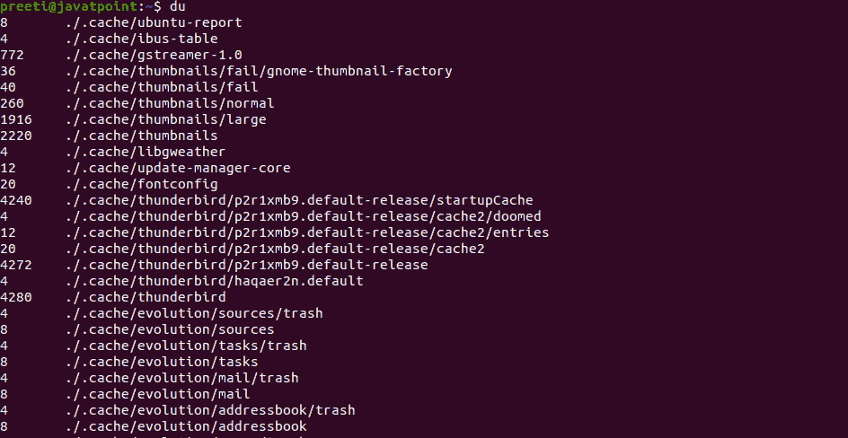
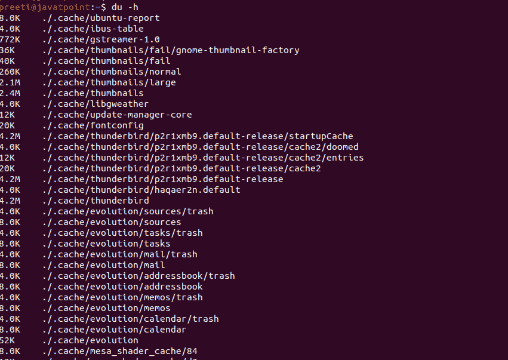
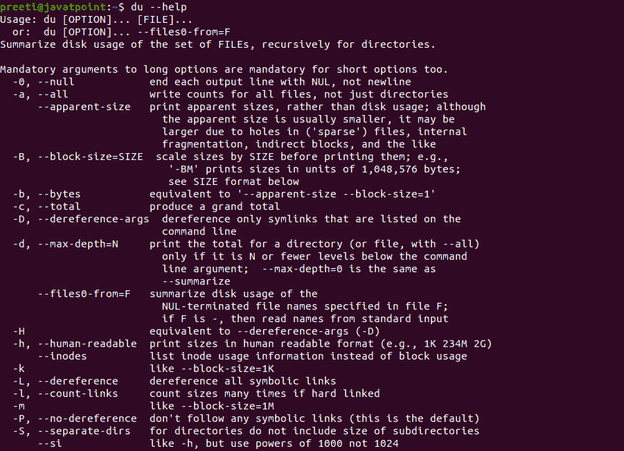
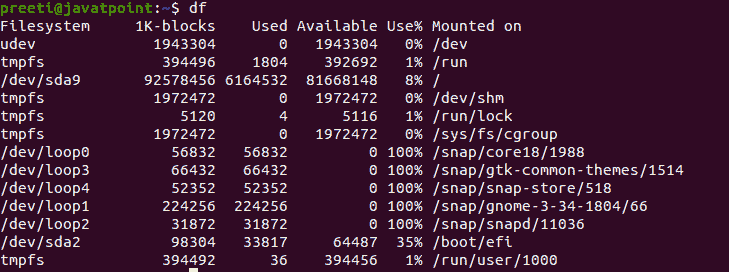
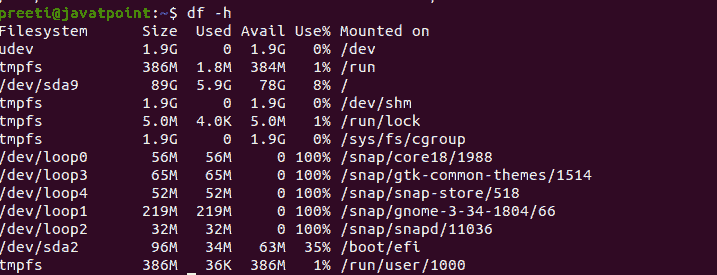
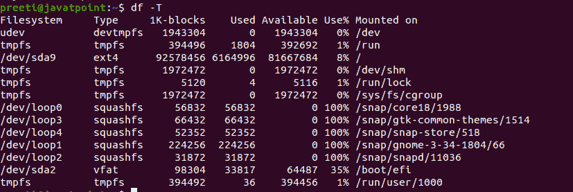
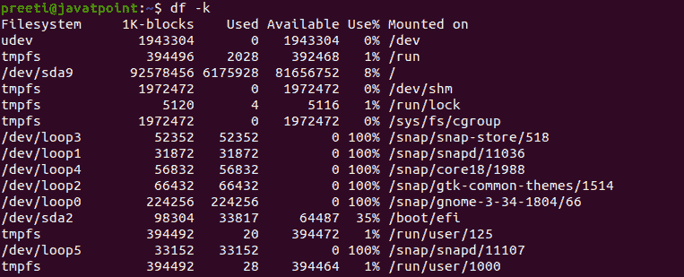
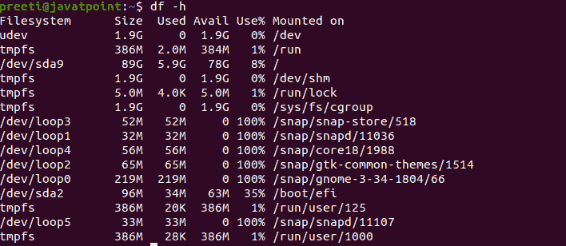

# 检查磁盘空间的 Linux 命令

> 原文：<https://www.javatpoint.com/linux-commands-to-check-disk-space>

我们有很多方法可以检查 Linux 系统的磁盘空间。我们可以使用显示可用磁盘空间的第三方应用程序。另一种方式是 Linux 终端的命令行，其中一些是 df 和 du，其中 **du** 表示已用磁盘空间， **df** 表示可用磁盘空间。

## 1.使用 du 命令

我们可以借助 [**du** 命令](https://www.javatpoint.com/linux-du)来检查磁盘空间。 **du** 的完整形式是“磁盘使用”du 命令显示磁盘的使用情况。du 命令将显示 [Linux](https://www.javatpoint.com/linux-tutorial) 中特定目录的磁盘使用情况。

**语法:**

```

$ du

```



*   **du -h: -** 这将以人类可读的格式显示每个目录和子目录的磁盘使用情况。

**语法:**

```

$ du -h

```



*   **du -a: -** 这将显示所有文件的磁盘使用情况。

**语法:**

```

$ du -a 

```


*   **du -s: -** 这将显示特定目录或文件使用的总磁盘空间。

**语法:**

```

$ du -s

```


*   **du -help: -** 我们可以用这个来求助。

**语法**

```

$ du -help

```



## 2.使用 df 选项

[df 命令](https://www.javatpoint.com/linux-df)的完整形式是“无磁盘”。使用这个命令，我们可以检查 Linux 系统中已使用和可用的磁盘空间。

**语法:**

```

$ df [optios].........FILESYSTEM.........

```

当我们在没有参数的情况下使用此命令时，此命令将向您显示与所有已装载文件系统相关的信息:

```

$ df

```



每行包含以下列:

*   “文件系统”——文件系统的名称。
*   “1K 块”-文件系统的大小，单位为 1K 块。
*   “已用”-已用是指 1K 块中的已用空间。
*   “可用”-可用是指 1K 块中的可用空间。
*   “使用%”-已用空间的百分比。
*   “装载于”-装载文件系统的目录/

如果我们只想显示特定文件系统的信息，我们可以将文件系统的名称或挂载点传递给 **df** 命令。

例如，如果我们需要显示装载到根目录 **(/)** 的文件系统上的可用空间，那么我们可以使用 df/dev/nvme0n1p3 或 df/。

**语法:**

```

$ df /

```


### 以人类可读格式显示磁盘空间使用情况

默认情况下，此命令将以 1 千字节块显示磁盘空间，可用和已用磁盘空间的大小将以千字节显示。

如果我们想以人类可读的格式显示磁盘驱动器的详细信息，如千兆字节、兆字节、千字节等。，那么我们必须使用 **df** 命令以及选项-h。

**语法:**

```

$ df -h

```



### 文件系统类型

如果我们注意到所有的命令输出，我们就看不到结果中指定的 Linux 文件系统类型。为了检查我们系统的文件系统类型，我们可以使用“T”选项。“T”选项将显示文件系统类型和其他信息。

我们可以使用 **-T** 选项告诉 **df** 显示文件系统类型:

**语法:**

```

$ df -T

```



输出包含一个名为“类型:显示文件系统类型”的额外列。

### 显示信息节点使用情况

inode 是 Linux 和 Unix 文件系统中的数据结构，包括文件或目录的信息，如所有者、大小、设备节点、管道、套接字等。

如果我们使用 ***-i*** 选项调用这个函数，那么 df 命令会打印与文件系统信息节点使用相关的信息..


上述命令将以人类可读的格式显示装载到系统根目录的文件系统上的信息节点的详细信息。

当我们使用 **-i** 选项时，每个输出的行包含以下列:

*   **“文件系统”-** 文件系统的名称。
*   **“索引节点”-** 索引节点是指文件系统上的索引节点总数。
*   **“IUsed”-**IUsed 表示已使用的索引节点数。
*   **“IFree”-**IFree 表示空闲索引节点的数量。
*   **“IUSE %”-**IUse 表示已用索引节点的百分比。
*   **“挂载于”-** 挂载于是指挂载文件系统的目录。


### 显示/主文件系统的信息

如果我们只想看到人类可读格式的设备**/家庭**文件系统的信息，那么我们可以使用以下命令:

```

$ df -hT /home

```


### 以字节为单位显示文件系统信息

如果想查看 1024 字节块中文件系统的信息和使用情况，那么我们可以使用“-k”选项。

**语法:**

```

$ df -k

```



### 以兆字节为单位显示文件系统信息

我们可以使用“-m”选项，以兆字节(MB)为单位显示所有文件系统的使用信息。


### 以 GB 为单位显示文件系统信息

如果我们想以**千兆字节(GB)显示所有文件系统统计信息，我们可以使用‘df-h’选项。**

**语法:**

```

$ df -h

```



* * *