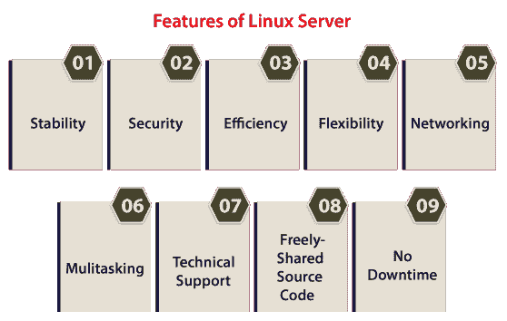

# Linux 服务器简介

> 原文：<https://www.javatpoint.com/linux-server>

Linux 服务器是在 Linux 开源操作系统上创建的一种服务器。它为企业提供了一个低成本的选择，为客户提供服务、应用和内容。由于 Linux 是开源发行版，所以用户也通过强大的倡导者和资源社区获得利润。

Linux 服务器可以定义为 Linux 操作系统非常终端的变体，它是处理大型企业及其软件的密集存储和实际需求的血液。这些服务器如今被广泛使用，并因其**灵活性、安全性、**和**稳定性**而在最著名的服务器中得到检验。

在 Windows 等闭源软件上使用 Linux 的另一个优点是，前者是完全开源的。它有助于保持低维护和设置成本，几个专有版本的 [Linux 操作系统](https://www.javatpoint.com/linux-tutorial)(如**红帽、Ubuntu、CentOS、**和 **Debian** )为用户提供了足够的维护、操作和设置服务器的灵活性。

此外，Linux 服务器在云服务器和物理服务器上运行通常更轻，因为它们不需要任何图形界面。与视窗不同，大多数版本的 Linux 完全基于命令行，创建了一个轻量级的结果，在易用性上更喜欢优化和功能。

我们选择的 Linux 服务器应该促进安全认证和技术，并管理遇到入侵的增强功能，保护我们的数据，并符合特定操作系统供应商或开源项目的法规遵从性。

它应该:

*   **通过特定的操作系统供应商或上游社区本身获得持续的敏感性安全更新**，在下一个工作日之前交付并解决每个关键问题，尽可能减少业务影响。
*   **围绕我们的系统和容器自动化安全配置补救和法规遵从性**以及图像扫描，如 OpenSCAP，它根据配置安全基线和漏洞进行补救和检查，包括针对 DISA STIG、PCI-DSS 的国家核对表计划内容等。它还应该围绕我们的整个混合环境进行横向扩展和集中配置补救。
*   **通过使用集成的控制优势为资源提供安全性**，如强制访问控制(MAC)、集中式身份管理、基于名为通用标准的基础之上的安全性增强 Linux (SELinux)和 FIPS 140-2 认证。

Linux 服务器应该促进自动化基础设施和遗留管理的灵活集成和平台可管理性。与不付费的 Linux 基础架构相比，它将节省信息技术人员的时间并减少计划外停机时间。

它应该:

*   **在技术问题影响业务运营之前解决技术问题**，使用预测性分析工具自动修复和识别异常及根本原因。
*   **简化环境更新**以及就地升级，减少应用重建和机器迁移的麻烦。
*   **围绕多个异构环境自动化合规性和一致性**，并使用系统角色和原生配置管理工具(如 **Puppet、Salt、Chef、Ansible** 等)减少脚本编写工作。
*   **通过 web 界面(易于使用)**管理单个系统，该界面包含服务、容器、网络、存储等。
*   **使用内置功能加快数据中心的映像部署、构建和补丁程序管理**并完善系统生命周期管理增强的补丁程序、资源调配等。

## Linux 服务器的特点

Linux 服务器的一些优势如下:

*   **稳定性:**不需要定期重启来维持效率水平。如果配置正确，Linux 系统可以正常运行，直到系统关闭或硬件故障。
*   **安全:** Linux 设施**顶级安全**。多功能文件访问以及高效的防火墙权限系统可以忽略病毒或不需要的访问。
*   **效率:** Linux 在服务器和网络上提供了一致的出色性能。它还包含管理大量并行连接和用户卷的功能。
*   **灵活性:**因为 Linux 是开源发行版，所以源代码对每个用户来说都是唾手可得的。所有用户都可以根据自己的需要使用它。
*   **联网:**它提供了卓越的联网优势。它可用于被保护的各种应用。
*   **多任务处理:**多任务处理是同时执行多个任务或程序的能力。它得到了 Linux 的支持。
*   **技术支持:** Linux 提供的几大技术支持存在。它是由几个商业分销商、顾问和一个活跃的开发者社区定制的。
*   **自由共享源代码:**这么多开发人员都在审核，并且已经审核了 Linux 源代码。因此，效率在提高，这使得**性能增强，安全性提高，**和**消除了 bug**。
*   **无停机:**每次更新都是虚拟使用，而不会让系统离线。很少，运行 Linux 的服务器需要重启来纠正错误或完成更新。这意味着实际上没有停机时间。

* * *