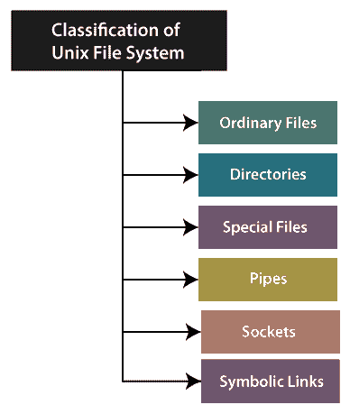

# Unix 中的文件类型

> 原文：<https://www.javatpoint.com/types-of-files-in-unix>

在 Unix 操作系统中，所有数据都组织成文件。每个文件都被组织成目录，这些目录被组织成树状结构，称为文件系统。

以下是 Unix 中的文件类型:

1.  普通文件
2.  目录
3.  特殊文件
4.  管道
5.  套接字
6.  符号链接

### 1.普通文件

普通文件是 Unix 中的文件，包括程序指令、文本和数据。

*   在普通文件中，没有其他文件。
*   普通文件总是放在目录文件下。
*   普通的文件被用来存储我们的信息，比如我们不得不写的文字或者我们不得不画的图画。这是我们主要处理的那种文件。
*   在 ls -l 的长格式输出中，使用“-”符号来指定此类文件。

### 2.目录

目录存储特殊文件和普通文件。对于熟悉 Mac 或 Windows 操作系统的用户来说，Unix 目录相当于文件夹。目录文件包括每个文件的入口文件及其包含的子目录。如果一个目录中有 5 个文件，那么该目录中将有 5 个条目。每个条目由两个部分组成。

1.  文件的名称。
2.  索引节点号，是文件或目录的唯一标识号。

*   层次树中的分支点。
*   我们用它来组织文件集合。
*   它包含特殊文件、普通文件或其他目录。
*   它不像文本那样包含我们要处理的“真实”信息。大多数情况下，只需要整理文件。
*   每个文件都是位于树顶部的根目录(名为/)的后代。

在 ls -l 的长格式输出中，我们使用了" d "符号来指定这种文件。

### 3.特殊文件

我们使用特殊文件来表示真实的物理设备，如终端、磁带机和打印机。也用于输入/输出操作。特殊文件或设备用于 [Linux](https://www.javatpoint.com/linux-tutorial) 和 Unix 系统上的输入/输出(I/O)。它们看起来类似于文件系统中的普通文件或目录。

在 Unix 系统中，每个设备主要有两种特殊文件，如块特殊文件和字符特殊文件。

*   如果我们将块特殊文件用于设备输入/输出(I/O)，数据将被移动到更高的固定大小的块中。这种访问被称为阻止设备访问。

对于终端设备，这是一次一个字符。然而，对于磁盘设备来说，原始访问意味着读取或写入磁盘本地的整个数据块部分。

*   在 ls -l 的长格式输出中，使用" c "符号字符 distinct，文件被标记。
*   在 ls -l 的长格式输出中，使用“b”符号块，标记不同的文件。

### 4.管道

在 Unix 中，借助管道，我们可以将命令链接在一起。管道就像一个临时文件，它的存在只是为了保存一个命令的数据，直到它被另一个命令读取。Unix 管道提供单向数据流。第一个命令的输出序列用作下一个命令序列的输入。为了创建管道，竖线(|)必须放在两个命令之间的命令行上。比如 who | wc -l

在 ls -l 的长格式输出中，称为管道，使用符号“p”进行标记。

### 5.套接字

Unix 套接字是一种支持高级进程间通信的文件类型。它也被称为进程间通信套接字。在客户机-服务器应用的框架中，使用了一个 Unix Socket。它本质上是一个数据流，与网络流和网络套接字相同，只是每个事务都是文件系统本地的。

在 ls -l 的长格式输出中，使用“s”符号，标记了 Unix 套接字。

### 6.符号链接

符号链接用于引用文件系统中的另一个文件。为了引用文件系统的另一个文件，我们使用符号链接。它涉及它所引用的文件路径的文本表示。对于最终用户来说，符号链接似乎有自己的名称，但是当我们需要向这个文件写入或读取数据时，它会将这些任务引用到它所关注的文件。当我们删除软链接本身时，无论如何，数据文件都会在那里。如果源文件被删除或移动到不同的位置，符号文件将不起作用。

在 ls -l 的长格式输出的情况下，使用“l”符号，标记符号链接。

* * *