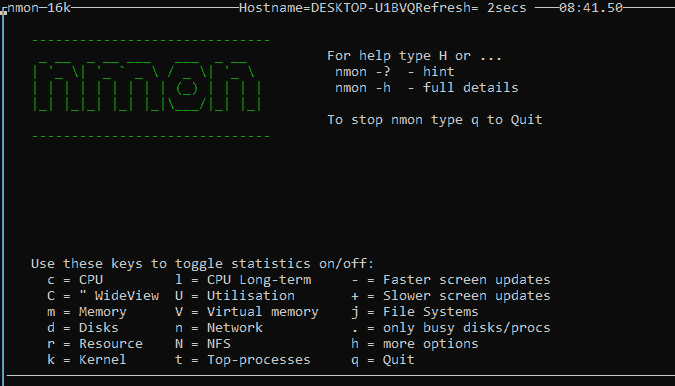

# Linux 中的中央处理器利用率

> 原文：<https://www.javatpoint.com/cpu-utilization-in-linux>

决定系统效率的一个方面是 CPU 性能。

监视 CPU 性能对于调试系统进程、做出系统决策、处理系统资源以及实时检查和评估系统至关重要。

有多种工具可用于跟踪和查看 CPU 性能。操作系统由依赖这些工具提取性能读数的内置系统调用组成。现在，我们来谈谈出色的 CPU 使用监控工具，以及如何在任何 Linux 发行版中使用它。

## 使用顶部检查中央处理器利用率

借助**顶部**命令，我们可以实时监控系统。当我们执行 top 命令时，它将为我们提供系统概要以及当前由 Linux 内核管理的线程和进程列表。它还提供了各种选项，以改变其行为并执行若干操作。

### 句法

```

$ top

```


在上面的输出中，要关注的主线是第三行的行号。输出值简述如下。每个值表示 CPU 执行一项任务所花费的时间。

*   **us:** 在“用户空间”中为单个用户运行流程所花费的时间
*   **sy:** sy 是运行“内核空间”进程所花费的时间。
*   **ni:** ni 是用自定义(手动设置)的优秀值运行流程所花费的时间。
*   **id:** id 为空闲时间。
*   **wa:** wa 表示等待 I/O 请求完成所花费的时间。
*   **hi:** hi 是服务硬件中断所花费的时间。
*   **si:** si 是服务软件中断所花费的时间。
*   **st:** st 是运行虚拟机所损失的时间，也叫“偷时间”

### 使用 htop 命令检查中央处理器利用率

**top** 和 **htop** 命令相同。在系统监控方面，两个命令提供相同的功能。另一方面， **htop** 命令提供了更好的生活质量体验。 **htop 的**默认显示更加用户友好。与顶级相比， **htop** UI 质量更好。在这种情况下，我们也可以水平和垂直滚动。

在大多数发行版中，默认安装 top，我们必须手动安装 **htop** 。安装 **htop** 的最好方法是使用 snap，因为它在任何 Linux 发行版上都运行良好。以下是我们用来安装 **htop** 的语法:

```

$ sudo snap install htop

```

**htop 的语法:**

```

$ htop

```


### 使用 iostat 检查中央处理器利用率

**iostat** 命令报告 CPU 和 I/O 使用情况统计。这个命令很简单，输出也很简单。但是，它将只报告命令运行时的数据。 **iostat** 不提供实时系统监控，不像 top 和 **htop。**

**iostat** 工具是 sysstat 包的一部分。这个命令在每个 Linux 发行版上都有。假设我们已经安装了 **sysstat** 包，那么运行。

**启动 iostat:**

```

$ iostat

```


如果我们想知道更多的细节，那么我们可以使用-c 标志来检查系统进程的 CPU 使用情况、I/O 等待、空闲时间和用户进程。

**语法**

```

$ iostat -c

```


“-x”标志可用于获取更多详细统计信息。“-t”标志指定每个报告必须显示的次数。

```

$ iostat -xtc 6 2

```


### 使用 mpstat 检查中央处理器利用率

**mpstat** 工具是 **sysstat** 包的一部分。该工具报告单个处理器或处理器内核的使用情况。

如果我们想使用 **mpstat** 命令，那么必须在我们的系统中安装 **sysstat** 包。假设我们已经安装了软件包，然后继续。

**启动 mpstat:**

```

$ mpstat

```


现在我们将详细解释每个值，每个值定义了特定阶段的 CPU 使用情况。

*   **%usr:** 表示用户级 CPU 使用率。
*   **%nice:** 表示“nice”用户进程对 CPU 的使用。
*   **%sys:** %sys 表示内核使用的 CPU。
*   **% low wait:**等待磁盘读/写用% low wait 表示。
*   **%irq:** 处理硬件中断称为%irq。
*   **%soft:** 处理软件中断称为%soft。
*   **%窃取:**术语%窃取是指等待虚拟机管理程序来处理虚拟处理器。
*   **$idle:** %idle 表示闲置。

### 使用合成孔径雷达检查中央处理器利用率

使用 **sar** 命令，我们可以收集和报告系统活动信息。该命令将为您提供一个简单而简短的关于 CPU 利用率的报告。

**Sar** 命令也可用于定期(以秒为单位)提供 CPU 信息。它不是实时报告；使用它仍然更好。

```

$ sar  
```

我们还可以定义 **sar** 打印输出的次数。在下面这个例子中， **sar** 将以 4 秒的间隔打印输出，打印 8 次。

```

$ sar 4 8

```


## **使用 nmon 命令检查 CPU 利用率**

**nmon** 是我们用来获取 CPU、Top 进程内存等信息的系统管理工具。我们可以使用以下命令安装 nmon 命令:

```

$ nmon

```



* * *