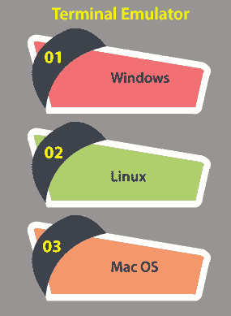

# Linux 终端

> 原文：<https://www.javatpoint.com/linux-terminal>

## 介绍

Linux 终端是与 Linux 服务器交互的标准方式。

命令行的应用可能看起来是一项困难的任务，但是如果我们从基础开始，并在此基础上创建我们的技能，这将非常方便。

让我们从掩盖什么是终端仿真器开始。

### 终端仿真程序



终端仿真器可以被定义为允许终端在图形环境中使用它的程序。大多数人使用操作系统和图形用户界面来满足日常的计算机需求，因此终端仿真器的使用对于大多数 Linux 服务器用户来说是必不可少的。

以下是操作系统常用的免费终端仿真器:

*   **窗户:**油灰
*   **Linux:** XTerm，KDE 控制台，终端
*   **Mac OS X:** iTerm2，终端(默认)

所有的终端模拟器都有自己的功能集，但是上面提到的每一个都很容易使用，而且效果很好。

## Linux 终端简介

Linux 终端也被称为**命令行、控制台、**或**外壳**。这是我们电脑的文本界面。我们可以解释命令，也可以用这个系统程序编写脚本。

一开始可能看起来很难，但是一旦我们熟悉了它，它就会很容易使用。

#### 注意:Linux 的所有发行版都附带命令行。Linux 终端为我们提供了一个界面，我们可以在其中输入命令并以文本形式检查结果。我们可以使用隧道来完成任务，例如导航一个区域或移动文件，而无需使用图形用户界面。这些终端只传输信息。我们需要一个外壳让操作系统知道这些信息。

我们可以通过在终端用 Linux 命令行输入来手动执行命令。我们也可以使用 **Shell 脚本**自动执行命令。

## Linux 终端历史

在计算的旧时代，有一个操作系统叫做 **Unix** 。它是作为多用户系统在大型计算机上运行而开发的。几个用户通过终端远程连接到它。

#### 注意:终端很常见，因为它们只能传输击键和在屏幕上显示数据。

用户可以高效快速地进行交互，因为文本轻于资源。用户可以通过这个文本界面实现的所有操作。用户将连接到一个单独的主程序，以协调不同程序的执行。

用户奖被包装在外壳程序中。用户可以编写 share 的脚本，自动执行一长串 shell 命令，使困难的任务变得更容易。

除此之外，Linux 可以说是 Unix 的后代。Linux 的核心部分是为类似于 Unix 系统的行为而开发的。最佳座椅由**斯蒂芬·伯恩**设计，发布于 1979 年发布的 Unix 7 版本。随着时间的推移，它已经成为 Linux 系统的默认外壳。

### 贝壳

外壳可以被定义为命令行的一个接口，它解释用户在 Linux 系统中的脚本文件和命令，并告诉服务器的操作系统如何使用它们。有几种炮弹被广泛使用，如 **C 炮弹**(现金)和**伯恩炮弹** (sh)。

所有的外壳都有一套与命令解释相关的特性和复杂性，但是这些外壳具有输出和输入重定向、条件测试、变量等特性。

通常，伯恩-再一次炮弹被称为**重击**。它是几乎所有 Linux 发行版的默认外壳，包括**红帽、CentOS、**和 **Ubu** ntu。

### 命令提示符

当我们第一次登录服务器时，我们通常会收到一条当天的消息(MOTD)。通常，它是一条信息性消息，包含各种信息，如服务器正在执行的 Linux 发行版的版本。我们将进入 shell 提示符或命令提示符，在那里我们可以向 MOTD 之后的服务器发出命令。

用户可以自定义命令提示符上显示的信息。Ubuntu 14.04 默认命令提示符的示例如下:

```

sammy@webapp:~$

```

下面是命令提示符的组成分解:

*   **sammy:** 是当前用户的用户名
*   **webapp:** 是服务器的主机名
*   **~:** 是当前目录。波浪号 or ~是一个唯一的字符，它是一个默认的 shell，扩展到 bash 中当前用户的主目录。在这种情况下，它代表/家/萨米
*   **$:** 是提示的符号。它表示命令提示符的完成，之后用户将进行键盘输入。

当以 root 用户身份登录并进入 **var/log 目录**时，以下是命令提示符的示例:

```

root@webapp:/var/log#

```

#### 注意:#是完成命令提示的符号，命令提示是 root 的标准提示符号。路由的用户是一个超级用户帐户，这是一个唯一的用户帐户，可以在 Linux 中执行系统范围的管理功能。它是一个不受限制的用户，包括在服务器上执行任何操作的权限。

## 执行命令

可以通过描述可执行文件的名称在命令提示符下发出命令，该名称可以是脚本或二进制程序。有几个标准的 Linux 实用程序和命令可以使用操作系统安装，允许我们浏览文件系统、软件包和安装，并配置应用程序和系统。

执行命令的一个实例称为**过程**。如果命令在前台(运行命令的默认路径)内运行，用户应该等待该过程完成，然后返回命令提示符，此时他们可以继续发出其他命令。

需要注意的是，大多数 Linux 都是区分大小写的，包括**选项、参数、命令、目录名、**和**文件名**。当某个东西没有按预期实现时，请仔细检查大小写和命令的拼写。

我们将通过一些示例来执行，这些示例将是执行命令的基本术语。

#### 注意:如果我们没有连接到任何 Linux 服务器，这是登录的好时机。

## 没有选项或参数

对于执行没有任何选项或参数的命令，我们可以简单地输入命令的名称，然后按下 ***返回*** 。

如果我们像这样执行一个命令，它将显示它的默认性质，即从一个命令到另一个命令的变化。

假设我们在没有参数的情况下执行 cd 命令，我们将返回到当前用户的主目录。 ***ls*** 命令将打印当前目录的目录和文件列表。没有参数的 ***ip*** 命令会打印一条消息，告诉我们如何应用该命令。

尝试执行 ***ls*** 命令，而不需要列出当前目录中的目录和文件的参数:

```

ls 

```

### 有争论

几个命令接受可能影响命令性质的参数或参数。让我们举一个使用 cd 命令的最基本方法的例子。它用于向它传递一个描述要修改到哪个目录的单独参数。

假设要修改到 ***/usr/bin*** 目录，其中可以安装几个标准命令，我们将发出这个命令:

```

cd /usr/bin

```

该命令是 ***cd*** 组件，初始参数 ***/usr/bin*** 奉行该命令。

#### 注意:命令提示符的当前路径是如何更新的。

如果我们愿意，可以尝试执行 ***ls*** 命令来查看新的当前目录中的文件。

```

ls 

```

### 带选项

大多数命令接受选项，也称为 ***开关*** 或 ***旗帜*** 改变命令的性质。因为它们是唯一的参数，所以选项执行命令，并且还使用单个 **-** 字符来表示，该字符由多个选项执行，这些选项由单个小写或大写字母来表示。

还有一些选项以 **- -** 开头，由单个或多个字符(通常是描述性的单词)选项来实现。

有关这些选项如何工作的常见示例。让我们看看**上的 *ls* 上的**命令。如果使用 ***ls*** ，以下是一些非常常见的基本选项:

**-l:** 它打印包含时间戳、文件大小、所有权和权限等额外信息的长列表。

**-a:** 它列出了一个目录的所有文件，包括未知的文件(以。).

要使用***【ls】***和 ***-l*** ，应用以下命令:

```

ls -l

```

#### 注意:该列表包含与之前类似的文件，但是包含关于所有文件的附加细节。

如前所述，选项通常可以一起收集。如果您希望一起使用 ***-a*** 和 ***-l*** 选项，我们可以运行 ls -l -a，或者只合并它们，如下命令所示:

```

ls -la 

```

#### 注意:由于 *-a* 选项，列表中包含隐藏的和目录。

### 带参数和选项

执行命令时，参数和选项几乎总是可以合并的。

比方说，我们可以通过执行 ***ls*** 命令来检查**/home**的内容，而不管我们当前的目录:

```

ls -la /home

```

命令为 ***ls*** ，选项为 ***-la*** ，参数为 ***/home*** 说明要列出哪个目录或文件。它必须打印 ***/home*** 目录详细列表，其中必须包括服务器上每个普通用户的主目录。

### 环境变量

这些变量被称为值，可用于更改进程和命令的运行方式。当我们最初登录到服务器时，根据一些配置文件，各种环境变量默认是固定的。

### 查看每个环境变量

要查看特定终端会话的每个固定环境变量，请执行***【env】***命令:

```

env 

```

很可能会有几个输出，但请查找并尝试 ***路径*** 条目:

```

PATH=/usr/local/sbin:/usr/local/bin:/usr/sbin:/usr/bin:/sbin:/bin:/usr/games:/usr/local/games

```

***【路径】*** 环境变量可以定义为一个**冒号分隔的目录**列表，当发出任何命令时，shell 会在其中查找一些可执行的脚本或程序。例如， ***env*** 命令放置在 ***/usr/bin*** 中，由于其路径在***【PATH】***环境变量中，我们将能够在不描述其完全限定位置的情况下执行它。

## 查看变量的值

而环境变量值可以通过在变量名前加上 ***$*** 来接收。这样做会将引用的变量发展为值。

为了打印出 ***路径*** 变量的值，我们可以应用 ***呼应*** 命令:

```

echo $PATH

```

或者我们可以将***【HOME】***变量应用到我们用户的主目录中，默认情况下该变量是固定的，这样就可以更改到我们的主目录:

```

cd $HOME

```

如果我们试图授权一个尚未固定的环境变量，它将被传播到零；空字符串。

## 环境变量设置

既然我们知道如何看到我们的环境变量，我们就必须了解如何修复它们。

对于设置环境变量，我们需要做的就是从变量名开始，立即按 ***=*** 符号，并立即按所需值执行:

```

VAR=value

```

#### 注意:当我们修复现有变量时，实际值将被覆盖。如果变量没有出现在初始位置，它将被创建。

Bash 包含一个名为 exports 的命令，可以导出一个变量；因此，它将由子进程获得。它允许我们在当前会话中使用更喜欢导出的环境变量的脚本。尽管如此，如果我们不清楚这意味着什么，现在不要去管它。

此外，如果设置任何变量，我们可以参考现有的变量。例如，当我们将任何应用程序安装到 **opt/app/bin** 中时，我们可以将该目录包含到我们的 **PATH** 环境变量中，并附带以下命令:

```

export PATH=$PATH:/opt/app/bin

```

现在，认证 ***/opt/app/bin*** 已包含在我们的 ***【路径】*** 变量的完成中，并有回音:

```

echo $PATH

```

请记住，以这种方式设置环境变量只是为我们当前的会话设置它们。这意味着，如果我们注销或以其他方式修改其他会话，我们创建的对环境的修改将不会被保留。此外，还有一种方法可以永久改变环境变量。

## 如何启动终端


### 技术 1:活动

1.  按下屏幕左上角的活动按钮。
2.  搜索提示符、命令、shell 或终端。
3.  选择启动它的终端选项。这里有我们的终端或提示符。目前它只是一个看起来很傻的屏幕。

如果我们使用的是一些其他的 Linux 版本，终端会因为其他的应用启动器而被定位在类似的地方。如果我们检测不到它，应用第二种方法。

### 技巧 2:键盘快捷键

这是访问我们的 Linux 终端最简单的方式。点击 ***CTRL+ALT+T*** 瞬间打开终端。

#### 注意:我们可以选择更改它，因为这是默认的快捷方式。为此，进入设置>键盘快捷键

在这里，我们可以看到每个键盘快捷键如下所示:

按下发射终端旁边的快捷键。在设置快捷方式窗口中输入我们的新快捷方式，按下设置，我们就可以开始了。

假设，我们将快捷方式更改为 CTRL+T，如下所示:

## 如何处理文件

现在我们已经检查了终端，尝试一些基本命令。命令是我们提供给计算机用来做某事的指令。

按下窗口，确保我们的按键在那里。在终端上检测到的奇怪文本被称为 ***提示*** 。这是计算机说它准备好接受任何命令的方式。

### 显示当前工作目录

在命令中输入如下内容，然后按回车键。

当我们启动终端时，我们在用户的主目录中。通常看起来有点像***"/home/用户名"*** 。该命令打印工作目录命令，使我们能够理解我们在哪个目录中。

它提供的方式是绝对的方式。绝对方式从根开始，根可以被定义为 Linux 文件系统的基础。它由***/***(斜线)表示。

### 限位开关（Limit Switch）

另一个基本命令是 ***ls。ls*** 命令用于显示我们当前目录中的每个文件和目录。输入 ls 并按回车键。

为了查看隐藏文件，我们可以在命令中加入***-一个*** 。

我们还可以在命令中包含其他选项来查找特定信息。

| 选择 | 描述 |
| **ls -x** | 使用扩展名排序 |
| **ls -t** | 使用日期和时间排序 |
| **ls -s** | 列表的文件大小 |
| **ls -S** | 使用文件大小排序 |
| **ls -r** | 逆序列表 |
| **ls -R** | 递归列出目录树 |
| **ls -ls** | 长格式文件列表 |
| ls-le | 具有可读文件大小和长格式的列表 |
| ls-la | 包含隐藏文件的长格式列表 |
| **ls -l** | 使用长格式显示权限的列表 |
| **ls -d** | 带有“*/”的列表目录 |

### 激光唱片

这是一个**改变目录命令**。我们当前的目录就是我们工作的地方。在修改目录之前，让我们了解什么是相对路径和绝对路径:

**绝对路径**从系统的根目录开始，相对路径通过我们当前的目录。

我们可以通过以下方式直接切换回之前的:

```

cd-

```

当前目录上面的目录是我们的父目录。为了导航到父目录，我们可以使用:

```

cd ..

```

要升级，我们可以使用:

```

cd ../../

```

要导航到我们的主目录，我们可以使用:

```

cd ~

```

## 如何制作文件和文件夹

使用 Linux 制作文件夹和文件是非常有效的。让我们从制作一个名为 ***【蛋糕】*** 的新目录开始。我们将应用以下命令:

```

mkdir directory _name

```

为了验证指令是否是目录生成的，我们可以使用 ***ls*** 命令:

同样，我们可以用 ***mkdir*** 创建多个目录，我们可以使用:

```

mkdir {directory_name1,directory_name2,directory_name3}

```

#### 注意:名字之间不要有空格。如果我们这样做，那么它将在我们创建的目录名称之间添加空格。

我们可以通过包含 ***-p*** 在一个目录中制作一些目录。例如，我们希望在 Cake1 中制作 Cake2，我们将使用:

```

mkdir -p Cakes/Cake1/Cake2

```

为了查看目录的结构，我们将使用:

```

ls -R

```

* * *