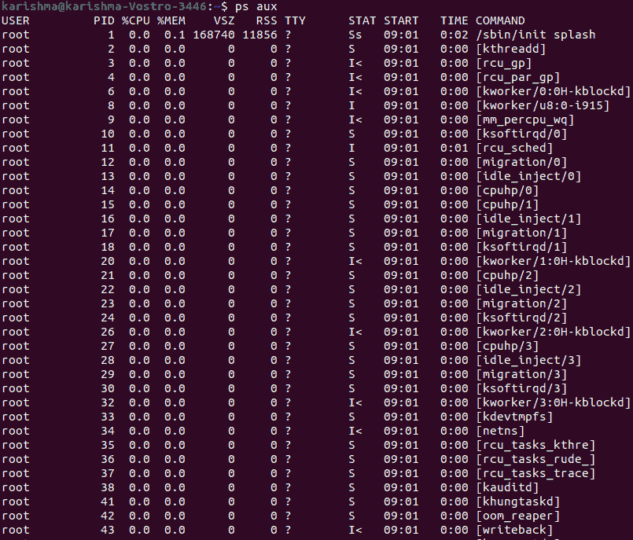
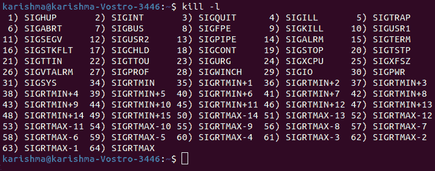

# 杀死命令

> 原文：<https://www.javatpoint.com/kill-command-in-linux>

## 什么是杀死命令？

Linux 是一个先进而伟大的操作系统；然而，它并不完美。一些应用程序可能开始表现不小心，变得不敏感，或者开始消耗一些系统资源。

不敏感的应用程序无法重新启动，因为实际的应用程序进程永远不会完全停止。一个单一的解决方案是重新启动系统或终止应用程序的进程。

有各种实用程序允许我们终止错误的进程以及 ***杀死*** 命令。这个命令在 Linux 中使用最广泛。

在 [Linux](https://www.javatpoint.com/linux-tutorial) 中，kill 命令(位于/bin/kill 内部)可以定义为内置命令。

它用于手动终止进程。在 shells 和 ***/bin/kill*** 独立可执行程序中，kill 命令的行为略有不同。

我们可以应用 type 命令来显示系统中包含 kill 的每个位置:

```

$ type -a kill

```


kill 命令将一个信号传送给一个进程，在该进程中，进程将进一步终止。当用户没有描述任何将与 kill 命令一起传输的信号时，将传输 **TERM** 信号(默认)，该信号将终止该过程。如果信号没有描述，则默认为**-15**(**-术语**)。

应用最广泛的信号如下:

*   **HUP (1)-** 它重新加载一个进程。
*   **KILL (9)-** 它杀死一个进程。
*   **TERM (15)-** 它优雅地停止一个进程。

我们可以使用 kill 命令和 **-l** 选项来获取每个可用信号的列表:

```

$ kill -l

```


这些信号可以用三种不同的方式来描述。下面列出了这些方法:

*   按编号(例如-6)
*   不带 SIG 前缀(例如-kill)
*   带符号前缀(例如-SIGkill)

以下命令彼此相似:

*   $ kill -SIGHUP PID_NUMBER
*   $ kill -HUP PID_NUMBER
*   $ kill -1 PID_NUMBER

给 kill 命令的 PiD 可以是以下任何人:

1.  当 PID 大于零时，该信号将与类似于 PID 的 ID 一起传输到进程。
2.  当 PID 等于零时，信号将被传送到当前过程组内的每个过程。这意味着信号将被传输到与请求 kill 命令的 Shell GID 相关的每个进程。我们可以使用 ***ps -efj*** 命令来查看流程组的标识。
3.  当 PID 等于-1 时，信号将与用户请求命令时的类似 UID 一起传输到每个进程。如果发出请求的用户是根用户，那么信号将被传输到除 kill 和 init 进程之外的每个进程。
4.  当 PID 小于-1 时，信号将与类似于 PID 绝对值的 GID 一起传输到过程组中的每个过程。

普通用户能够向他们的进程传递信号。但是，它不包括那些与任何其他用户相关的用户。另一方面，根用户能够将信号传递给其他用户的进程。

*   -1 的 PID 非常独特，因为它指示除 init 和 kill 之外的每个进程，init 和 kill 是系统上每个进程的父进程。
*   PID 的负值用于表示过程组标识。当我们传递任何进程组标识时，该组中的每个进程都会收到信号。
*   要显示正在运行的进程列表，我们可以使用 ps 命令，它会显示正在运行的进程以及 PID 号。我们需要给出 PID 来指定哪个进程应该获得 kill 命令的信号。

### 语法:

```

$ps

```


**ps aux:** 该命令用于显示每个正在运行的进程及其 PiD 和其他详细信息。万一我们不知道进程 ID，我们可以使用这个命令。



## kill 命令的选项

**1。kill -l:** 该选项用于显示每个已存在的信号，我们可以应用以下命令选项:

**语法:**

```

$kill -l

```



**2。kill pid:** 该选项用于显示如何将 pid 与 kill 命令一起应用。

**语法:**

```

$kill pid 

```


**3。kill-L:**kill-L 命令可用于以表格的形式列出存在的信号。

**语法:**

```

/bin/kill -L

```


**4。翻译信号编号:**我们可以使用以下命令轻松地将任何信号编号翻译成信号名称:

```

/bin/kill  --list=12

```


* * *