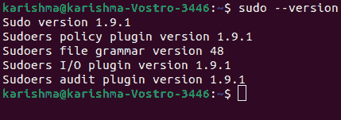
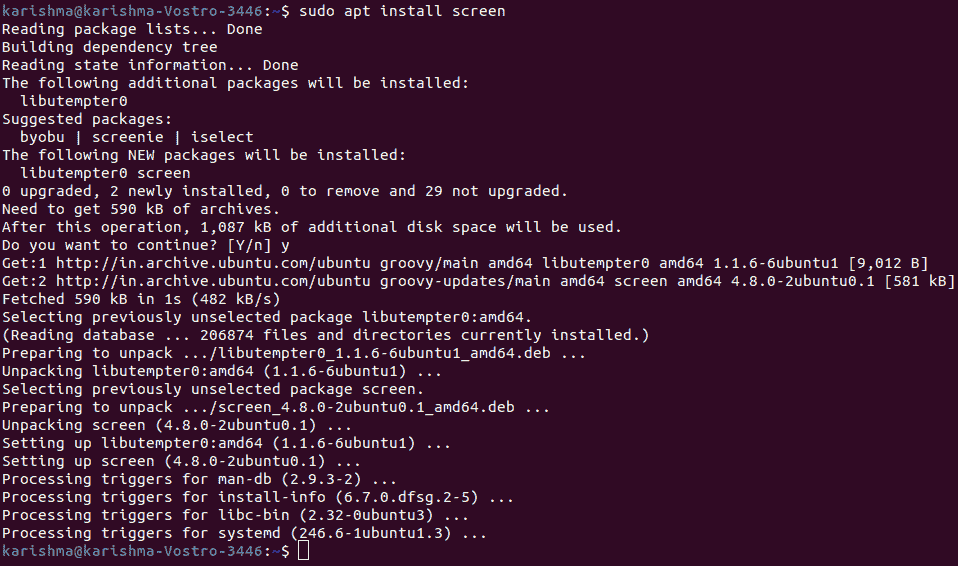
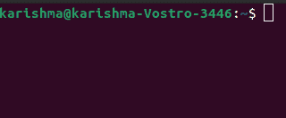
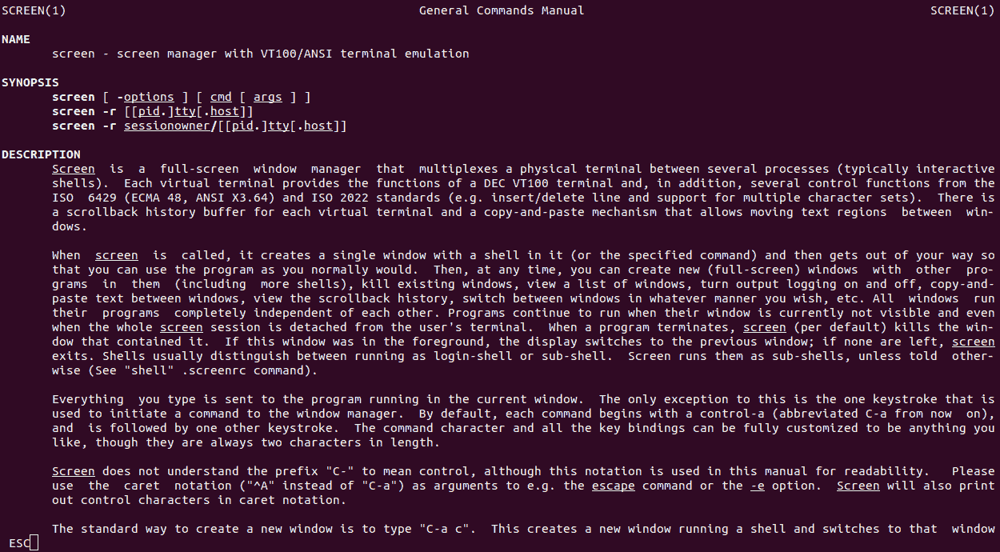
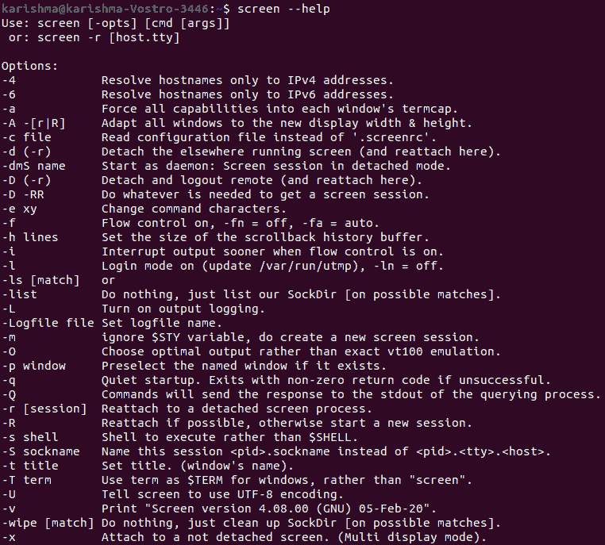

# Linux 屏幕命令

> 原文：<https://www.javatpoint.com/linux-screen-command>

我们有时会遇到这样的情况:我们执行一个长时间运行的操作来移除机器，然后我们的连接突然中断。在这种情况下， **SSH 会话**已经终止，我们的工作也没有了。

然而，我们每个人都在几个方面遇到过这种情况。但是，有一个被称为 ***屏幕*** 的命令允许我们恢复会话。

## 屏幕命令概述

在 [Linux](https://www.javatpoint.com/linux-tutorial) 中，screen 命令有助于通过单个 ssh 会话启动和使用多个 shell 会话。该进程可以通过会话分离。如果该过程从 screen 命令开始，我们可以稍后重新附加此会话。

最初，如果会话被分离，从屏幕开始的进程由屏幕管理和运行。之后，该过程可以重新连接会话，终端以原来的方式留在那里。

[GNU](https://www.javatpoint.com/gnu-full-form) 屏或简称屏可以定义为终端复用器。此外，这意味着我们可以启动屏幕的任何会话，然后在该会话中打开几个窗口(虚拟窗口)

即使我们断开连接，如果窗口不清晰，许多在屏幕中执行的进程也会继续执行。

### 屏幕命令的语法

```

screen [-opts] [cmd [args]]

```

## 屏幕命令中的选项

*   **-a:** 它会强制每个能力进入每个窗口的 termcap。
*   **-A -[r | R]:** 它将使每个窗口适应新的显示高度和宽度。
*   **-c 文件:**将读取配置文件而不是 ***。screenrc。***
*   **-d (-r):** 它将分离其他地方的执行屏幕。
*   **-dmS 名称:**它将作为:分离模式内的屏幕会话开始。
*   **-D (-r):** 将支持脱离和注销遥控器。
*   **-D -RR:** 它将实现获取屏幕会话所需的任何东西。
*   **-e xy:** 将修改命令的字符。
*   **-f:** 有助于流量控制， ***-fn = off，-fa = auto。***
*   **-h 行:**将设置回滚历史缓冲区大小。
*   **-i:** 如果流量控制有效，会更快中断结果。
*   **-l:** 有助于开启登录模式(更新/ ***var/run/utmp)，-ln = off。***
*   **-ls [match]:** 它将显示每个附加的屏幕。
*   **-L:** 将开启输出的记录。
*   **-m:** 它将忽略 ***$STY*** 变量并创建一个新的会话屏幕。
*   **-O:** 将选择最优输出，而不是 ***vt100 仿真*** (精确)。
*   **-p 窗口:**当有命名窗口时，它会预选一个。
*   **-q:** 这是一个相当不错的起步。如果不成功，它将与非零返回代码一起存在。
*   **-问:**这将有助于向查询过程的 stdout 发送回复。
*   **-r [session]:** 它将重新连接到分离屏幕的进程。
*   **-R:** 可能的话会重新连接，否则开始新一期的画面。
*   **-S (sockname):** 它将命名会话 ***。*sockname**而不是...
*   **-t(标题):**设置标题(窗口名称)。
*   **-T(术语):**它使用术语作为窗户的 ***$TERM*** ，而不是 ***【屏幕】*** 。
*   **-U:** 告诉屏幕使用 UTF-8 编码。
*   **-v:** 打印 ***“屏幕版本 4 . 06 . 02(GNU)23-10 月 17 日”。***
*   **-x:** 它将附着在一个非分离的屏幕上。它定义了显示器的多模式。
*   **-X:** 它在描述的会话中作为屏幕命令运行。

## 快捷键选项:

*   **Ctrl-a + c:** 这个快捷键可以创建任何新窗口。
*   **Ctrl-a + w:** 此快捷键显示当前打开的每个窗口的列表。
*   **Ctrl-a + A** 重命名当前窗口。如果我们列出使用 ***Ctrl-a + w.*** 打开的窗口列表，就会出现这个名称
*   **Ctrl-a + p:** 转到上一个窗口。
*   **Ctrl-a + n:** 这个快捷键转到下一个窗口。
*   **Ctrl-a + Ctrl-a:** 返回到上次使用的窗口。
*   **Ctrl-a + k:** 此快捷键关闭窗口(当前)。
*   **Ctrl-a + S:** 水平分割窗口(当前)。对于多窗口之间的切换，我们可以做 ***Ctrl-a + Tab。***
*   **Ctrl-a + |:** 垂直拆分窗口(当前)。
*   **Ctrl-a + d:** 此快捷键分离屏幕的会话，不限制。
*   **Ctrl-a + r:** 它重新连接了分离屏幕的会话。
*   **Ctrl-a + [:** 此快捷键启动复制模式。
*   **Ctrl-a + ]:** 粘贴了文字(复制)。

## 屏幕命令示例

### 1.检查屏幕版本

在大多数 Linux 发行版上，屏幕命令包是预装的。我们可以通过输入以下内容来考虑它是否已经安装在我们的系统上:

```

screen --version

```



在这种情况下，我们没有一个屏幕包已经安装在我们的系统上，我们可以很容易地安装它的帮助下，包管理器的分发。

### 2.屏幕命令的安装

我们需要转到我们的终端，输入以下命令来安装屏幕命令:

```

$ sudo apt install screen

```



如果我们正在使用 Fedora 和 CentOS，我们可以使用以下命令来安装屏幕命令:

```

$ sudo yum install screen

```

### 3.屏幕

该命令将在屏幕内开始一个新窗口。

```

screen 

```



### 4.构成名词复数

该命令在屏幕内启动一个新窗口。它还为我们的窗口提供了一个名称。它会建立一个由该特定名称识别的会话。该名称可用于以后重新连接屏幕。

```

screen -S file

```


### 5.开始命名会话

如果我们在屏幕上执行一个以上的会话，命名的会话非常有用。我们需要执行 screen 命令以及以下参数来创建命名会话:

```

$ screen -S session_name

```


始终，选择会话的描述性名称是一个好主意。

### 6.-ls

它用于显示当前打开的屏幕，包括在后台执行的屏幕。该命令将列出屏幕上每个附加和分离的会话。

```

screen -ls 

```


### 7.-d

它用于检测屏幕的会话，以便以后重新连接。也可以使用 ***Ctrl-a + d*** 快捷键实现。

```

screen -d 4774

```


这里 4774 是我们希望分离的屏幕的 id。

### 8.-r

它用于重新附加之前分离的屏幕会话。

```

screen -r 4774

```


### 9.定制 Linux 的屏幕

当屏幕开始时，它将通过~/ ***读取配置参数。screenrc 和/etc/screenrc*** 如果文件可用。我们可以在文件的帮助下根据自己的喜好更改屏幕的默认设置，即 ***.screenrc.***

### 10.在屏幕间切换

实现嵌套屏幕时，可以借助***【Ctrl-A】***命令和***【n】在屏幕间切换。*** 将移至即将出现的画面。我们在上一个屏幕上有两个 go，\只需点击***“Ctrl-A”***和***“p”。***

要创建新的屏幕窗口，只需点击***【Ctrl-A】******【c】。***

### 11.使用多个屏幕

当我们需要多个屏幕来完成工作时，我们可以一次执行多个屏幕窗口。我们可以用两种方法来做这件事。

首先，我们可以分离初始屏幕，在实际终端上执行另一个屏幕。其次，我们做一个嵌套屏幕。

### 12.记录我们做的任何事情

有时有必要记录下我们在控制台内所做的事情。例如，我们是一个处理 Linux 各种服务器的 Linux 管理员。使用屏幕记录，我们不必写下我们完成的每一个命令。激活屏幕登录功能，需要点击***【Ctrl-A】******【H】。***

#### 注意:我们在使用“H”字母时必须小心，因为“H”只会在另一个名为硬拷贝的文件中建立屏幕截图。

在屏幕的左下角，会有一个提醒通知我们，比如:创建日志文件***“screen log . 0”。*** 我们将在主目录中看到 ***屏幕日志 0*** 文件。

这个优势附加了我们在屏幕窗口内所做的一切。要关闭屏幕记录正在执行的活动，我们需要再次点击***【Ctrl-A】******【H】***。激活该日志功能的其他方式，我们可以在第一次运行屏幕时包括***-【L】***参数。

该命令如下:

```

$ screen -L

```

我们可以使用下面的命令来检查屏幕命令的手动页面:

```

man screen

```



我们可以使用下面的命令来检查屏幕命令的帮助页面:

```

screen --help

```



* * *