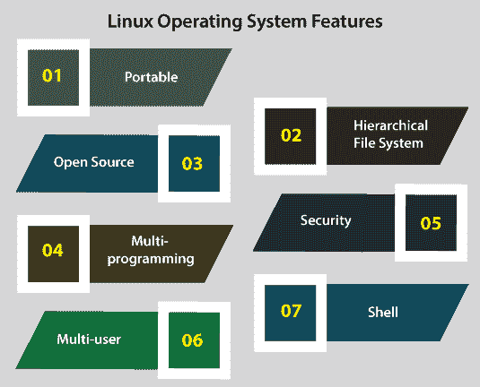

# Linux 和 Ubuntu 的区别

> 原文：<https://www.javatpoint.com/linux-vs-ubuntu>

## Linux 简介

操作系统可以被指定为计算机用户和计算机硬件之间的接口。它是一套管理计算机硬件工具并为许多计算机程序提供基本服务的软件。

[操作系统](https://www.javatpoint.com/os-tutorial)是计算机系统中系统软件的基本元素。操作系统的主要目标是促进一个平台，在这个平台上，用户可以方便有效地实现任何程序。

*   此外，Linux 操作系统是 UNIX 操作系统的一个流行标准。
*   它是集成的，为个人计算机系统的许多用户提供一个低成本和免费的操作系统。
*   它是一个非常完整的操作系统，包括 Emacs 编辑器、IP/TCP、X 窗口系统、图形用户界面等。它被誉为最高效、最快速的功能系统。
*   Linux 是一个类似于 iOS、Mac OS 和 Windows 的操作系统。另一方面，安卓是由 Linux 操作系统驱动的，这是世界上广泛使用的环境之一。
*   操作系统是管理与我们的笔记本电脑/台式机相关的所有硬件资源的软件。
*   操作系统维护我们的硬件/软件之间的通信过程，以便简单地实现它。
*   虽然，当我们必须选择一个平台来执行世界上的服务器、嵌入式和桌面系统时，Linux 是最安全、无忧和可靠的操作系统之一。

Linux 操作系统由几个不同的部分组成。其中一些解释如下:

*   **Bootloader:** 它是处理我们系统启动过程的软件。简单地说，这将是一个闪屏，最终启动到操作系统。
*   **初始化系统:**初始化可以定义为一个可以引导用户空间并使用处理守护程序进行充电的子系统。当引导过程由引导加载程序提供时，初始化系统管理引导过程(即 GRand 和 GRUB 统一引导加载程序)。
*   **内核:**是一整块，叫做 Linux。它可以被指定为系统的核心，也可以处理内存、外围设备和中央处理器。此外，内核是最低的操作系统阶段。
*   **守护进程:**守护进程是后台服务(像声音、调度、打印等。)在引导过程中登录到计算机或启动。
*   **图形服务器:**它可以被定义为在我们的显示器上代表图形的子系统。它通常被称为 X/X 服务器。
*   **应用程序:**桌面平台没有给出完整的应用程序阵列。就像视窗和苹果操作系统一样，Linux 给出了许多高级软件的名称，可以很容易地检测和安装。
    几乎所有现代 Linux 发行版都包含类似 App Store 的工具，可以简化和集中应用程序安装过程。
    例如，Ubuntu Linux 有 Ubuntu 软件中心，允许每个人快速检测许多应用程序之间的差异，并通过单独的集中位置安装它们。
*   **桌面环境:**其实是很多用户配合的细分市场。有几个桌面平台可供选择(KDE、Xfce、万神殿、启蒙、肉桂、Mate、GNOME 等。).每个桌面环境都有各种内置应用程序，如网络浏览器、配置工具、游戏和文件管理器。

## Linux 操作系统的应用

如今，Linux 是一个十亿美元的协会。世界上许多政府和组织都在使用 Linux 操作系统，因为时间、许可费、更低的成本和可负担性。

Linux 可以用在许多种电子设备中。这些类型的电子设备对全世界的所有用户来说都很容易获得。以下是一些流行的基于 Linux 的电子设备:

*   雅马哈动力键盘
*   数字录像机
*   沃尔沃车内导航系统
*   索尼阅读器
*   每个孩子一台笔记本电脑 XO2
*   索尼布拉瓦电视公司
*   摩托罗拉摩托罗拉 35 手机
*   HP Mini 1000
*   联想 IdeaPad S9
*   谷歌安卓开发手机 1
*   戴尔 Inspiron Mini 9 和 12
*   Garmin Nuvi 860、880 和 5000

## Linux 操作系统的特点

下面提到了 Linux 操作系统的一些主要特性:

*   **便携:** Linux OS 可以执行不同类型的硬件，Linux 的内核支持安装任何类型的硬件环境。
*   **多道程序设计:** Linux 操作系统可以表示为一个多道程序设计系统。它定义了一次可以执行多个应用程序。
*   **开源:** Linux 操作系统源代码是自由存在的，为了整合 Linux 操作系统的能力，很多团队都在继续合作。
*   **分层文件系统:** Linux 操作系统提供了一种经典的文件结构，其中组织了用户或系统的文件。
*   **多用户:** Linux 操作系统也可以指定为多用户系统。它定义了一个以上的用户可以同时使用系统的资源，如内存、应用程序或内存。
*   **Shell:** Linux OS 方便了一个特殊的解释程序。这种程序可以实现为运行操作系统的命令。它可以用于执行许多类型的操作，例如调用应用程序和其他操作。
*   **安全性:** Linux 操作系统借助身份验证的许多功能为用户安全系统提供帮助，例如对密码保护、特定文件或数据加密的受控访问。

## 安装 Linux

安装[操作系统](https://www.javatpoint.com/operating-system)的计划对许多人来说似乎是一个乏味的操作。Linux 为每个操作系统提供了最简单的安装过程。几乎所有的 Linux 标准都给出了 Live 发行版。我们无法通过 [USB](https://www.javatpoint.com/usb-flash-drive) 或 [CD](https://www.javatpoint.com/cd) /DVD 闪存驱动器执行操作系统，而无需对硬盘驱动器进行任何修改。

我们也可以在不承诺安装的情况下获得完整的功能。简单地说，我们双击安装按钮，当我们试用了基本安装向导并决定使用它时，就可以继续使用它。

安装过程的向导通常会按照下面提到的步骤引导我们:

*   **准备:**确保机器符合安装工艺要求。当我们希望安装第三方软件(如 MP3 播放插件、视频编解码器等)时，它可能会确认我们。
*   **硬盘分配:**这是一个必不可少的步骤，允许我们选择希望如何安装操作系统。如果我们希望在另一个操作系统旁边安装 Linux(称为“双引导”)，我们可以完全使用硬盘，将其安装在可用的 Linux 版本上，或者升级可用的 Linux 安装。
*   **位置:**使用地图选择我们的位置。
*   **无线设置(如果必要):**如果我们使用的是无线笔记本电脑(或机器)，我们将需要链接到网络以下载第三方更新和软件。
*   **用户设置:**设置密码和用户名。
*   **键盘布局:**为系统选择键盘。

就是这样，当我们的系统完成安装过程，我们只需要重启我们的系统，我们就可以开始了。

## Ubuntu 简介

Ubuntu 可以定义为一个完整的 OS。它与专业和社区支持一起免费提供。乌班图社区是在《乌班图宣言》中保留的思想基础上创建的。

它是为网络服务器、智能手机和计算机设计的。该系统由一家总部位于英国的组织设计，该组织名为

 *用于开发 Ubuntu 软件的每个原则都是根据开源软件开发原则工作的。

Ubuntu 适用于服务器和桌面。

Ubuntu 版本(当前)支持英特尔 x86、ARMv8、ARMv7、AMD64、IBM POWER9/POWER8 和 IBM Z zEC12/zEC13/z14。

Ubuntu 包含成千上万的软件，从 GNOME 3.28 和 Linux 内核 5.4 版本开始。

它们涵盖了从电子表格和文字处理应用程序到网络服务器软件、编程工具和语言、电子邮件软件、互联网访问应用程序以及各种游戏的所有标准桌面应用程序。

## Ubuntu 的安装

系统需要在 Ubuntu 产品之间进行更改。对于 Ubuntu 20.0 4 LTS 台式机版本，建议使用一台具有 4GB 内存、2 GHz 双核处理器和 25GB 可用磁盘空间的电脑。

还有许多其他发行版，如 Xubuntu 和 kubuntu，它们的计算机性能远没有那么强。

Ubuntu 为 ARM 的架构提供支持。此外，它还存在于 Power ISA 上，在早期的 PowerPC 架构中，有一个单独的点得到了非官方的支持，现在支持 Power ISA 的新 CPU。

*   实时图像是几个用户随后访问和安装 Ubuntu 的典型方式。这些可以作为磁盘映像下载，然后刻录到 DVD 并启动。
*   安装一个 u 盘可以额外应用于引导 Ubuntu 和 Kubuntu，其方式允许用户设置的永久存储以及安装了 u 盘的系统在许多物理机器之间的可移植性。
*   Ubuntu 的实时 USB Creator 可用于在较新版本的 Ubuntu 中通过 USB 驱动器安装 Ubuntu 操作系统(不带或带实时 DVD 或 CD)。
*   制作一个带持久性的可引导 u 盘就像拖动任何滑块来决定要为续航能力保留多少容量一样简单。Ubuntu 为此使用了 Casper。
*   桌面版也可以安装使用 Debian 安装程序的 Netboot 映像，并允许专业安装 Ubuntu:从早期安装升级而不使用网络访问，修复自动部署、RAID 或 LVM 分区，安装在系统上以及 256 兆内存。

## Ubuntu vs .Linux 系统

| 没有 | 比较基础 | 人的本质 | Linux 操作系统 |
| **1。** | **分布** | 它是基于 Linux 内核的发行版之一。 | 它有各种基于 Linux 内核的发行版。 |
| **2。** | **易用性** | 这是一个更加用户友好和基于桌面的发行版。 | 它的命令行对任何家庭用户来说都是具有挑战性的。 |
| **3。** | **变异** | 在 Ubuntu 中，基于桌面的、核心的和服务器的种类是可用的。 | 在 Linux 中，有多种基于嵌入式的服务器可供选择。 |
| **4。** | **健壮** | 几乎没有，如果任何元素行为不当，它就会崩溃。 | 这是一个类似 Unix 的架构。它有助于提高鲁棒性。 |
| **5。** | **安全** | 它是最安全的操作系统之一。 | 在安全性方面，它胜过所有其他竞争对手。 |
| **6。** | **灵活性** | 它更灵活，因为它基于 Linux 内核。 | 在 Linux 中，组件很容易更换。 |
| **7。** | **可靠性** | 经过几次使用后，它不会停滞不前，这使它更加可靠。 | 它非常可靠，这使得它值得在企业之间销售。 |
| **8。** | **论坛支持** | 在 Ubuntu 中，论坛的支持仍然需要比其他 Linux 发行版开发得更好。 | 在 Linux 中，论坛的支持是可以接受的。 |
| **9。** | **释放** | 它最初于 2004 年出版。 | 它最初出版于 1991 年。 |
| **10。** | 用法 | 它用于物联网、服务器、云计算和个人电脑。 | 它用于服务器、台式机、嵌入式系统、游戏机和个人电脑。 |
| **11 时。** | **显影剂** | 它是由 Canonical 有限公司发布的。此外，Ubuntu 社区支持该开发。 | 它最初是由莱纳斯·托瓦尔兹出版的。此外，Linux 社区支持操作系统开发。 |
| **12 时。** | **操作系统类型** | 这是一个 Linux 发行版。 | 它是一个核心操作系统。 |
| **13。** | **初级友好** | 它对初学者更友好。 | 它对初学者不太友好。 |
| **14。** | **导航** | Ubuntu 对最终用户来说既直观又简单。 | 对于办公室和家庭用户来说，在许多 Linux 发行版之间导航可能是一个挑战。 |

* * **