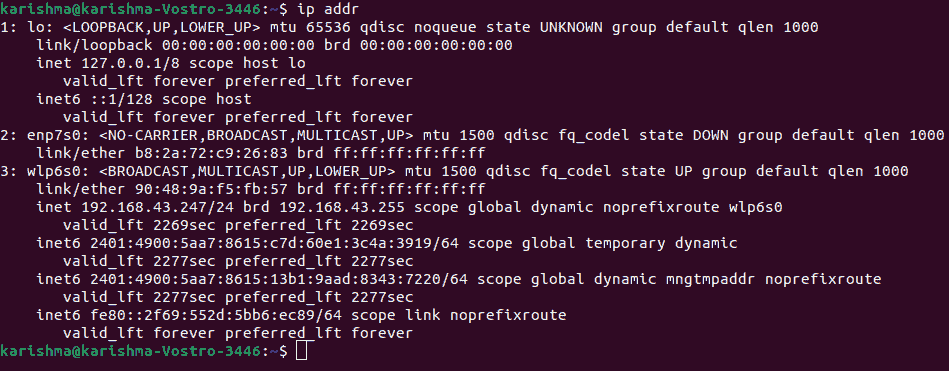
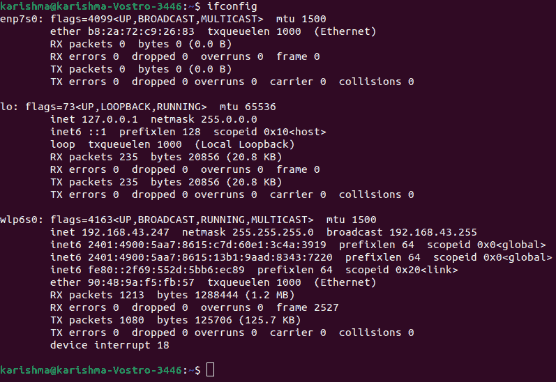

# 在 Linux 中查找 IP 地址

> 原文：<https://www.javatpoint.com/find-ip-address-in-linux>

## 介绍

IP 地址是分配给网络上系统的代码名。它的工作原理是将提供网络流量的邮政地址传输到正确的系统。

### 先决条件

*   Linux 操作系统
*   访问命令行/终端窗口

## 使用命令行找到我们的 IP 地址

有一些不同的命令我们可以用来检查我们的 IP 地址。我们可以从打开命令行/终端窗口来执行这些命令开始。

### 1.使用主机名命令

在终端窗口中，我们可以借助以下命令检查我们的 IP 地址:

```

hostname -I

```


我们的系统会显示内部 [IP](https://www.javatpoint.com/ip) 地址。

### 2.使用 ip 地址命令

我们可以使用一个命令来检查我们的 [IP](https://www.javatpoint.com/ip-full-form) 地址，即 ***ip addr。***

```

ip addr 

```



我们的系统将扫描我们的硬件，并显示我们所有网络适配器的状态。检查告诉以太网/链路的条目。我们应该看到以下任何一种情况:

```

inet 192.168.0.10/24
inet6 fe80::a00:27ff:fe76:1e71/64

```

这些条目将包含一个无线或 WiFi 适配器或有线或以太网适配器的条目。此外，我们可能有虚拟适配器的条目。通常只有一个条目会列出我们想要的 IP 地址。

***重要提示:*** *斜线/64 -和- /24 后的数字代表网络大小。此外，它还有助于映射和扫描网络的大小。*

### 3.使用 ifconfig 命令

该方法用于应用 ifconfig 命令查找我们的 IP 地址关联。在此命令行中键入以下命令:

```

ifconfig 

```



该系统将显示每个网络连接，如虚拟的、连接的和断开的。检查标签为多播、运行、广播、上行的，以找到我们的 [IP 地址](https://www.javatpoint.com/ip-address)。它列出了 [IPv6 和 IPv4](https://www.javatpoint.com/ipv4-vs-ipv6) 地址。

***重要:*** *当我们检查我们的 IP 地址时，我们可能会注意到回送术语。它指的是向类似系统提供流量的 IP 地址。环回地址通常是 127.0.0.1。要么我们正在检查不准确的线路，要么我们在检查列出的地址时没有连接到网络。*

### 4.在 Linux 中使用图形用户界面找到我们的 IP 地址

如果我们使用点击式界面来运行我们的 [Linux](https://www.javatpoint.com/linux-tutorial) 系统，我们可以通过考虑以下步骤来检查我们的 IP 地址:

*   在 ***应用菜单的搜索栏中输入 ***设置*** 。***
*   按下输出中出现的图标，即 ***【设置】*** 。
*   然后，在 ***【设置菜单】*** 内搜索选项卡，即 ***【网络】*** ，并按下图标，即 ***高级有线设置。***
*   它将打开一个弹出窗口以及有线设置的详细信息。这里我们可以同时检查我们的 ***IPv6 地址和 IPv4 地址。*T3】**

## 检查公共 IP 地址

我们可以通过外部网站找到我们的公共 IP 地址。

如果我们使用任何浏览器，我们可以导航到:

```

https://www.whatismyip.com

```

或者，

如果我们使用终端或命令行，使用检索命令，如 wget 或 curl 来显示外部 IP 地址。

```

wget -0 - -q https://checkip.amazonaws.com
curl -s https://icanhazip.com

```


***重要提示:*** *当我们使用 curl 连接一个网站(不安全)时，输出会以错误响应。*

## 什么是私有/公共 IP 地址

在网络中，所有的计算机都需要有自己的 IP 地址。如果两台计算机具有相似的 IP 地址，它将在网络上引入错误。

大多数现代网络会发现这个问题，并提示我们解决它。然而，各种较旧的网络可能会变得尴尬，试图将流量路由到两个系统。

大多数计算机将有两个不同的 IP 地址，如下所示:

**公共 IP 地址:**是我们在访问某个网站时，在该网站上遇到的地址。当我们连接到任何小型网络时，我们的系统将连接到具有 IP 地址(内部)的路由器。反过来，该路由器连接到一个巨大的网络(如互联网服务提供商)，并有自己的 IP 地址系统。

**私有 IP 地址:**是网络上使用的 IP 地址。这也是我们希望用来配置路由工具的工具。通常，内部 IP 地址从较小网络上的 192.168.x.x IP 地址开始。每当我们动态连接时，它就被分配给我们的系统。

为专用网络保留了一些 IPv4 地址范围。下面列出了这些内容:

*   192.168.0.0/16
*   172.16.0.0/12
*   10.0.0.0/18

* * *