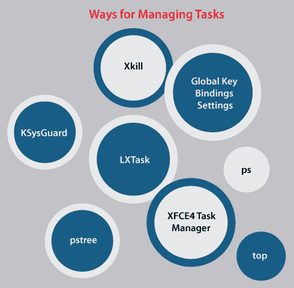
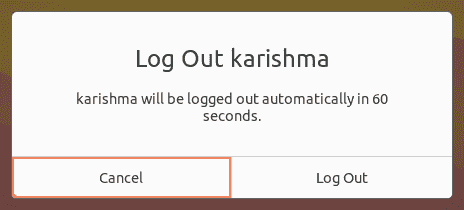
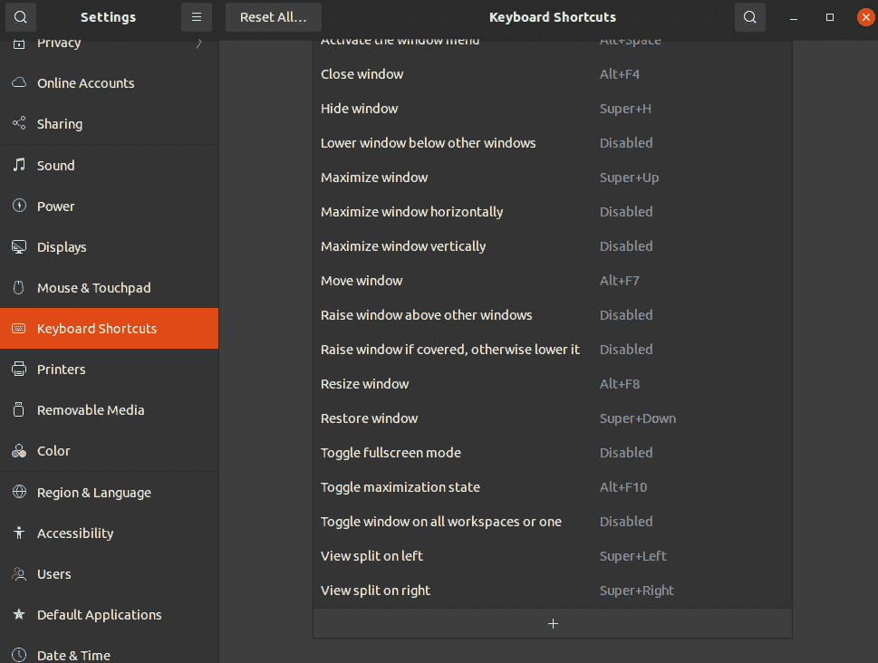
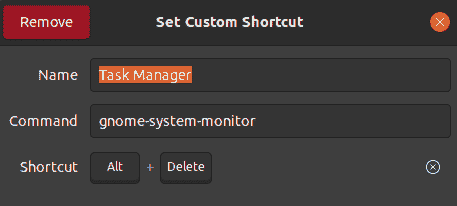
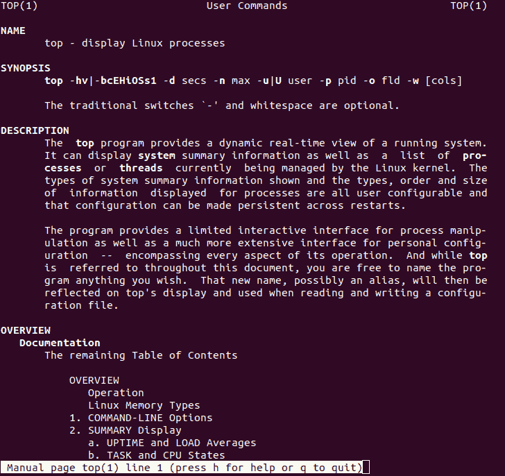
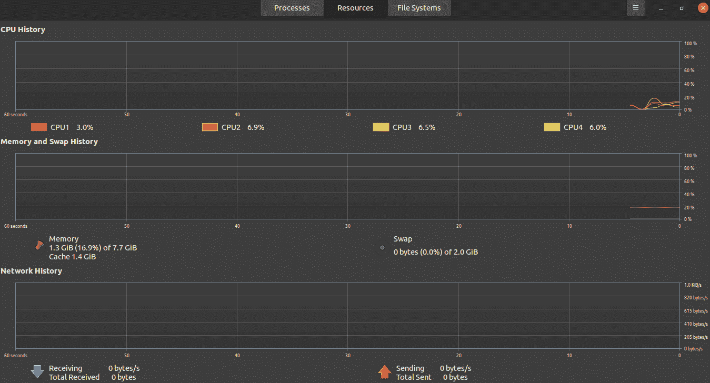
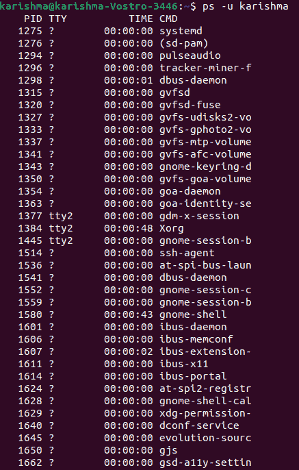
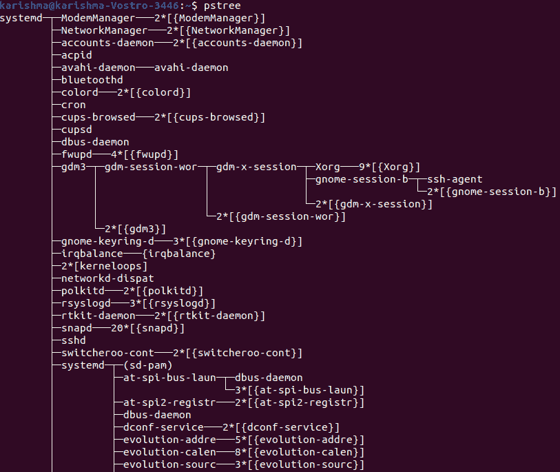

# Linux 任务管理器

> 原文：<https://www.javatpoint.com/linux-task-manager>

## 介绍

使用 Windows 的用户了解任务管理器的帮助有多大。在窗口中，我们按下 ***Ctrl+Alt+Del*** 键进入任务管理器。任务管理器向我们显示每个正在运行的进程及其对内存的消耗。我们可以使用任务管理器应用程序选择结束进程。

当我们刚开始使用 Linux 时，我们也可以在 Linux 中寻找等效的任务管理器。Linux 的专家用户会更喜欢终端/命令行方式来查找进程和内存消耗。然而，我们不必走那条路，至少如果我们只是从 [Linux](https://www.javatpoint.com/linux-tutorial) 开始就不会。

Linux 的每个主要发行版都有相当的任务管理器。通常被称为 ***“系统监视器”。*** 虽然，这取决于我们的 Linux 发行版和它所利用的桌面环境。

在本主题中，我们将看到如何在 Ubuntu 和其他 Linux 发行版中使用和找到任务管理器，这些发行版像桌面环境一样应用 [GNOME](https://www.javatpoint.com/ubuntu-gnome) 。

## 系统监视器简介

如果我们使用的是 ***GNOME 桌面，*** 则点击 ***Windows 键*(超级键)**并搜索 ***系统监视器。*** 我们还可以在其他类型桌面环境的菜单中找到 ***【系统监视器】*** 。

它将开始 ***GNOME 系统监视器。*** 它向我们展示了每一个正在运行的进程及其内存消耗。

我们可以选择任何进程，并按结束进程选项来终止它。此外，我们可以在这里选择多个条目，然后单击一下就可以终止任何进程。

我们可以在 ***资源选项卡*** 中看到一些关于我们系统的统计数据，以及像 ***网络使用情况、内存消耗、每核 CPU 消耗、*** 等。

该选项卡使我们能够轻松访问我们的 Linux 发行版和版本、正在运行的内核(当前)、可用磁盘空间以及 [GNOME](https://www.javatpoint.com/gnome) 版本。

下一个选项卡称为“进程”选项卡。它与任务管理器相同。我们可以按照进程名称、内存使用情况、 [CPU](https://www.javatpoint.com/central-processing-unit) 使用情况等进行排序。

我们将需要搜索进程的名称并按下一个按钮，即结束进程以终止进程。将弹出一个确认通知，我们可以轻松地终止一个无响应的进程。

资源选项卡显示[中央处理器](https://www.javatpoint.com/cpu-full-form)、网络和内存历史。它在系统的各种故障诊断性能中非常有用。只要系统监视器处于活动状态，历史记录就会被存储。因此，如果我们希望在运行几个程序时看到一个性能，请确保我们让它保持运行。

文件系统是最后一个选项卡。它显示本地硬盘及其分区的详细信息。特别有用的是目录、设备和使用的细节。设备说明了系统如何识别我们的分区，目录说明了该分区位于何处或何时位于何处。

## 管理任务的其他方法

如果我们希望使用命令行/终端方式，只需执行一个命令，即命令行中的 top，我们就可以找到每个正在运行的进程和内存消耗。在 Linux 终端中，我们可以很容易地杀死进程。

如果我们想要一个基于命令行/基于终端的任务管理器，我们建议使用 htop 命令。我们可以看到内存使用情况、运行过程等等。我们可以使用热键轻松地结束这个过程，而且看起来很好。



### 全局键绑定设置

默认情况下，GNOME 桌面环境使用快捷键，即 ***Ctrl+Alt+Del*** 调出休眠对话框，即我们的系统会在 60 秒内注销。



这对快速访问任务管理器的用户没有帮助。

要修改 GNOME 里面的 ***Ctrl+Alt+Del*** 设置，我们可以在屏幕上按鼠标右键打开 ***显示设置*** 。它位于 Ubuntu 中的 ***显示设置- >键盘快捷键*** 上。




#### 注意:我们可以使用 Linux Mint 中的 mintMenu ->控制中心->键盘快捷键来打开。

键盘快捷键选项将显示 GNOME 桌面环境可以控制的所有快捷键。

***重要提示:**其他 Compiz 或程序特定的键盘快捷键不会在此显示。我们需要检查程序中有哪些快捷方式。*

包含自定义全局键盘快捷键非常容易。

对于 ***Ctrl+Alt+Del*** 键的替换，我们需要命名一个新的快捷方式，即 ***【任务管理器】*** 和***gnome-system-monitor***是要执行的命令。



按下 ***进入*** 按钮，在自定义快捷方式上显示新的快捷方式。但是，**却是*禁用。***

点击显示**“禁用”**的地方，然后点击新选择的快捷键 **Alt+Delete。**


如果所选的键盘快捷键已经作为 GNOME 的其他键盘快捷键可用，我们将被要求输入一个键盘快捷键。

按下 ***进入*** 按钮，会创建一个新的键盘快捷键。它将显示命令的键盘序列。


我们还可以设置另一个键盘快捷键，以更有效的方式杀死没有响应的程序，并将其命名为 ***【杀死窗口】*** 以及***【xkill】***命令。


按下 ***【禁用】*** 按钮，将【击杀窗口】的快捷键设置为 ***Ctrl+Delete。***


### 克希尔

xkill 是为程序设置的键盘快捷键。该程序没有任何设置或用户界面。如果我们在终端上输入 ***xkill*** 命令，那么我们将会看到的一件事就是我们的鼠标光标将会切换到 ***X.***


我们需要在需要杀死的窗口上移动鼠标，并在窗口内的任何地方使用鼠标左键来杀死一个进程。程序会立即消失，出现一个进程激活的子窗口。


### 顶端

***top*** 命令是一个任务管理器，供多个 Linux 用户使用。我们可以在 Linux 的所有发行版中应用它。只是，我们需要打开命令行，输入***“top”。***top 命令是一个优秀的任务管理器，因为它说明了基本细节，如总任务、交换使用、空闲 ram、ram 使用、CPU 使用等。

如果我们启动 ***【顶】*** 命令，我们可以借助 ***Alt+j*** (下移) ***Alt+k*** (上移)移动工艺历史。如果我们希望进一步了解如何使用***【top】***命令，我们可以在命令行中输入以下命令:

```

man top

```



### LXTask

如果我们使用 ***Lxde*** 作为桌面环境，那么我们肯定使用 ***LXTask*** 作为我们的任务管理器。它是 Lxde 的任务管理器(默认)，并且包含一些好处。 ***LXTask*** 是一个非常 ***简单的*** 和 ***轻量的*** 任务管理器。如果我们正在寻找一个通用的任务管理器，那么它就是我们的解决方案。

### XFCE4 任务管理器

这个桌面环境(即 **Xfce** )也很受欢迎。它包含它的任务管理器。它的任务管理器非常 ***轻量级*** 并且它必须足以进行公共资源监控。

### XFCE4 任务管理器的特性

该任务管理器的一些基本功能解释如下:

*   监控内存和中央处理器的使用情况。
*   支持 OpenSolaris、FreeBSD、NetBSD、OpenBSD 和 Linux。
*   树视图列可以重新排序。
*   显示窗口名称/图标。
*   像树一样查看流程。
*   根据进程名称过滤所有进程的列表。
*   可通过一些设置进行定制。

### 大鼻子的

定义为 ***X 窗系统的系统监控软件。Conky*** 可用于 ***FreeBSD*** 和 ***Linux/GNU。*** 它是 ***免费的*** 软件下发布的 ***GPL 许可条款。*** 这个系统监控软件可以监控各种系统变量，如系统消息、下载、上传、置顶、温度、磁盘空间、交换、内存、CPU 等。

***【康基】*** 的一个特点是不依赖任何桌面环境，我们可以在任何 Linux 发行版中安装这个软件。

### 配对系统监视器

它是一个很好的任务管理器，包含在 ***MATE 桌面环境中。*** 如果我们使用的是 ***MATE，*** 那么我们可以轻松使用。它与 gnome 的任务管理器非常相似(尤其是讨论 Gnome 2)。



### 著名图象处理软件

它不是任何任务管理器。尽管如此，我们可以用它来查看流程的状态并管理我们的系统。 ***例如，*** 如果我们希望检查特定用户的进程，我们可以输入以下命令:

```

ps -u user_name

```



### 查看进程

这是一个用于查看进程状态的命令。它包含各种有用的方面，如果我们希望了解更多，那么它只是我们命令行中的一种 man pstree。pstree 的一个好处是，它被添加到 Linux 的每个发行版中。

该命令如下所示:

```

pstree

```



### KSysGuard

它是 ***KDE 桌面环境的任务管理器(默认)。*** 它包含与 gnome 的任务管理器相同的有用方面。我们也可以在其他桌面环境中使用它，如 ***XFCE。***

* * *