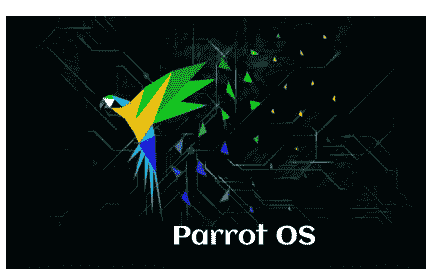
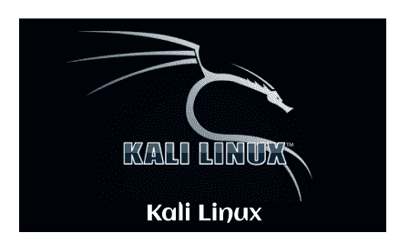

# 鹦鹉操作系统与 Kali Linux

> 原文：<https://www.javatpoint.com/parrot-os-vs-kali-linux>

## 鹦鹉操作系统

Parrot OS 是一款基于 Debian 的免费开源 GNU/Linux 操作系统，专为 ***安全专家、开发者、*** 和 ***隐私意识强的*** 用户而设计。2013 年 4 月，最初推出。

Parrot OS 和 Kali Linux 一样，包含了一整套用于 ***IT 安全和数字取证的可移植工具。*** 鹦鹉操作系统还附带了我们开发自己的程序和保护隐私所需的工具。除了这套可转移的工具，操作系统还附带了数百个预装工具，用于渗透测试和安全审计。

鹦鹉操作系统用于黑客攻击、计算机取证、云笔测试和隐私/匿名。

### 鹦鹉操作系统的特点

鹦鹉操作系统有多种功能:

鹦鹉操作系统有多种功能:

1.  轻量级选手
2.  自由的
3.  安全的

**1。轻量化**

Parrot OS 在非高端且资源有限的旧设备上运行流畅有效。

**2。免费**

因为 Parrot OS 是一个开源的分发系统，所以我们可以定制和使用源代码来创建一个满足我们需求的应用程序。

**3。安全**

鹦鹉操作系统完全沙箱化，定期发布更新的补丁来对抗威胁，非常安全。

## Kali Linux

Kali Linux 是一个基于 Linux 的操作系统，用于****数字取证的渗透测试。*** 它是在 Debian(一个 Linux 发行版)的指导下开发的。它于 2013 年 3 月首次发布，目标是取代 ***回溯操作系统。****

*

Kali 自带 600 个预装工具，用于各种数据安全活动，如 ***安全研究、Web 应用测试、渗透测试、计算机取证、*** 和 ***逆向工程。*** 此外，Kali Linux 正在创建并由一家著名且受欢迎的信息安全培训机构“攻击性安全”进行处理。

### 卡利 Linux 的特点

以下是 Kali Linux 的特性:

1.  多语言辅助
2.  定制内核，涵盖注射
3.  完全可定制
4.  自由的
5.  大范围无线设备支架
6.  可定制的
7.  预装工具和程序

**1。多语言辅助**

渗透工具是用英语编写的，允许非英语母语的人扩展他们的技能。因此，kali 包含了一个详细的多语言指南，允许更多的人使用他们的母语进行操作，并确定他们工作所需的工具。

**2。定制内核，注射覆盖**

作为渗透测试人员，我们一般要进行无线评估和测试；因此，我们的内核包含最先进的注入应用程序。

**3。完全可定制**

Kali Linux 的基本设计不达标，因为观感不太好。为了解决这个问题，Kali 让我们大胆的客户根据自己的喜好定制 Kali Linux 变得尽可能简单。

**4。免费**

它是免费使用的，就像回溯一样，我们永远不必购买 Kali Linux。超过 600 个渗透测试工具覆盖-在检查回溯中使用的每个工具后，它出现在安装本身的各种渗透测试工具中。

**5。宽范围无线设备支架**

广泛的无线设备支持者 Linux 发行版的一个持续的症结，已经被认证为无线接口。因此，Kali Linux 支持尽可能多的无线设备，允许它在各种硬件上运行，并与各种 USB 和其他无线设备一起工作。

**6。可定制**

Kali Linux 是一个非常可定制的操作系统，可以一直定制到内核级别。

**7。预装工具和程序**

Kali 配备了 600 多种预装渗透测试工具。因为它是回溯系统的再创造，它摆脱了一些不工作的工具，或者完成了与其他更简单的工具相同的事情。

## 关于 Kali Linux 我们需要知道什么？

Kali Linux 是一个渗透测试和面向安全的操作系统。它的核心是一个 Linux 内核。此外， ***【马体·阿哈罗尼】*** 和 ***迪冯·卡恩斯*** 还包括了最新的注射包，以节省所有笔测试人员的时间。

Kali Linux 已经按照 Debian 开发标准进行了开发，并被开发为一个复杂的笔测试发行版，将作为 Backtrack 的替代。

## 关于鹦鹉操作系统，我们需要了解什么？

Parrot OS 是一个基于 Debian 的发行版， ，这意味着代码库遵循 Debian 开发指南。它还自带渗透测试和安全相关工具。大多数都可以在上面找到。它由专业人员、开源开发者和 Linux 爱好者团队开发，于 2013 年推出。他们由洛伦佐·法莱塔领导。

## 鹦鹉操作系统与卡利 Linux 的比较

| 没有 | 鹦鹉操作系统 | Kali Linux |
| 1. | Parrot OS 需要的内存比 Kali Linux 少 320 MB 左右。 | Kali Linux 比 Parrot OS 需要更多的 RAM。 |
| 2. | Parrot OS 安装需要 16 GB 的可用空间。 | Kali Linux 安装需要 20 GB 的可用空间。 |
| 3. | 鹦鹉操作系统有一个更加用户友好的界面。 | Kali Linux 的用户界面更简单。 |
| 4. | 在 GPU 方面，Parrot OS 不需要图形加速；因此不需要图形卡。 | 在 GPU 方面，Kali Linux 需要显卡，因为需要图形加速。 |
| 5. | 鹦鹉操作系统中预装了许多编译器和 ide。 | Kali Linux 没有内置编译器或 IDEs。 |
| 6. | Parrot OS 非常轻量级，不会落后太多。 | Kali Linux 有重量级的要求，有点落后。 |
| 7. | Parrot OS 包括了在 Kali 找到的所有工具以及一些新的工具，比如 Airgeddon、Wifiphisher、AnonSurf。 | Kali Linux 包含黑客攻击所需的所有基本工具。 |
| 8. | 鹦鹉操作系统的界面建立在 Ubuntu-哑光-桌面-环境中。 | Kali Linux 用户界面基于 Gnome 桌面环境。 |

## 鹦鹉操作系统与 Kali Linux

大多数专家利用鹦鹉操作系统和卡利 Linux 来测试网络安全和渗透率。根据分析标准来比较两者是主观的，因为这都是关于个人品味和偏好的。让我们看几个参数来帮助我们区分这两个操作系统的可用性和用户友好性。

让我们根据以下参数比较一下 Kali Linux 和 Parrot OS:

### 1.黑客工具

在通用工具和可用功能方面，Parrot OS 明显优于 Kali Linux。它包括所有可在 Kali Linux 上访问的软件，以及它自己的工具。鹦鹉操作系统中有几个资源在 Kali Linux 中不可用。

### 2.表演

说到成绩，Kali 落后了。当 kali Linux OS 在低端机器上运行，后台运行着蛮力攻击，能力和结果都很可怕。

### 3.多样

与 Parrot OS 相比，Kali Linux 的选项数量有限。Kali 自带自定义桌面界面，有两个版本:基本完整版和轻薄版。它还支持物联网和云应用。

鹦鹉操作系统包含各种类型的多媒体支持选项。它还通过 ***【云连接】*** 升级了 ***物联网应用程序*** ，兼容性类似于 Kali Linux。

### 4.外观和感觉

GNOME 桌面环境包含在 Kali Linux 中。Kali Linux 提供的功能和 Parrot OS 一样，虽然 Kali Linux 的点睛之笔没有 Parrot OS 那么清晰。

另一方面，Parrot OS 是桌面 Ubuntu 变体。外观更哑光，更清晰。分为上下两部分。顶部包含 ***程序、位置、设备、*** 等信息。这与 Kali Linux 非常相似。它还提供了与中央处理器温度相关的各种细节，以及一个使用图。

### 5.硬件要求

**对于鹦鹉操作系统**

*   至少需要 1 千兆赫的*双核处理器 。*
**   在 Parrot OS 中，我们至少需要 ***320MB 的 RAM。*T3】***   ***图形加速*** 对于 Parrot OS 不再需要。*   在 Parrot OS 中，安装至少需要 ***16 GB 的硬盘空间*** 。*

 ***对于 Kali Linux:**

*   最低需要 1 千兆赫的 ***双核处理器*** 。
*   至少需要 **1GB 内存**。
*   Kali Linux 需要**图形加速。**
*   在 Kali Linux 中，安装至少需要 ***20 GB 的硬盘空间*** 。

* * ***