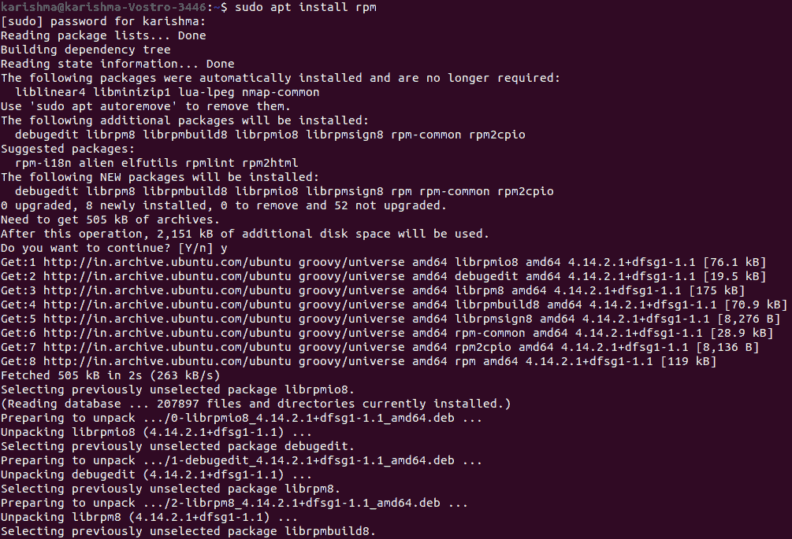
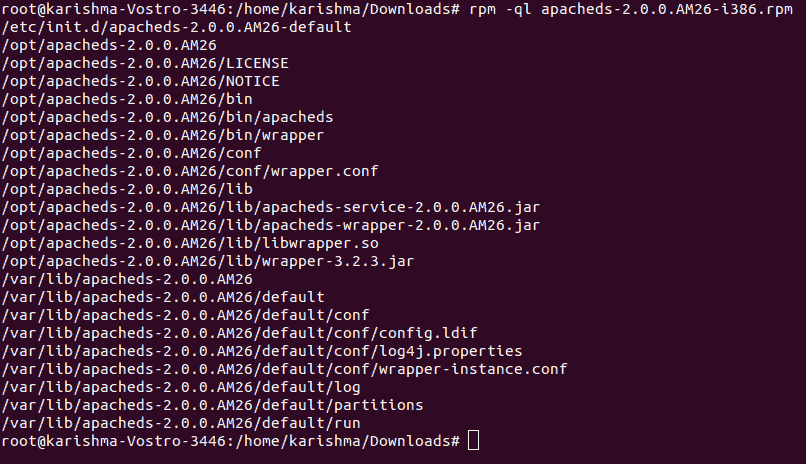
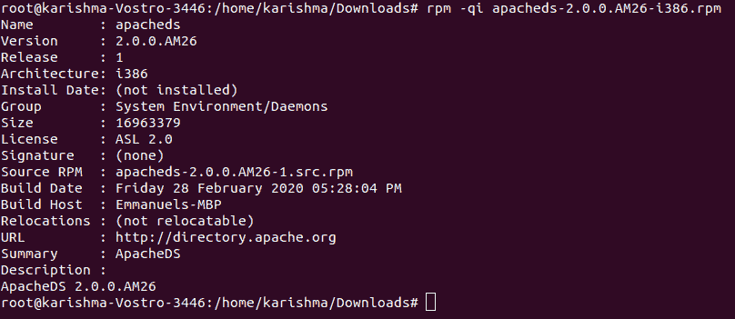
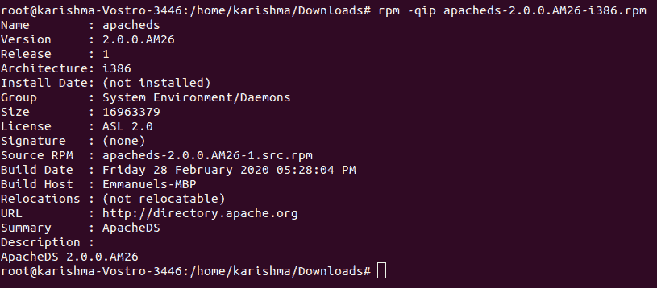
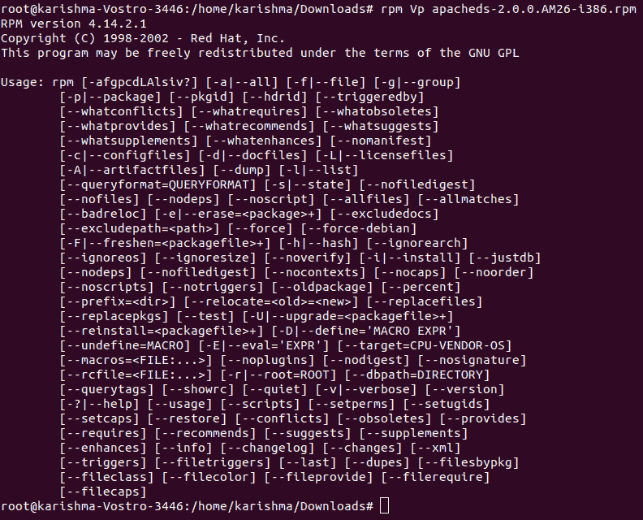

# Linux 中的每分钟转数命令

> 原文：<https://www.javatpoint.com/rpm-command-in-linux>

RPM 代表红帽包装经理。它是一个开源包管理器(默认)，也是基于红帽的系统(如 Fedora、CentOS 和 RHEL)最著名的包管理工具。该工具允许系统用户和管理员在 [Linux/UNIX](https://www.javatpoint.com/linux-tutorial) 操作系统中安装、更新、卸载、查询、验证和管理系统软件包。

以前，转速被称为。rpm 文件。它包含软件包所需的编译后的软件库和程序。它只实现在中创建的那些包。rpm 格式。

## 关于转速的几个事实

*   ***【红帽包管理器】*** 免费，发布在 ***GPL(通用公共许可证)上。***
*   RPM 是在 Linux 系统上安装软件包的单一方式。如果我们安装了任何带有源代码的包，RPM 将无法管理它。
*   RPM 将每个已安装软件包的详细信息保存在数据库中，即 ***/var/lib/rpm。*T3】**
*   RPM 处理所有的 ***。*rpm**文件。它包括包的实际细节，如 ***是什么，版本信息，依赖信息，从哪里来，*** 等。

## 转速指令的模式

1.  **安装:**该模式用于安装转速包。
2.  **移除:**用于擦除、移除或卸载转速包。
3.  **升级:**用于更新可用的 RPM 包。
4.  **验证:**该模式用于验证转速包。
5.  **查询:**该模式用于查询 RPM 包。

**在哪里搜索转速包**

以下是 rpm 站点的列表，我们可以在其中搜索和下载 RPM 包。

1.  [http://rpmfind.net](https://rpmfind.net/)
2.  [http://www.redhat.com](https://www.redhat.com/en)
3.  [http://freshrpms.net/](https://freshrpms.net/)
4.  [http://rpm.pbone.net/](http://rpm.pbone.net/)

#### 注意:在 Linux 中，请记住我们在安装 RPM 包时必须是超级用户。我们可以使用具有 root 权限的适当操作来管理 rpm 命令。

## 1.在 Linux 中安装 RPM

我们可以使用以下命令安装 RPM 包:

```

$ sudo apt install rpm

```



## 2.检查转速签名包

在我们的 Linux 系统上安装软件包之前，一定要检查它们的 PGP 签名，并确保它们的来源和完整性是 ***OK。*** 我们可以使用下面的命令使用一个选项，即 ***-checksig*** (代表 ***【检查签名】*** )来检查包裹的签名，这就是所谓的***Apache ds-2 . 0 . 0 . am26-i386 . rpm .***

```

# rpm --checksig apacheds-2.0.0.AM26-i386.rpm

```


## 3.安装前检查转速包依赖性

假设我们希望在升级或安装软件包之前检查 RPM 软件包的依赖性。**例如**我们可以使用下面的命令来检查一个包的依赖关系，即***Apache ds-2 . 0 . 0 . am26-i386 . rpm .***它将显示包依赖关系列表:

```

# rpm -qpR apacheds-2.0.0.AM26-i386.rpm

```


**在哪里，**

1.  **-q:** 用于查询任意包。
2.  **-p:** 用于列出该包赋予的功能。
3.  **-R:** 该选项用于列出包所依赖的功能。

## 4.安装没有依赖项的转速包

如果我们知道每个需要的包都已经安装好了，而 RPM 只是在装傻，那么在安装任何包之前，我们可以借助 ***-nodeps*** 选项(意味着没有依赖检查)来避免依赖。

该命令如下所示:

```

# rpm -ivh --nodeps apacheds-2.0.0.AM26-i386.rpm

```


强制地，上面的命令将通过避免依赖错误来安装 RPM 包。然而，当那些依赖文件丢失时，程序根本不会实现，直到我们安装它们。

## 5.检查转速包(已安装)

使用选项-q 和软件包名称将显示是否安装了 RPM 软件包。

命令如下:

```

# rpm -q apacheds-2.0.0.AM26-i386.rpm

```


## 6.列出已安装的转速包的每个文件

我们可以使用-ql 选项(查询列表)和 RPM 命令来查看已安装 RPM 包的每个文件。

命令如下:

```

# rpm -ql apacheds-2.0.0.AM26-i386.rpm

```



## 7.列出转速包(最近安装的)

我们可以用一个选项来应用 RPM 的以下命令，即 ***-qa(查询全部)。*** 该选项将列出最近安装的每个 RPM 软件包。

```

# rpm -qa --last

```

输出如下:


## 8.列出每个转速包(已安装)

我们可以使用下面的命令在我们的 Linux 系统上打印软件包(已安装)的每个名称。

```

# rpm -qa

```

输出如下:


## 9.移除转速包

例如，对于卸载或移除 RPM 包，我们可以使用包的名称***Apache ds-2 . 0 . 0 . AM26-i386 . RPM，*** 而不是包的真实名称***Apache ds-2 . 0 . 0 . 0 . AM26-i386 . RPM .***在下面的命令中，我们使用了一个选项，即 ***-e (erase)*** 来移除包。

```

# rpm -evv apacheds-2.0.0.AM26-i386.rpm

```

输出如下:


## 10.查询转速包(已安装)的详细信息

假设我们已经安装了任何转速包，我们希望知道该包的细节。下面的选项，即 ***-qi(查询信息)*** 将打印可用的已安装软件包的详细信息。

```

# rpm -qi apacheds-2.0.0.AM26-i386.rpm

```

输出如下:



## 11.安装前转速包的详细信息

我们已经使用互联网下载了任何软件包，我们希望在安装之前了解该软件包的详细信息。下方的-qip(查询信息包)选项将打印包的详细信息。

```

# rpm -qip apacheds-2.0.0.AM26-i386.rpm

```

输出如下:



## 12.验证转速包

验证任何软件包都会将软件包的已安装文件信息与转速数据进行比较。-Vp(验证包)选项用于验证包。

```

# rpm Vp apacheds-2.0.0.AM26-i386.rpm

```

输出如下:



## 13.列出每分钟转数的每个进口 GPG 键

我们可以使用以下命令在系统中对每个导入的 GPG 密钥进行加密。

```

$ sudo rpm -qa gpg-pubkey*

```

输出如下:


* * *