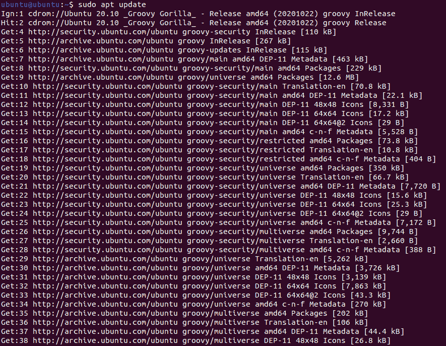
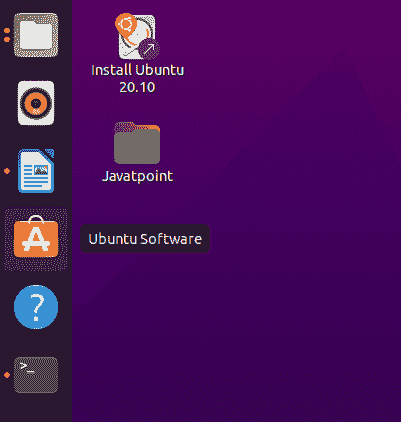
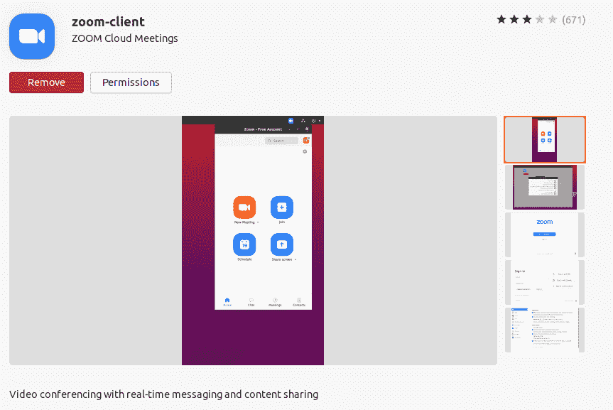

# Ubuntu 缩放

> 原文：<https://www.javatpoint.com/zoom-ubuntu>

在 Ubuntu 中， ***Zoom*** 是一个 ***会议*** 和 ***交流*** 平台，提供实时消息、数字内容分发、视频会议(基于云)。这个软件应用程序使我们能够管理会议，开放会议室，并为在线会议主持网络研讨会。

***Zoom*** 也可以定义为在 Linux、Android、Mac 和 Windows 系统上工作的跨平台视频会议工具。它允许用户加入和安排会议、视频会议并提供远程技术支持。

客户端在***【Fedora】【Ubuntu】***等各种 Linux 发行版上实现，安装方便。客户端不仅是开源软件，而且如果我们在 Zoom 上安排会议或参加 Zoom 电话会议，那么我们将希望安装该应用程序。

Zoom 解决方案跨 Mac、Windows、Zoom Rooms、Android、iOS 和 Linux 房间系统提供了出色的屏幕共享、音频和视频体验。

在本文中，我们将通过使用一些技巧来讨论***【Zoom】***在 Ubuntu 中的安装过程。

## 变焦的特点

缩放应用程序有一些重要的功能。这些功能如下所示:


1.  **高清音频和视频**
    Zoom 应用为我们的会议带来了高清音频和视频，同时支持 1000 多名视频参与者和 49 个屏幕视频。
2.  **精简日历**
    Zoom 应用程序支持使用 ***iCal、Gmail、*** 和 ***Outlook 启动和安排会议。***
3.  **协作工具(内置)**
    Zoom 应用程序提供了不止一个参与者，他们可以同时共享屏幕并为高度互动的会议进行共同注释。
4.  **安全会面**
    Zoom 应用程序为每次会议提供加密、安排与会者(待命)、等候室、密码保护和基于角色的用户安全。
5.  **记录和记录**
    在本地，我们可以记录我们的会议，或者与可搜索的记录一起上传到云上。
6.  **团队聊天**
    可搜索历史，与团体聊天，十年档案，开发文件共享。轻松升级为小组电话或 1:1。

## 技术 1:使用终端/控制台窗口

我们需要首先检查我们的麦克风和网络摄像头，因为*软件应用程序依赖于这些类型的外围设备。*

 *### 1.更新和升级

首先，一如既往地更新我们的 APT。打开 Ubuntu 桌面上的命令行窗口，输入下面提到的命令:

```

$ sudo apt update

```



```

$ sudo apt upgrade

```


### 2.安装缩放客户端

在我们的命令行窗口中运行以下命令来安装缩放客户端。系统会提示我们输入密码，因为安装过程需要 root 权限。

```

$ sudo snap install zoom-client

```


使用上述命令后， ***Zoom 客户端应用程序*** 将通过 Ubuntu 软件仓库下载安装。

### 3.启动缩放

在我们的命令行窗口中运行以下命令，开始使用 ***【缩放】*** 应用程序。

```

$ zoom-client

```


## 技术 2:使用 Ubuntu 软件中心

我们现在将解释通过图形用户界面技术安装缩放。

1.  **打开 Ubuntu 软件中心**
    在桌面按下 ***活动*** 图标，在搜索栏输入 ***软件*** 并选中。
    
2.  **在软件中心**
    内找到缩放在搜索栏中，在软件中心输入 ***缩放*** 并选择。
    
3.  **安装 Zoom App**
    按下 ***【安装】*** 按钮，应用程序开始安装。
4.  **启动 Zoom App**
    安装完成后，按 ***【启动】*** 按钮开始 Zoom 客户端。
5.  缩放已准备就绪。
    

## 技术 3

Ubuntu 的存储库中不包含 Zoom，它也不是一个开源工具。我们将使用 Ubuntu 的 APT 库安装*应用程序。*

 *我们需要以超级用户或具有根用户权限的用户的身份执行以下步骤，以便在我们的 Ubuntu 系统上安装 Zoom。

**1。**打开命令行窗口，输入一个命令，即***【wget】***下载 Zoom 当前 deb 包。该命令如下所述:

```

$ wget https://zoom.us/client/latest/zoom_amd64.deb

```


**2。**下载过程完成后，以具有 root 权限的用户身份执行命令，安装 Zoom 应用程序。该命令如下所述:

```

$ sudo apt install ./zoom_amd64.deb

```

我们将被要求输入密码。

## 如何卸载 Zoom 应用程序？

如果我们希望卸载或删除缩放应用程序，我们需要打开命令行窗口并输入以下命令:

```

$ sudo apt remove zoom

```

上述命令将卸载或删除缩放应用程序。

* * ***