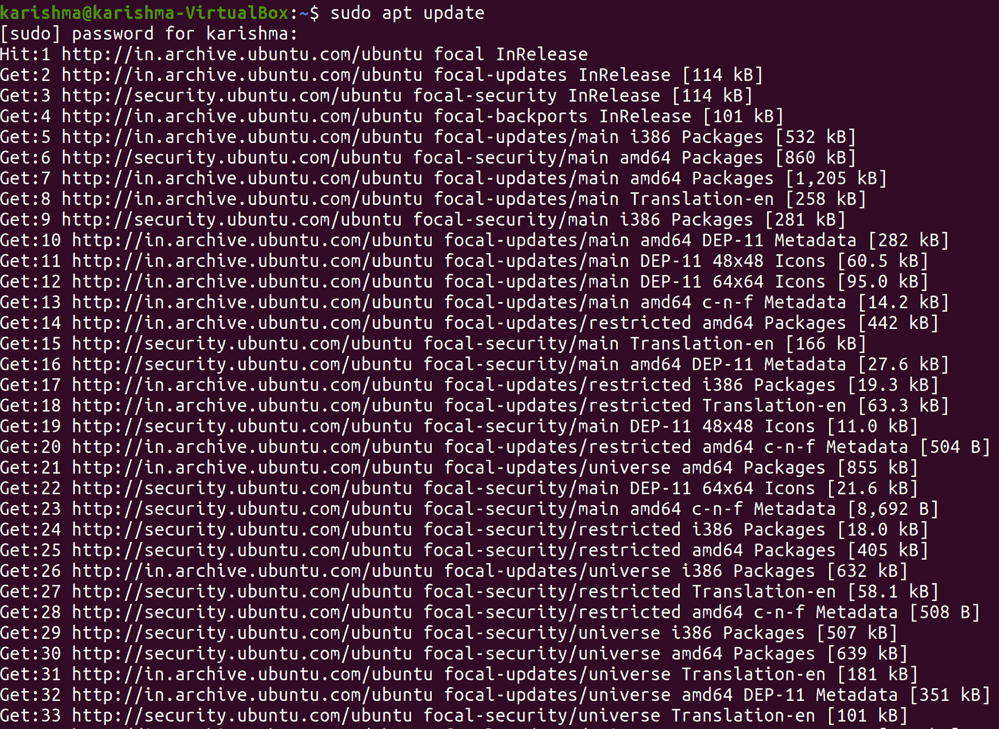
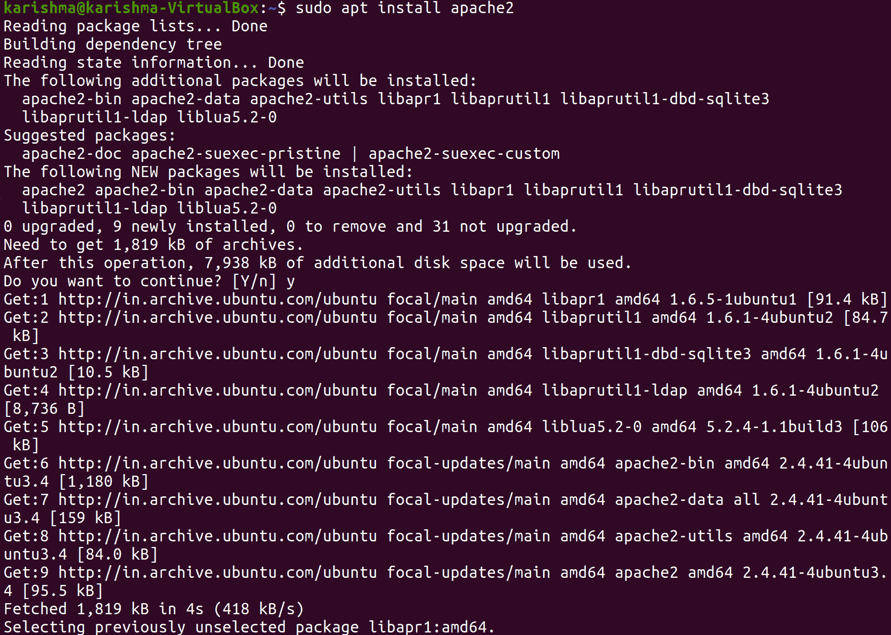
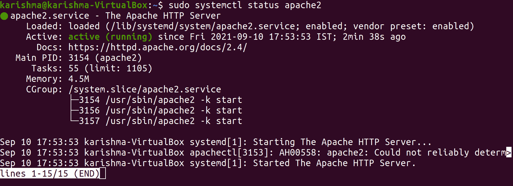
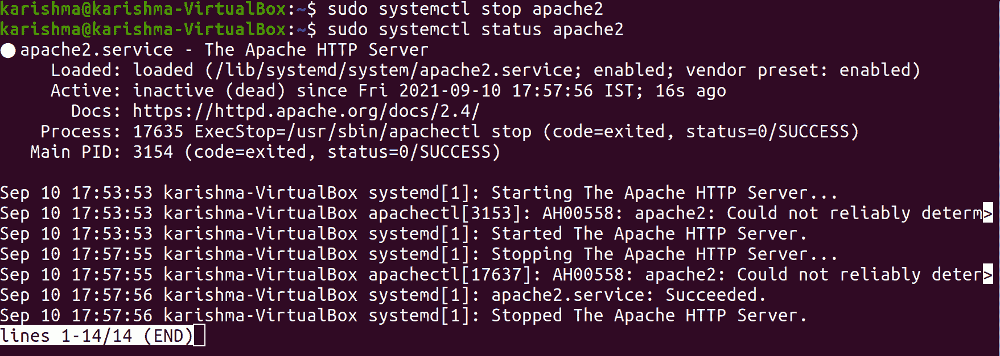
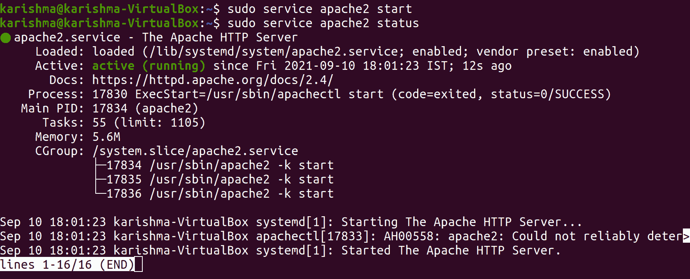

# 重启 Apache Ubuntu

> 原文：<https://www.javatpoint.com/restart-apache-ubuntu>

## 介绍

***【Apache】***可以定义为著名的 ***LAMP*** (简称 ***Linux、Apache、MySQL、PHP*** )软件栈的一部分。默认情况下，它包含在当前版本的 Ubuntu 18.04 中。

本文将向我们展示如何使用 Ubuntu 上的终端启动、重启和停止 Apache 服务。

首先， ***【阿帕奇】*** 用于在 ***WWW 上同时服务 ***动态网页*** 和 ***静态内容*** 。*** 各种各样的网络应用程序都是在期待 Apache 提供的特性和环境的情况下创建的。

我们可以使用以下技术之一在 Ubuntu 上重新启动、启动或停止我们的 httpd (Apache)服务器:

1.  **systemctl 命令:**此命令仅在 ***基于 systemd 的 Ubuntu*** 上有效，如 ***16.04 LTS*** 版及以上版本。
2.  **/etc/init.d/apache2 命令:**是在***【Ubuntu】***或 ***Debian*** Linux 下启动、停止或重启 ***Apache2*** 服务的 sys v init 格式脚本。
3.  **服务命令:**它在几乎所有的 Linux 发行版中都可以工作，包括 Ubuntu 和 Debian。
4.  **暴发户命令:**这个命令只对某些特定版本的 Ubuntu 有效。
5.  **apache2ctl 命令:**这个命令应该在每个类似 Unix 和 Linux 的操作系统上运行。

## 先决条件

*   拥有用户帐户以及 root 或 sudo 权限
*   已配置和安装的 Apache 安装
*   默认情况下，包含 apt 包管理器
*   终端/命令行窗口

## 在 Ubuntu 上安装 Apache2

我们可以使用以下命令在我们的 Ubuntu 计算机上下载或安装 Apache2 服务。

首先，我们需要使用下面的命令更新我们的系统:

```

$ sudo apt update

```



更新系统后，我们需要运行以下命令:

```

$ sudo apt install apache2

```



## 针对新的 Ubuntu 版本启动、重启或停止 Apache Web 服务器的命令

### 启动 Apache 服务器

我们可以为使用 18.04 和 16.04 版本的 Ubuntu 用户以及其他基于 Debian 的用户使用一个命令。该命令将在命令行窗口中用于启动 Apache。该命令如下所述:

```

$ sudo systemctl start apache2

```


我们还可以使用以下命令查看 Apache 是否已启用的状态:

```

$ sudo systemctl status apache2

```



以上命令将显示 ***活动(运行)*** 消息，如果它正在运行。

### 停止 Apache 服务器

我们可以使用一个命令来停止 Apache 服务器。该命令如下所述:

```

$ sudo systemctl stop apache2

```

我们还可以使用以下命令查看 Apache 是否已被禁用的状态:

```

$ sudo systemctl status apache2

```



如果停止运行或禁用，上述命令将显示 ***【无效(无效)*** 消息。

### 重新启动 Apache 服务器

我们可以在终端窗口中使用一个命令来重启 Apache 服务器。该命令如下所述:

```

$ sudo systemctl restart apache2

```

如果 Apache 以前被禁用，上面的命令将显示它已启动并再次运行。

```

$ sudo systemctl status apache2

```


## 用于启动、重启或停止旧版 Ubuntu 的 Apache Web 服务器的命令

### 启动 Apache 服务器

我们可以在终端窗口中使用一个命令，为使用旧版本的 Debian 和 Ubuntu 用户启动 Apache 服务器。该命令如下所述:

```

$ sudo /etc/init.d/apache2 start

```

或者，

```

$ sudo service apache2 start

```

我们还可以使用以下命令查看 Apache 是否已启用的状态:

```

$ sudo /etc/init.d/apache2 status

```

或者，

```

$ sudo service apache2 status

```



上面的命令应该显示 ***活动(运行)*** 消息，如果它正在运行。

### 停止 Apache 服务器

我们可以使用一个命令来停止 Apache 服务器。该命令如下所述:

```

$ sudo /etc/init.d/apache2 stop

```

或者，

```

$ sudo service apache2 stop

```

我们还可以使用以下命令查看 Apache 是否已被禁用的状态:

```

$ sudo /etc/init.d/apache2 status

```


如果停止运行或禁用，上述命令应显示 ***【非活动(死亡)*** 消息。

### 重新启动 Apache 服务器

我们可以在终端窗口中使用一个命令来重启 Apache 服务器。该命令如下所述:

```

$ sudo /etc/init.d/apache2 restart

```

或者，

```

$ sudo service apache2 restart
$ sudo service apache2 status

```


**重要提示:命令即重启可能需要很多时间才能完成。这取决于我们服务器配置的复杂性。如果我们运行复杂或大型的服务器配置，它可能会导致依赖服务器的各种用户中断。**

* * *