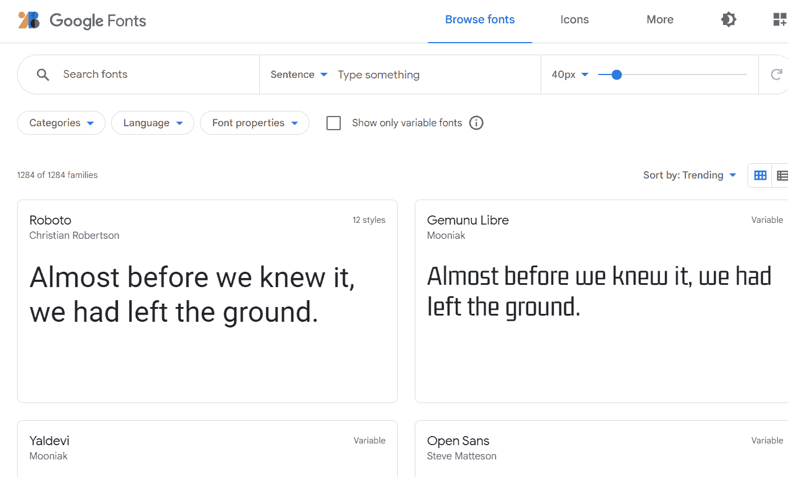
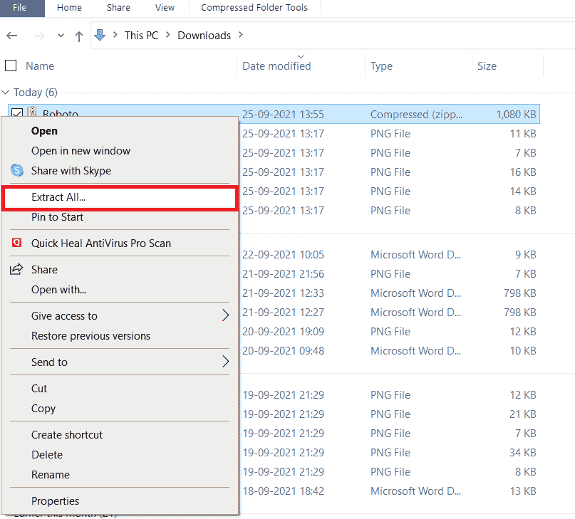
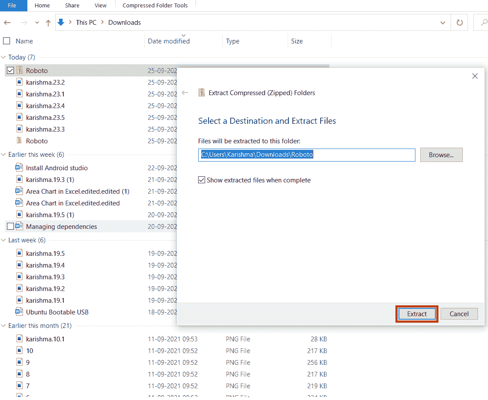
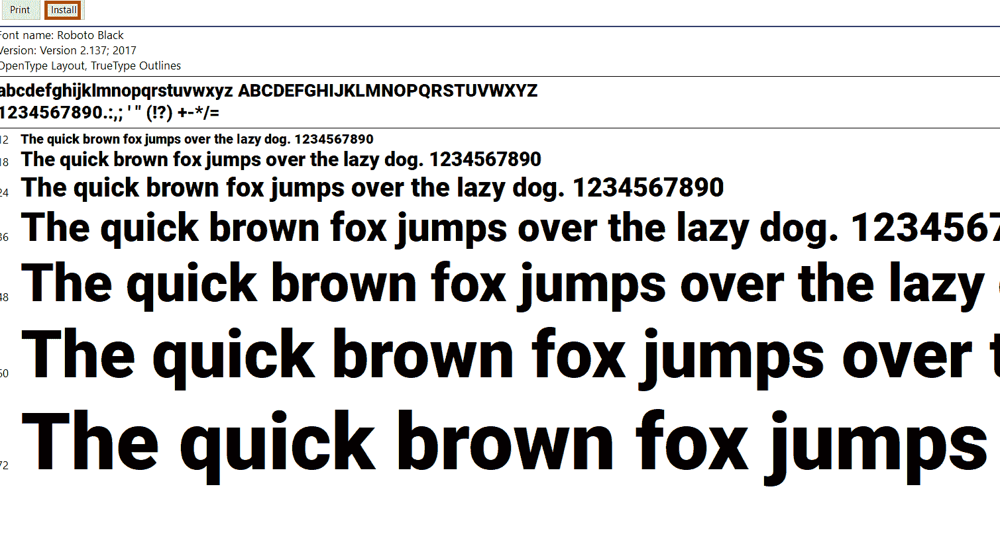
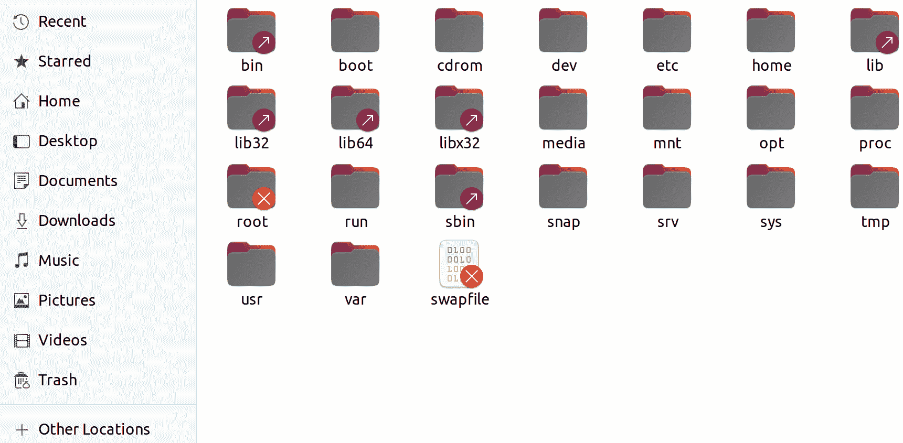
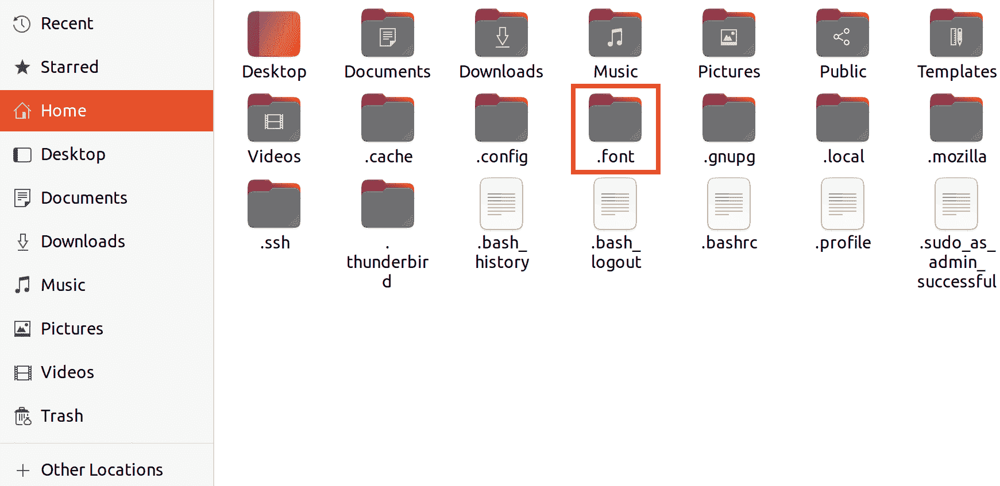

# Ubuntu 字体

> 哎哎哎:# t0]https://www . javatppoint . com/Ubuntu-font

Ubuntu 是一个基于 Open-type 的字体家族，由 foundry***Dalton Maag***(基于伦敦的类型)和 Canonical Ltd .提供的资金设计成一种人文风格的现代字体。近段时间，该字体处于开发阶段 9 个月，从测试版软件程序到 2010 年 9 月只有有限的初始版本。

然后，它成为了 Ubuntu 10.10 版本中 Ubuntu 操作系统的默认字体。Ubuntu 字体的设计者包括投石机 MS 字体、漫画 Sans 创作者和 Vincent Connare。

#### 注意:Ubuntu 的字体系列是根据 Ubuntu 字体许可证授权的。

Ubuntu 的字体系列是 2010-2011 年期间开发的匹配新 open/libre 字体的集合。这项开发由 Canonical Ltd 资助，以支持 Ubuntu 项目和大型自由软件社区。字体的技术实现和工作由 ***道尔顿马格完成。*T3】**

最终字体设计文件和用于制作字体系列的 OpenType/TrueType 文件在开放许可协议中共享，我们鼓励改进、共享、修改和实验。

Ubuntu 的新字体系列是为了让所有菜单、对话框和按钮都能感受到 Ubuntu 的个性而开始的。无衬线字体使用*字体，为了清晰起见，它在电脑的移动和桌面屏幕上被手动引用。*

 *Ubuntu 字体系列的范围包含了 Ubuntu 的几个用户在世界上使用的每一种语言，Ubuntu 的理念是所有用户都可以用他们想要的语言使用他们的程序。因此，Ubuntu 字体系列的项目将增加，以覆盖许多其他书面语言。

#### 注:Canonical 和 Ubuntu 是 Canonical Ltd 的注册商标。

## Ubuntu 字体的特点和历史

这种字体最初是在 2010 年 10 月随着 Ubuntu 10.10 版本的发布而推出的，有四个不同的版本，如英语中的 ***【粗体斜体】【粗体】【斜体】*** 和 ***【常规】******。*** 扩展语言和附加字体的覆盖范围是在 2011 年 4 月 Ubuntu 11.04 版本发布时引入的。建议最终开发包括总共 13 种字体，包括:

1.  乌班图浓缩在只有 ***有规律。*T3】**
2.  ***中的 Ubuntu 中斜体，常规。*T3】**
3.  ***中的乌班图灯斜体，常规。*T3】**
4.  ***中的 Ubuntu Monospace 加粗斜体、加粗、斜体、*** 和 ***常规。***
5.  **中的 Ubuntu*粗斜体、粗体、斜体、*中的**和**中的*常规。***

最初，monospace 版本(用于终端)计划与 11.04 版本的 Ubuntu 一起发货。尽管如此，它还是被推迟了，而是以 11.10 版本的 Ubuntu 作为系统等宽字体(默认)。

字体完全符合*Unicode，包括扩展字符的拉丁 B 和 A 集、 ***西里尔扩展、*** 和 ***希腊语多音字。****

 *除了包含印度卢比的符号之外，它已经成为最初的原生操作系统字体。该字体主要设计用于屏幕显示，其字距和间距针对正文的大小进行了优化。

## Ubuntu 字体的用法

Ubuntu 的字体系列是 Ubuntu 操作系统开发和当前版本的字体(默认)，用于 Ubuntu 的项目品牌推广。

Ubuntu 的字体系列已经被添加到 ***【谷歌字体】*** 的目录中，使其很容易用于 ***网页排版。*** 新增自 2011 年 4 月 26 日起在 ***谷歌文档*** 内使用。

突出的是， ***Ubuntu 单体*** 被用于 ***晶体管电子游戏(2014)。*** 此外， ***比特币*** 的 logo 中使用了 Ubuntu 粗斜体，符号为 ***比特币。***

## Ubuntu 字体许可证

Ubuntu Font 的许可证是一个许可证，即 ***【临时】*** ，是为 Ubuntu 字体家族设计的，Ubuntu 从 0.68 版本就应用了这个许可证。本许可证基于 ***SIL 开放字体许可证。***

Ubuntu 字体许可证允许字体按照许可证条款自由地重新分发、修改、研究和使用。该许可证可以被描述为版权所有，每一个衍生作品都应该在类似的许可证下共享。使用字体，文档不需要获得 Ubuntu 的字体许可。

***【Debian】******【Fedora】***已经审核了许可，集中在修改权限和暧昧使用上。

### 1.0 版本

### 序文

本许可证允许自由地重新分发、修改、研究和使用许可字体。如果本许可证的条款和条件相匹配，包含衍生工具的字体可以重新分发、嵌入和捆绑。但是，衍生产品和字体不能在其他许可下发布。对于字体，这种保留在本许可证上的要求不需要任何使用本许可证下发布的字体或衍生字体制作的文档，只要该文档的主要目标不是分发字体。

## 设计师

***Dalton Maag*** 是一家专业(国际)从事数字字体及字体设计生产的字体代工企业。该企业于 1991 年由 ***【布鲁诺·马格(瑞士印刷工)*** 在**检测出，多年来发展成为世界上最著名的铸造企业。**

拥有一个来自十八个国家的多元文化和跨国集团，道尔顿·马格(Dalton Maag)的客户遍及工业的各个领域，拥有几个世界上最受认可的品牌。

## 定义

与 Ubuntu 字体相关的一些重要定义解释如下:

*   ***【字体软件】*** 定义了版权所有者在许可证上发布的文件组，并明确标记为这样。它可能包含文档、构建脚本和源文件。
*   ***【原始版本】*** 定义了在本许可证下收到的字体软件的组件集。
*   ***【修改版本】*** 定义了通过修改格式或将字体软件运送到全新的环境中来添加、替换或删除原始版本的全部或部分组件而创建的任何衍生版本。
*   ***【版权所有者】*** 定义了每一个拥有字体软件版权的公司和个人。
*   ***【实质性变更】*** 定义了变更版本，通过字体软件的用户将修改版本测量为原始版本，可以很容易地识别为与字体软件不同。
*   对于 ***【传播】*** 一个作品定义了未经许可使用它做任何事情将使我们对违反适用的版权法负次要和直接的责任，除了在系统上运行它或改变私人副本。

除此之外，传播还包括分发(有或没有改变，有或没有收取再分发费用)、复制和向公众以及少数企业提供其他任务。

## 条件和权限

本许可证不授予商标法规定的权利，所有权利都是保留的。

因此，为了传播字体软件，获得字体软件副本的人可以免费获得许可，但需满足以下条件:

1.  每个字体软件副本都应该有上面提到的许可证和版权声明。这些可以作为机器可读元数据、人类可读标题的精确字段，或者二进制或文本文件中的独立文本文件，只要用户可以轻松查看这些字段。
2.  字体名称满足以下条件:
    1.  原始版本应保留其未修改的名称。
    2.  实质性变更的修改版本应完全更名，以避免使用类似名称或原始版本的名称。
    3.  未发生实质性变化的修改版本应重命名为:
        1.  保留原始版本名称，并
        2.  包括使用原始版本区分修改版本的附加命名元素。这样的修改版本名应该是原版本名，加上***【X 衍生】*** ，其中 X 表示新作品名，附在名称之后。
3.  版权所有者名称和字体软件贡献者不得用于宣传、认可或推广修改版本，不包括:
    1.  根据本许可证的需要
    2.  感谢版权所有者贡献者
    3.  明确使用他们的书面许可。
4.  字体软件(未修改或已修改)的全部或部分应在本许可证下完全分发，不应在其他许可证下分发。

对于字体，保留在许可证下的要求不影响使用字体软件制作的文档，不包括使用字体软件制作的文档提取的任何字体软件版本，这些版本可能仅在本许可证下分发。

## 结束

当上述任何条件不匹配时，许可证无效。

## Ubuntu 字体许可的更多信息

目前，Ubuntu 的字体系列是在 Ubuntu 的字体许可证上发布的。这意味着我们可以像使用其他字体一样使用这些字体(*或 ***打开*** )。*

 *开放定义了长期，换句话说，字体可以继续改进，因为字体的设计文件(原始源代码)已经存在于相关人员手中。

欢迎所有用户在我们的文档、公司文具、徽标或图形设计中使用 Ubuntu 字体系列。

## 对于那些想要扩展或改变 Ubuntu 字体的人来说

当前 1.0 版本的 ***Ubuntu 字体许可证*** 的灵感来源于 1.1 版本的 ***SIL 开放字体许可证。*** 使用***【Ubuntu 字体许可】*** 的 ***1.0 版本*** 是一个临时解决方案，随着未来替代许可的存在，许可选择可能会发生变化。

#### 注意:SIL 开放字体许可证和 Ubuntu 字体许可证并不完全相同，不应该与这两者混淆。

要在 Ubuntu 字体许可证上准确许可我们字体的衍生版本，我们应该:

*   将我们的版权信息添加到我们文件树顶部的 copyright.txt 中的专用占位符中，并以此树中添加的示例为模型。
*   使用此树添加 ubuntu-font-license-1.0.txt 副本。
*   使用准确填写在文件顶部的占位符输入带 copyright.txt 的文本，以明确这些文件的许可和所有权。在源和对象中，字体都有许多用于保存许可证和作者信息的专用元数据字段。我们应该用这些来包含相应的信息。

## 在 Ubuntu 和其他 Linux 发行版上安装新字体

Ubuntu 提供了默认情况下可以安装在其中的字体集合。然而，有时我们可能对系统中已经有的字体不满意。如果是这样的话，我们可以在 Ubuntu OS 或者任何其他发行版的 Linux 上安装其他字体，比如 ***Linux Mint。*T3】**

### 在 Ubuntu 上安装新字体

通常字体有 ***【打开类型】*** (简称 ***(OTF)*** 和 ***真类型(TTF)*** 格式的文件。我们可以在 Ubuntu 中安装或使用***【OTF】***或 ***TTF*** 。

### 步骤 1:下载字体

我们需要首先下载我们想要使用的字体。我们可以在 ***谷歌字体网站上获得一些免费提供的字体。*** 同样，我们可以在 ***字体松鼠*** 或 ***丢失字体处找到字体。***

### 步骤 2:安装新字体

通常字体是我们从网站上下载的 ***zip 格式*** 字体。我们可以在 Ubuntu 中提取字体 zip 文件，方法是右键单击该文件，然后选择 ***提取*** 选项。

我们现在需要转到提取的文件夹，找到 ***。*** 或**T5。ttf (TrueType Fonts)** 文件。

我们只需要双击那个字体文件。系统将在 ***字体查看器应用*** 中打开该文件。我们可以在右上角看到 ***【安装】*** 字体的选项。

我们不会像安装应用一样找到正在安装的任何东西。几秒钟后我们会发现状态已经修改为 ***【已安装】*** 。现在，没有奖品来猜测我们的字体已经成功安装。

我们可以在安装后使用***【Pinta】【GIMP】***等字体的应用中看到安装的字体。

## 在 Ubuntu 中一次安装多种字体

这是上述步骤的替代方案。假设我们有 10 种新字体要安装。但是，通过逐个双击来安装每种字体是不方便和麻烦的。

我们只需要做一个目录，即 ***。字体*** 如果在我们的 ***主目录*** 中没有，用于在我们的系统中一次安装多种字体。

### 第一步:制作。主目录中的字体目录

*   我们需要进入我们的 ***主目录。*T3】**
*   按快捷键 ***Ctrl+H*** 显示 Linux Ubuntu 中的隐藏文件。
    
*   我们需要右键单击创建一个新文件夹并命名该文件夹 ***.font.***
    

#### 注意:在开始时，点(。)至关重要。如果我们在文件名前加一个点，它会在 Linux 的普通视图中隐藏我们的文件。

### 第二步:将字体文件放入目录

我们需要复制我们的字体文件，并将这些文件粘贴到目录中，即 ***。字体*** 我们在上面的步骤中已经制作好了。我们不需要做任何其他事情。现在，这些字体可供我们使用，我们可以随时使用它们。

* * ****