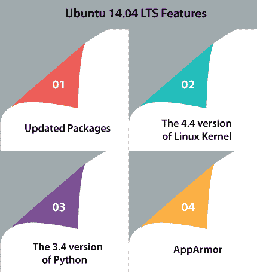
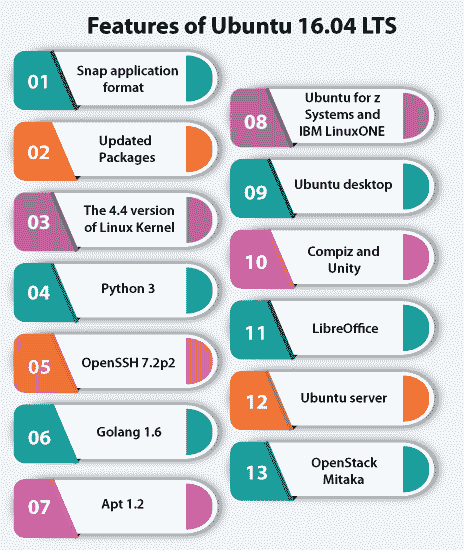
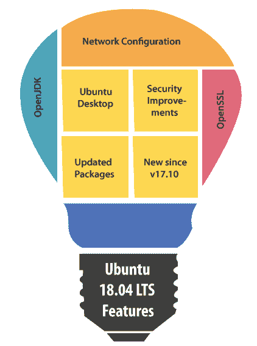

# ubuntu lts

> 吴奇珍:t0]https://www . javatppoint . com/Ubuntu-lt；

**LTS** 是**【长期支持】**的简称。支持意味着在发布期间，有更新补丁和维护软件的承诺。有一个精确的开发周期，在这个周期中，贡献者和工程师添加到发布主体中。

一个更长的测试周期，更多的错误修复和测试集中在发行版的稳定性和性能上。如果没有 LTS，该软件可能会成为安全隐患。漏洞会随着时间的推移而改进，并且随着时间的推移，系统会变得越来越不完善。

此外，如果用户附加一个相似的版本太久，用户的系统将开始落后。开发向前推进，而一些关键方面偶尔会回到以前的版本。

Ubuntu 开发者每六个月生产一个全新的 Ubuntu 服务器和 Ubuntu 桌面版本。这意味着我们将永远拥有开源世界必须提供的最伟大和最新的应用。Ubuntu 操作系统是安全创建的。我们在服务器和桌面上获得 9 个月(至少)的免费安全更新。

*   新的长期支持版本每两年发布一次。
*   LTS 版本(长期支持)在 12.04 LTS 版本的 Ubuntu 上有 3 年的支持，在以前的版本中在 Ubuntu 服务器上有 5 年的支持。
*   从 12.04 LTS 版的 Ubuntu 开始，这两个版本都获得了 5 年的支持。
*   Ubuntu 以类似的免费条款为每个人提供最好的作品，LTS 版本不收取其他费用。
*   Ubuntu 新版本的升级总是免费的。
*   LTS 的名称仅用于某些特定的 Ubuntu 档案子集。LTS 可能不会使用 Ubuntu 的所有混音和风格。
*   例如，对于 8.04 LTS 版本， **Kubuntu** 选择移动到 4.0 版本的 **KDE** ，并且没有发布 LTS 版本。在 10.04 版本中，**上网本版本**不是 LTS 版本。在 LTS 的开发周期早期，该项目将确定哪些口味是 LTS 口味，以及对所有口味的支持持续时间。

## 什么是 LTS 版本？

Ubuntu 的 LTS 是**规范**对支持和维护 Ubuntu 版本 5 年的承诺。Canonical 发布了一个全新的 LTS，其中两年的每一个开发都获得了最新的**版本**和**功能丰富的**版本。

这些版本专注于稳定性和性能增强。LTS 是 Ubuntu 向大型企业、企业和普通用户提出的建议。

然而，在这两年中，动态用户每六个月就会有一次开发者发布。这些版本保持相关和最新，有最大和最新的贡献者，但一次只支持 9 个月。

无论我们是跨国公司、中小企业还是个人用户，可靠性都很重要。Ubuntu 的重点是维护**安全、信任**和**可靠性**。得到 5 年支持的第一个 Ubuntu LTS 就是 12.04 版本的 Ubuntu。从那以后，Ubuntu 的发布保持了类似的两年节奏。

这是指出命名惯例的好地方。

不管是开发者版本还是 LTS 版本，命名惯例都是以路径和年份为导向的，无论是 10 月还是 4 月的版本。即将发布的版本将于 2020 年 10 月发布，被称为 20.10 版本。

此外，LTS 是一个照亮乌班图社区的机会。数百万开发者的贡献汇集成一个版本，建议用户在未来许多年内使用。

Ubuntu 中足够多的社区信仰是各种官方 Ubuntu 风格，它们的成功依赖于不断的发展。这种信任是双向的，所有的版本都发布一个 LTS，类似的版本都通过了完整的 Ubuntu 档案和 Ubuntu 发行版的更新和打包。

## 发布的计划细节

1.  Ubuntu 的开发人员很早就开始通过显著限制新功能的范围来稳定版本。他们将选择将哪个功能打包到 LTS 版本中，然后选择哪个功能，并允许用户从隔离的归档中随意下载和使用。
2.  尽可能忽略结构修改，例如修改应用程序的默认组、几个库转换和系统层修改。
    此外，他们指定一个 LTS 为:并明确定义它不是:
    1.  **与新硬件的兼容性:** Ubuntu 将在开发周期内建立点版本，为桌面硬件和新服务器提供功能支持。
    2.  **专注于企业:** Ubuntu 的目标是多个桌面和服务器安装，其中普通用户适度规避风险。
    3.  **更多测试:** Ubuntu 将最小化开发窗口，最大化 Beta 周期，以允许更多的 bug 修复和测试。and clearly define that it's not:
3.  **前沿:**从 14.04 LTS 版的开发周期开始，从 Debian unstable 实现自动完整包导入。这是因为在 Ubuntu 档案中使用了**提议的移动**。
4.  **基于功能的版本:** Ubuntu 将专注于明确可用功能的功能，而不是定义新功能，不包括桌面体验和在线服务领域。
    1.  首选项目的例外情况将被记录在案。
    2.  由于这两个开发领域相对较新，它们仍然需要新的特性来满足其创建的原始原因。

## Ubuntu LTS 发布

Ubuntu 的一些 LTS 版本如下所示:

### Ubuntu 14.04

ubuntu 的 14.04 LTS 将支持五年 **Ubuntu 麒麟、Eubuntu、Kubuntu、Ubuntu 核心、Ubuntu 服务器、**和 **Ubuntu 桌面**。所有其他口味将支持三年。

### Ubuntu 14.04 LTS 特色

默认情况下，14.04.5 点版本将附带一个 **X 堆栈**和**更新内核**，以支持 LTS 现有版本上更广泛的硬件。这个新的硬件支持堆栈将由 16.04 版本的 **X 堆栈**和**内核**(**Xenial**)组成。

那些运行云或虚拟映像的应用程序不应该需要这个新的硬件支持堆栈，因此建议它们在实际的 Trusty 堆栈上继续运行。有一些选项可以保留在实际的 Trusty 堆栈上。

使用以前的 14.04.1 或 14.04.0 点更新和版本进行安装。

以前的 14.04.1 或 14.04.0 版本可以在[http://old-releases.ubuntu.com/](http://old-releases.ubuntu.com/)存档

通过 Ubuntu 的早期版本对 Trusty 进行升级和更新。那些使用 14.04.02 点介质安装的用户，默认情况下，新用户会自动收到一个新的硬件支持堆栈。使用**网络引导映像**而不是**新的 xenial-网络引导、willy-网络引导、living-网络引导**或**自动网络引导映像**实施网络安装。

**1。更新包**

与所有新版本一样，各种类型和软件包应用程序的软件都在快速更新。这些包中有几个是从 Debian 不稳定分支的自动同步延续而来的，其他的已经被明确地拉进了 Ubuntu 的 14.04 LTS。

**2。4.4 版 Linux 内核**

默认情况下，14.04.5 点版本将附带匹配的 X.org 堆栈和 16.04 版本的 Ubuntu 的新的 4.4 版本的 Linux 内核。它基于扩展的上游稳定内核 4.4.0 版本。在 14.04.5 版本中提供新内核的目的是为了硬件支持。

**3。Python 的 3.4 版本**

最终，我们打算只运送 Python 3 和 Ubuntu 的桌面映像，而不是 Python 2。Ubuntu 的 14.04 LTS 映像就经历了这个过程。然而，对于 14.04 LTS 版本的 Ubuntu，我们可以将所有内容转换成 Python 3。

如果我们有基于 ***Python 2*** 的程序。

但是，Python 2 将在未来的某个时候继续可用(就像 Python 包一样)。尽管如此，我们必须考虑将我们的代码移植到***【Python 3】***中，以便最好地支持 Ubuntu 的未来版本。

**4 .申明〔t1〕**

*   它在 14.04 LTS 版本的 Ubuntu 中有几个特性。
*   它支持信号的细粒度中介。
*   它支持 ptrace 细粒度中介。
*   它改进了 DBus 调解。
*   它为运行在 Unity 上的许多应用程序提供了更新的抽象。
*   它有各种新的可调参数，支持 dovecot、XDG 用户目录等。
*   它有几个支持错误修复和新功能的策略更新。
*   它有一个新变量，即，@{profile_name}用于引用策略中的最新配置文件名称。
*   apparemor 有新的 Python3 和 Python 库(Python 3-apparemor 和 Python-apparemor)。

AppArmor 的策略已经适应了许多包，这些包可以通过这些修改来运送它。但是，可能需要适应本地政策，尤其是 ptrace 和信号规则。

## Ubuntu 16.04 lt

**简介**

Ubuntu 的 16.04 LTS 版本将支持 Ubuntu 麒麟、Ubuntu 核心、Ubuntu 服务器和 Ubuntu 桌面五年。每种口味都可以支持三年。

### Ubuntu 16.04 LTS 的特色

*   **Snap 应用格式**
    16.04 LTS 版的 Ubuntu 定义了一个新的应用格式，即***【Snap】***。它可以用传统的 deb 包来安装。这两种打包格式非常舒适地毗邻共存，使 Ubuntu 能够维护其现有的更新和开发流程。
*   **更新的软件包**
    各种类型的软件和软件包应用程序都在快速更新和升级，就像所有新版本一样。这些包中有几个是从 Debian 的不稳定分支延续下来的，其他的已经被明确引入到 16.04 版本的 Ubuntu 中。
*   **Linux 内核的 4.4 版本**
    16.04 LTS 版的 Ubuntu 是在长期支持的 Linux 4.4 系列版本的基础上工作的。
*   **Python 3**
    默认情况下，Python 2 不再安装在触控、云或服务器映像上。Python 3 版本本身已经更新为 3.5 系列。如果我们有基于这个版本的程序，也就是 Python 2，那么 Python 2 将会在未来的某一天继续可用(就像 Python 包一样)。虽然，为了最好地支持 Ubuntu 的未来版本，我们应该尝试将我们的代码移植到 Python 3。
*   **OpenSSH 7.2p 2**
    OpenSSH 的最新版本禁用了各种不安全、遗留和/或弱加密技术。如果我们通过 SSH 远程升级任何系统，那么我们应该看到我们不依赖这些来确保我们将在过程升级后继续访问。
*   **Golang 1.6**
    ***Golang***的工具链更新为 1.6 系列， ***gccgo*** 更新为 GCC 6.1 的发布候选 1。因此，在每个完全受支持的体系结构上，这两个编译器都给出了相似级别的标准编译器和库特性。
*   **Apt 1.2**
    1.2 版本的 Apt 包含了 1.1 版本 Apt 中引入的新的权限分离特性。重要的是，非特权“_apt”的用户现在被用于为输出网络建立连接，并解析几种传输方法(如 FTP、HTTPS、HTTP 等)的结果。
*   **适用于 z Systems 和 IBM LinuxONE 的 Ubuntu**
    16.04 版本的 Ubuntu 包含了一个较新的适用于 IBM 大型机的端口到 z/架构 64 位。实际上，它是一个完整的云和 Ubuntu 服务器端口，以及 95%二进制包的可用性。
*   **Ubuntu 桌面**
    桌面上 16.04 版本的基本主题是增量质量改进和 bug 修复。
    *   **通用**
        *   大部分情况下，GNOME 升级到版本，即 3.18。GLib 更新到 2.48(与 GNOME 3.20 相关)。
        *   移植到应用 WebKit 2 的所有默认库和应用程序。
        *   现在，默认情况下包含了 GNOME 日历。
        *   铬升级到 48 版本。
        *   Brasero 和移情会从默认安装中删除。
*   **Compiz 和 Unity**
    *   改进启动器与设备和文件管理器的集成
    *   gtk 与 headerbars 应用程序的集成支持
    *   支持使用快速列表格式化可移动设备
    *   超级+Ctrl+W 激活应用传播
    *   对 GNOME 按键抓取的改进
    *   一个选项，即 ***【统一控制中心】*** ，用于始终显示菜单
    *   扩展和交换后端的改进
    *   更好地支持仪表板主题
    *   支持在 HiDPi 环境中缩放光标
    *   发射器可能在底部
    *   如果应用程序在其他地方启动，则显示启动器中图标的启动状态
*   书店
    *   LibreOffice 的 5.1 版本为整个软件包带来了许多改进。
    *   下面提到一些要点:
        *   LibreOffice 默认为主题，即 Ubuntu 中的 Breeze
        *   对语言绑定和 Python 脚本的改进
        *   HTTPS 支持网络达沃斯
*   **Ubuntu 服务器**
    *   **通用**
        现在，内核崩溃转储机制支持内核崩溃转储(远程)。现在可以使用 NFS 或 SSH 协议将内核崩溃转储传输到远程服务器。
*   **OpenStack Mitaka**
    16.04 版本的 Ubuntu 包含了 OpenStack 的最新版本。 ***米塔卡*** 包括以下组件:
    *   巴比肯-开放堆栈密钥管理器
    *   马尼拉-开放堆栈文件系统
    *   讽刺-开放堆栈裸机
    *   指定-开放堆栈域名系统
    *   开放堆栈数据库即服务
    *   Swift - OpenStack 对象存储
    *   地平线-开放堆栈仪表板
    *   热开放堆栈编排
    *   Aodh 和云高仪-开放堆栈遥测
    *   中子-开放堆栈网络
    *   新星-开放堆栈计算
    *   煤渣露天堆垛块料仓库
    *   扫视-开放堆栈成像
    *   Keystone - OpenStack 标识

## Ubuntu 18.04 lt

**简介**

18.04 版本的 Ubuntu 有一个主存档，支持五年。它将为 Ubuntu 核心、Ubuntu 服务器和 Ubuntu 桌面提供支持。18.04 版本的 Ubuntu 工作室将支持 9 个月。每种口味都可以支持三年。

### Ubuntu 18.04 LTS 特色

*   **更新包**
    Ubuntu 的 18.04.4 版本使用基于 5.3 的 Linux 内核，该内核是从 18.04.3 版本中基于 5.0 的内核更新而来的。它支持英特尔、IBM 和其他公司提供的当前外围设备和硬件。18.04 版本的内核提供了继承自上游的新方面。下面提到这些方面:此外，我们看到 Ubuntu 在以下方面取得了显著的具体成就:
    *   它支持许多 AMD 和英特尔图形芯片组。
    *   它包括新的网络队列默认管理算法，用于改善拥塞和慢速链路上的网络。
    *   它初步支持 WiFi 6。
    *   它支持 BTRFS 交换文件。
    *   它包括针对输入/输出延迟的新块控制器。
    *   它包括几个与安全相关的改进。Also, we see remarkable specific achievements of Ubuntu with:
    *   改变文件系统，提高 lxd 性能
    *   安全性和设备模块的进一步改进
*   **OpenJDK**
    OpenJDK 的第 8 个版本已经走向世界，并将在 18.04 生命周期中一直存在，为无法使用 OpenJDK 11 创建的脚本、应用程序和包提供迁移时间。OpenJDK 的第 8 个版本已经在 18.04 版本中更新，直到 2021 年 4 月 16.04 版本的 Ubuntu 达到 EOL。
*   **OpenSSL**
    ***OpenSSL(默认)*** 已经从 1.1.0 版本更新到 1.1.1 LTS 版本。这个版本带来了高性能和在选择的包中使用 TLSv1.3 的能力。
*   **安全改进**
    在 18.04 版本的 Ubuntu 中，gcc 被默认用于编译像 PIE(位置无关可执行文件)这样的应用程序，并使用即时绑定来更有效地使用***【ASLR】(地址空间布局随机化)*** 。
    ***【主】*** 内的每个包都被重新创建，以利用它，当然也有一些例外。缓解措施已经到位，以防止熔毁和幽灵。
*   **网络配置**
    *   **自 v18.04.2** 以来的新增功能
        I 提供了对 DHCP 覆盖、IPv6 隐私扩展的改进支持，对 802.1x 身份验证和 WPA 企业 wifi 的错误报告的改进支持，并支持 IP 隧道。
    *   **自 LTS 版本 16.04 起新增**
        ifupdown 已被 IOT 贬损，在新安装中不再提供。安装程序将在目录中为 netplan.io 生成一个配置文件，即/etc/netplan。netplan 的这种配置通过 NetworkManager 或 systemd-networkd 呈现后端特定的配置。
*   Ubuntu 桌面
    *   **18 . 04 . 2**中的修复和更新
        *   修正了早期英特尔图形处理器(凌动和酷睿 2 等)出现的中断登录屏幕的错误
        *   修正了 OSK 错误中断字母(大写)输入
        *   修正了鹦鹉螺号内存泄漏的问题
        *   修正了两个应用程序实例在我们到达码头时被启动的错误
        *   雷鸟的更新版本为 60.4.0 版本
        *   将 LibreOffice 的版本更新为 6.0.7 版本
        *   火狐更新到 65 版本
        *   修复了使用 Livepatch 的通知启动顺序导致一些通知丢失的错误
        *   修复了导致 dock 在锁定屏幕上显示的错误
        *   对 GNOME 外壳的性能做了一些改进
*   **自 v17.10 起新增**
    *   x 是显示服务器(默认)。韦兰是一个技术预览版，它应该是 20.04 LTS 版本的显示服务器(默认)。
    *   安装程序为带有核心系统和网络浏览器实用程序的通用桌面平台提供了一个最小安装选项。18.04 桌面的几个官方版本也在应用这个新的方面。
    *   GNOME 提供的许多应用程序都更新到了 3.28 版本。
    *   LibreOffice 更新到 6.0 版本。
    *   现在，几乎所有的应用程序都用彩色显示表情符号。要输入表情符号，键盘快捷键是 Ctrl+；或者 Ctrl+。
    *   现在，日历为天气预报提供了支持。
    *   对于较新的安装，一些实用程序已更改为快照格式(系统监视器、日志、字符和计算器)。Snap 应用程序提供了更好的隔离，允许它们在 LTS 的生命周期中升级到新的稳定版本。
    *   默认情况下，角色应用程序会替换以前的角色贴图。
    *   Ubuntu 软件应用程序允许轻松切换。

* * *