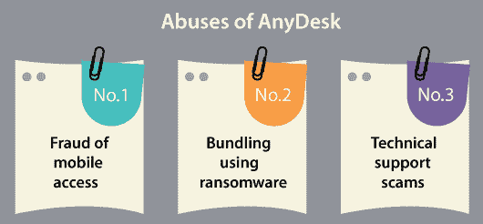
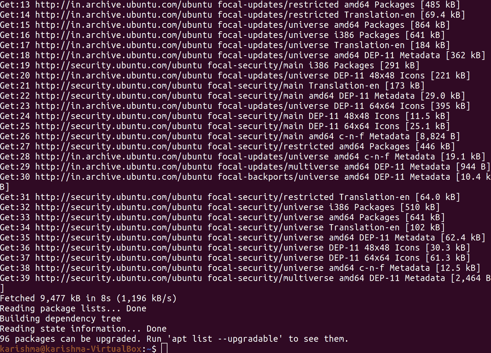
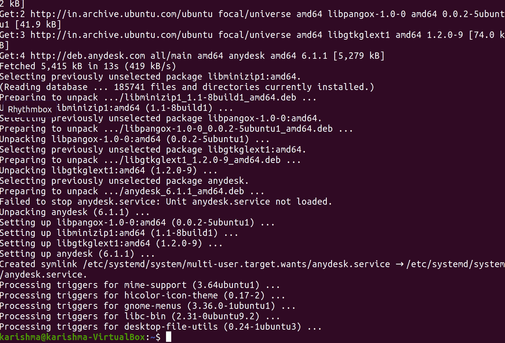
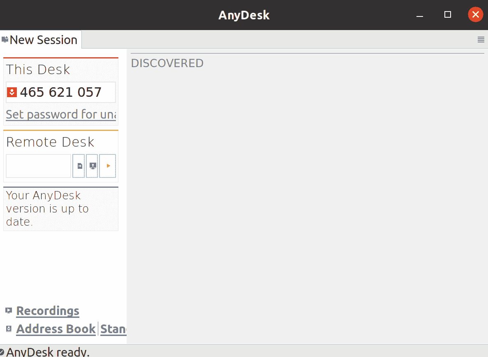

# 任意桌面 Ubuntu

> 哎哎哎:# t0]https://www . javatppoint . com/any desk-Ubuntu

## 什么是 AnyDesk？

***Anydesk*** 可以描述为由 Anydesk 软件 ***GmbH 共享的远程桌面应用。*** 软件程序有助于执行主机应用的个人电脑和各种其他设备独立于平台地远程访问。因为这个程序经常被网络骗子用来控制受害者的电脑。它方便了虚拟专用网络、文件传输和远程控制功能。

***AnyDesk*** 提供强大的基于 Linux 的连接，可无缝、流畅地远程访问所有计算机。无论是专业人员还是为用户提供远程支持的个人组织。 ***AnyDesk*** 专为强大的远程连接和轻松的操作而开发。

对于 Linux 桌面， ***AnyDesk*** 远程控制保证了与基于 Linux 的操作系统的不间断连接。 ***AnyDesk*** 远程访问 Linux 的解决方案是为持续运行而创建的，允许我们使用 ***Mac、Windows、*** 和其他各种基于 Linux 的操作系统 访问 Linux 内的远程桌面，非常适合使用 Ubuntu。我们可以享受*和 ***简单的*** 管理工具和任何办公桌的设置。*

 **   大概，***【AnyDesk】***是远程桌面跨平台最快的连接工具，用来共享我们的桌面。
*   它与***【TeamViewer】***相同，可用于远程连接到 Windows、Linux 和 Mac 系统，以促进协作或支持。
*   对于希望在享受高质量和安全体验的同时提供远程协助的技术支持用户和专家来说，它是最好的工具之一。
*   此外，它还可以用于协作和会议，如***【Webex】***和桌面的许多其他共享工具。
*   ***【AnyDesk】***不仅适用于 Ubuntu 的 Linux 发行版，还适用于 Fedora、Linux Mint 等。
*   它允许我们轻松访问和连接到我们的远程设备。
*   我们还将能够在工作、家庭或学校访问安卓、iOS、窗口，或许还能访问我们的 MacOS 设备。
*   ***AnyDesk*** 是随着地面上升走向开创性而发展起来的。
*   ***【AnyDesk】***的核心是 ***DeskRT*** ，这是一款专门为 GUI 开发的新鲜视频编解码器。
*   ***AnyDesk*** 是市面上最快的远程桌面软件之一。
*   它允许使用新的应用程序和场景，而使用远程桌面的最新软件是不可能的。

## AnyDesk 的规格


### 帧速率

***AnyDesk*** 可以在本地网络或各种互联网连接上每秒传输 ***60 帧*** 。与远程桌面的其他应用程序相比，它更方便，并且能够尽可能方便地在屏幕上移动，因为大多数个人计算机显示器也以 60 帧/秒的速度工作。 ***AnyDesk*** 使 ***无加加速度实现*** 成为可能。

### 潜伏

从最底层来看，延迟对于在远程桌面上工作至关重要。延迟越短，远程电脑对我们的输入的响应速度就越快。至关重要的是， ***AnyDesk*** 在账单中包含尽可能少的内容，因为互联网连接总是在使用一个系统向另一个系统传输数据时造成延迟。

### 接近

我们不需要记住繁琐的防火墙配置和低可靠性。我们可以在任何地方使用我们的电脑，而不会有任何麻烦。无论是五小时还是五分钟，我们甚至看不到*在那里。我们个性化的 ***AnyDesk-ID*** 可以是我们桌面以及所有应用程序、文件、文档和照片的钥匙。此外，我们的数据将保留在原来的位置。*

 *### 没有滞后

***AnyDesk*** 应用 ***DeskRT*** 的概念，比竞争对手的远程和屏幕共享桌面产品提供更好的响应能力和图像质量。 ***DeskRT*** 是一款创新的全新视频编解码器，专为从图形用户界面传输图像素材而开发。

任意桌面 T3 的连接正在基于二郎的服务器上移动。这项技术被广泛应用于健壮的大型电信系统。这项技术的可靠性确保了我们的产品在我们需要时随时存在。

### 轻量级选手

每个用户都会喜欢***【AnyDesk】***在不喜欢臃肿软件的 ***【可移植性】*** 领域设定独特标准的方式。***【any desk】***团队设法将这些特性打包成一个只有一兆字节的小文件。 ***AnyDesk*** 可以在几秒钟内将任何桌面转换为我们的桌面，不需要安装或管理权限。

## Ubuntu 中 AnyDesk 的特性


1.  **性能**
    1.  **低延迟**
        在远程桌面上工作时，响应(近乎即时)是强制性的。这就是为什么在许多本地网络中，AnyDesk 的延迟低于 16 毫秒，因此无法察觉。
    2.  **高帧率**
        我们可以通过许多本地网络和几乎所有的互联网连接，享受到 60 帧每秒的屏幕流畅体验。
    3.  **高效利用带宽**
        ***AnyDesk*** 即使带宽低至 100 KB/秒，也能流畅执行多项任务。 ***AnyDesk*** 是一款针对互联网连接性较低地区的远程桌面选择软件。
    4.  **快速启动**
        我们可以从 ***开始，无需管理权限、安装或注册。我们可以简单地下载并启动软件，我们就可以开始了。***
    5.  **高生产力技术**
        ***桌面*** 可以说是我们创造的一个生产力编解码器。它可以形成 ***AnyDesk 基础。*** 它可以压缩图像数据并在电脑之间传输，这是任何竞争商品都无法做到的。
    6.  **故障安全的二郎网络**
        我们几乎所有的服务器都应用了二郎电信的技术。这意味着高可用性、低延迟和保证正常运行时间。
    7.  **要求苛刻的应用**
        ***AnyDesk*** 以其令人钦佩的带宽效率，对视频编辑或 CAD 等许多数据密集型应用毫不畏惧。
    8.  **实时协作**
        无论我们是举行在线演示和会议，还是从世界的角度处理类似的文档，我们都可以轻松地进行交流和协作。
2.  **安全**
    1.  **使用自己的网络**
        用 ***AnyDesk 建立我们的企业网络很方便。*** 它允许我们独立操作，无需访问互联网，因为不需要与任何服务器通信。
    2.  **访问限制**
        Control 通过将可靠的办公桌列入白名单来获得对我们计算机的访问权限。它确保只有授权用户可以这样做才能声明连接。
    3.  **已验证连接**
        ***Anydesk*** 使用 ***RSA 2048 加密*** 的非对称密钥交换来验证所有连接。
    4.  **加密技术**
        ***银行标准 TLS 1.2*** 的技术保护我们的系统免受未经授权的访问。
3.  **灵活性**
    1.  **远程打印**
        配合 ***AnyDesk、*** 远程打印带来更快的速度，对于团队来说很容易，不需要复杂的联网机器。
    2.  **文件传输**
        简单来说，我们可以复制粘贴或者应用一个新的传输标签在系统之间传输文件。
    3.  **国际**
        ***AnyDesk*** 可支持国际键盘，有 ***28+语言*** 可供选择，非常适合全球个人和团队使用。
    4.  **轻量级**
        即使我们在旅途中，下载 AnyDesk 也相当简单。相当程度上，AnyDesk 比竞争对手更轻，只有 3 兆字节。
    5.  **最大兼容性**
        ***AnyDesk*** 并不仅仅运行在我们当前版本的操作系统上。它在像***【Windows 7】***这样的早期版本上运行同样流畅，因为它比最先进的计算机软件运行得更好。
    6.  **多平台支持**
        在我们选定的平台上执行 ***AnyDesk*** ，无论是 ***安卓、iOS、FreeBSD、Mac OS、Windows、*** 还是 ***Linux。*** 此外，我们可以免费使用手机应用。
    7.  **在任何地方使用**
        我们可以从最近的会议室、家庭办公室或办公桌轻松访问我们的系统。我们都只需要设置一个密码。
4.  **给药**
    1.  **自动推出**
        要在多个系统上自动推出***【any desk】***，并根据需要配置每个系统，我们可以使用一个 MSI 包。此外，我们可以使用命令行界面来编写安装脚本。
    2.  **远程重启**
        ***AnyDesk*** 不会让任何任务阻挡我们。它不仅可以在会话时重新启动，而且非常简单。
    3.  **定制**
        将 ***AnyDesk*** 的标识换成个性化用户名，并包含一个徽标，使我们的远程桌面软件与我们的品牌标识保持一致。
    4.  **详细会话报告**
        通过集成使用自动开票和 ***REST API*** 以及***【TANS】***或 ***远程桌面管理器等多种信息技术服务管理解决方案，简单明了，提供准确的计费信息。***
    5.  **在线管理面板**
        轻松访问会话日志、设置和许可证。 ***AnyDesk*** 包括 ***自动开票选项*** 和 ***导出选项。***
    6.  **管理联系人**
        它可以跟踪我们与 ***通讯录(内置)*** 的连接和联系人，无需连接即可查看谁在线。

## 公司

***【AnyDesk】***的软件 ***GmbH*** 于 2014 年在 ***德国(斯图加特)*** 被检测到，并和很多子日记一起在 ***中国*** 和 ***美国流行起来。***

***Anydesk、***2018 年 5 月，通过 ***EQT Ventures 获得了 650 万欧元的融资。***2020 年 1 月又一轮投资带来 ***AnyDesk*** 迈向 2000+万美元的资金。

## 滥用任何桌面

可选地，***【any desk】***可以安装在具有完全管理权限的智能手机和计算机上，如果任何用户选择这样做的话。因此，应该谨慎使用它，因为它可能会导致像远程桌面的每个应用程序一样，通过互联网远程完全访问任何设备。



*   **移动接入欺诈**
    RBI 在 2019 年 2 月就数字银行的一个新兴欺诈发出警告，明确提到***【AnyDesk】***为攻击渠道。正常的诈骗流程如下:诈骗分子通常通过模仿合法的公司客服，利用 ***【谷歌 Play 商店】*** 在手机上下载 ***AnyDesk*** 软件，即可获得受害者。之后，骗子会说服那些受害者提供九位数的访问代码，并授予几个权限。通常情况下，诈骗分子在获得多项权限后，在没有其他安全措施的情况下，借助 ***印度统一支付接口*** 汇款。根据 2020 年的 ***克什米尔网络警察*** 也发生了同样的骗局。
*   **使用勒索软件进行捆绑**
    ***趋势科技(一家日本网络安全公司)*** 在 2018 年 5 月发现，许多网络犯罪分子使用***【AnyDesk】***包装了一种新的勒索软件变体，作为一种规避战术的掩盖，当它执行加密的例行程序时，勒索软件的实际目的。
*   **技术支持骗局**
    几个骗子已经熟悉使用***【AnyDesk】***和远程桌面的同一个软件，通过冒充技术支持人员获取对受害者电脑的完全访问权。然后，系统会提示受害者下载并安装***【any desk】***，并为攻击者提供完全访问权限。如果获得访问权限，攻击者可以控制系统并移动敏感数据和个人文件。

## 为什么我们需要办公桌？

我们需要 ***AnyDesk 的原因有几个。*** 下面提到一些原因:

*   单个主机服务器
*   双因素认证
*   会话协议
*   自定义-客户端
*   休息-应用编程接口
*   聊天功能
*   自动发现(自动进行本地网络分析)
*   白色书写板
*   无人值守访问
*   虚拟专用网络
*   远程打印
*   文件管理器和传输
*   多平台(安卓、iOS、macOS、Linux、Windows 等)远程访问。)

## 在 Ubuntu 中安装 AnyDesk

### 1.第一步:更新 Ubuntu 系统

首先，我们需要更新我们的系统，以确保我们的系统得到更新。我们需要输入以下命令来更新我们的系统:

```

$ sudo apt update

```


```

$ sudo apt -y upgrade

```



### 2.第二步:添加 AnyDesk 的存储库

我们可以直接使用 ***官方下载页面下载 AnyDesk*** 的 ***Debian 文件。*** 此外，我们还可以使用 ***官方小组提供的***【PPA】***来安装 AnyDesk。*** 我们将向可信软件提供商列表中添加一个存储库密钥，然后将 PPA 添加到我们的计算机中。

为此，我们需要输入以下命令:

```

wget https://keys.anydesk.com/repos/DEB-GPG-KEY 

```

```

$ sudo apt-key add DEB-GPG-KEY

```


然后，我们需要添加 AnyDesk 的存储库，它是我们的 Ubuntu 系统的内容:

```

$ sudo echo "deb http://deb.anydesk.com/ all main" | sudo tee /etc/apt/sources.list.d/anydesk-stable.list

```


### 3.第三步:在 Ubuntu 中安装 AnyDesk

最后，我们将更新 ***apt 缓存*** ，然后在 Ubuntu 中安装当前版本的 ***AnyDesk*** 。

我们需要输入以下命令:

```

$ sudo apt update

```


```

$ sudo apt install anydesk

```



### 4.第四步:在 Ubuntu 中启动 AnyDesk

在 Ubuntu 中启动***【AnyDesk】***的安装过程之后，我们需要使用一个启动器，即 ***【桌面应用】*** 。

输入以下命令:

```

$ anydesk

```



* * ***