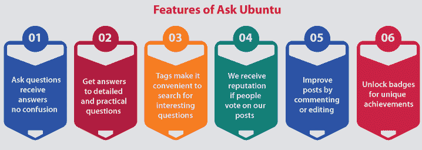

# 问问 Ubuntu

> 原文：<https://www.javatpoint.com/ask-ubuntu>

***问 Ubuntu*** 是一个面向 Ubuntu OS 的社区驱动问答网站。这是一个网络的一部分 ***栈交换*** ，它运行类似 ***栈溢出的软件。***

所有成员的影响力都是基于社区对其各种问题和答案的回应。影响力表示在所提供的答案中对许多用户的信任。每一项特权都是根据影响力级别以及使用最高影响力的用户提供的，这些用户对所有版主拥有相同的特权。每个用户生成的内容都已获得 ***【知识共享属性-共享相似性】*** 3.0 许可。

2010 年 10 月 10 日，该网站发布了 Ubuntu 10.10 版本的测试版。Ask Ubuntu 截至 2021 年 3 月约包含 ***925662 注册用户*** 和 ***373339+提问*** 。

***Ask Ubuntu*** 与 IRC 邮件列表和网络论坛的不同之处在于，他们不是按时间顺序解决问题，而是通过更改和更新数据来解决问题，即使我们没有指定。正如我们所知，总有一些东西可以在网站上改进，以保持新鲜度和质量随着时间的推移而提高。该网站的流量(95%)来自 ***搜索引擎。*** 因此，复习内容要准确始终很重要。

## Ask Ubuntu 的历史

***Ask Ubuntu*** 作为一个针对 Ubuntu 开发者和用户提出的问答网站，在 ***Stack Exchange*** 区域 51 上已经流行起来。 ***栈交换*** 被选中推出 ***问乌班图*** 在私测版使用互联网其他用户支持的侧提案通过 ***进行“承诺”。***

该网站最终与从社区投票过程中选出的 ***Ask Ubuntu*** 名称一起公开测试，并于 2010 年 10 月与 10.10 版本的***Ubuntu Maverick Meerkat***一起发布。

***Ask Ubuntu*** 被允许继续使用一个孤立的 ***UNIX*** 和 ***LINUX*** 站点，尽管 ***堆栈交换*** 的政策在投票和审议后反对分裂。

***Ask Ubuntu*** 已获得 ***Canonical Ltd.*** 的支持，后者已允许该网站使用其 ***商标。******Canonical ltd .***支持网站设计，确保 ***问乌班图*** 主题遵循乌班图 ***品牌指引。***

## 询问 Ubuntu 的格式

该网站允许用户回答和提问。所有用户都可以对问题和答案进行投票。还有，他们可以因为自己对网站的几次贡献获得 ***【徽章】*** 和 ***信誉积分*** 。

***例如，*** 当用户对任何问题的回答赢得了一个向上投票时，他们将获得 10 个信誉点的补偿。

每个用户还可以以*维基的方式提交对问题和答案的更改，并让他们推荐的更改经过同行评审的过程。*

 *有了 2000 或 2000+的信誉点，用户可以直接更改问题和答案，而无需经过相同的同行评审过程。一些帖子被开发为 ***【社区维基】*** ，这些帖子对编辑的声誉要求较低。

***询问乌班图*** 包含两个子网站，如下所述:

*   一个***【meta】***用户可以回答和提问与网站本身相关的问题。
*   聊天室的集合(实时)作为 ***栈交换*** 站点网络的一部分。

## 开始使用 Ask Ubuntu

***问乌班图*** 连续用 ***【美誉度】*** 的概念为我们提供访问不同细分网站的途径。所以，同样的，就像电子游戏一样，我们需要解锁很多通过获得 ***声望而获得的特权。*** 参与网站的话是同行授予我们的。我们赢得的最大声誉是社区对我们的最大信任，也是我们被允许通过网站完成的最大事情。

开始使用 ***询问 Ubuntu*** 的最好方法之一是通过 ***询问 Ubuntu 指南。*** 然后，我们可以开始回顾 ***【最大点击率】【现有常见问题】*** 和 ***未回答问题*** 的新鲜度和质量。

## 询问 Ubuntu 的提示和技巧

1.  经常收到较高 upvotes 的答案 launchpad 的 bug 报告、交叉引用文档(官方)和其他来源(官方)。如果需要，他们会得到通知，并包含逐步说明和截图。任何人都可以通过在命令中粘贴来给出一个问题的答案，那么最好的答案就是任何用户都需要自学的知识。
2.  如果我们不是任何技术用户，我们需要专注于固定帖子的结构，比如 ***语法、拼写、*** 等等。我们可以在很多技术上不知道的帖子上做。随着时间的推移，我们将开始学习技术细节，因为我们审查内容，任何人都可以通过审查内容质量来了解 Ubuntu。
3.  几乎所有用户都不知道独一无二的重要性。如果我们看到任何带有正常标题的问题，如 ***【无线不工作】*** 或 ***【火狐问题】*** 那么我们可以更新该问题，以便与使用他们身体的内容一起改进它。因此， ***“无线不工作”*** 可能变成 ***“如何让博通 BCM12345 工作？”******“火狐问题”*** 有可能变成 ***“如何让火狐打印？”*** 以此类推。

## Ask Ubuntu 的特点

众所周知，Ask Ubuntu 是一个面向 Ubuntu 开发者和用户的问答网站。它是由我们创建和运行的，作为问答网站堆栈交换网络的一部分。在我们的帮助下，他们正在合作建立一个关于 Ubuntu 所有问题的几个答案的库。如果加入这个社区，我们可以追求 Ubuntu 行为准则’。

*   **提问收到答案没有困惑**
    问乌班图网站完全是以获得答案为基础的。它不是任何论坛，也没有闲聊。所有优秀的答案都可以投上去，出现在最上面。
    表示最好的答案先显示一个，这样总是很容易找到这些答案。提问的用户可以将单个答案标记为 ***“接受”。*** 但接受并不代表它是一个很棒的答案，它意味着它是为提问的用户实现的。
*   **获得详细而实用的问题的答案**
    我们需要专注于关于我们所面临的一个真实问题的问题，包括关于我们已经做了什么和我们正在努力做什么的信息。并不是每个问题在它们的格式中都能很好地实现。他们可以忽略那些主要基于观点或可能产生讨论而不是答案的问题。
    **注意:**需要改进的问题可能会被关闭，直到有人解决它们。
    *   **询问...**
        *   我们遇到的实际问题
        *   Ubuntu 提供的服务
        *   Ubuntu 的改进
        *   在 Ubuntu 上运行第三方应用
        *   使用官方 Ubuntu 衍生品管理和使用 Ubuntu。
    *   **不要问...**
        *   任何与 Ubuntu、官方支持的衍生品或其社区不直接对应的东西。
        *   使用几种可能答案的问题或者需要更长答案的问题
        *   主要基于观点的问题
*   **标签可以方便地搜索有趣的问题**
    每个问题都用其主题区域进行标记。所有问题最多可以有五个标签，因为问题可能对应于不同的主题。按下任意标签，查看带有特定标签的问题列表，或者我们可以进入标签列表，浏览我们喜欢的每个主题。
*   **如果人们对我们的帖子进行投票**
    我们就会获得声誉，如果其他人对我们的编辑、回答和问题进行投票，我们的声誉得分就会上升。我们将解锁新的特权，如评论、投票和编辑他人帖子的能力，因为我们获得了声誉。
    我们将获得最高级别的独特审核工具。我们将能够与我们的社区版主合作，保持网站的帮助和重点。
*   **通过评论或编辑**
    来改进帖子我们的目的是对所有问题都有最好的答案，所以当我们看到 ***Q & A*** 可以改进的时候，我们可以改变它们。我们可以使用编辑来修正错误，澄清帖子的意思，或者改进格式。
    我们可以用评论来询问更多的细节好吗澄清 Q & A .我们可以随时评论我们的问题和答案。一旦我们赢得 50 分的声誉，我们可以评论任何人的帖子。
*   **解锁徽章获得独特成就**
    徽章是我们在网站上参与获得的独特成就。这些徽章有 3 个不同的级别，如下所述:事实上，我们可以通过阅读任何页面来获得或获得徽章。
    *   金色的
    *   银
    *   青铜In fact, we can earn or receive a badge just to read any page.

* * **