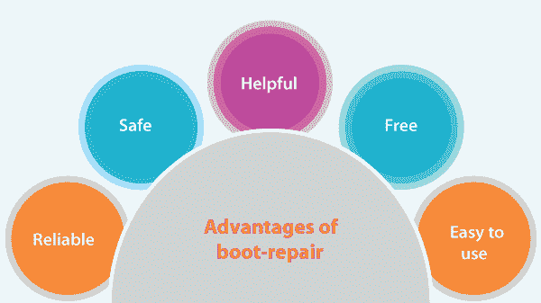
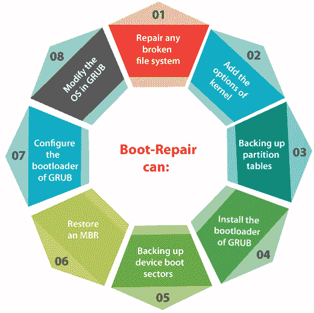
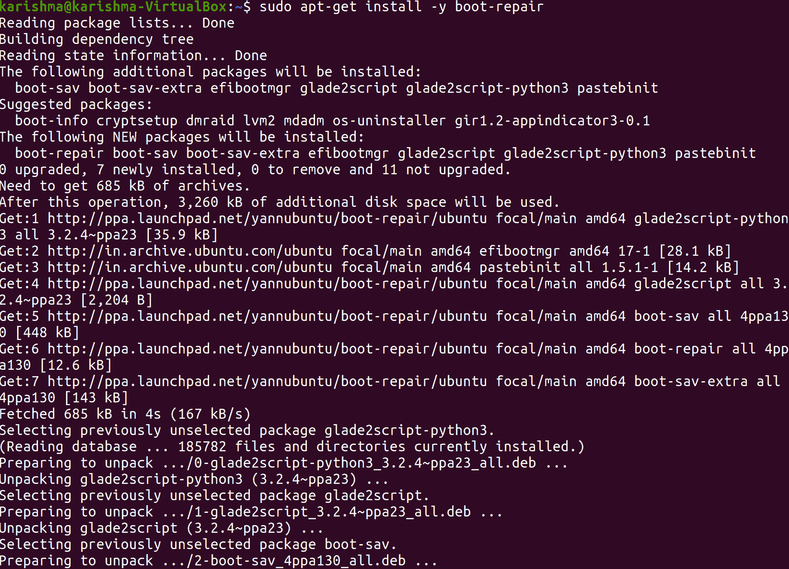
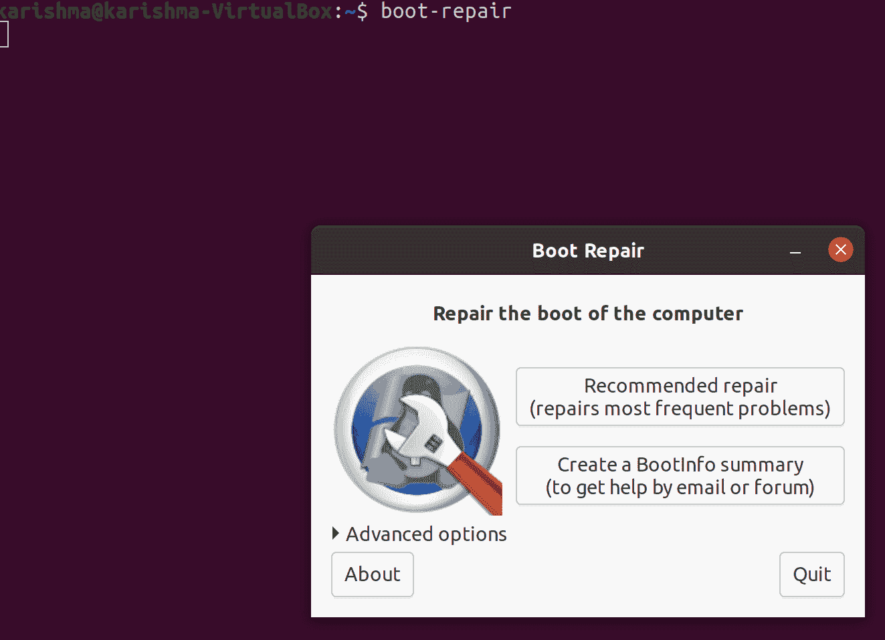

# 引导修复 Ubuntu

> 原文：<https://www.javatpoint.com/boot-repair-ubuntu>

***引导修复*** Ubuntu 是一个通用的工具，用于修复我们在 Ubuntu 中可能触发的频繁引导的问题，比如如果我们在安装 Windows 操作系统或 Linux 的其他发行版后无法引导 Ubuntu 操作系统，或者如果我们在安装 Ubuntu 操作系统后无法引导 Windows 操作系统，或者如果 ***GRUB*** 不再显示，几次升级就能破解 GRUB 等。

在 Ubuntu 中， ***引导修复*** 使我们能够通过正常点击修复这些类型的问题，这可以恢复对我们在此问题之前安装的操作系统的访问。

还有， ***引导修复*** 有各种高级选项，用于备份引导扇区、表分区、创建 ***【引导信息】*** (通过论坛或邮件获取帮助)、或者更改修复的默认参数:添加内核选项、配置 GRUB、恢复一个***【MBR】***(Windows 兼容)、修改默认操作系统、清除 GRUB、描述 GRUB 必须安装的磁盘、修复损坏的文件系统等。

***开机修复*** 将建立一个***Ubuntu***的 Pastebin 链接供我们分发，允许有经验的会员检查我们的开机有什么问题，目的是帮助 IRC 和论坛会员帮助我们识别开机设置的问题。Ubuntu 的 ***粘贴板*** 不容易搜索或索引，建立引导信息页面的工具的目标是帮助解决这个问题。

其目的既不是侵犯我们的隐私，也不是让我们成为目标。但是这个工具完全专注于那些希望摆脱引导问题并轻松使用 Linux 的 Ubuntu 新用户。如果我们愿意，我们可以通过查看“高级选项”部分，完全退出每一种互联网使用，包括生成 ***粘贴板链接*** 。

#### 注意:引导修复是在 GNU-GPU 上许可的，并且是免费软件。

## 开机修复的优点

使用引导修复的一些主要优势如下:



*   可靠(400.000 用户/年)
*   安全(自动备份)
*   有用(通过我们最喜欢的论坛或电子邮件获取帮助的引导信息摘要)
*   免费(根据开源 GPL 许可)
*   易于使用(可一键修复)
*   可以删除对 Windows 的访问(Windows10、Windows8、Winodws7、Vista、XP)。
*   可以删除访问 Arch Linux、OpenSuse、Fedora、Mint、Ubuntu、Debian 等。
*   如果我们的电脑包括 Arch Linux、OpenSuse、Fedora、Mint、Ubuntu、Debian 或衍生产品，可以删除对任何操作系统(Linux、macOS、Windows 等)的访问。
*   用于轻松重新安装 GRUB1/GRUB2 引导加载程序的选项(默认操作系统、内核选项、取消隐藏、清除等)。
*   如果我们有错误信息，即***【GRUB Recovery】，可以修复开机。*T3】**
*   通过 ***清理无处不在，当实际启动扇区已经保存时，可以修复 MBR 锁定的原始设备制造商计算机的启动。*T3】**

## 什么是 GRUB？

***GNU GRUB*** 是来自 GNU***项目的 ***包的私货。*** 它是 ***【自由软件基金会】*** 的 ***多引导规范*** 的参考实现，便于用户选择引导安装在系统上的多个操作系统中的一个，或者选择在操作系统的特定分区上可用的内核的特定配置。***

***GNU GRUB*** 是用名为 ***大统一引导加载器*** (基于 ***大统一理论*** )的包设计的。它主要用于许多类似 Unix 的系统。GNU OS 应用 GNU GRUB 作为引导加载程序，因为在 x86 系统上实现大多数***Solaris OS***和 ***LINUX 发行版，*** 从发布 ***Solaris 10 1/06 开始。***

还有一个术语叫做 ***GRUB 2。GRUB 2*** 可以定义为 ***默认管理器*** 和 ***引导加载器*** 自 9.10 版本的 Ubuntu ***(Karmic Koala)。*** GRUB 2 要么自动将控件发送到操作系统的 Kernel，要么代表一个菜单，然后等待用户的输入。

***GRUB 2*** 也可以说成是 GRUB 的 ***后裔(简称***GRand Unified boot loader***)。此外，它已经被完全重写，以显著方便用户 ***高性能*** 和 ***的灵活性。*** GRUB 2 是市场上免费提供的软件。***

## 引导信息简介

A ***开机信息*** 可以描述为支持发现我们电脑或开机参数异常的诊断报告。不是备份，是一种 ***“我们系统的即时画面”。*** 通常，我们会被要求指出我们的引导信息，以支持在 Ubuntu 论坛中知道问题的人。

建议使用两种方法轻松制作此报告:

*   使用 ***Ubuntu 光盘*** (需要互联网连接和 Ubuntu 光盘)
*   或者使用 ***【启动修复盘】*** (如果我们经常做启动信息的报告，或者要诊断的系统没有互联网连接，这是最简单的方法)

***开机信息*** 的一些重要要点如下:

*   引导信息可以被指定为我们的主要系统参数的即时映像。它既不修改引导文件，也不修改系统文件。我们可以随时重复这个过程。
*   如果在此过程中没有连接互联网，该工具将不会显示该网址。但是，它将在文本查看器中显示引导信息的报告(与网址相比，它不太方便，因为我们需要在论坛上复制和粘贴该文件的数据)。如果可以的话，在那之后连接到互联网，重新开始获取网址的过程。
*   如果忘记了，然后重做这个过程。
*   一旦我们向某人指示了网址，人们将只需要在网络浏览器中打开网址来检查报告内容。
*   ***开机信息报告*** 比我们可以通过 ***开机信息脚本获得的更具体。***
*   ***开机信息*** 底部显示的是我们选择 ***开机修复实用程序的 ***【推荐修复】*** 按钮将执行的修复类型。***
*   ***【开机修复】*** 如果选择推荐修复，将执行这些修复的操作。然后它会显示一个完整的 ***引导信息*** 包括修复日志(允许找到一些标准 ***引导信息*** 找不到的问题)。
*   如果我们没有被邀请，请不要修改 ***【引导修复高级选项】*** 。

## 引导修复可以:



*   修复任何损坏的文件系统
*   恢复多媒体广播(兼容视窗)
*   在 GRUB 中修改操作系统(默认)
*   添加内核选项
*   配置 GRUB 的引导加载程序
*   安装 GRUB 的引导加载程序
*   备份设备引导扇区
*   备份分区表
*   和许多其他人
*   我们现在可以使用以下命令安装引导修复:

```

$ sudo apt install boot-repair

```

现在，我们需要按 y，然后点击 ***进入*** 按钮继续。

### 使用引导修复备份分区表

我们可以在引导修复的帮助下备份我们的分区表。这很重要，因为如果我们的分区表以某种方式被破坏，我们将能够恢复分区，也能取回我们的数据。否则我们可能会丢失所有数据。

我们只需要按下按钮，即 ***备份分区表，启动扇区和日志*** 来备份我们的分区表。

我们需要选择一个*的位置来保存我们分区的数据，然后按下 ***保存*** 选项。*

 *保存分区表时，我们应该会发现一条消息。只需按下 ***确定。*T3】**

我们现在应该可以在之前选择的目录中看到一个 ***zip 文件*** 。

### 使用引导修复修复文件系统

我们的文件系统有时可能会被感染，Ubuntu 无法在启动时自动解决这个问题。这可能会导致许多启动失败。我们可以使用引导修复来修复我们的文件系统。

我们只需要勾选一个选项，即 ***在选项卡中修复文件系统*** ，即 ***主选项，*** 然后按下 ***应用*** 选项。

修复我们的文件系统并解决启动问题应该需要几分钟的时间。完成后，我们应该能够像往常一样再次启动安装的操作系统。

### 使用引导修复修改 GRUB 位置

我们可以使用 ***引导修复高级选项来定义 ***GRUB*** 安装在硬盘上的位置。*** 如果我们的系统上安装了多个硬盘，并且安装了 ***GRUB、*** ，那么我们可能希望在此修复我们希望修复的硬盘。

要修改 ***GRUB 的位置，*** 我们需要转到引导修复的选项卡，即 ***GRUB 位置*** 。现在从下拉菜单中选择硬盘的分区，即 ***OS 默认引导。*** 同样，从下拉菜单中选择作为 ***电喷系统分区*** 应用的硬盘分区，即 ***分离/引导/电喷分区*** 如果我们应用的是基于 ***UEFI 的主板。***

### 使用引导修复修改 GRUB 的选项

另外，我们可以使用一个选项卡更改 GRUB 的几个选项，即引导修复的 ***GRUB 选项。*T3】**

## 正在进行引导修复

### 第一个选项:具有引导修复功能的磁盘

使用 ***引导修复*** 最简单的方法之一是建立一个包含该工具的磁盘(例如，自动启动引导修复的磁盘，引导修复磁盘)并在其上引导。

#### 注意:建议通过通用串行总线安装国际标准化组织(例如，通过通用串行总线安装程序、LiliUSB 或 Unet 引导)。如果我们的系统预装了 Windows 8 操作系统，或者我们的引导是在电喷模式下，不要把它刻录在 DVD 上。

### 第二个选项:在 Ubuntu 上安装引导修复

1.  无论是从我们安装的 Ubuntu 会话(如果我们可以访问它)还是从 Ubuntu 的实时会话(在 Ubuntu 的*或 ***实时光盘*** 上引导我们的系统)，然后选择 ***“尝试 Ubuntu”。****
**   链接到互联网*   打开终端，然后输入下面提到的几个命令(在每一行后点击回车):*

```

$ sudo apt-add-repository ppa:yannubuntu/boot-repair

```


```

$ sudo apt-get update

```


```

$ sudo apt-get install -y boot-repair && boot-repair

```



```

boot-repair

```



## 应用引导修复

### 建议修理

1.  我们可以使用以下任一方法启动引导修复:
    1.  通过在我们的终端中输入 ***【开机修复】***
    2.  或者通过破折号(屏幕左上角的 Ubuntu 标志)
2.  之后，选择按钮，即 ***“建议维修”。*** 记下 ***网址*** ，修复完成后会在纸上显示出来。然后，重新启动，看看我们是否恢复了对超过个操作系统的访问。
3.  如果修复不成功，请将 ***网址*** 提交给通过论坛或电子邮件帮助我们的用户。

***警告:**设置(默认)是由**“推荐维修”应用的设置。**修改它们可能会恶化我们的问题。在建立**引导信息网址、**和在 Ubuntu 论坛**安装和升级**或**绝对初学者部分提示建议之前，不要更改它们。***

## 安装 Windows 后恢复 Ubuntu

本文指定了如何在安装 Windows 操作系统后恢复或还原引导加载程序。修复引导加载程序的几个原因可能包括在安装 Ubuntu 后安装 Windows 操作系统、移除或添加硬盘，或者修改硬盘的设置。

***重要提示:**如果我们在 Windows 中安装了 Ubuntu(由**吴彼安装程序**安装)，这篇文章就没什么帮助了。*

### 使用 Ubuntu 光盘(建议)

### 使用图形方式

1.  我们需要插入我们的 Ubuntu 光盘，重新启动我们的系统，并在基本输入输出系统中将其设置为从光盘引导，并在实时会话中引导。此外，如果我们过去做过，我们可以使用任何 ***LiveUSB*** 。
2.  安装并执行引导修复后
3.  选择 ***“推荐维修”。*T3】**
4.  现在 ***重启*** 我们的电脑。GRUB 通常的引导菜单应该会出现。启动时，如果没有，我们需要按住左键。我们将能够在视窗和 Ubuntu 之间进行选择。

### 使用终端方式

我们需要打开我们的终端。从 11.10 版本和 11.04 版本的 Ubuntu 开始，可以通过打开一个***【Unity Dash】***(我们可以在顶部面板内选择 Ubuntu 的标志，也可以使用键盘上的 Windows 键)并输入 ***【终端】*** 并按下出现的内容来实现。

我们可以通过转到之前版本的 ***【应用】>配件>终端*** 来实现。或者，我们可以应用键盘的快捷键，即 ***Ctrl+Alt+T.***

### 使用 Ubuntu 备用光盘

*   用 Ubuntu 备用光盘引导我们的计算机。
*   如果随船出现 Ubuntu 闪屏:询问，在 ***救援、*** 中输入，点击 ***进入。***
*   选择位置(国家)，语言，然后键盘的布局，因为如果我们正在进行新的安装。
*   键入主机的名称，或者保留 Ubuntu 默认值。
*   我们用屏幕来表示，在这个阶段，我们可以选择哪个分区是我们的根分区(我们的硬盘上有一个分区列表，所以我们需要了解 Ubuntu 的分区数量是多少)。将是***dev/discY/PartX、*** ，其中***【X】***指定分区号， ***Y*** 指定驱动器号。

* * ***