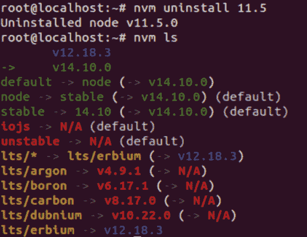

# 安装 NVM Ubuntu

> 原文：<https://www.javatpoint.com/install-nvm-ubuntu>

在本文中，我们将在 20.04 版本的 Ubuntu 上安装 ***NVM*** 。 ***节点版本管理器*** 是著名的 ***Node.js 的版本管理工具之一。*** 如果我们是 Node.js 的开发者或者是初学者，那么了解这个工具是非常必要的。我们可以安装任何 Node.js 版本，甚至可以使用这个工具轻松切换我们的版本。通常，这个活动是为了测试不同版本的代码而实现的。

## NVM 简介

***NVM*** 可以描述为一个 ***节点版本管理器工具。*** 借助 ***NVM 实用程序，我们可以在一个系统上安装多个版本的 ***Node.js*** 。*** 同样，我们可以为很多应用选择特定版本的节点。此外，它还提供了一个选项，用于自动选择带有配置文件的节点版本，即 ***.nvmrc.***

Node.js 是用于服务器端编程的 ***JavaScript*** 的运行时。它允许开发人员在 JavaScript 的帮助下创建可扩展后端的功能，*这是一种几乎每个人在网络开发中都已经知道的语言(基于浏览器)。*

 ****NVM*** 用于在 Linux 的多个环境中安装和管理不同类型的 node.js 版本。node.js 的任何开发人员在从事一个以上需要不同版本的 node.js 的项目时，通常更喜欢用 NVM 来安装、卸载和切换节点的各个版本，而不是手动安装和卸载所有项目所需的所有版本。人们可以在工具的帮助下建立他们的应用程序。这个工具无疑会节省大量的精力和时间。

### 先决条件

*   我们需要在 Ubuntu 中有一个活动的 20.04 服务器。
*   我们应该有一个工具，即 ***apt*** 安装在我们的服务器上。
*   我们应该在服务器上安装一个工具，即 ***【收拢】*** 。
*   我们应该有 ***根*** 或 ***sudo*** 来访问运行特权命令。

## 在 Ubuntu 20.04 中为 Node.js 安装 NVM

### 步骤 1:更新系统

在我们的系统上安装任何新的软件包之前，总是建议借助 apt-get update 或 apt update 命令来更新我们的系统。这个命令将帮助我们使用 Ubuntu 存储库下载和安装每个当前可用的更新。

该命令如下所述:

```

$ sudo apt update

```


### 第二步:下载并安装 Node.js 的 NVM

更新服务器后，我们将借助以下命令下载并安装 ***节点版本管理器*** 。

```

curl -o- https://raw.githubusercontent.com/nvm-sh/nvm/v0.35.3/install.sh | bash

```


### 步骤 3:检查非易失性存储器的版本

一旦 NVM 成功安装在我们的服务器上，我们就可以在命令的帮助下检查 NVM 的版本。该命令如下所述:

```

nvm --version

```

### 步骤 4:使用 NVM 安装 Node.js

现在我们可以在安装 NVM 后，借助命令安装 node.js。这个命令将帮助我们使用它的官方链接下载并安装当前版本的 Node.js。该命令如下:

```

nvm install node

```


### 步骤 5:检查节点的版本

我们可以在 Ubuntu 20.04 中查看节点的版本。我们将使用一个命令，即 ***节点版本*** ，它将显示我们系统上的当前版本。

### 步骤 6:使用- lts 安装当前 LTS 版本

如果我们希望安装 node.js 的当前 LTS 版本，那么我们需要应用下面提到的命令。这个命令将为我们找到并安装当前的 LTS 版本。我们不必手动描述版本。

```

nvm install -lts

```


### 步骤 7:安装特定版本的 Node.js

如果您希望安装 node.js 的特定版本，那么我们需要应用下面提到的命令。我们将在以下命令的帮助下安装 11.5 版本的 node.js:

```

nvm install 11.5

```


我们可以用这个命令安装任何特定版本的 ***Node.js.***

### 步骤 8:列出每个已安装的版本

如果我们希望检查 node.js 的每个安装版本，那么我们需要应用下面提到的命令。以下命令将显示我们系统中当前存在的不同版本的节点。

```

nvm ls

```


### 步骤 9:切换 Node.js 的版本

如果我们希望切换 node.js 的版本，那么我们需要应用下面提到的命令。我们将借助以下命令将 node.js 的版本切换到 14.10.0 版本:

```

nvm use v14.10.0

```


### 步骤 10:卸载 11.5 版本的节点

如果我们希望卸载 node.js 的特定版本，那么我们可以应用下面提到的命令。我们将在以下命令的帮助下卸载 11.5 版本。

```

nvm uninstall 11.5

```

如果我们执行以下命令，那么在卸载过程之后，我们将不会在列表中看到 11.5 版本。

```

nvm ls

```



### 步骤 11:安装 Node.js 的稳定版本

如果您希望安装 node.js 的稳定版本，那么我们可以应用以下命令。

```

nvm install stable

```


我们可能已经注意到，我们在这里没有描述任何具体的版本。因此，如果我们不知道当前的稳定版本，可以使用这个命令。

* * **