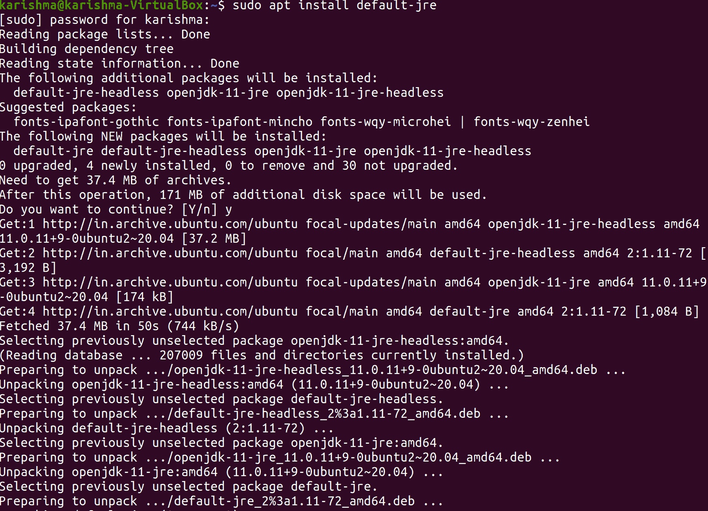
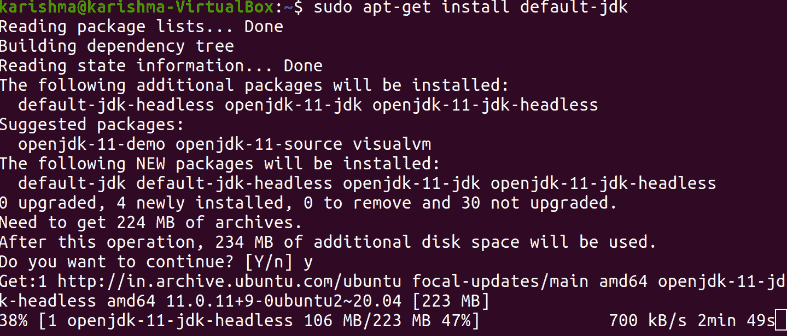
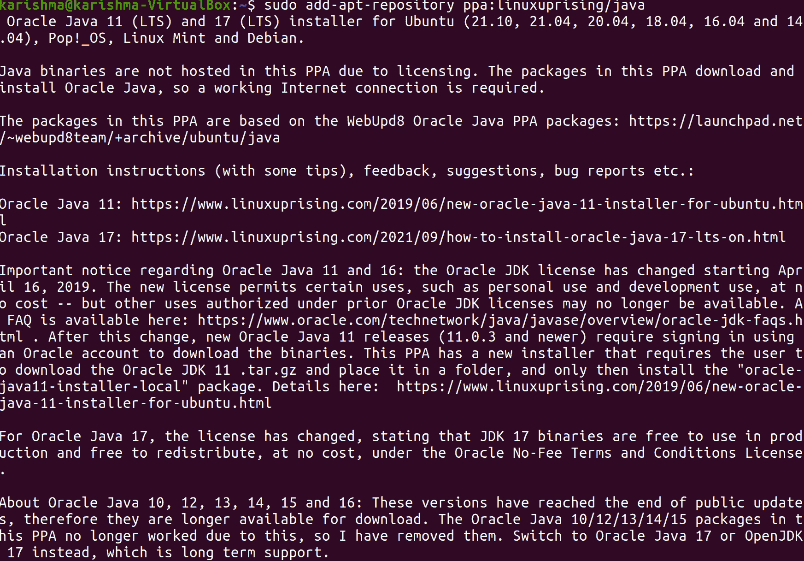
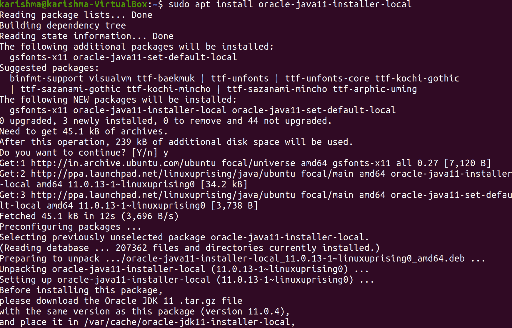

# 安装 JDK Ubuntu

> 原文：<https://www.javatpoint.com/install-jdk-ubuntu>

***【JVM】***(Java 虚拟机)和***【Java】***是包括 ***Jenkins、Cassandra、Glassfish、Jetty、*** 和 ***Tomcat 在内的各种类型软件所需要的。***

在本文中，我们将使用***“apt”安装许多版本的 ***Java 开发工具包(JDK)*** 和 ***Java 运行时环境(JRE)*** 。*** 我们将安装 ***OpenJDK*** 和官方 ***JDK*** 以及来自 ***的甲骨文。*** 然后我们将选择我们希望用于项目的版本。当我们完成后，我们将能够应用***【JDK】***开发软件或使用 ***Java 运行时*** 运行软件。

Ubuntu 20.04 的存储库(默认)包含 ***OpenJDK、Java 开发工具包、*** 和 ***Java 运行时环境两个包。******Java 运行时环境*** 由允许我们执行 ***Java 程序的 ***Java 虚拟机、二进制文件、*** 和 ***类组成。******Java 开发工具包*** 包含 ***Java 运行时环境*** 和 ***调试/开发*** 工具以及 ***库*** 为构建 Java 应用的必备工具。***

### 先决条件

我们需要遵循这篇文章:

Ubuntu 20.04 服务器按照 Ubuntu 20.04 初始服务器设置指南设置，包括一个 ***非根 sudo*** 用户和一个 ***防火墙*** 。

## 安装默认的 JDK/JRE

安装***【Java】***最简单的选择之一就是应用使用 Ubuntu 打包的版本。20.04 版本的 Ubuntu 默认包括***【OpenJDK】***的 ***11 版本*** ，是***【JDK】***和 ***JRE 的 ***开源版本。******

首先，我们需要更新软件包的索引来安装这个版本。

```

$ sudo apt update

```


接下来，看看是否已经安装了 ***Java*** 版本。

```

$ java -version

```


如果当前没有安装***【Java】***版本，我们会看到以下结果。

我们需要运行下面的命令来安装默认的 ***Java 运行时环境*** ，它将使用 ***OpenJDK 11 安装***【JRE】***。***

```

$ sudo apt install default-jre

```



Java 运行时环境将允许我们执行几乎所有的 Java 软件。

我们可以使用以下命令来验证我们的安装。

```

$ java -version

```

我们会发现类似以下的结果:


除了 ***Java 运行时环境*** 之外，我们可能还需要 ***Java 开发工具包*** 来编译和运行一些特定的 ***基于 Java 的软件。*** 我们需要运行下面的命令来安装***【JDK】***，该命令也将安装***【JRE】***。

```

$ sudo apt install default-jdk

```



我们需要通过检查 ***Java 编译器 javac*** 版本来验证***【JDK】***是否安装成功。

```

$ java -version

```


我们将看到下面的结果:

接下来，让我们看看如何安装甲骨文的官方 JDK 和 JRE。

## 安装甲骨文 JDK 11

***【甲骨文】*** 的 Java 许可协议不允许从 ***包管理器自动安装。*** 我们应该创建一个 ***Oracle*** 的帐户，并手动下载***【JDK】***来为我们曾喜欢用来安装 ***Oracle Java 开发工具包*** 的版本添加任何新的包存储库，该版本是由 ***Oracle 共享的官方版本。*** 然后，我们可以借助第三方安装脚本，应用 ***apt*** 进行安装。

我们将需要安装必须匹配发布的安装程序脚本的***【JDK】***版本的甲骨文。我们应该访问一个页面，即***【Oracle-java11-installer】***，了解我们需要哪个版本。

本页面脚本版本为 ***11.0.7*** 。在这种情况下，我们需要 ***11.0.7*** 版本的 ***甲骨文 JDK*** 。我们的版本号可能会因安装软件的时间而异。我们不需要使用这个页面安装任何东西，我们将很快从 apt 下载安装脚本。

然后，我们需要检查下载页面，然后找到符合我们需要的版本。

*   点击按钮，即***【JDK 下载】*** ，我们将跳转到显示可用版本的屏幕。
*   点击包，即***. tar . gz '***为 Linux。
    我们将看到提示我们接受甲骨文许可协议的屏幕。
*   选择接受本许可协议的复选框，点击 ***下载*** 按钮。
*   我们的下载将开始。
*   在下载开始之前，我们可能需要多次登录我们的 ***甲骨文账户*** 。
*   文件下载后，我们需要将其发送到我们的服务器。我们将把这个文件上传到本地机器的服务器上。
*   在 Windows、Linux 或 macOS 上，借助 ***Windows 子系统 for Linux、*** 我们将应用命令，即***【scp】***将文件传输到我们的 Sammy 用户主目录。
*   下面的命令假设我们已经将 ***【甲骨文】*** 的***【JDK】***文件保存到本地机器的 ***下载*** 文件夹中。

我们将返回到我们的服务器，并添加一个第三方存储库，当文件上传过程完成时，该存储库将支持我们安装 Oracle 的 Java。我们将安装一个包，即 ***【软件-属性-公共】*** ，它将向我们的系统添加一个命令，即 ***【添加-apt-存储库】*** 。

```

$ sudo apt install software-properties-common

```


接下来，我们将导入一个签名密钥，用于验证我们将要安装的软件:

```

$ sudo apt-key adv --keyserver keyserver.ubuntu.com --recv-keys EA8CACC073C3DB2A

```


我们将看到以下输出:

然后，我们将使用一个命令，即***【add-apt-repository】***将该存储库添加到我们的包源列表中:

```

$ sudo add-apt-repository ppa:linuxuprising/java

```



我们将看到以下消息:

我们需要按下 ***进入*** 按钮继续安装过程。我们可能会发现一条关于 ***【找不到有效的 OpenPGP 数据】*** 的消息，但我们可以安全地忽略这条消息。

我们将使用以下命令更新我们的软件包列表，以便在安装过程中提供新软件:

```

$ sudo apt update

```


安装程序会看到我们在***/var/cache/Oracle-JDK 11-installer-local***目录下下载的 ***甲骨文 JDK*** 。我们将制作这个目录并将 ***甲骨文 JDK*** 的档案转移到那里。

```

$ sudo mkdir -p /var/cache/oracle-jdk11-installer-local/

```

```

$ sudo cp jdk-11.0.7_linux-x64_bin.tar.gz /var/cache/oracle-jdk11-installer-local/

```


最后，我们将使用以下命令安装软件包:

```

$ sudo apt install oracle-java11-installer-local

```



首先，安装人员会要求我们接受甲骨文的许可协议。我们将接受协议，安装程序将提取 Java 包并安装它。

现在，我们将看到如何选择我们希望使用的 Java 版本。

## Java 管理

我们可以在一台服务器上安装多个 Java。我们可以借助一个命令，即 ***“更新-备选项”，来配置终端上应用的默认版本。*T3【命令如下:**

```

$ sudo update-alternatives --config Java

```


如果我们在本文中安装了这两个版本的 Java，结果会是什么样子。

选择对应于 Java 版本的数字作为默认值，或者点击 ***进入*** 按钮，将当前设置保留在原位。

我们可以用 Java 的其他命令来做，比如 ***javac*** 编译器。该命令如下所述:

```

$ sudo update-alternatives --config javac

```

可以执行该命令的许多其他命令包括但不限于: ***keytool、jarsigner、*** 和 ***javadoc。***

## JAVA_HOME 环境变量设置

用 JAVA 语言编写的几个程序使用环境变量，即***【Java _ HOME】***来确定 Java 的安装位置。

首先，我们需要确定 ***Java 版本*** 安装在哪里来设置环境变量。

我们将使用以下命令:

```

$ sudo update-alternatives --config Java

```


该命令将显示带有安装路径的所有 Java 安装。

在这种情况下，安装路径如下:

1.  ***OpenJDK 11*** 位于***/usr/lib/JVM/Java-11-OpenJDK-amd64/bin/Java***目录下。
2.  ***Oracle Java*** 位于***/usr/lib/JVM/Java-11-Oracle/JRE/bin/Java***目录。

我们需要使用首选安装复制路径。之后，我们将借助 ***【纳米】*** 文本编辑器或任何其他文本编辑器打开 ***/etc/environment*** 目录。

```

$ sudo nano /etc/environment

```

我们将在该文件完成时添加下面的行。确保用我们复制的路径替换突出显示的路径，但不要添加 ***bin/的路径部分。*T3】**

```

JAVA_HOME="/usr/lib/jvm/java-11-openjdk-amd64"

```

我们将修改这个文件，该文件将为我们系统上的每个用户设置路径，即 ***JAVA_HOME*** 。

我们将保存该文件并退出文本编辑器。

现在，我们将重新加载文件，以便将修改应用到当前会话:

```

$ source /etc/environment

```

我们将在以下命令的帮助下验证此环境变量是否已设置:

```

$ echo $JAVA_HOME

```

我们会找到我们刚刚设定的道路。

```

/usr/lib/jvm/java-11-openjdk-amd64

```

许多其他用户会要求运行 ***源/etc/环境*** 命令或重新登录并注销才能使用该设置。

* * *