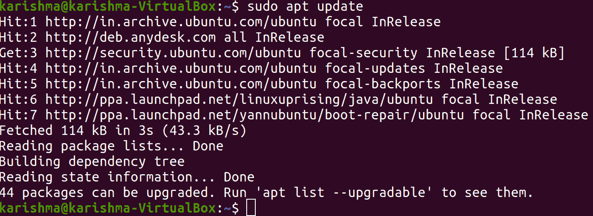
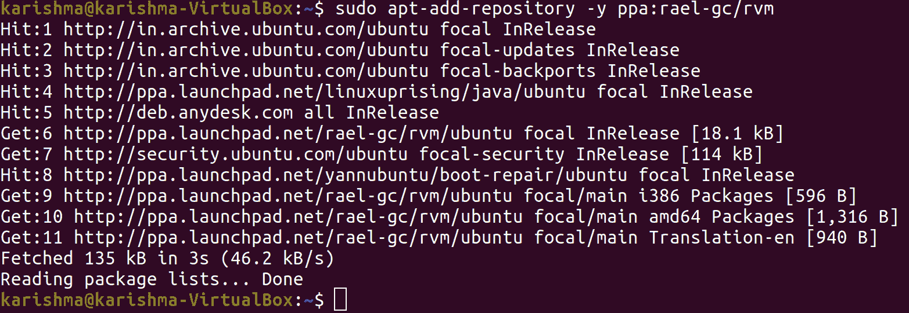
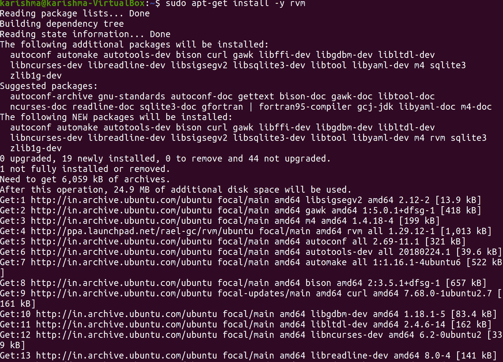

# 安装 RVM Ubuntu

> 原文：<https://www.javatpoint.com/install-rvm-ubuntu>

***【RVM】***支持几乎所有 Windows 和类 Unix 系统(在 Ubuntu 上的 Windows 上有 ***Bash*** 或 ***Cygwin*** )。基本需求是 ***curl、gpg2、bash、*** 以及整体 GNU 版本的工具，但是 ***RVM*** 正在尝试自动检测，然后安装任何需要的东西。

***【RVM】***是 ***红宝石版本管理器的简称。*** 它是一个类似 UNIX 的操作系统的软件平台，是为管理类似设备上的多个 ***Ruby 安装*** 而开发的。 ***Ruby*** 的整个环境包括 Ruby 的 ***解释器，已安装的 RubyGems、*** 和 ***文档*** 将被分区。然后，开发人员可以在不同的版本之间切换，以处理具有不同版本需求的各种项目。

Ruby 的标准 ***解释器，*** 包含在 ***核磁共振成像中，RVM*** 作为其他几个 ***Ruby 实现的安装器工作。*** 这些包括 ***Rubinius、Maglev、IronRuby、MacRuby、mruby、jruby、Topaz、Ruby Enterprise Edition、*** 和 ***GoRuby*** (针对 ***代码高尔夫优化的解释器)。RVM*** 为安装 ***核磁共振补丁版本提供支持。***

***【RVM】***为来自 ***【宝石组】*** 的红宝石组织提供了许多功能，这是一组由命名空间和相关安装的 ***红宝石隔离的宝石。gemset***可以与使用 RVM 专有文件的项目/目录相关，即。 ***rvmrc。*** 使用文件的替代，即 ***。rvmrc*** (而基本目的不过用户专用 ***)。jrubyrc*** )及其格式是 ***的应用。宝石镶嵌*** 和 ***。与其他 RVMs 兼容的 ruby 版本*** 文件，如 ***chruby*** 和 ***RBenv。*** 使用文件还需要信任，以防止未经授权的代码执行，而 ***。*红宝石版**不要。

## 使用 RVM 解释 Ruby 安装

我们可以用三种不同的方式安装和配置 Ruby 版本管理器，下面列出并解释了这三种方式:

**1。单用户安装(建议):**对于用户的 ***$HOME*** 目录中的单独安装，而不是 ***sudo*** 或 ***root。***

**2。多用户安装(建议服务器管理员使用):**适用于系统中每个用户都可以使用的安装。此外，它曾经被称为 ***全系统安装。*** 在不知情的情况下使用这种安装会导致很大的安全风险。

#### 注意:单用户安装取代了多用户安装。

**3。混合模式安装:**用于系统上每个用户都可以使用的安装，在用户的 ***$HOME*** 目录中有分开的宝石/红宝石。安装说明与多用户安装相同，唯一不同的是用户的环境。

## RVM 基础

RVM 不仅使安装一个以上的***【Ruby】***运行时/解释器变得一致和容易，它促进了几乎所有 ***Ruby 安装都不支持的方面，如 ***宝石套装*** 。*** RVM 使我们能够使用不同类型的红宝石，而不会干扰我们现有的 Ruby 安装，并使我们能够在独立的终端中同时执行多种类型的 Ruby。

### 社区维护项目

***Ruby 版本管理器*** 由 ***社区*** 通过拉取请求和问题跟踪器来支持和维护:

*   对所有项目中的***RVM 的 GitHub 组织，*的**
*   尤其是***【RVM】***项目的 ***问题跟踪器*** 。

### 生产

***【RVM】***使我们能够利用其完全专用和独立的环境部署所有项目，从特定的 ruby 版本，一直到运行我们的应用程序所需的一组明确的宝石。拥有一套明确的宝石忽略了项目之间的版本问题冲突，这会导致难以追踪的 bug 和数小时的脱发。

### 发展

***Ruby 版本管理器*** 可以从其 ***API*** 的 ***命令行降低几个 ***Ruby*** 开发角度的复杂度。*** 我们的 ***开发、Q/A、Staging、CI、*** 和 ***生产环境*** 与 RVM 可以有自成一体的相同环境。不再有隐藏的赞赏，如果它实现了其中的一个，那么它将实现其中的每一个。

我们可以使用命名的 gemsets 立即可靠地将修改从一个环境推送到另一个环境。RVM 是 Ruby 的应用程序，而不仅仅是 Rails 的应用程序。 所有基于 ***Ruby 的*** 应用程序都将从我们对 RVM 的使用中受益。

### 测试

***Ruby 版本管理器*** 使我们能够非常一致且轻松地测试 ***逃避*** 和 ***升级路径*** 。我们可以用 RVM 同时针对不止一个版本的 Ruby 执行 rake 任务、测试套件、gem 和基准测试命令。这意味着我们可以轻松地确保我们的应用程序在 ***Ruby 1.8.X、MRI 1.9.1、REE、jruby、*** 等中实现....并迅速披露任何他们不知道的领域。

### 创业板的管理

***【RVM】***包含一个极其成型的 ***宝石管理系统*** ，被称为 ***命名宝石套装。***RVM 的 ***【宝石套装】*** 使搬运宝石跨越多个 ***红宝石版本*** 成为非发行品。RVM 使我们能够向应用程序的存储库中添加一个小的文本文件，而不是签入几个宝石，这将不必要地扩大存储库的大小。

此外，RVM 的 gemset 管理应用了缓存的基本目录，因此所有 gems 只有一个下载版本驻留在磁盘上，而不是许多副本。***【RVM】***支持确保每一个 ***Ruby*** 方面都完全包含在用户空间中，非根，强烈鼓励更安全的使用。

使用 RVM 红宝石有助于实现出色的系统安全性，从而降低风险并减少系统的整体停机时间。此外，由于每个进程都是在用户级别执行的，合成的 Ruby 进程不能合成整个系统。

## 从 RVM 开始

首先，我们必须确保安装 ***RVM。*T3】**

## 安装后的配置

当我们通过本地 shell 或 ssh 帐户登录时，RVM 会像函数一样被加载。如果出现任何问题，我们可以使用以下链接之一作为配置我们的终端的参考:

*   屏幕工作流
*   zsh 项目
*   XTerm(外省)
*   Windows 上的 Ubuntu
*   l 外部终端
*   konsole(控制台)
*   Gnome 终端

## RVM 的最佳做法

以下是一组最佳实践和技巧，这些实践和技巧已被证实在实践 RVM 的过程中有助于简化开发过程。

### 目录

1.  **对我们所有的单个项目使用文件，即 rvmrc。**
    An ***rvmrc*** (项目特定)使我们的通用工作流程自动化变得方便。它不仅使我们能够在使用应用程序时自动切换许多红宝石，还可以方便地自动引导环境。
2.  **在源代码管理中检查我们的 rvmrc。**
    通过用我们的应用程序在源代码管理中检查项目的***【rvmrc】***文件，我们确保每个用户在使用我们的项目和 RVM 时都有一个一致的环境，还通过自动化安装***【gemset】***等。
    同样，我们可以通过在项目目录中编码来引导任何项目，假设我们在 ***$HOME/中有***export rvm _ project _ rvmrc = 1***文件。rvmrc*** 文件。
    除此之外，我们还可以通过设置特定于应用程序的平台来自动启用我们的部署，即使我们正在应用 passenger。
3.  **应用每个项目的宝石套装**
    在这个列表中， ***应用每个项目的宝石套装*** 使得所有的应用都有它们不同的宝石环境，支持我们忽略通过冲突版本产生的问题。它涉及应用类似***[【邮件保护】](/cdn-cgi/l/email-protection)***的东西，而不是***【2 . 1 . 1】***如果选择一个 ***红宝石*** (例如，在我们的***rvmrrc***)。
4.  **如果可能的话用 RVM 设置**
    使用 RVM 开发不仅是一个好主意，如果可能的话，用 RVM 设置我们的应用程序也是一个好主意。它带来了特定于应用程序的平台的共同好处，但也方便了在开发后期跟踪生产中出现的 bug(特定于版本)。
    首先，这是因为它合理地确保了两者之间的一致平台。***【RVM】***可以通过命令支持我们用它，也就是***【rvm 升级】*** 如果到时候升级我们的 ***Ruby*** 就更好了。
5.  **将 RVM 整合到选择的工具中**

## RVM 的结构

***【RVM】***包含一个位于 ***$rvm_config_path*** 文件中的配置目录，对于像用户一样的普通安装，它们的目录，即 ***$HOME*** 将位于 ***~/。rvm/config/*** 文件。

## 默认

RVM 收集了以下文件中记录的虚假信息:

```

$rvm_config_path/db

```

上面的文件在我们升级 RVM 的时候都被替换了，所以不要编辑它。

### 覆盖默认设置

另外，***【RVM】***包含一个目录供所有用户覆盖定位在 ***$rvm_path/user*** 文件中。我们需要将精确的 key=value 放入该文件夹的 db 文件中，以覆盖 ***RVM 的默认设置。***

```

$rvm_path/user

```

然后，***【RVM】***将应用这些设置，而不是 RVM 的默认值。

## 准备安装我们的操作系统

在安装 RVM 之前，我们需要安装 3 个库:

*   **GPG:** 是验证应用程序来源的加密程序
*   **Bash:** 是运行下载脚本的程序。
*   **Curl:** 是一个下载脚本的程序，将安装 RVM。

大多数操作系统都将使用这些预安装的软件包，因此在下载之前请先进行检查。

### 使用命令终端

在本文中，我们将参考命令行或终端。对于大多数操作系统来说，这是我们应用程序的名称，它使我们能够输入将通过系统解释的命令。 ***MacOS*** 包含一个 ***终端仿真器，Windows*** 包含一个 ***控制台，*** 和 ***Linux*** 也包含一个 ***控制台。***

### 验证安装的来源

密码方面，RVM 签署了所有需要下载验证的版本。我们将通过在命令行中执行以下命令来配置 RVM 验证签名所需的相关密钥:

```

gpg --keyserver hkp://pool.sks-keyservers.net --recv-keys 409B6B179 6C275462A1703113804BB82D39DC0E3 

```

```

7D2BAF1CF37B13E2069D6956105BD0E739499BDB

```

上面的命令将把提供的密钥添加到我们的本地密钥存储中，并启用 RVM 安装验证，并在执行时显示以下输出:

该输出显示两个重要的公钥被添加到本地存储中。如果安装了 RVM，将根据这两个密钥来验证来自源的文件。

### 安装 RVM

与其他操作系统相比，RVM 的安装过程中，Ubuntu 操作系统的步骤略有不同。Windows 操作系统仅在将 Windows 的子系统用于 Linux 时受支持，并应用与用于 Linux(Ubuntu 除外)和 macOS 类似的指令。

### 安装在 Ubuntu 中

Ubuntu 操作系统包含一个专用的包，可以在包管理器的帮助下进行安装，即 ***apt-get。*T3】**

## 安装使用个人软件包所需的库

我们需要安装 ***软件-属性-通用*** Ubuntu 包，以允许包含 ***【个人包档案】*** (或***【PPA】***)。

我们需要打开命令行窗口并执行以下命令:

```

$ sudo apt-get update

```



```

$ sudo apt-get install -y software-properties-common

```


以上命令将借助当前引用更新包管理器，即 ***apt-get*** ，然后安装库，即 ***软件-属性-通用*** ，允许包含 RVM PPA。

我们需要执行以下命令来验证旧命令是否成功运行:

```

dpkg-query -Wf'${Status}' software-properties-common

```


上述命令将查询包管理器，以验证所提供的包是否安装正确。如果此命令成功运行，我们的命令行窗口将显示以下消息。

```

install ok installed

```

## 包括代表 RVM 的 PPA

具体来说，在以下命令的帮助下，为 RVM 添加 ***个人包档案*** 。该命令将添加一个包含 RVM 二进制文件的存储库，并允许安装:

```

sudo apt-add-repository -y ppa:rael-gc/rvm

```



上面的命令将把存储库添加到 Ubuntu 的内部列表中。它适用于启用 RVM 安装。

### 安装 RVM

我们需要更新我们的安装程序，然后通过在终端中执行以下命令来安装 RVM:

```

$ sudo apt-get install -y rvm

```



该命令将安装 RVM 的应用程序，并为应用程序提供准确的权限。选项 ***-y*** 将跳过安装时的确认请求。

## 使用 RVM 验证安装是否正确

我们将在终端中执行以下命令，第一次从 RVM 开始。它只需要在安装过程后执行一次:

```

source /etc/profile.d/rvm.sh

```

上面的命令将运行脚本，并允许我们在终端的最新终端中执行 RBM。我们需要指示 RVM 返回当前安装的版本，以确保我们的 RVM 通过在终端中执行以下命令来正确工作:

```

rvm -version

```


上面的命令将显示我们的操作系统上安装的最新 RVM 版本。

## 安装 Ruby

我们将借助***【RVM】***使用***【rvm 安装】版本号>***命令安装一个 ***红宝石版本*** 。我们需要在终端中执行以下命令来安装特定版本的 Ruby:

```

rvm install 2.6.3

```


根据我们的操作系统，该命令可以编译 Ruby 的二进制文件，或者从源代码中应用预编译的二进制文件。如果使用源代码编译，可能需要一些时间才能完成。

我们将在终端中执行以下命令，以检查此安装是否正确实施:

```

rvm list

```


它将列出 RVM 处理的每一个已安装的 Ruby 版本。

* * *