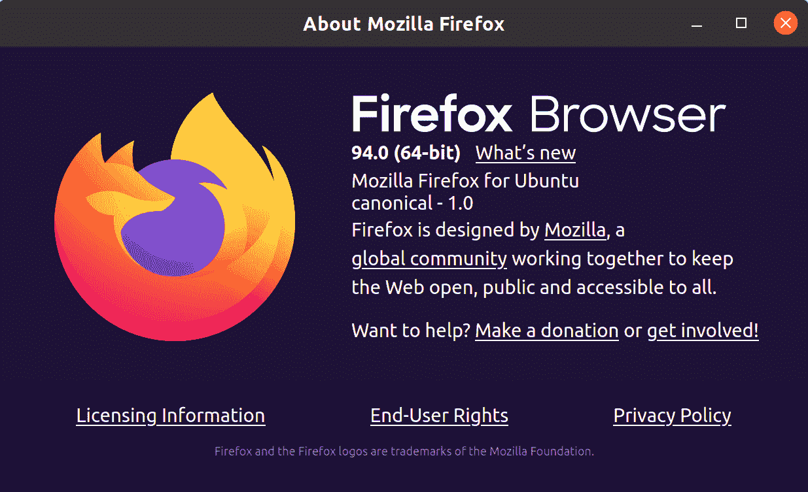
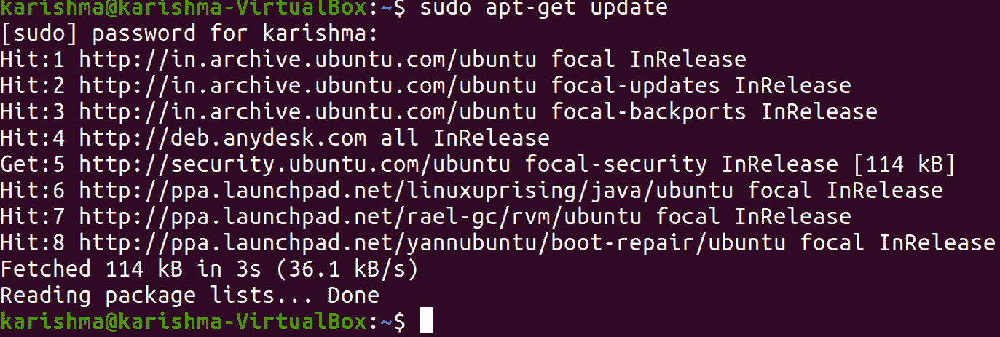
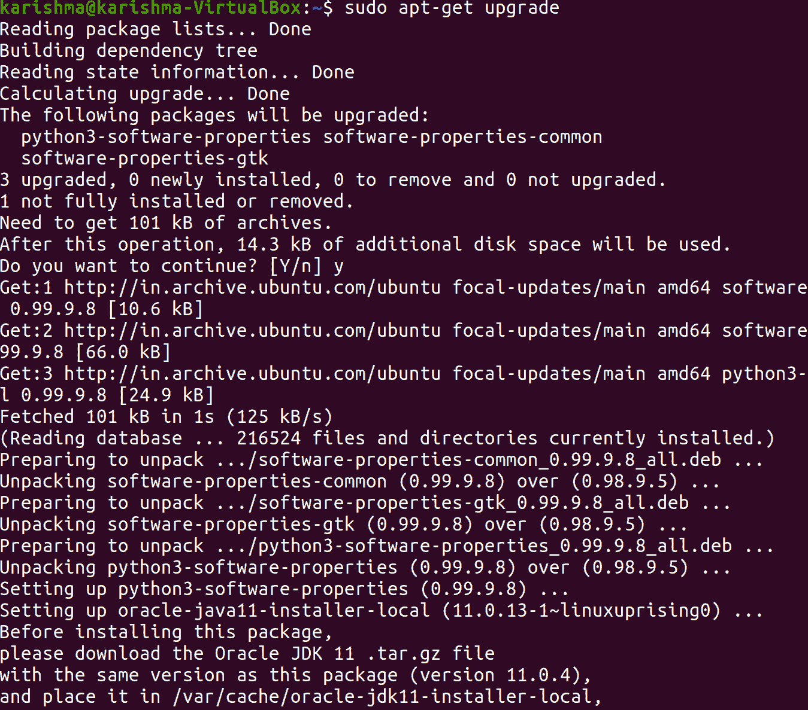

# 更新火狐 Ubuntu

> 原文：<https://www.javatpoint.com/update-firefox-ubuntu>

使用旧版 ***【火狐】*** 版本上网存在各种安全隐患。在旧版本中，已知的安全漏洞可能会引起黑客的注意，破坏系统安全。火狐必须保持最新，以最大限度地降低安全风险。Firefox 是 Ubuntu 上的默认浏览器。

此外，它是在 Ubuntu 安装时安装的。但是在编译 Ubuntu 的安装盘时使用了最新的 Firefox 版本，安装过程结束后必须更新。 ***【乌班图】*** 和 ***火狐*** 使用不同的发布和更新周期。由于与默认安装的这种差异，我们可能会获得火狐的早期版本。

***网络浏览器*** 可以说是我们系统中最重要的软件。我们使用许多网络浏览器来维护网上银行的社交网络。所有的黑客都会利用我们浏览器的漏洞来攻击我们的系统，窃取重要的数据，所以我们保持浏览器的更新是非常必要的。

要查看当前安装的火狐版本，我们需要打开命令行终端并输入以下命令:

```

$ firefox -version

```


## 安装并更新开发人员版本

有了稳定和常规的版本，火狐也发布了开发者版本。开发人员版本包括最新的功能和更新。Firefox 提供了这些功能和更新，但没有经过测试，因此这些版本可能包含 bug，或者可能没有按照预期实现。

如果我们使用 ***【火狐】*** 只是为了上网或者作为普通用户，使用这些版本是没有要求的。此开发人员版本仅面向希望用新版本测试其程序或应用的开发人员、安全测试人员、程序员或管理员。

默认情况下，Ubuntu 不会安装和更新开发者版本。如果我们出于开发目的需要这个版本，那么我们可以使用以下命令安装它:

```

$ sudo add-apt-repository ppa:ubuntu-mozilla-security/ppa

```

```

$ sudo apt-get update

```

```

$ sudo apt-get install firefox

```


*   第一个命令将为开发者版本添加一个存储库。
*   第二个命令将更新存储库。
*   第三个命令将安装火狐浏览器。

## 使用带快照存储的 Ubuntu 软件管理器安装火狐

对于一个不太想使用终端窗口的用户来说，从用户界面安装 Ubuntu 存储库中的任何可用软件都非常容易。

*   我们需要在我们的 Ubuntu 桌面的 ***活动工具栏*** 上选择图标，即 ***Ubuntu 软件*** 。
*   按下搜索图标，在搜索栏中输入 ***【火狐】*** 。我们会在搜索结果中找到 ***火狐*** 。
    
*   按下按钮，即 ***安装*** 开始安装过程。
*   将显示一个验证对话框，让我们给出我们的验证细节，因为授权用户只能在 Ubuntu 中安装软件。
    我们需要输入我们的密码并按下按钮，即 ***认证。***
*   之后，安装过程将开始，并显示一个进度条。
*   然后， ***Mozilla Firefox*** 浏览器将安装在我们的系统上。

### 启动火狐

现在， ***【火狐】*** 应该会出现在我们的系统 ***活动/Dock 面板中。*** 同样，我们可以使用 ***Ubuntu 应用启动栏*** 访问它，或者使用应用列表直接访问它。


### 正在删除火狐

如果我们想删除借助上述方法安装的 ***火狐*** ，那么我们可以使用以下方法将其从系统中删除:

*   我们需要选择 ***Ubuntu 软件中心*** 并打开。
*   然后，我们将搜索 ***火狐。*T3】**
*   我们将在搜索条目中找到安装状态。
*   按下此条目并按下 ***移除*** 选项。
*   系统会要求我们进行身份验证，并出现一个对话框。当我们给出根用户的密码并按下身份验证选项时，应用将被删除。

## 如何检查安装的火狐版本

我们需要按照以下步骤检查当前安装的火狐版本:

1.  首先，我们需要启动 ***火狐*** 浏览器。
2.  按下 ***菜单上的*** 图标。
3.  使用打开的菜单选择*帮助选项。*
**   使用打开的上下文菜单，按下关于火狐的*选项。
    **

 **版本信息将显示在打开的弹出窗口中。

如果不是最新版本，我们可以将火狐版本更新到当前版本。我们可以按照下面解释的技巧来做。

## 如何更新已安装的火狐版本

***火狐浏览器*** 作为核心扩展安装在 Ubuntu 上。Ubuntu 自动为这些核心扩展建立和配置强制存储库，以便于管理。这些存储库包含了 Ubuntu 管理核心扩展所需的所有必要细节。

我们可以用下面提到的两种方式使用这些存储库更新核心扩展:

1.  更新整个系统
2.  单独更新扩展

### 更新整个系统

如果我们实现一个系统更新，每个核心扩展都会更新到它们稳定的最新版本。此外，***火狐****也会更新，因为它也是这些核心扩展的一部分。*

 *我们需要将系统连接到互联网，并执行以下命令来实现系统更新:

```

$ sudo apt-get update

```



```

$ sudo apt-get upgrade

```



*   ***第一个命令*** 将调整和更新每个配置的存储库。Ubuntu 在这个过程中实现了各种必要的任务，如下载、安装和导入必要的公钥，检查每个配置的存储库是否可访问，将安装的包(本地)与可用的包(远程)进行比较，以准备可用的更新列表等。
    *   软件包管理(删除/添加存储库、删除/安装软件等)需要 root 用户的权限。
    *   安装过程中的用户帐户具有我们创建的强制权限。如果提示进行身份验证，请输入该帐户的密码。
*   第二个命令*将使用已配置的存储库提取所有可用的更新，然后安装它们。

    *   如果我们的系统连接到没有任何数据限制的高速互联网连接，这个选项可以是我们的首选。
    *   它可能会消耗大量的时间和数据，因为这个选项会集体更新每个系统包和扩展。如果我们的 internet pack 中有受限制的数据，或者我们与 internet 的连接速度很慢，我们就不应该应用此选项。* 

 *检索并安装每个更新后，我们需要使用以下命令重新启动系统:

```

$ reboot

```

#### 注意:不需要重新启动命令，但这是清理包的剩余部分和缓存的最简单方法。

再次检查火狐浏览器的版本，确认重启系统后是否更新。

### 单独更新火狐

如果我们希望只更新火狐，因为任何原因(如低余额数据或缓慢的互联网连接)，那么我们需要使用以下命令:

```

$ sudo apt-get update

```

```

$ sudo apt-get install --only-upgrade firefox

```


*   第一个命令将如上所述调整和更新每个已配置的存储库。
*   第二个命令将只更新 Firefox。

### 启动火狐

我们需要使用以下命令来启动火狐浏览器:

```

$ firefox

```


### 卸载或删除火狐

我们需要运行以下命令来删除火狐浏览器:

```

$ sudo apt-get purge firefox

```

点击***【y】***，卸载过程开始。我们的系统上不会有 ***火狐*** 浏览器。

在清除包的缓存之前，火狐的版本信息不会更新。我们需要您使用以下命令或重新启动系统来清理包缓存:

```

$ sudo apt-get clean

```

一旦数据包缓存被清除，我们需要再次检查火狐的版本来验证更新。

* * *****