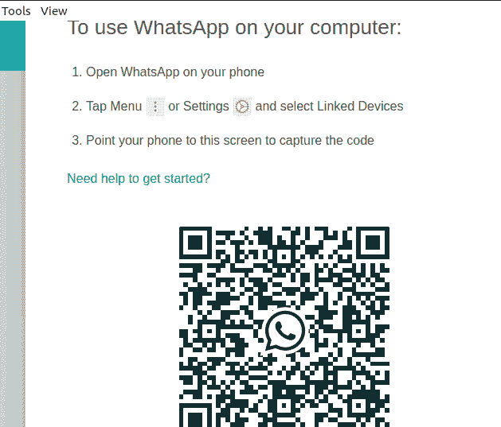
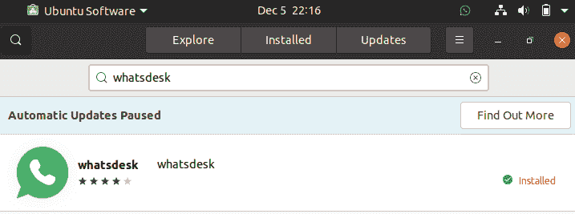

# 华沙普乌邦图

> 吴奇珍:t0]https://www . javatppoint . com/whatsapp-Ubuntu

***WhatsApp*** 是一款 ***消息应用(免费)*** ，全球超过 10 亿用户使用。WhatsApp 提供可靠、安全的视频和语音通话，可以通过蜂窝或无线数据连接在国际或本地进行。此应用程序可用于多个设备，如电话、平板电脑和计算机。

尽管如此，在 WhatsApp 的网站上并没有任何 Linux 下载链接。在 Ubuntu 中安装 WhatsApp 是可能的。在本文中，我们将学习一些在 Ubuntu 中安装 WhatsApp 的方法。

几个社交媒体网站的受欢迎程度已经超越了手机，在电脑和笔记本电脑中也找到了一席之地。在我们的桌面上使用 WhatsApp 有各种好处。我们可以更快地发送文件夹和文件。视频和音频文件以及图像可以快速传输，因为桌面或笔记本电脑上有足够的存储空间，不像我们的智能手机。

我们也可以从我们现有的 WhatsApp 帐户登录，或者为我们所有计算机的 WhatsApp 建立一个新帐户。

## Whatsapp 简介

WhatsApp 应用可以描述为手机即时通讯的跨平台客户端，在订阅业务模式下实现。该应用程序使用互联网，借助标准蜂窝智能手机号码向其他用户发送音频媒体消息、用户位置、视频、图像和文本消息。

极其著名的 WhatsApp 消息应用程序令人惊讶地没有提供桌面客户端。虽然更好的部分是他们考虑了这个问题，然后为所有用户推出了 WhatsApp 应用程序 web 选项。

2015 年，WhatsApp 应用推出了第一个网页版，借助谷歌 Chrome 和手机的网络连接(无论是 Wi-Fi 还是手机数据)，我们可以在桌面上使用 WhatsApp。

WhatsApp web 实现的方式相当不错。但是，仍然有一些用户希望在他们的系统上安装桌面客户端(专用)。虽然，可悲的是没有 WhatsApp 客户端(官方)可用。

然而，有一些第三方应用程序，如 ***【弗朗兹】*** 和***whatsdssk***是可用的，我们可以使用这些应用程序在我们的 Linux 发行版上运行 WhatsApp。

*   ***Franz*** 可谓是 WhatsApp、Telegram、Slack、Facebook Messenger 等社交媒体应用和平台的消息应用。
*   这是一个单一的环境，允许我们根据需要多次添加不同的服务。
*   因此，我们很容易同时处理多个私人和商业账户。
*   我们可以很容易地从 ***Franz WhatsApp 客户端*** 开始。我们还可以免费为我们的苹果、视窗和 Linux 系统下载软件。

## 在 Linux 桌面上使用 WhatsApp

#### 注意:每种方法都需要我们将我们的 Linux 电脑或手机连接到互联网，否则它们将不起作用。

### 在 Linux 上安装 Whatsdesk WhatsApp 桌面客户端(非官方)

***Whatsdesk*** 是 Linux 中一个方便的 WhatsApp 客户端(非官方)。它是由 ***古斯塔沃·冈萨雷斯*** 创建的，它的代码出现在 ***Gitlab*** 上。这个 WhatsApp 客户端的工作方式与 WhatsApp 网络非常相似。但是，这些客户端之间的唯一区别是，我们在 Linux 机器上安装了一个 WhatsApp(专用)。

我们可以用一些方法把它安装在我们的 Linux 系统上。但是，安装它最简单的选择是借助终端。

*   我们需要同时按下 ***CTRL+ALT+T*** 来打开终端。
*   然后，我们需要执行以下命令:

```

$ sudo snap install whatsdesk

```


*   我们需要进入菜单，找到安装后的***whatsdssk***。
    
*   我们可以从这里启动这个客户端。
*   我们最终需要使用智能手机扫描二维码，然后登录我们的 WhatsApp 帐户。
    

## WhatsApp 在 Linux 下运行吗？

我们可以在我们的 Linux 操作系统上使用 WhatsApp messenger，包括基本操作系统、Linux Mint 和 Ubuntu，任何执行 Linux 及以上版本的软件都可以毫无问题地使用 WhatsApp。令人惊讶的是，WhatsApp 没有任何 Linux 桌面客户端。它支持***【macOS】***和 ***Windows*** 平台，但不支持 Linux。

借助 WhatsApp，我们可以在全球智能手机上免费获得安全、简单、快速的通话和信息。如果我们唯一的选择是通过台式电脑链接，那么只支持 macOS 和 Windows 平台。

如果我们有一台 Linux 机器，那么我们对于桌面客户端(官方)来说是幸运的。有几个 Linux 应用程序可能会给我们带来类似于 WhatsApp 的体验，我们将在 macOS 和 Windows 平台上获得类似的体验。但是他们没有得到 WhatsApp 的官方支持。如果我们不能为 Linux 机器获得一个专用的 WhatsApp 桌面客户端，那么我们可以使用著名网络浏览器支持的 WhatsApp 网络客户端。

当我们有了 Ubuntu 操作系统后，就有了下载 WhatsApp 的程序，解释如下:

**第一步:下载安卓模拟器**

我们可以通过考虑在我们的 Ubuntu 操作系统上下载 WhatsApp 的“[https://dl.google.com/android/android-sdk_r16-linux.tgz](https://dl.google.com/android/android-sdk_r16-linux.tgz)”链接来安装安卓模拟器。
在我们的系统上成功安装后，我们的电脑上会出现一个屏幕，显示各种文件。在文件中，我们需要按下 ***【工具】*** 然后选择，即 ***【安卓】*** 。最后按选项，即 ***【安装包】*** ，再按选项 ***【全选】*** 即可下载。这可能需要几分钟，因此，我们应该有耐心。

**第二步:选择 AVD**

在安装过程中，我们的屏幕上会弹出一些与索尼、宏达、摩托罗拉或其他公司相关的宣传信息。我们可以取消这些窗口。接下来，进入 ***【工具】*** 菜单，选择 ***【管理 AVD 的*** 选项。然后，按下选项，即 ***【新增】*** ，需要填写详细信息。详细信息填写成功后，按 ***【创建 AVD】***选项。

**第三步:选择操作系统**

将出现一个新窗口，我们应该在其中按下选项，即 ***确定*** 。然后，我们需要返回到 AVD 的选择窗口，必须选择 ***【安卓 2.3】***版本。按下 ***【开始】*** 选项，一个窗口将代表。按下 ***“启动”*** 选项创建最终默认值。

**第四步:找到 WhatsApp**

一旦 ***安卓仿真器*** 被修复，我们可以借助搜索栏找到***【WhatsApp for Ubuntu】***应用。按照步骤下载并安装应用程序。安装过程完成后，我们可以在应用菜单上找到***【WhatsApp for Ubuntu】***图标。

**第五步:按 WhatsApp，输入需要的详细信息**

我们可以继续使用现有号码，也可以建立一个新账户。因此，这一过程意味着安装***【WhatsApp for Ubuntu】***的结束，我们可以继续使用他们的服务和我们在智能手机上无法获得的优势。

## 用图形用户界面安装 WhatsApp

WhatsApp 的官方客户端不适用于 Linux 计算机。相反，我们可以使用一个官方的***whatsdssk***客户端，它将镜像官方客户端的网络版本功能。

**第一步:**首先我们会要求打开我们的 ***Ubuntu 软件应用程序*** 。点击超级键，并在搜索栏中输入应用程序的标题。

**第二步:**打开我们的**下 *Ubuntu 软件应用*下**。我们应该收到软件的目录。然后，我们希望通过屏幕左上角应用程序中的搜索栏进行导航。

**第三步:**输入 WhatsApp，选择***whatsdssk***应用，与下面截图中的应用类似。



**第四步:**我们可以在安装后用 Ubuntu 仪表盘选择执行程序。

打开客户端下的二维码图片，即***【Whatsdesk】***，我们会得到一些如何使用该应用的指导。


## 用命令行安装 WhatsApp

对于第二种方法，我们将使用 snap 命令从其 snap 包中获取 WhatsApp 应用程序。Snap 是围绕几个发行版实现的包，用于 Linux 中最新实用程序和应用程序的安全操作和交付。

**步骤 1:** 我们可以应用快照命令来安装、配置、刷新和删除快照。默认情况下，最新的 Ubuntu 版本已经安装了*快照选项(快照包管理器)。因此，我们可以如下应用安装 WhatsApp 的命令:*

 *```

$ sudo snap install whatsapp-for-linux

```


**第二步:**我们可以使用应用启动器使用应用，也可以在安装好 WhatsApp 后，输入下面的命令通过终端打开 WhatsApp。

```

$ whatsapp-for-linux

```


## 在 Ubuntu 中使用 WhatsApp 网络版

在前面的章节中，我们解释了如何为 Ubuntu 安装一个专用的 WhatsApp 客户端。但是，我们也可以在 Linux 中使用 WhatsApp，而无需安装任何其他东西。

有一个官方的 WhatsApp 网络版本，可以从任何浏览器访问，消除了桌面官方应用程序中可用的任何操作系统限制。

**第一步:**我们可以在[web.whatsapp.com](https://web.whatsapp.com/)访问 ***WhatsApp 网络客户端*** 。

**步骤 2:** 关于如何使用 WhatsApp 的进一步说明将在应用程序中进行管理，就像在 Ubuntu 中安装 WhatsApp 的其他技术一样。也就是说，我们需要用手机扫描二维码。

* * **