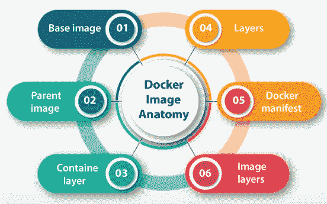
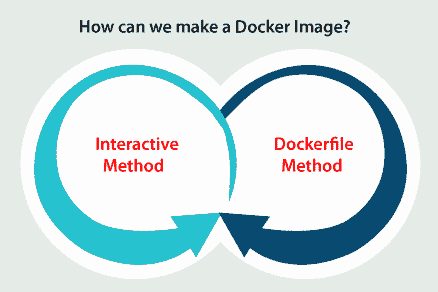

# Ubuntu 图像坞站

> 哎哎哎:# t0]https://www . javatppoint . com/docker-Ubuntu 映像

码头工人图像可以被描述为用于在码头工人的容器中执行代码的文件。码头工人图像充当用于构建码头工人容器(例如模板)的一组指令。此外，如果使用 docker，docker 图像充当起始点。在虚拟机环境中，快照相当于映像。

Docker 用于在容器中创建、运行和部署应用程序。docker 映像包括应用程序代码、依赖项、工具、库以及运行任何应用程序所需的其他文件。如果用户执行一个图像，它可以成为容器的许多或一个实例。

Docker 图像包含多个层，它们源自旧层，但与旧层不同。

*   这些层可以加速 docker 的构建，同时减少磁盘的使用并提高可重用性。
*   另外，图像层是只读文件。
*   不可改变图像的头部包括可写层，一旦容器建立，允许用户进行修改。
*   在 docker 容器和图像中，引用可能会混淆磁盘空间。
*   有必要区分虚拟大小和正常大小。
*   正常大小是指容器的可写层应用的磁盘空间，而虚拟大小是用于可写层和容器的磁盘空间。
*   图像的只读层可以从相似的图像开始在容器之间分布。

## Docker 的用例

docker 映像包含执行容器化应用程序所需的一切，如库、运行时、环境变量、配置文件和代码。当一个映像被部署到 docker 环境中时，它可以作为 docker 容器运行。docker 的 run 命令从一个特定的图像建立一个容器。

docker 映像是可重用的资产，可以在主机上部署。开发人员可以从单个项目中获取静态图像的图层，并将其应用到另一个项目中。它节省了用户的时间，因为他们不需要使用 scratch 重新创建任何图像。

## 码头工人图像码头工人容器之间的区别

docker 容器可以描述为在应用程序开发中使用的虚拟化运行时环境。它用于创建、运行和部署通过底层硬件分离的应用程序。docker 容器可以使用一台机器，分发其内核，并虚拟化操作系统以执行更多独立的进程。因此，docker 容器是轻量级的。

docker 映像与其他类型虚拟机环境中的快照相同。它是码头工人集装箱在特定时间点的记录。此外，docker 映像是不可变的。它们可以删除、共享或复制，但不能更改。该功能有助于测试软件的新配置，因为无论发生什么情况，映像都不会改变。

容器需要一个可运行的映像来保留。它们依赖于图像，因为它们用于构建运行时环境，并且是执行应用程序所必需的。

## 图像解剖学

docker 映像包含几个层，所有映像都包含配置容器环境所需的一切:依赖项、工具、系统库和其他文件。下面提到并解释了一些图像部分:

### 1.基本图像

用户可以在 build 命令的帮助下从头开始创建这个初始层。

### 2.父图像

父图像可以是 docker 图像中的初始层，作为基础图像的替代。这是一个重复使用的图像，作为其他图像的基础。

### 3.容器层

docker 图像不仅创建了一个新的容器，还创建了一个容器或可写层。它托管对活动容器所做的修改，并保存新删除和写入的文件，以及对现有文件的修改。此外，该层用于定制容器。

### 4.层

许多层在代码的帮助下被连接到基础图像，该代码将允许它在容器内执行。所有码头工人图像层在***/var/lib/码头工人/aufs/diff*** 目录上或通过命令行界面中码头工人的历史命令可见。

docker 的默认状态是显示每个顶层图像，如文件大小、标签和存储库。缓存了一个中间层，使顶层便于查看。Dockers 包含管理图像层内容管理的存储驱动器。

### 5.码头工人清单

这个 docker 图像部分是一个额外的文件。它使用 JSON 格式来描述带有数字签名和图像标签等信息的图像。

## Docker 映像的存储库

docker 映像存储在公共或私有存储库中，如 ***Docker Hub、*** 云注册服务中的存储库，所有用户都可以从中使用容器并共享和测试映像。 ***Docker Hub*** 的 ***Docker 可信注册表*** 也提供访问控制和映像管理功能。

官方形象是 Docker 生成的形象，而社区形象是 Docker 用户制作的形象。 ***CoScale 代理*** 可以用 Docker 检查 Docker 应用的官方形象来形容。 ***Docker-dd-agent/Datadog，***Docker 的一个容器，用于在 ***Datadog 的日志管理程序中的代理。***

这是社区码头工人形象的一个例子。

*   此外，用户可以在现有图像的帮助下制作新图像，并应用 Docker 的推送命令在 Docker Hub 上上传自定义图像。
*   Docker 便于在简报前向制作人反馈，以确保社区图像质量。
*   一旦图像发布，制作者就有责任进行更新。
*   如果从其他方获得任何图像，制作者应该谨慎，因为所有攻击者都可以从为跟踪用户而创建的模仿图像中访问计算机，从而认为这些图像来自可信来源。
*   最新的图像概念也可能引起混乱。以 ***为标题的码头工人图像”。最新的“*** 本质上并不是典型意义上的最新。
*   最新的标签并不是指目前推送发布最多的一张图片；简单来说，这是一个默认标签。

## 我们如何制作码头工人形象？

所有的码头工人图像都可以通过 ***码头文件*** 或 ***交互式*** 方法创建。下面列出并解释了这两种方法:

### 文件方法

这个方法需要建立一个纯文本 ***Dockerfile。*** 这个 ***Dockerfile*** 建立了创建图像的规范。这个程序比较耗时和困难，但是在持续交付的环境中做得非常好。该方法包括建立 ***文件*** ，并包括图像所需的命令。

一旦 ***文件*** 开始，用户构建一个文件，即 ***文件*** 文件，用于排除最终帧不需要的文件。文件，即***dockrignore***驻留在根目录中。Docker 的 build 命令用于创建 Docker 图像、图像的名称以及设置标签。Docker images 命令用于查看创建的图像。

### 互动方法

用户使用 Docker 的现有映像执行容器，并在保存映像之前手动对环境进行任何必要的修改。这种方法是创建 Docker 映像最简单的方法之一。第一步是打开任何终端会话并启动 Docker。

然后，应用 Docker 的 run 命令，即 ***image_name:tag_name。*** 它与通过图像启动的容器一起开始一个外壳会话。如果省略了标签的名称，Docker 将应用图像的最新版本。图像必须出现在其后的结果中。

### 互动方法的优势

这是创建 Docker 映像最简单快捷的方法。测试已确定的依赖关系和非常过时的进程并排除其故障是徒劳的。

### 交互式方法的缺点

它有一个复杂的生命周期管理，需要手动重新配置(容易出错)许多实时交互过程。使用不必要的图层更容易设计未优化的图像。

## Docker 映像的命令

根据 Docker，有多组 Docker 的主映像命令。这些命令分为许多子命令。下面提到并解释了其中一些命令:

*   **Docker 图像构建:**它使用***Docker 文件构建图像。***
*   **Docker 映像加载:**它使用 tar 档案或流加载映像，以接收或读取输入 ***(STDIN)。***
*   **Docker 图像检查:**显示多张图像上的信息。
*   **Docker 图像修剪:**删除未使用的图像。
*   **Docker 映像推送:**它将存储库或映像推送到注册表。
    **Docker 图像拉取:**它通过注册表拉取存储库或图像。
*   **Docker 图像保存:**它将多个图像保存到 tar 存档(默认情况下流式传输到*)。*
**   **Docker 图像 rm:** 它移除多个图像。*   **Docker 图像标签:**它制作了一个 ***TARGET_IMAGE*** 标签，引用了 ***SOURCE_IMAGE。****

 *docker 的命令行界面提供了几个用于自定义许多 Docker 映像的命令。下面提到并解释了 Docker 映像的一些命令示例:

*   **Docker 图像历史:**它显示图像的历史，包括应用于图像及其图层的修改。
*   **Docker 标签:**它做了一个类似 ***TARGET_IMAGE*** 标签的标签，可以让所有用户对容器图像进行分组和组织。
*   **Docker 更新:**使用户能够更新容器的配置。
*   **Docker 保存:**它使用户能够将图像保存到归档中。
*   **码头工人搜索:**它在 ***码头工人中心*** 内搜索用户需要的任何东西。
*   **Docker compose:** 用于处理环境的一个变量。
    在 Docker 中工作时，Docker 映像是理解在容器化环境中创建应用程序的重要工具和概念。

### 图像层

构成 Docker 映像的所有文件都称为图层。这些层构建了一个中间图像系列，在阶段内一个在另一个之上创建，其中所有层都依赖于紧接其下的层。我们的层次结构是方便 Docker 映像生命周期管理的关键。

### 父图像

在大多数情况下，Docker 图像的初始层称为父图像。它是创建所有其他层的基础，并为我们的容器环境提供了一般的构建块。我们可以在公共容器注册中心 Docker Hub 上看到大量现成的应用程序映像，作为我们的父映像。

此外，我们可以在许多第三方服务上看到它们，如 ***谷歌容器注册中心。*** 我们可以应用我们现有的一个图像作为支持来创建新的图像。正常的父映像可能是 Linux 的精简版，或者提供预装的服务，如内容管理系统(CMS 的缩写)或数据库管理系统(DBMS)。

### 基本图像

基本图像可以简单地描述为空的初始层，这允许我们使用 scratch 创建 Docker 图像。这些图像为我们提供了对图像内容的完全控制，但基本上是为 Docker 的更多领先用户设计的。

## 集装箱登记处

容器的注册表是存储位置的目录，称为存储库，我们可以在其中拉和推容器图像。

下面列出并讨论了三种主要类型的注册管理机构:

*   **Docker Hub:** 它是一个 Docker 的官方图片资源，在这里我们可以访问到由软件厂商、Docker 的用户社区、开源项目分发的 100000 多个容器图片。此外，我们可以应用该服务来托管和管理我们的私人图像。
*   **自托管注册中心:**这是许多组织推荐的注册中心模式，这些组织主要倾向于在其内部基础架构上托管容器映像，这通常是由于低延迟要求、合规性考虑或安全性。我们需要使用一个注册服务器来运行我们自己托管的注册表。我们还可以设置我们的私有、虚拟和远程 Docker 注册表。
*   **第三方注册管理机构服务:**该注册管理机构是完全托管的产品，为我们的容器映像提供了一个中心点，便于存储、管理和保护它们，而无需执行内部注册管理机构的任何操作难题。为 Docker 映像提供支持的第三方注册服务实例，如***【JFrog 集装箱注册】*** 谷歌集装箱注册、Azure 集装箱注册、亚马逊 ECR 和红帽码头。

### 文件方法

***Dockerfile*** 方法是企业级和真实世界容器部署的首选方法。这是构建 docker 映像的一种更高效、灵活和系统的方式，也是安全、可靠和紧凑的容器环境的关键。

简而言之， ***Dockerfile*** 方法是一个由三个步骤组成的过程，我们制作 Dockerfile 并包含组装图像所需的命令。

下表显示了我们最有可能应用的那些 ***文件*** 的语句:

| 命令 | 目的 |
| **出发地** | 该命令用于指定父图像。 |
| **工作台** | 用于设置在 ***文件内执行的命令的工作目录。*T3】** |
| **运行** | 它用于安装我们的容器所需的任何包和应用程序。 |
| **复制** | 它用于从特定位置复制目录或文件。 |
| **添加** | 和***【COPY】***命令一样，也可以解压压缩文件，管理远程网址。 |
| 输入点 | 当容器开始时，该命令将始终运行。如果未指定，默认为 ***/bin/sh/ -c*** 。 |
| **CMD** | 所有参数都将传递给 entrypoint 命令。如果未设置 ***ENTRYPOINT*** 命令(默认为 ***/bin/sh/-c*** ，则容器执行的命令将是 ***CMD*** 。 |
| **暴露** | 它用于定义从哪个端口访问我们的容器应用程序。 |
| 标签 | 它用于向任何图像添加元数据。 |

### Dockerfile 方法的优点

它包括可重复的，紧凑的，干净的基于配方的图像。它包括方便的生命周期管理和方便地集成到连续交付(CD)和连续集成(CI)流程中。此外，这种方法包括一个公平的自我记录步骤的记录，用于组装图像。

### Dockerfile 方法的缺点

对初学者来说比较复杂。此外，使用 scratch 创建图像非常耗时。

* * **