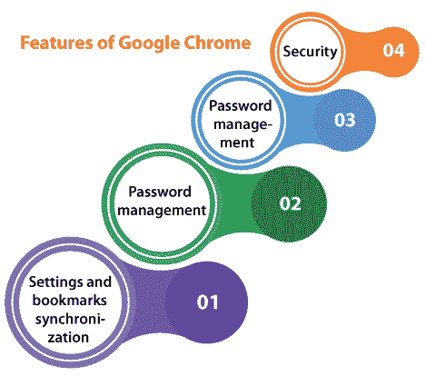

# 卸载 Chrome Ubuntu

> 原文：<https://www.javatpoint.com/uninstall-chrome-ubuntu>

***谷歌 Chrome*** 是全球使用最广泛、最受欢迎的网页浏览器。它安全、快速，具有最佳优势，并提供了出色的浏览体验。 ***谷歌 Chrome*** 可以在每一个主要的操作系统上卸载，比如 Linux、Mac 和基于 Windows 的系统，谷歌 Chrome 浏览器不是开源的，所以它在 ***Ubuntu 软件中心不可用。***

谷歌 Chrome 是一款跨平台的网页浏览器，由 ***谷歌开发。*** 最初是 2008 年为 ***微软 Windows*** 发布的，用 ***Mozilla Firefox*** 和 ***苹果 WebKit 的自由软件组件创建。*** 后来被移植到 ***安卓、iOS、macOS、*** 和 ***Linux、*** 其中它是默认浏览器。

此外，浏览器是 Chrome 操作系统的主要组件，它在其中充当网络应用的环境。

*   几乎 Chrome 的每一个源代码都来自于谷歌的开源免费 Chrome 软件项目，但是 Chrome 浏览器是作为专有的免费软件获得许可的。
*   ***苹果 WebKit*** 是实际的渲染引擎，但最终，谷歌将其分叉为创建 ***Blink 引擎；*** 除 iOS 外的所有 Chrome 变体现在都适用 ***闪现。***
*   Statcounter 计算出，截至 2021 年 10 月，Chrome 浏览器在全球个人电脑上的浏览器市场份额为 68%。它在平板电脑上的使用率最高，在智能手机上也占主导地位，每个平台的使用率总和为 65%。由于这一成功，谷歌为其产品增加了品牌的***【Chrome】***名称: ***Chromebase、Chromebox、Chromebit、Chromebook、Chromecast、*** 和 ***Chrome OS*** 。

## 谷歌浏览器的特点

***谷歌 Chrome*** 提供了一个极简的用户界面，其用户界面字母的原理也适用于其他浏览器。 ***例如，*** 的合并把 ***搜索栏*** 和 ***地址栏*** 变成了 ***omnibar*** 和 ***omnibox。*** 此外，Chrome 还以浏览器的强大性能而闻名。



*   **设置和书签同步**
    Chrome 允许用户通过接收和发送来自谷歌选定账户的数据，在使用浏览器安装的每台设备周围同步他们的 ***书签、设置、*** 和 ***历史记录*** ，这又会更新每个登录的谷歌实例。它可以通过同步密码或谷歌凭证进行身份验证。
*   **对 web 标准的支持**
    第一个谷歌 Chrome 版本通过了 ***Acid2*** 和 ***Acid1 测试。*** 从 4.0 版本开始，Chrome 已经通过了每一个 ***Acid3 测试*** 方面。
*   **安全**
    Chrome 会定期检索 2 个黑名单的更新(一个用于 ***恶意软件*** 一个用于 ***网络钓鱼*** )并警告所有试图访问标记为潜在有害网站的用户。此外，这项服务是提供给其他人使用的免费公共 API，被称为 ***“谷歌安全浏览 API”。***
    谷歌 Chrome 为 ***沙盒标签应用了一个流程分配模型。*** 使用最小特权原则，所有选项卡进程都不能与复杂的内存功能(如 ***【用户文件】、OS 内存*** )或选项卡的其他进程交互——类似于 9 版或更高版本 ***Internet Explorer 所使用的微软的保护模式。***
    *   ***Torrentfreak*** 报道称，由于浏览器在 2015 年 1 月对 ***WebRTC*** 的支持，如果使用 VPN 连接到互联网连接，利用 Chrome 可能是一个严重的安全问题。
    *   从 Chrome 56 开始，据报道，如果用户访问不安全的 HTTP 网站，将会受到警告，因为他们鼓励更多的网站在 2016 年 9 月 9 日创建向 HTTPS 的过渡。
*   **密码管理**
    *   **Windows**
        ***Chrome***被指自 2008 年以来不包含防止随意访问用户密码的主密码。Chrome 的开发人员提到，主密码并不能提高针对许多黑客的实际安全性，并拒绝实施主密码。
        在这个问题上出现的错误已经被评论为 ***【馄饨修复】。谷歌 Chrome*** 在显示 2014 年 2 月保存的密码前，提示用户输入 Windows 的账号密码。
    *   **Linux**
        ***Google Chrome/Chrome***可以在 Linux 中以三种不同的方式保存密码，具体如下:
        *   纯文本
        *   钱包
        *   gnome key ring-gnome 金钥环

***Google Chrome/Chrome***会根据使用中桌面的环境自动选择使用哪个店铺。

保存在*或 ***GNOME 密钥环*** 中的密码通过磁盘加密，对它们的身份验证由守护程序的专用软件管理。保存在 ***明文*** 中的密码不加密。正因如此，当 ***KWallet*** 或 ***GNOME 钥匙圈*** 使用时，之前保存的未加密密码会自动移动到加密存储中。*

 *## 如何在 Ubuntu 中卸载或移除谷歌 Chrome？

如果我们希望从我们的 Ubuntu 系统中删除 ***谷歌浏览器*** ，我们需要打开我们的终端窗口并输入以下命令:

```

dpkg --list | grep google

```


使用上述命令后，我们将找到当前安装在我们系统上的谷歌 Chrome 软件包。

我们可以使用***【apt-purge remove】***命令删除 ***谷歌-chrome-stable*** 在 Ubuntu 中安装 chrome 的包:

```

$ sudo apt --purge remove google-chrome-stable

```


使用上述命令后，谷歌 Chrome 将从我们的 Ubuntu 系统中卸载。

借助 ***dpkg*** 命令，我们可以再次检查它是否被移除:

```

dpkg --list | grep google

```

## 使用图形界面卸载谷歌浏览器

如果我们安装了带有 ***Ubuntu 软件中心的谷歌 Chrome 浏览器，我们需要按照下面提到的一些步骤从我们的 Ubuntu 系统中卸载谷歌 Chrome。*T3】**

*   打开 ***Ubuntu 软件中心。*** 会出现一个画面。
*   我们需要选择 ***已安装选项卡。*T3】**
*   选择后，屏幕上将出现已安装的应用列表。
*   我们需要在这个已安装的应用列表中找到 ***谷歌浏览器*** 浏览器并选择列表项。
*   将出现以下屏幕。按下 ***移除*** 按钮，从我们的 Ubuntu 系统中删除/卸载谷歌 Chrome。

* * **