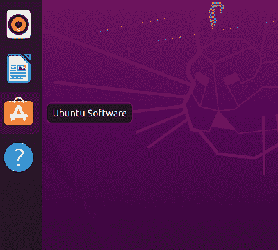
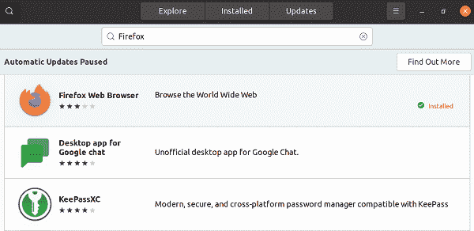
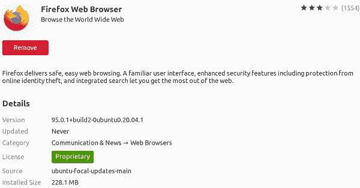
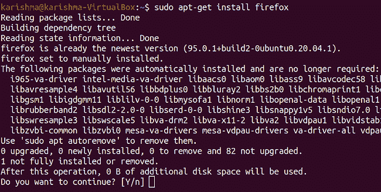
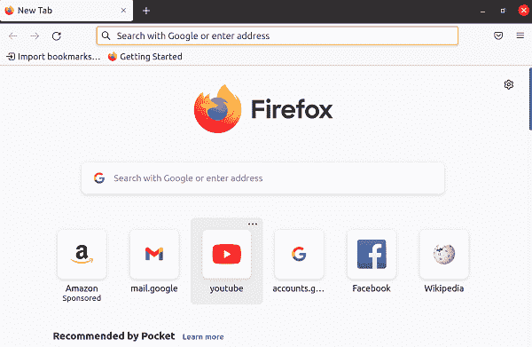
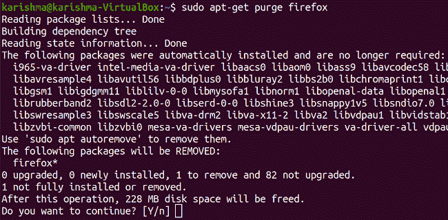

# 安装火狐 Ubuntu

> 原文：<https://www.javatpoint.com/install-firefox-ubuntu>

**火狐**或 **Mozilla Firefox** 是由 **Mozilla 基金会**和 **Mozilla Corporation** (其子公司)开发的开源免费网络浏览器。火狐应用**壁虎渲染引擎**来显示网页，该引擎将实现预期的和当前的网络标准。2017 年，火狐开始在**量子**代号上加入新技术，以促进并行性和更具感知性的用户界面。

该浏览器可用于 Windows 7 和许多更高版本、Linux 和 macOS。它的非官方端口适用于几个类似 Unix 和 Unix 的操作系统，包括 Solaris Unix、illumos、NetBSD、OpenBSD 和 FreeBSD。

此外，火狐适用于 iOS 和安卓系统。但是，iOS 版本因为平台要求，使用的是 **WebKit** 的布局引擎，而不是 **Gecko** ，就像 iOS 的其他每一个网页浏览器一样。优化的火狐版本也可以在亚马逊消防电视上访问，因为亚马逊的丝绸浏览器提供了两种主要浏览器之一。

*   2002 年，火狐是由 Mozilla 的社区成员以“T0”凤凰“T1”的代号创建的，他们想要一个独立的网络浏览器，而不是 Mozilla 应用程序套件的捆绑包。
*   事实证明，火狐在测试阶段因其众多测试人员而闻名，并因其安全性、速度和附加组件而受到赞赏，相比之下，当时占主导地位的是微软的互联网浏览器 6。
*   2004 年 11 月 9 日，火狐发布，以 9 个月 6000 万次下载挑战互联网浏览器的统治地位。火狐网络浏览器是网景导航器的精神继承者，因为 Mozilla 社区是由网景在 1998 年从美国在线收购之前开发的。
*   火狐份额的使用率在 2009 年 11 月增长到了 32.21 %的峰值，3.5 版本的火狐超越了 7 版的 Internet Explorer，虽然不是每一个 Internet Explorer 版本作为一个整体，但后来在与 Google Chrome 的冲突中其使用率有所下降。

## 火狐的历史

该项目由戴夫·海厄特的布雷克·罗斯·乔·休伊特作为 Mozilla 项目的试验分支开始。他们认为开发人员驱动的技术要求和网景的赞助功能蔓延损害了 Mozilla 浏览器实用程序。他们建立了一个独立的浏览器，他们想用这个浏览器来代替 Mozilla 套件来对抗他们认为的 Mozilla 套件的软件膨胀。

0.1 版本于 2002 年 9 月 23 日发布。2003 年 4 月 3 日，Mozilla 组织透露，他们计划将他们的关注点从 **Mozilla Firefox** 转移到**雷鸟**和 **Firefox** 。

## 火狐功能

Firefox 桌面版的功能包括全屏模式、选项卡式浏览、拼写检查、智能书签、增量搜索、拖放下载和书签、用户配置文件管理、下载管理器、私人浏览、书签导出、书签标签、屏幕截图工具、离线模式、web 开发工具、显示页面多媒体项目和元数据列表的功能**“页面信息”**、针对许多超级用户的**“关于:配置”**上的配置菜单，以及基于谷歌服务的位置感知浏览(地理定位)，以及默认情况下

*   火狐还为许多网络开发人员提供了一个环境，他们可以在其中应用内置工具，如 Dom Inspector、错误控制台和扩展，如 Firebug，并且已经有了一个开发 Pocket 功能。
*   **火狐 Hello** 是 2014 年 10 月加入的 **WebRTC** 的一个开发版本，它允许火狐用户和其他系统通过相互传输链接进行视频通话以及文件和屏幕共享的附加功能。原定于 2016 年 9 月删除。
*   以前的功能增加了阻止来自单个域的图像的能力(直到 72 版本)，3D 页面检查器(11 到 46 版本)，选项卡分组(直到 44 版本)，以及添加定制的附加工具栏的能力(直到 28 版本)。

火狐的一些主要特性如下:

## 浏览器扩展

许多功能可以从第三方开发人员建立的附加组件中添加。主要是，使用名为**网络扩展**的应用编程接口，用 JavaScript、CSS、HTML 对加载项进行编码，创建该应用编程接口是为了与**微软 Edge** 和**谷歌 Chrome** 扩展系统兼容。

此前，火狐通过 **XPCOM** 和**XUL API**支持插件，这使得它们可以直接访问和操作浏览器的大部分内部功能。 **XUL 附加组件**一直被认为是传统的附加组件，在 57 版本的火狐**(【Quantum】)**和更新版本上不再支持。

### 主题

**火狐**网页浏览器可以包含很多主题，用户可以制作或者从任何第三方下载来修改浏览器的出现。此外，火狐插件网站为用户提供了添加其他应用程序的能力，如截图应用程序、广告拦截器、游戏和许多其他应用程序。

### 来宾会话

对于安卓，火狐配备了一个功能，即 2013 年发布的**访客会话**。它会存储浏览数据，如历史记录、cookies 和标签，但仅限于来宾会话期间。即使重新启动设备或浏览器，来宾会话的数据也将被保留。

### 标准

Firefox 使用 alpha 透明度来运行几种网络标准，如 XPath、XSLT、DOM、ECMAScript、CSS、SVG 2、MathML、XHTML、XML、HTML4 和 APNG 图像。此外，火狐实现了 WHATWG 提出的标准建议，如画布元素和客户端存储。

## 在 Ubuntu 中安装 Firefox

对于 Ubuntu 来说，Mozilla Firefox 是一个互联网浏览器(官方)，因此，大多数发行版的 Ubuntu 习惯默认安装。如果我们的系统因为任何原因没有这个浏览器，或者我们不小心删除了它，我们将解释如何在我们的 Ubuntu 系统上安装这个浏览器。

在本文中，我们将解释在我们的系统上安装 Mozilla Firefox 的一些方法。然后，我们可以根据我们希望安装火狐浏览器的来源以及我们是否希望使用命令行或用户界面来进行选择。

*   使用 **Ubuntu 软件中心**
*   使用**命令行**

### 先决条件

所有用户都应通过**根帐户**登录，或使用 **sudo 权限**执行命令。

### 方法 1:使用 Ubuntu 软件中心安装 Mozilla Firefox

1.  首先我们需要选择位于 Ubuntu***活动工具条*** 侧边栏的 ***Ubuntu 软件中心*** 图标。
    
2.  按下显示在 Ubuntu 软件中心的搜索图标:
3.  当搜索栏显示在我们的屏幕上时，我们需要在搜索栏中键入***【Mozilla Firefox】***。搜索结果将显示在下面的窗口中。
4.  然后，我们只需要按下 Mozilla Firefox，如下图所示:
    
5.  从我们的鼠标中按下 ***【安装】*** 按钮，安装 Mozilla Firefox 浏览器。
6.  按下 ***【安装】*** 后，我们的屏幕上会弹出一个确认页面，我们需要输入我们的 ***密码*** 并按下 ***【认证】*** 按钮，如下图截图所示:
7.  火狐安装将在身份验证后开始，如下图所示:
8.  安装过程完成后，我们可以按下十字图标关闭该窗口，如下图所示:

### 启动 Mozilla Firefox

1.  我们将按下按钮图标，即 ***App 菜单*** 开始使用 Mozilla Firefox，如下图所示:
2.  按下 ***【全部】选项卡*** 或者我们也可以搜索浏览器，然后按下 Mozilla Firefox 图标，如下图截图所示:
3.  ***Mozilla Firefox 网络浏览器*** 将在我们的屏幕上显示如下:
    

### 卸载或删除火狐

1.  按下位于 ***活动*** 上的图标 ***乌班图软件中心***
2.  按下搜索图标，使用我们的键盘在搜索栏中键入***【Mozilla Firefox】***。按下***“Mozilla Firefox***”如下图所示:
3.  按 ***【删除】*** 按钮卸载或删除 Mozilla Firefox:
    
4.  一个 ***弹出页面*** 将显示在我们的显示屏上。这是我们希望卸载 Mozilla Firefox 的确认。如果是，按 ***【删除】***
    
5.  一个 ***弹出页面*** 将再次显示在我们的屏幕上进行认证。我们必须输入我们的密码，并按下 ***认证*** 按钮，如下图所示:
6.  Mozilla Firefox 的 ***卸载过程*** 将在屏幕上开始。可能需要几分钟。

### 方法 2:使用命令行安装 Mozilla Firefox

安装 Firefox 的另一种方法是使用命令行。

1.我们需要打开终端窗口。

2.当终端窗口打开时，我们将键入以下命令:

```

$ sudo apt-get update

```


3.然后，我们将输入我们的密码。

4.我们需要在终端窗口中输入以下命令:

```

$ sudo apt-get install firefox

```



5.完成火狐浏览器安装可能需要一些时间。

### 启动火狐

我们将在终端中键入一个启动火狐浏览器的命令。该命令如下所述:

```

$ Firefox

```



火狐浏览器将在我们的屏幕上打开，如下图所示:

### 卸载或删除火狐

我们需要在终端窗口中运行以下命令，用命令行删除火狐浏览器:

```

$ sudo apt-get purge firefox

```



点击***【y】***按钮，卸载过程开始。我们的系统上不会有火狐浏览器。

* * *