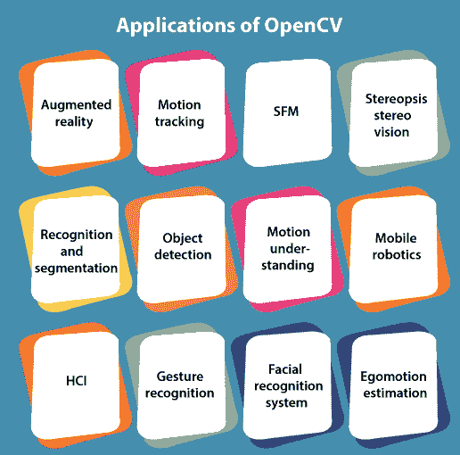
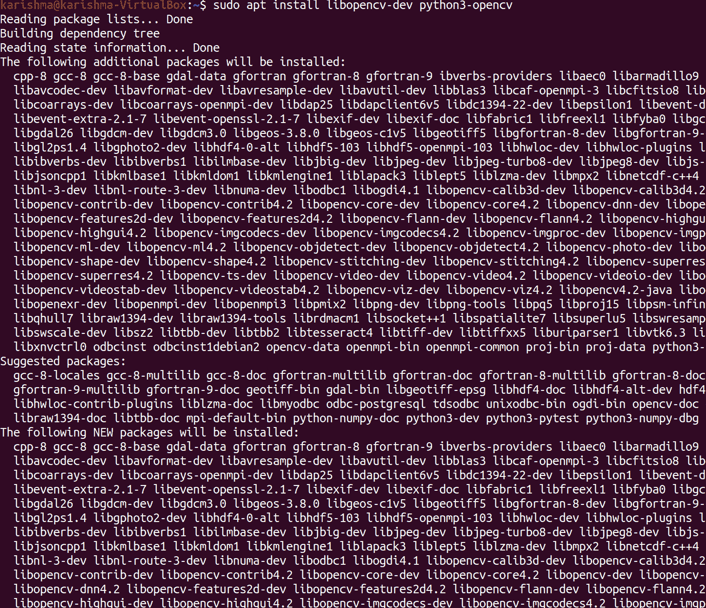

# 在 Ubuntu 中安装 OpenCV

> 原文：<https://www.javatpoint.com/install-opencv-in-ubuntu>

## 什么是 OpenCV？

**OpenCV** (代表**开源计算机视觉库**)是主要专注于实时计算机视觉的编程函数库。它最初是由英特尔整合的，后来由当时的 **Itseez** (后来由**英特尔**继承)提供。 **OpenCV** 是**免费的**和**跨平台**在**开源 Apache 2 许可证**上使用。它的特点是从 2011 年开始加速图形处理器的实时实现。

## 什么是计算机视觉？

计算机视觉可以被描述为一个过程，从这个过程中，我们可以知道视频和图像的概念，它们是如何存储的，以及我们如何从它们中检索和处理信息。计算机视觉是**人工智能**的基础或主要应用。它在**机器人、自动驾驶汽车**以及**照片校正应用**中发挥着重要作用。

计算机视觉是一门描述如何利用 2D 图像理解、中断和重建三维视图的学科，涉及视图中可用的结构属性。它涉及用计算机硬件和软件复制和模拟人类视觉。

计算机视觉可以与下面提到的领域显著重叠:

*   **模式识别:**模式识别描述了对几种模式进行分类的各种方法。
*   **图像处理:**图像处理强调图像操作。
*   **摄影测量:**摄影测量涉及从图像中获得正确的测量值。

## OpenCV 的功能

OpenCV 的一些重要功能如下:

*   CUDA 加速
*   聚类和机器学习
*   计算摄影(视频、照片、超级照片)
*   立体计算机视觉或基于几何的单目(视频、拼接、calib3D)
*   特征/对象检测(非自由、特征 2d、对象检测)
*   视频/图像输入/输出、显示、处理(高级图形界面、核心、图像处理)

## 什么是图像处理？

这是一种对任何图像执行一些操作、接收增强图像或使用它提取一些有用信息的方法。图像处理的基本定义可以是，“图像处理是对数字化图像进行处理和分析，以提高其质量”。

### 数字图像

图像可以被分类为一个**二维函数 f(x，y)** ，其中 **x** 和 **y** 是平面(空间)坐标，任何坐标对的脂肪振幅被称为该特定点处图像的**灰度**或**强度等级**。

这些图像只不过是二维矩阵，由任意特定点的**数学函数 f(x，y)** 指定，提供该点图像的像素值，该像素值指定该特定像素有多亮，以及它将是哪种颜色。

基本上，图像处理是信号处理，其中根据与该图像相关的需要，输入被称为**图像**，结果被称为**特征**或**图像**。

图像处理有以下三个步骤:

*   图像的处理和分析
*   导入图像
*   输出结果可能是基于图像分析的变更报告或图像

## OpenCV 的历史

1999 年， **OpenCV** 正式上线，这是**英特尔研究**的一项举措，旨在推进 CPU 密集型应用，这是一系列具有 3D 显示墙和实时光线追踪的项目的一部分。该项目的主要贡献者包括**性能库团队**和**英特尔俄罗斯**的几位优化专家。在 **OpenCV** 的开始时间里，项目目标规定为:

1.  传播视野的知识，通过提供一个所有开发人员都可以创建的基础设施，使代码更容易转移和阅读。
2.  高级视觉的研究，不仅为公共视觉基础设施提供开放的而且优化的代码。
3.  通过免费提供性能优化和可移植的代码，以及无需代码免费开放的许可证，推进基于视觉的技术应用。

2000 年，第一个 **OpenCV alpha 版**在 **IEEE 计算机视觉会议**和**模式识别上向公众发布，2001-2005 年期间发布了**和 5 个 betas。2006 年，最初的 1.0 版本发布。1.1 版**“预发布”**于 2008 年 10 月发布。2009 年 10 月，第二个主要的 OpenCV 版本发布。

**OpenCV 2** 包含对 **C++** 界面的重大修改，重点在于更好的实现、新的功能、更类型安全的模式，以及与性能(主要在多核系统上)相比更易于现有的模式。现在，官方版本每 6 个月出现一次，改进现在由俄罗斯团队实施，并得到技术公司的支持。

对于 OpenCV 来说，支持是通过一个名为**OpenCV.org**的非营利基金会在 2012 年 8 月接管的。该基金会管理一个用户和开发者网站。

**英特尔**在 2016 年 5 月签署了收购领先的 OpenCV 开发商 **Itseez** 的协议。

OpenCV 为 **OpenCV AI 套件**披露并启动了 **Kickstarter 活动**，该套件是 OpenCV 支持 AI 的硬件模块系列和内含物。

## OpenCV 的应用

OpenCV 的应用领域包括:



*   增强现实
*   运动跟踪
*   运动的结构(SFM 的简称)
*   立体视觉
*   识别和分割
*   目标检测
*   运动理解
*   移动机器人
*   人机交互(人机界面的简称)
*   手势识别
*   面部识别系统
*   自我运动估计
*   3D 和 2D 功能工具包

为了支持上述几个领域，Open CV 有一个机器学习静态库，包括:

*   深度神经网络(DNN 的简称)
*   支持向量机(SVM 的简称)
*   随机森林
*   人工神经网络
*   朴素贝叶斯分类器
*   k-最近邻算法
*   期望最大化算法
*   梯度增强树
*   决策树学习
*   助推

## OpenCV 的编程语言

***OpenCV*** 是在 ***C++*** 语言中指定的，它的主界面在这种语言内部，但它仍然有一个不太宽泛的虽然广泛的 C 的旧界面。每一个新的算法和开发都发生在 C++界面中。***【MATLAB/OCTAVE】【Java】******Python***中有几个绑定。在线文档中可以检测到接口的应用编程接口。

各种编程语言中的许多包装器已经得到了改进，以鼓励更多的受众采用。特定 OpenCV 函数子集的 JavaScript 绑定被发布为***【OpenCV . js】***，将在 3.4 版本中应用于网络平台。

## OpenCV 中的操作系统支持

***OpenCV*** 在许多桌面操作系统上执行。下面提到其中一些:

*   Windows 操作系统
*   从源代码构建
*   NetBSD
*   操作系统
*   苹果
*   Linux 操作系统

***OpenCV*** 也在下面提到的几个移动操作系统上运行:

*   黑莓 10
*   Maemo
*   ios
*   机器人

用户可以从***【SourceForge】***获取官方版本，也可以使用***【GitHub】***获取最新来源。同样，OpenCV 应用 ***的概念来做*** 。

## 硬件加速

当库在计算机上检测到英特尔的集成性能原语时，它将应用这个专有例程来加速自己:

*   基于 OpenCL 的 GPU 接口自 2012 年 10 月以来一直在开发中，***【2.4.13.3】***版本的文档可以在[docs.opencv.org](http://docs.opencv.org/)网站上找到。
*   一个基于 GPUCUDA 的 ***接口，从 2010 年 9 月开始开发。***

## 在 Ubuntu 中安装 OpenCV

如上所述， ***OpenCV*** 是一个计算机视觉库，代表 ***开源计算机视觉库*** 。在这个缩写中， ***open*** 定义了一个 ***开源库*** 以及 Java、C++和 python 的绑定，支持不同类型的操作系统，比如 Linux 和 Windows。

它可以使用 GPU 加速和多核处理进行实时操作操作。OpenCV 库可用于许多应用，包括医学图像分析、3D 模型提取、人脸检测和识别、监控视频、运动跟踪等等。

在本文中，我们将解释如何在 20.04 版本的 Ubuntu 中安装 OpenCV。

### 使用 Ubuntu 存储库安装 OpenCV

在 20.04 版本的 Ubuntu 中，***【Opencv】***的库可以在官方 Ubuntu 存储库中找到。首先，我们需要通过在终端窗口输入以下命令来更新我们的 ***apt 缓存*** :

```

$ sudo apt update

```


然后，我们将通过在终端窗口中执行以下命令来安装 OpenCV:

```

$ sudo apt install libopencv-dev python3-opencv

```



这个命令将帮助我们在系统上安装所有必要的软件包。

在完成 OpenCV 的安装过程后，我们还可以通过导入模块来验证安装过程，即***【cv2】***，在终端窗口运行以下命令打印安装好的 OpenCV 版本:

```

$ python3 -c "import cv2; print(cv2._version_)"

```

* * *